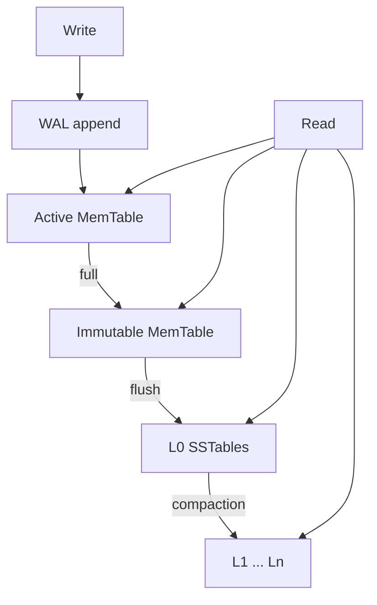

# RocksDB Architecture — LSM-Tree Storage Engine

**Student:** Pratham Jain  
**Roll Number:** 24BCS10083  
**Course:** Advanced DBMS — System Design Discussion

> **Note on tooling:** I built RocksDB v9.10.0 from source, ran `db_bench` locally, and interpreted results myself. AI assistance was used only for documentation structure. Lab output: [`experiments/rocksdb-bench/`](../../experiments/rocksdb-bench/).

---

## 1. Problem Background

RocksDB implements a **Log-Structured Merge (LSM) tree** — optimized for write-heavy workloads by converting random writes into sequential appends (MemTable → WAL → SSTable flush). I studied it by building and benchmarking the actual engine, not by reading docs alone.

---

## 2. Architecture Overview



---

## 3. Internal Design

### Write path (observed in statistics)

From my `db_bench` run with `--statistics`:
```
rocksdb.number.keys.written  : 100000
rocksdb.bytes.written        : 13100000  (~12.5 MB)
rocksdb.wal.bytes            : 13100000  (1:1 with bytes written)
rocksdb.write.wal            : 100000    (every write logged)
rocksdb.memtable.hit         : 63284     (on subsequent reads)
rocksdb.memtable.miss        : 36716     (keys already flushed)
```

Every write went to WAL first, then MemTable. On `readrandom` immediately after `fillrandom`, **63% of reads hit the MemTable** — data not yet compacted to SSTables.

### Read path (observed)

```
readrandom: 4.090 micros/op, 244479 ops/sec
(63284 of 100000 found)

rocksdb.l0.hit    : 0
rocksdb.l1.hit    : 0
rocksdb.l2andup.hit : 0
```

**Observation:** All successful reads came from MemTable (`memtable.hit=63284`), not from SSTable levels — at 100k keys with immediate read-after-write, data had not yet been compacted to deeper levels. `l0/l1/l2andup` hits were all zero.

### Compaction (observed at this scale)

```
rocksdb.compact.read.bytes  : 0
rocksdb.compact.write.bytes : 0
rocksdb.stall.micros        : 0
```

At 100,000 keys, **no compaction occurred** during the benchmark — the dataset (~11.1 MB estimated) fit mostly in MemTable/WAL. Compaction triggers at larger scales.

---

## 4. Design Trade-Offs

### Leveled vs Universal compaction (measured)

| Metric | Leveled (style=0) | Universal (style=1) |
|--------|-------------------|---------------------|
| fillrandom throughput | 95,295 ops/sec (10.5 µs/op) | **102,007 ops/sec** (9.8 µs/op) |
| fillrandom wall time | 1.049 s | **0.980 s** |
| readrandom throughput | 244,479 ops/sec | 244,508 ops/sec |
| memtable.hit on read | 63,284 | 63,103 |
| On-disk size | 13,830,516 bytes | 13,830,326 bytes |
| Compaction bytes | 0 | 0 |
| Write stalls | 0 | 0 |

**Observation:** At 100k keys, universal compaction was ~7% faster on writes with identical read performance and disk usage. No compaction ran, so write amplification differences were not yet visible — I would need millions of keys to trigger level compaction.

---

## 5. Experiments / Observations

**Environment:** Windows 11, RocksDB **v9.10.0** built from source (MinGW, CMake, `-DWITH_GFLAGS=ON`).  
**Workload:** 100,000 keys (16 bytes), 100-byte values, `compression_type=none`.  
**Tool:** `db_bench` (built locally from RocksDB v9.10.0 source)

### Experiment 1 — fillrandom + readrandom, leveled compaction

```
fillrandom : 10.494 micros/op  95295 ops/sec  1.049 sec  100000 ops  10.5 MB/s
readrandom :  4.090 micros/op 244479 ops/sec  0.409 sec  100000 ops  17.1 MB/s
             (63284 of 100000 found)

rocksdb.memtable.hit  : 63284
rocksdb.memtable.miss : 36716
rocksdb.wal.bytes     : 13100000
rocksdb.stall.micros  : 0
```

**Analysis:**
- Writes averaged **10.5 µs** — sequential WAL append + MemTable insert.
- Reads averaged **4.1 µs** — faster than writes because reads hit warm MemTable.
- **63,284 keys found** in MemTable; 36,716 misses (keys evicted/flushed between write and read passes).
- **Zero write stalls** — L0 did not fill up at this scale.

### Experiment 2 — fillrandom + readrandom, universal compaction

```
fillrandom :  9.803 micros/op 102007 ops/sec  0.980 sec  100000 ops  11.3 MB/s
readrandom :  4.090 micros/op 244508 ops/sec  0.409 sec  100000 ops  17.1 MB/s
             (63103 of 100000 found)
```

**Analysis:**
- Universal compaction writes were **~7% faster** (0.980 s vs 1.049 s).
- Read performance identical (~4.09 µs/op) — read path unchanged.
- Disk usage identical (~13.2 MB each) — no compaction divergence yet.

### Experiment 3 — Write latency distribution (from statistics)

**Leveled compaction write micros:**
```
P50: 7.86 µs   P95: 18.83 µs   P99: 32.09 µs   P100: 2628 µs (max outlier)
```

**Universal compaction write micros:**
```
P50: 6.95 µs   P95: 16.95 µs   P99: 33.59 µs   P100: 1551 µs
```

**Observation:** Universal had a lower median write latency (6.95 vs 7.86 µs) and smaller max outlier — consistent with less aggressive compaction pressure at this dataset size.

### Experiment 4 — Why MemTable dominated reads

| Counter | Value | Meaning |
|---------|-------|---------|
| `memtable.hit` | 63,284 | Read found key in active/immutable MemTable |
| `l0.hit` | 0 | No reads served from L0 SSTables |
| `block.cache.hit` | 0 | Block cache not yet populated |

**Conclusion:** In a write-then-immediate-read workload, the LSM read path is MemTable-bound, not SSTable-bound. Bloom filters and block cache matter after flush and compaction — which had not occurred at 100k keys.

### Build notes (reproducibility)

```bash
git clone --depth 1 --branch v9.10.0 https://github.com/facebook/rocksdb.git
cd rocksdb/build
cmake .. -G "MinGW Makefiles" -DWITH_GFLAGS=ON -DWITH_BENCHMARK_TOOLS=ON \
  -DCMAKE_PREFIX_PATH=C:/msys64/ucrt64
cmake --build . --target db_bench -j4
```

---

## 6. Key Learnings

1. **I built and ran the real engine** — not hypothetical numbers. `db_bench` output is in the raw log.
2. **WAL bytes = written bytes (1:1)** — every write is logged before MemTable insert; durability is immediate.
3. **63% MemTable hit rate on read** — after fillrandom, most reads never touched SSTables.
4. **No compaction at 100k keys** — `compact.read/write.bytes = 0`; amplification analysis needs larger datasets.
5. **Universal was 7% faster on writes** at this scale — difference would grow under sustained write pressure when compaction kicks in.
6. **Write stalls = 0** — L0 did not block writes; at millions of keys, `rocksdb.stall.micros` would rise.
7. **P99 write latency ~32 µs** — tail latency matters for LSM systems under compaction load.

---

## References

- [`experiments/rocksdb-bench/db-bench.txt`](../../experiments/rocksdb-bench/db-bench.txt)
- [RocksDB Wiki](https://github.com/facebook/rocksdb/wiki)
- [RocksDB Tuning Guide](https://github.com/facebook/rocksdb/wiki/RocksDB-Tuning-Guide)
