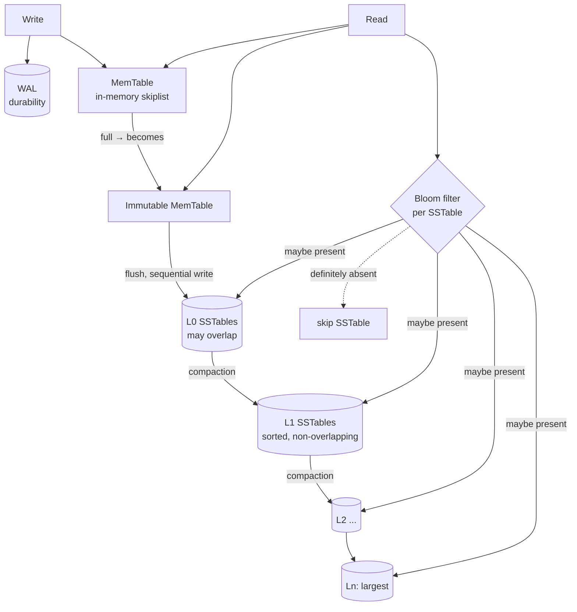

# RocksDB Architecture (LSM-Tree Storage Engine)

> RocksDB is an embeddable, high-performance key-value store built on a **Log-Structured Merge-tree (LSM-tree)**. It spends read and space efficiency to buy outstanding write throughput, by converting random writes into sequential ones. Every experiment here was run live against **RocksDB `db_bench` 7.8.3** (Debian `rocksdb-tools`) over 1,000,000 key-value pairs.

---

## 1. Problem Background

RocksDB came out of Facebook in 2012, forked from Google's LevelDB, to handle **write-heavy, flash-based** workloads: message queues, metadata stores, stream-processing state, and storage backends (MySQL's MyRocks, CockroachDB, TiKV, Kafka Streams).

The problem it set out to beat: **B-trees handle high-volume random writes badly.** A B-tree mutates pages in place, so a random insert can force a random read-modify-write of a disk/SSD page. On flash that piles on device-level write amplification and grinds down the drive. The LSM-tree's answer is to **never update in place**: writes are appended to memory and flushed sequentially, with the reorganization shoved off into background **compaction**. That tunes the write path beautifully, at the cost of complicating reads and space management, which is the central trade-off the entire design hangs on.

---

## 2. Architecture Overview



**Write path:** every write hits the **WAL** (for crash recovery) and the in-memory **MemTable** (a sorted skiplist) at the same time. Once the MemTable fills up it turns **immutable** and a fresh one takes over; a background thread then **flushes** the immutable MemTable into an **SSTable** at **L0** in a single sequential write. Compaction later folds SSTables down through the levels L1…Ln.

**Read path:** a lookup probes the MemTable first, then the immutable MemTable, then SSTables starting at L0 and working down. Each SSTable carries a **Bloom filter** that is checked up front, if it reports "key absent", the SSTable is skipped with zero I/O. Because a key can live in several levels at once (newest wins), a read may have to visit multiple files: that's **read amplification**.

---

## 3. Internal Design

### 3.1 MemTable, immutable MemTable, WAL
Writes arrive in the **MemTable** (by default a skiplist, which gives sorted iteration and `O(log n)` insert) and are appended to the **WAL** in the same step. When the MemTable hits `write_buffer_size`, it's frozen into an **immutable MemTable** and a fresh MemTable picks up new writes, so writes never stall waiting on a flush. After a crash, the WAL replays whatever hadn't yet been flushed to an SSTable.

### 3.2 SSTables and levels (L0 → Ln)
A flushed MemTable lands as a **Sorted String Table (SSTable)**: an immutable file of key-value pairs sorted by key, complete with a block index and a Bloom filter. RocksDB stacks SSTables into levels whose sizes grow geometrically:
- **L0** holds the freshly-flushed files, which **may overlap** in key range (so a read might have to check all of them).
- **L1…Ln** are held **sorted and non-overlapping** within each level, so a read touches at most one file per level.

**Experiment — the level structure after loading 1M keys (level compaction):**
```text
Level  Files   Size      W-Amp
  L0    2/0    9.15 MB    1.0
  L1    1/1   40.64 MB    1.4
  L2    2/2   82.61 MB    2.0
 Sum    5/3  132.40 MB    3.2
```
Five SSTables made up a 3-level tree; data cascades downward as the levels fill.

### 3.3 SSTable internals
```text
$ sst_dump --file=<one>.sst --show_properties
  # entries          : 378477
  raw key size       : 9,083,448
  raw value size     : 96,890,112
  data block size    : 67,109,498        # < raw value: compressed
  SST compression    : Snappy
```
Each SSTable describes itself: sorted data blocks, an index, and (when turned on) a Bloom filter, with block-level **Snappy** compression (96 MB of raw values squeezed into 67 MB of data blocks).

### 3.4 Bloom filters: the key to LSM reads
A Bloom filter is a compact probabilistic structure that answers "is this key in this SSTable?" with **no false negatives** (an "absent" verdict is always correct) and a tunable false-positive rate. RocksDB consults it before reading any SSTable block, so most levels that don't hold the key get skipped without touching disk. This is what keeps point lookups feasible in a multi-level LSM tree.

### 3.5 Compaction
**Compaction** is the background work that merges SSTables, throws away overwritten and deleted keys, and pushes data into larger levels to keep the tree shallow and read-friendly. It's the bill for cheap writes: the same data gets rewritten several times as it sinks through the levels, which is **write amplification**. Two main strategies:
- **Level compaction** (default): merges a file into the next level down, keeping each level non-overlapping. Lower space amplification, higher write amplification.
- **Universal compaction**: merges runs more lazily. Lower write amplification, higher space amplification.

---

## 4. The Three Amplifications (with measurements)

LSM design is ruled by a trilemma, you can't drive all three to a minimum at once.

| Amplification | Meaning | Measured (level compaction) |
|---|---|---|
| **Write** | bytes written to disk ÷ bytes of user data | **W-Amp 3.2** (≈386 MB compaction writes + 177 MB flush writes for 0.27 GB ingested) |
| **Read** | SSTables/blocks examined per lookup | reads may touch MemTable + multiple levels; Bloom filters cut the I/O (below) |
| **Space** | bytes on disk ÷ bytes of live data | 137 MB physical for ~270 MB raw user data (Snappy compression + level layout) |

### Experiment A: write amplification — level vs universal compaction
```text
                       fillrandom         W-Amp   compaction writes
level   (style 0)   :  126,167 ops/s       3.2      386 MB
universal (style 1) :  143,594 ops/s       3.0      354 MB
```
Universal compaction wrote less (W-Amp 3.0 vs 3.2) and ingested faster, in exchange for higher space usage, exactly the documented trade-off.

### Experiment B: Bloom filters slash read amplification
```text
readrandom WITH bloom (10 bits/key) :  97,769 ops/s   10.2 micros/op
readrandom WITHOUT bloom (0 bits)   :  54,605 ops/s   18.3 micros/op
rocksdb.bloom.filter.useful         :  547,380   <- SSTable reads avoided
```
The Bloom filter delivered roughly **1.8× the read throughput** and sidestepped **547,380** SSTable lookups for keys those files didn't hold. Without it, every level has to be probed on disk, which halves throughput.

---

## 5. Design Trade-Offs

| Decision | Benefit | Cost |
|---|---|---|
| **Out-of-place writes (LSM)** | Sequential writes → very high write throughput; flash-friendly | Reads/space get harder; needs compaction |
| **Memtable + WAL** | Fast in-memory writes, durable via WAL | WAL is a second write; recovery replays it |
| **Leveled SSTables** | Bounded reads (1 file/level below L0); compact | Write amplification from re-writing data downward |
| **Bloom filters** | Avoid most disk reads for absent keys; make point lookups fast | Memory per key (~10 bits); useless for range scans |
| **Compaction (level)** | Low space amplification, predictable reads | High, bursty write amplification & CPU/IO |
| **Compaction (universal)** | Low write amplification | High space amplification (transient 2× disk) |
| **Block compression (Snappy)** | Smaller on-disk footprint | CPU on read/write; slight latency |

### Why compaction can turn expensive
Compaction rewrites data every time it slides down a level. With L levels and a given fan-out, each byte may be rewritten about L times, our small DB already clocked W-Amp 3.2. Under sustained writes, compaction fights foreground traffic for CPU and I/O, and if L0 fills faster than it can be drained you get **write stalls**. Tuning compaction is the core operational headache of any LSM store.

---

## 6. Key Learnings

- **LSM trees are a write-optimized wager.** By appending to memory and flushing sequentially, RocksDB reached 126k–143k random-write ops/s; a B-tree would eat random I/O on every insert. The bill comes due later, in compaction.
- **The three amplifications are a budget, not a target.** The level-vs-universal experiment made the write/space trade-off concrete: universal trimmed W-Amp from 3.2 to 3.0 but used more disk. You choose which amplification to spend.
- **Bloom filters are what make LSM reads viable.** Switching them off nearly **halved** read throughput (97.8k → 54.6k ops/s) and forced 547k extra SSTable probes. It's the single most important read optimization in the whole design.
- **Compaction is both hero and villain.** It keeps reads bounded and reclaims space, yet it *is* the source of write amplification and write stalls, every LSM tuning conversation is, deep down, about compaction.
- **Surprising observation:** even an "absent" key lookup costs Bloom-filter checks across the levels; and our DB packed 270 MB of user data into 137 MB on disk, showing how block compression and space amplification interact to sometimes make the physical size *smaller* than the logical, the opposite of the naive "LSM wastes space" intuition.

### Why LSM trees win in write-heavy workloads
Every write is a sequential append (MemTable + WAL flush), there is no in-place page update, and the costly reorganization is pushed into background compaction off the write path. That's ideal for ingest-heavy systems (logs, metrics, queues, KV state) on SSDs, which is exactly why RocksDB sits underneath MyRocks, TiKV, CockroachDB, and Kafka Streams.

---

### Reproducing
```bash
docker run -d --name rocks debian:12 sleep 3600
docker exec rocks bash -c "apt-get update && apt-get install -y rocksdb-tools"
docker exec rocks db_bench --db=/tmp/d --benchmarks=fillrandom,stats \
  --compaction_style=0 --num=1000000 --value_size=256 --statistics
# add --bloom_bits=10 vs 0 and --benchmarks=fillrandom,readrandom for the read test
```
*Engine: RocksDB 7.8.3 `db_bench` (Debian rocksdb-tools, Docker). Sources: RocksDB Wiki (Architecture Guide, Leveled/Universal Compaction, Bloom Filters), the original LSM-tree paper (O'Neil et al., 1996), and LevelDB design notes.*
