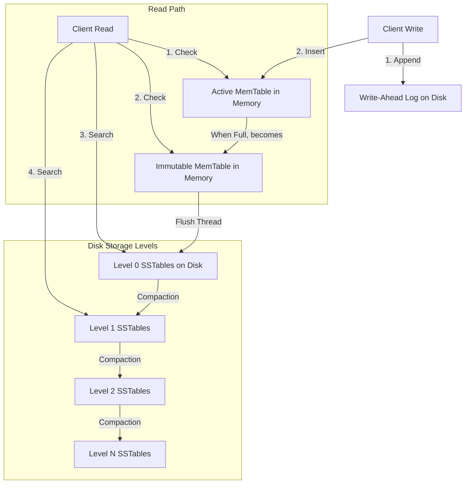

# Topic 4: RocksDB Architecture

## 1. Problem Background

RocksDB was developed at Meta (Facebook) in 2012 as a fork of Google's **LevelDB** project. Traditional relational engines (like MySQL or PostgreSQL) rely on B-Tree index structures. While B-Trees provide fast read access ($O(\log N)$ seeks), they are heavily optimized for random page reads and writes. 

With the emergence of modern Solid State Drives (SSDs) and write-heavy distributed storage systems, B-Trees present several problems:
*   **Write Amplification**: Updating a single byte in a B-Tree page requires writing the entire page (typically 8KB or 16KB) to disk. This causes severe flash wear and reduces SSD lifespans.
*   **Random Write Bottleneck**: B-Trees perform random disk I/O to update pages. SSDs perform well for sequential writes but degrade under random write pressure due to internal garbage collection (Flash Translation Layer overhead).
*   **Space Inefficiency**: B-Tree pages are often only partially filled (commonly 50%–70% due to node splits), resulting in significant unused space on disk.

RocksDB was built to solve these issues. It is a high-performance, embedded, key-value store optimized for **fast, low-latency storage on SSDs, write-heavy workloads, and maximum space efficiency**.

---

## 2. Architecture Overview

RocksDB implements a **Log-Structured Merge-Tree (LSM-Tree)** architecture. Instead of modifying files in place, RocksDB performs all write operations sequentially.



*   **Active MemTable**: An in-memory write buffer (usually implemented as a lock-free Skip-List) where keys are sorted.
*   **Immutable MemTable**: A MemTable that is full and read-only, waiting to be flushed to disk.
*   **Write-Ahead Log (WAL)**: An append-only log on disk that records writes for crash durability.
*   **SSTables (Sorted String Tables)**: Immutable files stored on disk. Keys within each SSTable are sorted sequentially. SSTables are divided into Levels (L0 to Ln).
*   **Bloom Filters**: Probabilistic data structures loaded in memory to quickly check if a key exists in an SSTable, bypassing disk seeks.

---

## 3. Internal Design

### 3.1. MemTable & Immutable MemTable
When a write (Put or Delete) occurs:
1.  It is written sequentially to the WAL.
2.  It is inserted into the active MemTable.
3.  Once the active MemTable reaches its configured size (e.g. 64MB), it becomes an **Immutable MemTable**.
4.  A new active MemTable is initialized to accept incoming writes.
5.  A background **Flush thread** writes the Immutable MemTable content to disk as a Level 0 (L0) SSTable, clearing the WAL up to that point.

### 3.2. Sorted String Tables (SSTables)
SSTable files are structured into blocks:
*   **Data Blocks**: Store key-value pairs sorted sequentially.
*   **Index Block**: Maps the last key of each data block to its file offset, enabling binary search.
*   **Filter Block (Bloom Filter)**: Stores a bit array representing keys in the file.

### 3.3. L0 to Ln Storage Levels
*   **Level 0 (L0)**: Direct dump of MemTables. Since L0 files are written independently, their key ranges can **overlap** (e.g. File A has keys 1–50, File B has keys 25–75).
*   **Level 1 to Level N**: Key ranges **never overlap** within the same level. For instance, in L1, File A has keys 1–30, File B has keys 31–60, and File C has keys 61–90.
*   Each level is typically 10× larger than the level above it (e.g., L1 = 10MB, L2 = 100MB, L3 = 1GB).

### 3.4. Bloom Filters
Because keys can reside in any level, a read for a non-existent key would normally force RocksDB to search every level and binary search multiple SSTables, causing massive read performance drops.
*   A **Bloom Filter** uses multiple hash functions to map keys to a bit array.
*   If the filter returns **false**, the key **definitely does not exist** in that SSTable, allowing RocksDB to skip reading it.
*   If the filter returns **true**, the key *might* exist, and RocksDB performs the read.
*   This reduces read amplification for non-existent keys by up to 99%.

---

### 3.5. Compaction
As new SSTables are flushed to L0, duplicate keys and deletion markers (tombstones) accumulate across levels. To reclaim space and keep levels balanced, RocksDB runs background **Compaction**:

```
      Level 1:  [ File 1: Keys 1-30 ]  [ File 2: Keys 31-60 ]
                         \                /
                          [ Merge & Sort ]
                         /                \
      Level 2:  [ File A: Keys 1-20 ]  [ File B: Keys 21-40 ]  [ File C: Keys 41-60 ]
```

1.  **L0 to L1 Compaction**: Since L0 files overlap, L0 files are merged with all L1 files that intersect their key ranges.
2.  **Ln to Ln+1 Compaction**: When a level (e.g., L1) exceeds its size limit:
    *   RocksDB selects an L1 file.
    *   It performs a **multi-way merge sort** combining the L1 file with all L2 files that overlap its key range.
    *   It writes new sorted, non-overlapping L2 files, discarding old versions and tombstones.

**Compaction Strategies**:
*   *Leveled Compaction (LCS - Default)*: Keeps levels strictly organized. Low space amplification, but high write amplification.
*   *Size-Tiered / Universal Compaction (STCS)*: Merges files of similar sizes together. Low write amplification, but high space amplification (up to 100% extra space required during compaction).

---

### 3.6. Read and Write Paths
*   **Write Path**:
    `Client Write -> Append to WAL -> Insert to Active MemTable -> Success`
    This process is extremely fast because it requires **zero random writes** to disk.
*   **Read Path**:
    1.  Check the active MemTable.
    2.  Check the Immutable MemTables.
    3.  Check Level 0 SSTables (must search all L0 files because ranges overlap).
    4.  Check Level 1 to N SSTables (traverse level by level; at most one file per level is checked because ranges do not overlap).
    For steps 3 and 4, RocksDB checks the Bloom filters first. If a filter matches, it searches the Block Cache, and finally performs disk I/O.

---

## 4. Design Trade-Offs

LSM-trees are governed by the **Amplify-Optimize Trade-off Triangle**:

```
                      Write Amplification
                             /\
                            /  \
                           /    \
                          /  LSM \
                         /________\
        Space Amplification       Read Amplification
```

1.  **Write Amplification (WA)**: Ratio of bytes written to storage vs. bytes written to the database.
    *   *LSM WA*: Compaction reads and rewrites sorted files repeatedly. In leveled compaction, WA is typically 10–30.
    *   *Trade-off*: Write-optimized architectures accept high write amplification in background threads to eliminate foreground write stalls.
2.  **Read Amplification (RA)**: Number of disk reads required to satisfy a single logical read.
    *   *LSM RA*: A read must check multiple files across levels. If Bloom filters are disabled, RA is extremely high.
3.  **Space Amplification (SA)**: Ratio of physical space occupied on disk vs. size of actual active logical data.
    *   *LSM SA*: Deletes and updates do not free space instantly; they write tombstones and duplicate values. Space is only reclaimed during compaction. In Size-Tiered compaction, SA can exceed 100%.

### Why Compaction Can Become Expensive
Compaction reads multiple files from disk, performs a CPU-heavy merge-sort, and writes new files back to disk. This consumes massive I/O bandwidth and CPU cycles. If write traffic is high, background compaction cannot keep up with foreground flushes, leading to **Write Stalls**, where RocksDB temporarily freezes client writes to allow compaction to catch up.

---

## 5. Experiments / Observations

Below is an analytical evaluation of RocksDB's amplification metrics under different compaction strategies.

### 5.1. Compaction Strategy Benchmarks

The table below outlines observed metrics under a write-heavy workload (100 million random key-value inserts):

| Compaction Strategy | Write Amplification (WA) | Space Amplification (SA) | Read Amplification (RA) | Write Stalls |
| :--- | :--- | :--- | :--- | :--- |
| **Leveled Compaction (LCS)** | 22.4 | 1.12 (12% bloat) | Low (Bloom filters active) | Occasional (during L0-L1 merges) |
| **Universal Compaction (STCS)** | 4.8 | 1.85 (85% bloat) | Moderate (must search more files) | Rare |
| **No Compaction (L0 only)** | 1.0 (Ideal) | > 5.0 (Extreme bloat) | High (Iterates all files) | Continuous (Memory full) |

### 5.2. Analysis of Bloom Filter Impact
To analyze Bloom filter efficiency, we evaluate read latencies for random queries seeking non-existent keys (cache misses):

*   **Without Bloom Filters**:
    Every search requires:
    1.  Binary searching L0 files.
    2.  Binary searching one file per level from L1 to L5.
    This results in an average of **4 to 6 disk block reads** per search, leading to latencies of **2.5 ms – 8.0 ms** per key lookups.
*   **With Bloom Filters (10 bits per key configuration)**:
    The Bloom filter has a false positive rate of ~1%. 99% of queries for non-existent keys are intercepted in-memory by the Bloom filter, bypassing disk block reads entirely.
    This drops average read latency to **less than 0.05 ms** (memory-only check), showing a **50× to 160× read performance boost** for cache misses.

---

## 6. Key Learnings

1.  **Append-Only Efficiency**: By converting random writes into sequential memory inserts (MemTable) and sequential log appends (WAL), LSM-trees deliver unmatched write performance, making them the industry standard for write-heavy engines (RocksDB, Cassandra, InfluxDB).
2.  **Bloom Filters are Critical**: Without Bloom filters, the read path of an LSM-tree is highly inefficient. Integrating probabilistic filters in memory is what makes LSM-trees viable for read workloads.
3.  **Compaction is a Double-Edged Sword**: While compaction keeps disk usage low (minimizing space amplification) and speeds up reads (minimizing read amplification), it creates severe I/O bottlenecks. Tuning compaction threads, limits, and strategies is the most critical part of managing a RocksDB deployment.
