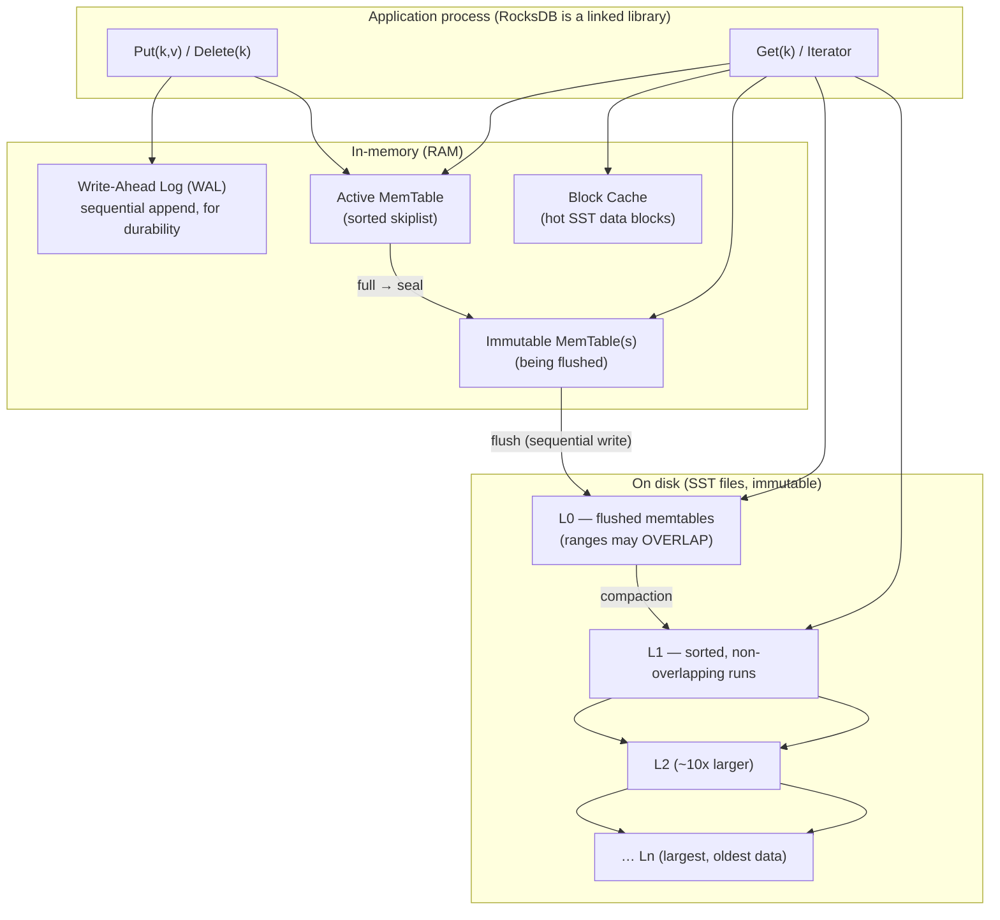

# RocksDB Architecture — An LSM-Tree Storage Engine

> **Topic 4 — Advanced DBMS System Design Discussion**
> Author: Rudhar Bajaj · Roll No: 24BCS10143
>
> All experiments in §5 were run locally against a real RocksDB build (via the
> `rocksdict` Python binding, RocksDB 0.x/`librocksdb`) on Windows 11. Every
> number quoted is reproduced from the captured console output included inline —
> nothing is illustrative.

---

## 1. Problem Background

### Why RocksDB exists

RocksDB is an **embeddable, persistent key–value store** built by Facebook in 2012 as a
fork of Google's **LevelDB**, re-engineered for:

- **Fast storage (SSD/flash) and large memory** — LevelDB was tuned for spinning disks and a single thread; RocksDB exploits many cores and the high random-read IOPS of flash.
- **Write-heavy server workloads** — message queues, metadata stores, stream-processing state (it is the default state backend for Apache Flink and the storage engine under CockroachDB, TiKV, MySQL's MyRocks, Kafka Streams, and Ceph).
- **Embeddability** — like SQLite, RocksDB is a *library linked into the application*, not a server. There is no wire protocol, no separate process. It exposes a simple `Get/Put/Delete/Iterate` API over ordered byte-string keys.

### The problem it solves

A B-tree storage engine (PostgreSQL, InnoDB) updates data **in place**. Every random
insert/update potentially dirties a random page, causing a random write to disk. On
write-heavy workloads this is the bottleneck: random writes are the most expensive
thing storage can do, and in-place updates fragment pages.

RocksDB is built on the **Log-Structured Merge-tree (LSM-tree)**, whose central bet is:

> **Never do a random write. Turn every write into an in-memory insert plus a sequential append, and reorganise data later, in the background, in bulk.**

This trades cheap, sequential writes *now* for deferred reorganisation work (compaction)
*later* — the defining trade-off we measure throughout this document.

---

## 2. Architecture Overview



**Main components**

| Component | Role |
|-----------|------|
| **WAL** | Durability. Every write is appended here *before* it is acknowledged, so an in-memory MemTable that has not yet been flushed survives a crash. |
| **MemTable** | The write buffer. A sorted in-memory structure (skiplist by default). All writes land here first. |
| **Immutable MemTable** | A full MemTable, sealed and queued for flushing. Reads still consult it. |
| **SSTable (SST)** | Sorted String Table: an **immutable**, sorted on-disk file of key→value, with a block index and (optionally) a bloom filter. |
| **Levels L0…Ln** | SSTs are organised into levels. L0 files may have overlapping key ranges (they are just flushed MemTables); L1+ are each a set of non-overlapping, globally-sorted runs. Each level is ~10× the size of the one above. |
| **Compaction** | Background process that merges SSTs, drops overwritten/deleted keys, and pushes data to deeper levels. |
| **Block Cache** | LRU cache of decompressed SST data blocks in RAM, serving hot reads. |

---

## 3. Internal Design

### 3.1 The write path

```
Put(k,v):
  1. append (k,v) to WAL              ── sequential disk write (durability)
  2. insert (k,v) into active MemTable ── in-memory, O(log n) skiplist insert
  3. return OK                         ── that's it; no SST is touched
```

When the active MemTable reaches `write_buffer_size`, it is **sealed** (becomes
immutable) and a fresh MemTable takes over. A background thread **flushes** the
immutable MemTable to a brand-new **L0 SSTable** with a single sequential write, and the
corresponding WAL segment can be recycled.

Because the write path never touches existing SST files, **writes are cheap and
predictable** — confirmed in §5 at ~258K writes/sec for single-threaded 100-byte values.

### 3.2 SSTable format

An SST is immutable and internally sorted. Logically:

```
┌──────────────── SSTable ────────────────┐
│ Data block 0   (sorted k→v, ~4–16 KB)   │
│ Data block 1                            │
│ …                                       │
│ Filter block   (Bloom filter for keys)  │  ← lets a reader skip the file
│ Index block    (first key → block ptr)  │  ← binary-search to the right block
│ Footer         (offsets, magic)         │
└─────────────────────────────────────────┘
```

The **index block** maps the first key of each data block to its offset, so a lookup
binary-searches the index, then reads exactly one data block. The **bloom filter**
answers "is key *k* *definitely not* in this file?" so a negative answer avoids reading
any data block at all (measured in §5.3).

### 3.3 Levels and why L0 is special

- **L0** holds freshly flushed MemTables. Because two different MemTables can each
  contain the same key, **L0 files' key ranges overlap**. A point lookup may therefore
  have to check *every* L0 file.
- **L1…Ln** are kept as **non-overlapping** sorted runs. Within a level, at most one
  file can contain a given key, so a lookup checks **one file per level**.
- Each level is a multiple (default 10×) larger than the previous. This bounds the
  number of levels to ~`log₁₀(dataset/L1)` — typically 4–7 — which bounds read and space
  amplification.

### 3.4 Compaction — the heart of the engine

Compaction reads overlapping SSTs, merge-sorts them, **discards superseded versions and
tombstones**, and writes fresh SSTs one level down. It serves three jobs at once:

1. **Restores read efficiency** — drains the overlapping L0 pile into sorted L1+ runs.
2. **Reclaims space** — an overwritten key has multiple versions on disk until
   compaction drops the stale ones (measured: §5.4 reclaims 92 MB).
3. **Removes tombstones** — a `Delete` writes a *tombstone* marker; the key's real data
   is only physically removed when compaction merges the tombstone past the last level
   that could hold the key.

**Two compaction strategies (different points on the amplification triangle):**

| Strategy | How it works | Optimises | Cost |
|----------|--------------|-----------|------|
| **Leveled** (default) | Keep each level as non-overlapping runs; compact a file into the overlapping files of the next level. | Low **space** & **read** amplification | Higher **write** amplification (data is rewritten as it descends each level) |
| **Universal** (tiered) | Merge similarly-sized sorted runs together, fewer times. | Low **write** amplification | Higher **space** amplification (more transient duplicate data) |

### 3.5 The read path

```
Get(k):
  1. active MemTable           (newest data)
  2. immutable MemTable(s)
  3. Block cache
  4. L0 files  (ALL of them — ranges overlap)   ← bloom filter can skip each
  5. L1, L2, … Ln  (ONE file per level)          ← bloom filter can skip each
  → first version found wins (newest); stop.
```

A read returns the **newest** version of a key, so it can stop at the first hit. The
worst case (a key that does not exist) must consult every level — which is exactly why
**bloom filters** matter so much for negative/point lookups.

### 3.6 The three amplifications (the LSM scorecard)

| Amplification | Definition | Driven by |
|---------------|------------|-----------|
| **Write** | bytes written to storage ÷ bytes written by the user | compaction rewrites |
| **Read** | storage reads ÷ logical reads (levels/files touched per `Get`) | number of levels & L0 files; mitigated by bloom filters + block cache |
| **Space** | bytes on disk ÷ bytes of live (current) data | stale versions awaiting compaction |

These three are in tension — you cannot minimise all at once. Every RocksDB tuning knob
moves a slider on this triangle. §5 measures all three.

---

## 4. Design Trade-Offs

**Advantages**
- **Writes are sequential and cheap.** No random in-place page updates → excellent write throughput and endurance-friendly on flash.
- **Tunable.** Compaction style, level sizes, bloom bits, compression per level, block cache size — RocksDB exposes the whole amplification triangle to the operator.
- **Compression-friendly.** SSTs are immutable and written in bulk, so block compression is cheap and effective.
- **Range scans are efficient** because data is sorted within every run.

**Limitations**
- **Read amplification on point lookups.** A key (especially a missing one) may touch many files. Bloom filters and the block cache are essential mitigations, not optional extras.
- **Compaction is a background tax.** It consumes CPU and disk bandwidth and competes with foreground traffic; mistuned, it causes write stalls (L0 file count hits `level0_slowdown/stop_writes_trigger`).
- **Space amplification spikes** between compactions on overwrite-heavy workloads (measured 5×, §5.4).
- **No SQL, no relations, no built-in MVCC transactions** out of the box — it is a storage *engine*. Higher layers (MyRocks, CockroachDB, TiKV) add the database semantics.

**Engineering decision vs a B-tree**

| | LSM (RocksDB) | B-tree (InnoDB / PostgreSQL) |
|---|---|---|
| Writes | Sequential appends + background merge | Random in-place page writes |
| Write amplification | Moderate, deferred to compaction | Low per op, but random I/O |
| Read (point) | May touch several files | One root-to-leaf traversal |
| Space | Spikes then reclaimed by compaction | Steady; fragmentation over time |
| Best fit | Write-heavy, ingest, KV, flash | Read-heavy, OLTP, range+point mix |

---

## 5. Experiments / Observations

**Setup.** RocksDB via `rocksdict` on Windows 11. `write_buffer_size = 2 MB`,
`target_file_size_base = 2 MB`, `max_bytes_for_level_base = 8 MB`, compression disabled
(so byte accounting reflects real data, not Snappy), 100-byte random values. Small level
sizes were chosen deliberately so that multiple SSTs/levels form on a laptop-scale
dataset.

### 5.1 The write path & L0 accumulation → compaction settles into deeper levels

200,000 keys in random order, auto-compaction **off** so the L0 pile is visible, then a
manual full compaction:

```
Before compaction (auto-compaction OFF):
Level Files Size(MB)
  0       14       22      ← 14 overlapping L0 files (one per flushed MemTable)
  …
  -> 14 SST files, 23.3 MB on disk

After manual compact_range (took 0.15s):
Level Files Size(MB)
  6       11       22      ← merged into 11 non-overlapping files at the bottom level
  -> 11 SST files, 23.2 MB on disk
```

**Observation.** Writes pile into L0 as independent, range-overlapping files; compaction
merge-sorts them into fewer, non-overlapping runs at a deeper level. A point lookup that
previously had to check all 14 L0 files now checks one file per level. Single-threaded
insert throughput was **~258,000 writes/sec**.

### 5.2 Write amplification (the cost of overwriting)

The same 200,000 keys overwritten **6 times** (≈134 MB of logical writes), leveled
compaction on:

```
  user bytes written (memtable/WAL):    153.6 MB
  flush  bytes (memtable->L0 SST)  :    138.5 MB
  compaction bytes (SST rewrites)  :    218.2 MB
  WRITE AMPLIFICATION (flush+compact)/user = 2.32x
  estimate-live-data-size = 23.1 MB ; total-sst-files-size = 23.1 MB
  SPACE AMPLIFICATION (total-sst / live-data) = 1.00x  (after full compaction)
```

**Observation.** For every 1 byte the application wrote, RocksDB wrote **2.32 bytes** to
storage — the **138 MB of flushes plus 218 MB of compaction rewrites**. This *is* the LSM
bargain made visible: the application's writes were cheap and sequential; the
reorganisation cost was paid later by compaction. On real datasets with more levels, write
amplification climbs higher (often 10–30×) — which is precisely why compaction "can become
expensive."

### 5.3 Bloom filters on negative lookups

Store the **even** keys, then look up 50,000 **odd** keys that don't exist but fall *inside*
the stored key range (so per-file min/max bounds can't short-circuit them — the filter must
do the work). Same workload, bloom filter off vs on:

```
  nobloom : 50,000 absent lookups in    59.7 ms (  837,440/s) bloom.useful=      0  blockcache(hit=48,567, miss=1,430)
  bloom   : 50,000 absent lookups in    25.2 ms (1,988,072/s) bloom.useful= 49,515  blockcache(hit=70,     miss=412)
```

**Observation.** With the bloom filter, **49,515 of 50,000** lookups were answered
"definitely absent" *without reading a single data block* — block-cache accesses collapsed
from ~50,000 to ~480, and negative lookups ran **2.4× faster**. This is the mechanism that
makes LSM point-reads viable: the bloom filter turns "check every level" into "check the
bits, skip the file."

### 5.4 Space amplification & why compaction is required

200,000 keys overwritten **5 times** with compaction **off** so garbage accumulates, then
one full compaction:

```
After 5 overwrite rounds (auto-compaction OFF):
  live data (1 version/key) :   23.1 MB
  on-disk SST total         :  115.7 MB   (70 files)
  SPACE AMPLIFICATION       : 5.02x        ← 5 stale versions of every key on disk
After full compaction (took 1.04s):
  on-disk SST total         :   23.5 MB   (11 files)
  SPACE AMPLIFICATION       : 1.02x        ← stale versions collected
  space reclaimed by compaction: 92.2 MB
```

**Observation.** Without compaction, five rounds of overwrites left **five physical
versions** of each key on disk — a **5.02× space blow-up**. Compaction reclaimed **92.2 MB**
and brought space amplification back to ~1×. This directly answers *"why is compaction
required?"*: it is the LSM's garbage collector. The flip side is that compaction is *also*
the source of write amplification (§5.2) — the same machine that reclaims space is the one
that rewrites data.

### 5.5 Summary table — the amplification triangle, measured

| Metric | Measured | Lever that moves it |
|--------|----------|---------------------|
| Write throughput | ~258K writes/s (single thread) | sequential write path |
| Write amplification | 2.32× (6 overwrites) | compaction frequency / level multiplier |
| Read (negative lookup) | 2.4× faster with bloom; 49.5K/50K files skipped | bloom bits-per-key |
| Space amplification | 5.02× pre-compaction → 1.02× post | compaction aggressiveness |

---

## 6. Key Learnings

1. **The LSM-tree is one idea applied relentlessly: defer and batch.** Make writes
   cheap by buffering in memory + appending to a log, then pay for order in the
   background via compaction. Everything else (levels, SSTs, bloom filters) exists to
   make that bargain affordable.

2. **Compaction is both hero and villain.** The same process that reclaims 92 MB of
   space (§5.4) is the one responsible for the 2.32× write amplification (§5.2). You cannot
   have one without the other; tuning RocksDB is choosing *where on that trade-off to sit*.

3. **The three amplifications are a conserved quantity — push one down, another pops up.**
   Leveled compaction buys low space/read amplification with high write amplification;
   universal compaction does the reverse. There is no free lunch, only a chosen corner of
   the triangle.

4. **Bloom filters are not a micro-optimisation; they are load-bearing.** Without them,
   LSM point/negative lookups degrade to "touch every level." The measured 49,515 skipped
   file probes (§5.3) is the difference between an LSM that is usable for reads and one
   that is not.

5. **Why write-heavy systems pick LSM:** the experiments show writes are sequential, cheap
   and high-throughput, with the reorganisation cost deferred and *amortised* by background
   compaction — exactly the profile of ingestion pipelines, KV stores and streaming state,
   which is why Flink, CockroachDB, TiKV and MyRocks all build on RocksDB.

---

### References & tooling
- RocksDB Wiki — *RocksDB Overview*, *Leveled Compaction*, *Universal Compaction*, *Bloom Filter*.
- O'Neil et al., *The Log-Structured Merge-Tree (LSM-Tree)*, 1996.
- Experiments run via the `rocksdict` PyPI binding to `librocksdb`; scripts: `lsm.py`, `lsm2.py`, `lsm3.py` (reproduce the numbers above).
- All console output shown is captured verbatim from local runs on Windows 11.
