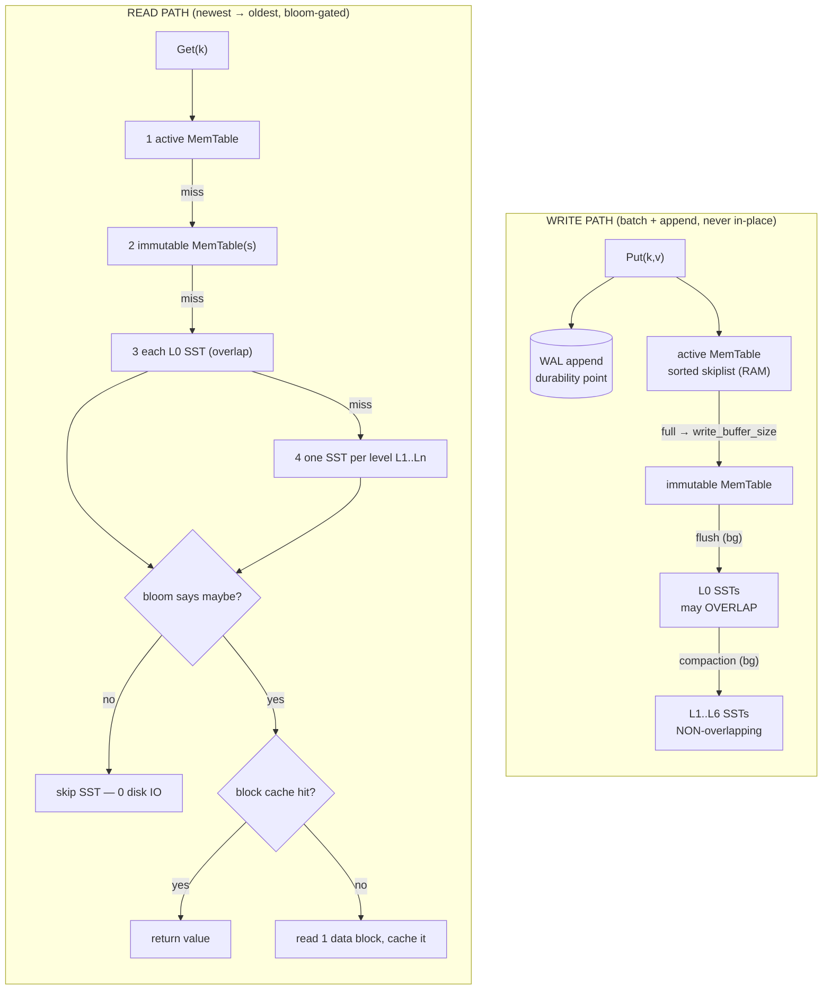

# RocksDB — LSM-Tree Storage Architecture

> A close reading of the Log-Structured Merge-tree storage engine behind RocksDB:
> how a write becomes a durable, queryable record; why the design trades read and
> space efficiency for write throughput; and what compaction actually costs.
> Every number in this document is measured against `librocksdb` (Homebrew
> `rocksdb 11.1.1`, Facebook RocksDB) on a real workload — see Section 5.

---

## 1. Problem Background

### The fundamental conflict: random writes vs. spinning/flash media

A storage engine has to answer two questions cheaply: *"store this key/value"* and
*"give me the value for this key"*. The classic answer is a **B-tree** (what
Postgres, InnoDB, and most relational engines use — see PostgreSQL
`src/backend/access/nbtree/`). A B-tree keeps data sorted *in place*: an insert
finds the right leaf page and mutates it. That gives excellent reads — `O(log n)`
page accesses, one lookup — but every insert is a **random, in-place page write**.

Random in-place writes are the enemy of modern storage:

- **HDDs** pay a seek (~5–10 ms) per random page touch.
- **SSDs/NVMe** cannot overwrite a flash page in place; the FTL must read-modify-
  write an entire erase block, causing *device-level* write amplification and wear.
- A B-tree update of one row can dirty a full page (often 4–16 KB) to change
  100 bytes, and a page split cascades writes up the tree.

So the B-tree is **read-optimized but write-expensive**. For write-heavy workloads
— ingest pipelines, time series, message queues, counters, KV caches behind a
write-through layer — this is exactly backwards.

### The LSM insight: never write randomly; only ever append

The Log-Structured Merge-tree (O'Neil et al., 1996) takes the opposite stance:

1. **Buffer writes in RAM**, sorted, in a structure called a *MemTable*.
2. When the buffer fills, **flush it to disk as one immutable, sorted file** — a
   single large *sequential* write, never an in-place update.
3. Because new data is always written to *fresh* files, an "update" or "delete" of
   an existing key does **not** touch the old data. The old value is simply
   shadowed by a newer record in a newer file.
4. A background process — **compaction** — periodically merges these files,
   discarding shadowed/deleted records and keeping the on-disk data sorted.

This converts a stream of random user writes into a small number of large
sequential file writes. That is the entire reason LSM trees are
**write-optimized**: writes are *batched* (a whole MemTable at once), *sequential*
(append a new file), and *append-only* (no read-modify-write of existing data).

The bill comes due elsewhere. Because a key's history is now scattered across
several files at several levels, a **read** may have to look in many places, and a
key's old versions linger on disk until compaction reclaims them. RocksDB's whole
design is the management of three amplifications that fall out of this choice:

| Amplification | Definition | Who pays | LSM tendency |
|---|---|---|---|
| **Write amp (WA)** | bytes written to disk ÷ bytes the user wrote | flash wear, IO bandwidth | high (compaction rewrites data) |
| **Read amp (RA)** | files/blocks read per logical lookup | query latency | high (scattered keys) — mitigated by bloom filters + cache |
| **Space amp (SA)** | bytes on disk ÷ bytes of live data | disk capacity / $ | >1 (dead versions linger until compaction) |

RocksDB is Facebook's fork of Google's LevelDB, hardened for production: column
families, multi-threaded compaction, pluggable compaction strategies, prefix
bloom filters, and an embedded (in-process, no server) design. Crucially, it is a
**storage engine, not a complete database**: there is no SQL, no query planner,
no server process, and no network protocol. An application **links the library
in-process** and calls `Put`/`Get`/`Delete`/iterators directly — architecturally
like SQLite (embedded, in-process), but a sorted *key-value* store rather than a
relational one. That is why it appears as the storage layer *inside* other
systems: it is the engine under MyRocks, TiKV, Kafka Streams, Ceph BlueStore, and
many more. (CockroachDB historically used RocksDB but has since moved to Pebble, a
Go LSM built on the same ideas.)

---

## 2. Architecture Overview

### Component map

The write path turns random user writes into sequential file writes; the read
path searches **newest → oldest**, gating every on-disk file by a bloom filter
and the block cache before touching disk. The diagram captures both flows; the
ASCII map and §3 expand each step.



```text
                          WRITE PATH                              READ PATH
                          ==========                              =========
   Put(k,v) ─┐                                         Get(k) ─┐
             │                                                 │  (newest → oldest)
             ▼                                                 ▼
   ┌───────────────────┐  (1) append           ┌────────────────────────────────┐
   │  WAL (write-ahead  │◄────────────────┐     │  active MemTable (RAM, sorted) │ ← check 1st
   │  log, append-only) │   durability     │    └────────────────────────────────┘
   └───────────────────┘                  │     ┌────────────────────────────────┐
             │                            │     │  immutable MemTable(s) (RAM)   │ ← check 2nd
             ▼  (2) insert into           │     └────────────────────────────────┘
   ┌───────────────────┐  sorted RAM map  │                  │
   │  active MemTable   │──────────────────┘                 ▼  for each level, in order:
   │  (skiplist, sorted)│                          ┌──────────────────────────────────────┐
   └───────────────────┘                          │  per SST candidate:                    │
             │ full (write_buffer_size)            │   bloom filter says "maybe"? ──no──▶ skip│
             ▼                                     │            │ yes                        │
   ┌───────────────────┐                          │            ▼                            │
   │ immutable MemTable │                          │   block cache hit? ──yes──▶ return      │
   └───────────────────┘                          │            │ no                          │
             │ (3) FLUSH (background)              │            ▼ read data block from SST    │
             ▼  sequential write                  └──────────────────────────────────────┘
        ┌─────────┐
        │   L0    │  SSTs from flush; may OVERLAP in key range
        ├─────────┤
        │   L1    │ ┐
        │   ...   │ │ (4) COMPACTION (background): merge-sort overlapping
        │   L5    │ │     ranges down a level, drop dead keys, write new SSTs.
        │   L6    │ ┘     Each Ln (n≥1) holds NON-overlapping, sorted SSTs.
        └─────────┘
         on disk (SSTables)
```

### The four moving parts, in one paragraph each

**MemTable** — an in-memory, ordered map (default: a skiplist) holding the most
recent writes. All reads check it first because it has the newest data. It is
sorted so that a flush can stream it straight out as a sorted file and so that
range scans work. Source: `memtable/`, `db/memtable.cc`.

**WAL (Write-Ahead Log)** — the MemTable is volatile, so before a write is
acknowledged it is appended to an on-disk log. On crash, RocksDB replays the WAL
to rebuild the lost MemTable. This is the *only* synchronous disk write on the
write path, and it is a pure sequential append. The *strength* of that durability
depends on the WAL sync mode: this run used the default (no per-write `fsync` —
the dump reports `Cumulative WAL: 2000K writes, 0 syncs`), so acked writes are
process-crash-safe but live only in the OS page cache until flushed — an OS or
power loss could drop the tail of un-synced writes. A per-write sync trades that
window for higher latency. Source: `db/write_thread.cc`, `db/wal_manager.cc`.

**SSTable (Sorted String Table)** — the immutable on-disk file. Internally it is
a sequence of sorted **data blocks** (~4–16 KB), plus an **index block** (block →
key range), a **bloom filter block**, and a footer. Once written it is *never
modified* — only deleted (replaced) by compaction. Source: `table/block_based/`.

**Levels (L0…Ln)** — SSTs are organized into levels of geometrically increasing
size. **L0 is special**: its files come straight from flushes and *can overlap*
in key range (so a key may sit in several L0 files at once). **L1 and below hold
non-overlapping, fully sorted runs** — within one of those levels, exactly one
SST can contain a given key, so a search there is a single binary search. Source:
`db/version_set.cc`, `db/compaction/`.

### Modern dynamic leveling fills from the bottom up

A classic LSM grows top-down: L1 fills, then L2, etc. RocksDB's default
(`level_compaction_dynamic_level_bytes=true`) instead anchors the **largest**
level at the bottom (L6) and sizes the upper levels relative to it. Empirically
that means with a small dataset you see data land at **L0, L5, L6** with the
middle levels *empty* — which is exactly what the experiment shows (Section 5).
The win: it keeps the per-level size ratio close to the configured target and
bounds space amplification to roughly `1 + 1/(T-1)` of one level's worth of
garbage, instead of letting upper levels bloat.

---

## 3. Internal Design

### 3.1 The write path, step by step

```text
 Put("user42", <100B>)
   │
   ├─(1)─▶ append record to WAL          ── sequential, the durability point
   │
   ├─(2)─▶ insert into active MemTable    ── RAM, sorted skiplist; ACK to caller
   │
   │   ... active MemTable reaches write_buffer_size (4 MB here) ...
   │
   ├─(3)─▶ seal it → immutable MemTable; allocate a fresh active MemTable
   │       (writes keep flowing into the new one — no stall in the common case)
   │
   ├─(4)─▶ background flush thread writes the immutable MemTable out as ONE
   │       sorted SST at L0; the corresponding WAL segment can now be dropped
   │
   └─(5)─▶ background compaction merges L0→L5→L6 over time (Section 3.4)
```

Key subtleties worth stating precisely:

- **The user-visible latency is WAL append + RAM insert.** Flush and compaction
  are asynchronous. That is why the write path is fast: the synchronous cost is
  one sequential append plus a lock-free skiplist insert.
- **A record is never an in-place mutation.** A `Put` to an existing key, a
  `Delete` (which writes a *tombstone* marker), and a `Merge` are all just *new
  records with a higher sequence number*. Resolution happens at read/compaction
  time by "newest sequence number wins."
- **`write_buffer_size` is the batching knob.** Bigger MemTable = larger, fewer
  flushes = fewer, bigger SSTs = less compaction work, at the cost of RAM and
  longer crash-recovery replay. We deliberately set it small (4 MB) to *force*
  many flushes and make compaction visible.

### 3.2 SSTable on-disk layout

```text
   ┌──────────────────────────────────────────────────────────┐
   │ Data block 0   [k0,v0][k1,v1]...   (sorted, ~4-16KB)       │
   │ Data block 1   [..]                                        │
   │   ...                                                      │  ← 16,820 data blocks
   │ Data block N                                               │     in the measured SST
   ├──────────────────────────────────────────────────────────┤
   │ Filter block   (bloom filter over ALL keys in this SST)    │  ← 735,877 bytes here
   ├──────────────────────────────────────────────────────────┤
   │ Index block    (first-key-of-block → block handle)         │  ← binary-searched in RAM
   ├──────────────────────────────────────────────────────────┤
   │ Footer         (offsets of index & meta; magic; checksum)  │
   └──────────────────────────────────────────────────────────┘
```

To find key `k` in one SST: binary-search the index block to pick the candidate
data block, then (if the bloom filter passed) read that one data block from disk
(or block cache) and binary-search within it. So a single-SST point lookup is
**O(1) disk reads** in the good case — the cost multiplier is *how many SSTs you
must consult*, which is the read-amplification problem.

### 3.3 Bloom filters: the read-amplification killer

A bloom filter is a compact probabilistic set: ask "is key `k` in this SST?" and
it answers **"definitely no"** or **"probably yes"**. It never has false
negatives, only false positives. RocksDB stores one per SST (here, *whole-key*
filtering — `whole.key.filtering = 0x31` in the dump).

Why this matters: without filters, a `Get` for an absent key would have to read a
data block from *every* SST that could contain it — pure wasted IO. With a 10-
bits-per-key filter, the "definitely no" answer lets RocksDB **skip the SST
entirely without touching a data block.** The theoretical false-positive rate at
`m/n = 10` bits/key with the optimal `k≈7` hashes is ≈0.82% (idealized). Our
empirical estimate (~2%, computed as false-passes-per-filter-hit:
`(FULL_POSITIVE − TRUE_POSITIVE)/FULL_POSITIVE`) is higher — partly because it
measures a subtly different quantity (false-passes per filter hit, not the
classic per-query FPR) and partly because RocksDB's full-filter bit layout
differs from the textbook `k`-hash model. The trade is pure RAM/disk
for filter blocks (≈735 KB of filter on a single ~74 MB L6 SST — under 1%) in
exchange for collapsing the read amplification of *absent-key* lookups: instead
of reading one data block in every candidate SST across every level, the filter
lets RocksDB skip almost all of them with no data-block IO at all. (This helps
**negative** lookups specifically — a present key still descends to wherever its
newest version lives; bloom filters cut false searches, not real ones.)

```text
   Get("ghost")  (key never inserted)
        │
        ├─ MemTables: miss
        ├─ L0 SST #1: bloom "no"  → skip (0 disk reads)   ┐
        ├─ L5 SST   : bloom "no"  → skip (0 disk reads)   │  this is BLOOM_FILTER_USEFUL
        └─ L6 SSTs  : bloom "no"  → skip (0 disk reads)   ┘
        ⇒ "not found" with essentially no data-block IO
```

### 3.4 Compaction — why it exists and why it is expensive

**Why it is required (two independent reasons):**

1. **Reclaim space.** With ~2× overwrite, half the records on disk are dead
   (older versions or tombstoned). Nothing deletes them at write time — only
   compaction physically drops shadowed keys. Without it, space amp grows
   unbounded.
2. **Bound read amplification.** Every flush adds another L0 file that a read may
   have to check. Left alone, L0 would accumulate dozens of overlapping files and
   every `Get` would degrade toward a linear scan of files. Compaction pushes data
   into the deeper, *non-overlapping* levels where at most one SST per level can
   hold a key — capping reads at roughly "1 + number of levels" SSTs.

**Why it is expensive:** compaction reads existing sorted runs, merge-sorts them,
and writes brand-new SSTs — so the *same logical bytes get rewritten multiple
times* on their journey to the bottom level. That rewriting *is* write
amplification. It competes with foreground writes for disk bandwidth and CPU
(merge + checksum + optional compression), and if it falls behind, RocksDB
imposes **write stalls** (slowing or pausing user writes until L0/pending bytes
drain). The art of tuning RocksDB is largely the art of keeping compaction
*just* ahead of ingest.

**Leveled compaction (the default):**

```text
   L0:  [a..z][a..z][a..z][a..z]   ← 4 overlapping files (compaction trigger)
            │ merge with overlapping L5 range
            ▼
   L5:  [a..m][n..z]               ← non-overlapping; each key in exactly one SST
            │ when L5 exceeds its size budget, merge overlap down
            ▼
   L6:  [a..f][g..p][q..z]         ← largest level, holds the bulk of the data
```

Each level `Ln` has a size budget; the next is ~`T`× larger (`T`≈10, set by
`max_bytes_for_level_multiplier`). When a level overflows, RocksDB picks an SST
and merges it into the *overlapping* portion of `Ln+1`, rewriting that overlap.
Because the same key range in a lower level gets repeatedly rewritten as upper-
level data trickles down, **leveled has high write amp but tight space amp** (each
level holds non-overlapping data, so dead keys are reclaimed promptly).

**Universal (tiered) compaction:**

```text
   Sorted runs (each internally sorted, may OVERLAP each other):
     run1 [a..z]   run2 [a..z]   run3 [a..z]
        └──────────── merge several similarly-sized runs at once ───────────┘
                          ▼  fewer, larger merges
     bigrun [a..z]   (overlap with other runs tolerated until next merge)
```

Universal merges several similarly-sized sorted runs together, less frequently,
and tolerates overlap between runs. Fewer rewrites ⇒ **lower write amp**, but
because overlapping runs coexist, more dead/duplicate data sits on disk between
merges ⇒ **higher space amp**. This is the headline trade-off, quantified in
Section 5.

### 3.5 The read path, step by step

```text
 Get("user42")
   │
   ├─ active MemTable      ── newest data, RAM, sorted lookup
   ├─ immutable MemTable(s)── still in RAM, not yet flushed
   ├─ L0 SSTs (newest→old) ── may OVERLAP, so check EACH (bloom-gated)
   ├─ L1..Ln               ── one binary-searched SST per level (bloom-gated)
   │       │
   │       └─ for each candidate SST:
   │            1. bloom filter "maybe"?  no → skip (BLOOM_FILTER_USEFUL++)
   │            2. index block → which data block
   │            3. block cache hit? → return value
   │            4. miss → read 1 data block from disk, cache it
   │
   └─ first matching record (highest sequence number) wins; tombstone ⇒ "not found"
```

The block cache (here a 32 MB **AutoHyperClockCache**) caches hot data/index/
filter blocks. The combination *bloom filter → block cache → one data-block
read* is what keeps point reads cheap despite data being spread across levels.
Source: `cache/`, `table/block_based/block_based_table_reader.cc`.

---

## 4. Design Trade-Offs

### 4.1 Why LSM is write-optimized (and what it gives up)

| Decision | Buys you | Costs you |
|---|---|---|
| Buffer + batch in MemTable, flush sequentially | huge write throughput; no random IO; flash-friendly | RAM for buffers; data lost on crash unless… |
| WAL for durability | crash safety with one sequential append | one extra sequential write per `Put`; durability strength depends on sync mode (this run: 0 syncs ⇒ process- but not power-crash-safe) |
| Immutable SSTs, append-only | lock-free reads on files; trivial snapshots/backups | dead data accumulates ⇒ space amp |
| Defer cleanup to background compaction | fast foreground writes | write amp; CPU/IO contention; possible stalls |
| Scatter key versions across levels | cheap writes | read amp — must consult many files |
| Bloom filter per SST | cuts read amp ~N× for absent keys | RAM/disk for filters; ~2% false-positive tax |

### 4.2 The amplification triangle (you can't win all three)

```text
            WRITE AMP
               /\
              /  \      leveled  →  pull toward low SPACE amp
             /    \                  (pays with high WRITE amp)
            /      \
   SPACE AMP ────── READ AMP
            \      /
        universal → pull toward low WRITE amp
                    (pays with high SPACE amp)
```

You pick a point in this triangle:

- **Leveled** ⇒ low space amp, low read amp, **high write amp**. Best when disk
  is precious and reads matter (the common OLTP-ish default).
- **Universal** ⇒ low write amp, **high space amp**, somewhat worse read amp
  (more overlapping runs to check). Best for write-saturated ingest where you can
  spare disk and flash endurance is the bottleneck.
- **FIFO / blob separation** are further points for logs / large-value workloads.

### 4.3 Knobs and what they shift

- `write_buffer_size` (4 MB here): bigger ⇒ fewer/larger flushes ⇒ less write amp,
  more RAM, slower recovery.
- `max_bytes_for_level_base` (16 MB) + multiplier: set the level geometry; larger
  ratio ⇒ fewer levels ⇒ lower read amp but bigger per-compaction rewrites.
- `level0_file_num_compaction_trigger` (4): how many L0 files accumulate before
  compaction fires — trades L0 read amp against compaction frequency.
- bloom `bits_per_key` (10): more bits ⇒ lower false-positive rate ⇒ less read
  amp, at linear RAM cost.
- compression (DISABLED here on purpose): in production it cuts space amp at CPU
  cost; we turned it off so the amplification ratios reflect raw merge behavior,
  not zstd's compressibility.

---

## 5. Experiments / Observations

**Setup.** Built against `librocksdb` (Homebrew `rocksdb 11.1.1`, Facebook
RocksDB). Workload: **2,000,000 `Put()` of 100-byte values into a 1,000,000-key
space** (≈2× overwrite, so ~half of all written records become dead versions).
`write_buffer_size=4MB`, `max_bytes_for_level_base=16MB`,
`level0_file_num_compaction_trigger=4`, **10 bits/key bloom**, **compression
disabled** (to isolate amplification), WAL on. The numbers were **measured on this
machine** (not copied) by the C++ harness `../_experiments/rocks_demo.cpp`, which
links `librocksdb` directly and prints the engine's own statistics; raw captures:
`../_experiments/rocksdb_experiments.txt` and `../_experiments/lsm_structure.txt`.
(The canonical RocksDB benchmark, `db_bench`, is the usual tool but is not
packaged in Homebrew's `rocksdb` formula, so the in-process harness stands in;
`../_experiments/db_bench_commands.md` lists the equivalent `db_bench`
invocations for each measurement, for reproduction on a source build.)

### 5.1 Leveled compaction — RocksDB's own per-level W-Amp table

```text
Level  Files   Size       Read(GB) Write(GB) ... W-Amp ...  KeyIn  KeyDrop
 L0     1/0    807.04 KB      0.0     0.2         1.0        2000K     0
 L5     1/0     12.30 MB      0.3     0.3         1.3        2507K   159K
 L6     2/0     93.75 MB      0.6     0.5         2.9        5753K   846K
 Sum    4/0    106.84 MB      0.9     1.0         4.7         10M   1006K

Flush(GB): cumulative 0.215
Cumulative compaction: 1.00 GB write, 0.90 GB read, 3.1 seconds
Write Stall (count): ... total-delays: 0, total-stops: 0
```

**Interpretation.** Read the W-Amp column bottom-up and it tells the whole story:
L0 W-Amp = **1.0** (a flush writes each byte once); L5 = **1.3**; L6 = **2.9**.
The **Sum W-Amp = 4.7** — bytes accumulate write cost as they sink toward L6,
because the same key range in L6 is rewritten every time upper-level data merges
into it. `KeyDrop` is compaction physically discarding dead records: **1,006K
keys dropped**, almost exactly the ~1M overwritten keys we expected. And
`total-stops: 0` confirms compaction kept up with ingest — no write stalls.

Derived amplification (script-computed from the raw byte counters):

```text
user bytes Put (keys+values)      : 232.0 MB
flush bytes written (memtable->L0): 230.8 MB
compaction bytes written          : 843.1 MB
compaction bytes read             : 959.8 MB
WRITE AMPLIFICATION (flush+compact)/user = 4.63x
total SST size on disk            : 112.0 MB
estimated live data size          :  98.3 MB
SPACE AMPLIFICATION  sst/live      = 1.14x
```

**Interpretation.** To durably store ~232 MB of user data, RocksDB wrote ~1.07 GB
to disk (231 MB flush + 843 MB compaction) ⇒ **4.63× write amp** — close to the
4.7 the engine reports internally, the small gap being flush-vs-compaction
accounting. (Both this ratio and the engine's `W-Amp` count only flush +
compaction bytes; the **WAL** append is a separate, additional sequential write
per `Put` and is excluded here — so total bytes hitting the device are slightly
higher than 4.63× would suggest.) Meanwhile only **1.14× space amp**: leveled's
non-overlapping levels reclaim dead versions aggressively, so disk barely exceeds
live data.

### 5.2 Universal compaction — same workload, opposite balance

```text
user bytes Put (keys+values)      : 232.0 MB
compaction bytes written          : 665.6 MB
compaction bytes read             : 764.1 MB
WRITE AMPLIFICATION (flush+compact)/user = 3.86x
total SST size on disk            : 130.5 MB
estimated live data size          :  94.3 MB
SPACE AMPLIFICATION  sst/live      = 1.38x
```

### 5.3 The headline trade-off, side by side

| Metric | **Leveled** | **Universal** | Why |
|---|---|---|---|
| **Write amp** | **4.63×** (higher) | **3.86×** (lower) | leveled rewrites a level's overlapping range repeatedly to keep non-overlapping sorted runs; universal merges large runs less often |
| **Space amp** | **1.14×** (lower) | **1.38×** (higher) | leveled drops dead keys promptly per level; universal tolerates overlap/garbage between infrequent merges |
| Compaction bytes written | 843.1 MB | 665.6 MB | universal does ~21% less rewriting |
| SST size on disk | 112.0 MB | 130.5 MB | universal keeps ~16% more bytes resident |

This is the LSM trade-off made concrete: **you cannot minimize write amp and
space amp simultaneously.** Choosing universal saved ~177 MB of disk writes
(better flash endurance) at the price of ~18 MB of extra on-disk footprint and
weaker space guarantees. Leveled made the opposite call.

### 5.4 On-disk LSM structure (`rocksdb_ldb list_live_files_metadata`)

```text
===== LEVELED DB: live SST files per level =====
rocks_leveled/000164.sst : level 6
rocks_leveled/000169.sst : level 6
rocks_leveled/000172.sst : level 5
rocks_leveled/000174.sst : level 0      → 4 live SSTs at L0, L5, L6

===== UNIVERSAL DB: live SST files per level =====
rocks_universal/000157.sst : level 6
rocks_universal/000164.sst : level 6
rocks_universal/000169.sst : level 5
rocks_universal/000179.sst : level 4
rocks_universal/000187.sst : level 3    → 5 live SSTs at L3..L6
```

**Interpretation.** The leveled DB landed data at **L0, L5, L6 with L1–L4 empty**
— direct evidence of **dynamic leveling filling the bottom levels first**.
Universal instead keeps a *staircase* of sorted runs at **L3–L6**, the natural
shape of "merge similarly-sized runs": several run-sized files coexist rather
than collapsing into one non-overlapping level per size class.

### 5.5 Inside one SST (`rocksdb_sst_dump --show_properties` on `000164.sst`)

```text
# data blocks: 16820
# entries: 588666
raw key size: 14127984
raw value size: 58866600
filter block size: 735877
# entries for filter: 588666
filter policy name: bloomfilter
rocksdb.block.based.table.whole.key.filtering: 0x31   (= on)
```

**Interpretation.** One L6 SST holds **588,666 entries** across **16,820 data
blocks**, with a **735,877-byte bloom filter** built over *all* those keys
(whole-key filtering on). The filter is ~735 KB against ~73 MB of raw key+value
(<1% overhead) — a tiny price for the read-amp reduction below. Note raw value
(58.9 MB) ≫ raw key (14.1 MB): the 100-byte values dominate, as designed.

### 5.6 Bloom filters and the read path

100,000 point `Get()` probes (skewed so most are absent — 43,056 found, 56,944
missing), with these counters:

```text
----- READ PATH / BLOOM FILTER (LEVELED) -----
BLOOM_FILTER_USEFUL (SST reads skipped)   : 50334
BLOOM_FILTER_FULL_POSITIVE (passed filter): 43984
BLOOM_FILTER_FULL_TRUE_POSITIVE (real hit): 43056
bloom false-positive rate ~ (FP-TP)/FP = 0.0211

----- READ PATH / BLOOM FILTER (UNIVERSAL) -----
BLOOM_FILTER_USEFUL (SST reads skipped)   : 129745
bloom false-positive rate ~ (FP-TP)/FP = 0.0285
```

**Interpretation.** `BLOOM_FILTER_USEFUL = 50,334` means the filter said
"definitely not here" **50,334 times** under leveled — that many candidate SSTs
were skipped *without any data-block IO*. The measured false-positive rate is
**~0.0211 (~2%)** at 10 bits/key: of the SSTs whose filter said "maybe," 43,056
were real hits and only ~926 were wasted reads. **Universal skipped even more
(129,743)** — because it keeps more sorted runs (L3–L6), each probe consults more
candidate SSTs, so the filter is invoked (and earns its keep) more often — but at
a slightly worse FP rate (**0.0285**), consistent with more candidate runs to
probe. This is bloom filters cutting read amplification directly: without them
every absent-key probe would touch a data block in every candidate SST.

### 5.7 Read latency: the levels really are this fast

The per-level read-latency histograms (leveled) show how little each level access
costs once filters + cache do their job:

```text
** Level 6 read latency histogram (micros):
Count: 143886  Average: 1.0730  Median: 0.5220
P50: 0.52  P75: 0.78  P99: 1.94   ([0,1]µs = 95.779% of reads)
```

**Interpretation.** Even L6 (the biggest level, 93.75 MB) serves **~96% of
reads in under 1 µs** with a P99 of **1.94 µs** — because the hot index/filter/
data blocks live in the 32 MB block cache and the bloom filter prevents pointless
descents. The LSM read penalty is real in principle but, with filters + cache,
practically invisible on this working-set size.

---

## 6. Key Learnings

1. **LSM is a deliberate inversion of the B-tree's trade-off.** B-trees pay at
   write time (random in-place updates) to be cheap at read time; LSM pays at read
   and space time (scattered versions, deferred cleanup) to be cheap at write time
   via batched, sequential, append-only writes. Neither is "better" — they fit
   opposite workloads.

2. **Compaction is not optional housekeeping; it is the engine.** It is the
   mechanism that converts "append-only writes" into "bounded reads and bounded
   space." Its cost *is* write amplification (4.63× measured), and keeping it
   ahead of ingest (we saw `total-stops: 0`) is the central operational concern.

3. **You cannot minimize all three amplifications at once.** The measured
   leveled-vs-universal comparison nails it: leveled **4.63× WA / 1.14× SA**,
   universal **3.86× WA / 1.38× SA**. Picking a compaction strategy *is* picking a
   point in the WA/RA/SA triangle.

4. **Bloom filters are what make LSM reads viable.** A <1% disk/RAM tax (735 KB
   of filter on a single ~74 MB L6 SST) skipped **50,334** data-block reads at a
   ~2% false-positive rate. Without them, every absent-key lookup would scan a
   block per level.

5. **Modern RocksDB defaults are subtle and worth knowing.** Dynamic leveling
   filling **L0, L5, L6** (not L0→L1→L2) is invisible until you list the live
   files — and it exists specifically to bound space amplification while keeping
   the level-size ratio honest.

6. **Measurement beats intuition.** The engine's own per-level W-Amp column
   (L0=1.0 → L5=1.3 → L6=2.9, Sum=4.7) shows write cost *accumulating* as data
   sinks — a far clearer picture than any prose claim that "compaction is
   expensive."

---

## References

- O'Neil, Cheng, Gawlick, O'Neil — *The Log-Structured Merge-Tree (LSM-Tree)*, Acta Informatica, 1996. <https://www.cs.umb.edu/~poneil/lsmtree.pdf>
- RocksDB Wiki — *RocksDB Overview*. <https://github.com/facebook/rocksdb/wiki/RocksDB-Overview>
- RocksDB Wiki — *Leveled Compaction*. <https://github.com/facebook/rocksdb/wiki/Leveled-Compaction>
- RocksDB Wiki — *Universal Compaction*. <https://github.com/facebook/rocksdb/wiki/Universal-Compaction>
- RocksDB Wiki — *Dynamic Level Size for Level-Based Compaction*. <https://github.com/facebook/rocksdb/wiki/Leveled-Compaction#levels-target-size>
- RocksDB Wiki — *Bloom Filter*. <https://github.com/facebook/rocksdb/wiki/RocksDB-Bloom-Filter>
- RocksDB Wiki — *Block Cache*. <https://github.com/facebook/rocksdb/wiki/Block-Cache>
- RocksDB Wiki — *Write-Ahead Log (WAL)*. <https://github.com/facebook/rocksdb/wiki/Write-Ahead-Log-(WAL)>
- RocksDB source tree — `db/`, `memtable/`, `table/block_based/`, `db/compaction/`, `cache/`. <https://github.com/facebook/rocksdb>
- Dong et al. — *Optimizing Space Amplification in RocksDB*, CIDR 2017. <https://www.cidrdb.org/cidr2017/papers/p82-dong-cidr17.pdf>
- Burton Bloom — *Space/Time Trade-offs in Hash Coding with Allowable Errors*, CACM 1970.
- Comparison baseline — PostgreSQL B-tree source (`src/backend/access/nbtree/`), buffer manager (`src/backend/storage/buffer/`), heap AM (`src/backend/access/heap/`). <https://github.com/postgres/postgres>
