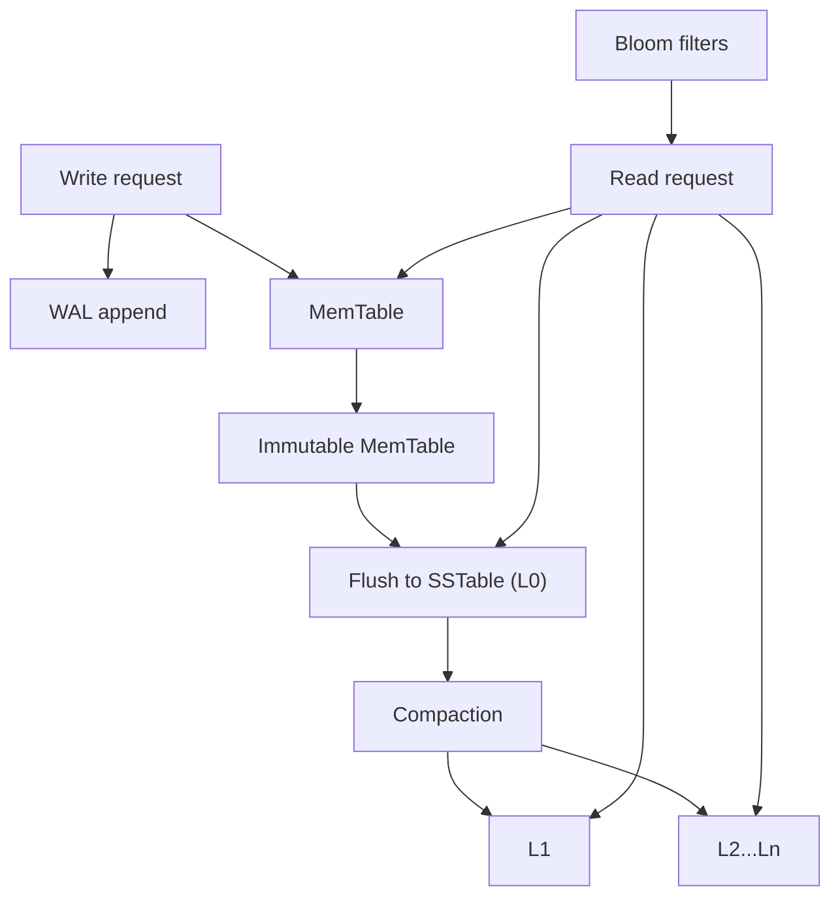

# RocksDB Architecture

## 1. Problem Background

RocksDB is a high-performance embedded key-value storage engine designed for workloads where writes are frequent, data volume is large, and applications need predictable durability and tunable compaction behavior.

It is especially useful in systems such as:

- write-heavy services
- caching layers with persistence
- stream-processing state stores
- LSM-tree-based storage subsystems

Unlike relational systems such as PostgreSQL or MySQL, RocksDB does not try to provide SQL, joins, or relational query planning. Its job is much lower-level: efficiently store and retrieve sorted key-value pairs.

## 2. Architecture Overview

### Main system components

- WAL
- MemTable
- Immutable MemTable
- SSTables
- L0 to Ln levels
- Bloom filters
- Compaction

## 3. Internal Design

### 3.1 MemTable and Immutable MemTable

New writes first land in memory inside the MemTable. Once it fills up, it becomes immutable and a new MemTable takes over for fresh writes.

This design makes writes fast because the engine initially performs sequential/log-structured work instead of random in-place updates.

### 3.2 WAL

To avoid losing writes on crash, RocksDB can also append those writes to a WAL before the MemTable contents are durable elsewhere.

So the write path is:

1. append to WAL
2. insert into MemTable
3. later flush to SSTable

### 3.3 SSTables and levels

When an immutable MemTable is flushed, it becomes an SSTable on disk. Over time, SSTables accumulate in L0 and then move through lower levels through compaction.

This means the on-disk state is not updated in place. Instead, RocksDB continuously reorganizes sorted runs.

### 3.4 Compaction

Compaction is the central maintenance mechanism in RocksDB.

It is required because:

- too many overlapping SSTables hurt reads
- old overwritten/deleted versions should eventually disappear
- level size targets must be maintained

The main trade-off is classic for LSM trees:

- writes are cheap up front
- later background compaction pays part of the cost

### 3.5 Bloom filters

Bloom filters help RocksDB quickly rule out SSTables that definitely do not contain a requested key. This is especially valuable when many SSTables exist, because negative lookups can otherwise touch too many files.

### 3.6 Read path

A point lookup may need to check:

- current MemTable
- immutable MemTable(s)
- L0 files
- lower levels

Bloom filters and indexes inside SSTables reduce unnecessary reads, but the read path is still potentially more scattered than a simple B-Tree lookup.

### 3.7 Why LSM trees are good for writes

LSM trees turn many random updates into:

- append-like WAL writes
- in-memory inserts
- later batch compaction

That is why they are popular in write-heavy systems. The downside is that compaction, read amplification, and space amplification must be managed carefully.

## 4. Design Trade-Offs

### Advantages

- Excellent write throughput
- Good fit for write-heavy and embedded workloads
- Highly tunable compaction and memory behavior
- Strong key-value lookup performance with the right settings

### Limitations

- Compaction can become expensive
- Read amplification can rise if many SSTables overlap
- Space usage may temporarily grow during compaction
- Operational tuning is more important than in simpler engines

### Engineering decisions

RocksDB intentionally accepts background rewrite work in exchange for cheap foreground writes. That is the heart of the design.

## 5. Experiments / Observations

I ran a local benchmark using RocksDB through Python bindings (`rocksdict`) to observe how compaction strategy affects write cost, read cost, and disk usage.

### 5.1 Benchmark setup

Workload:

- 50,000 inserts
- 25,000 overwrites
- value size around 512 bytes
- 10,000 random point reads afterward

Configuration choices:

- small write buffer (`256 KB`) to force flushes quickly
- comparison between:
  - level compaction
  - universal compaction

This is not a full production benchmark, but it is enough to expose the major LSM trade-offs in a controlled local experiment.

### 5.2 Results

| Metric | Level compaction | Universal compaction |
| --- | ---: | ---: |
| Total write/update workload time | 6.084 s | 6.930 s |
| Avg write cost per operation | 81.12 µs | 92.40 µs |
| 10,000 random gets | 0.102 s | 0.108 s |
| Avg point-read cost | 10.2 µs | 10.8 µs |
| Directory size on disk | 3,422,076 bytes | 5,809,803 bytes |
| Estimated live SST bytes | 949,758 bytes | 1,942,983 bytes |
| Live output files | 89 | 8 |

### 5.3 Interpretation

From this workload:

- level compaction finished writes slightly faster
- level compaction also gave slightly better random-read latency
- universal compaction produced far fewer output files
- universal compaction used more disk space in this particular short benchmark

That final point is important: fewer files does not automatically mean lower space usage. Compaction style changes how sorted runs are merged and retained, so space behavior depends heavily on workload shape.

### 5.4 What this says about amplification

#### Write amplification

The write path in RocksDB is cheap initially, but background compaction means user writes can trigger later rewrite work. In this benchmark, level compaction handled the short overwrite-heavy workload more efficiently than universal compaction.

#### Read amplification

Point-read latency stayed low in both cases, but the reason RocksDB needs Bloom filters and compaction is clear: without them, reads would have to search too many SSTables and sorted runs.

#### Space amplification

The benchmark showed visible on-disk overhead beyond the final live data footprint. This is expected in LSM systems because logs, metadata, and compaction outputs may coexist for some time.

### 5.5 Why compaction becomes expensive

Compaction can be expensive because it is not just “moving files around.” It can require:

- reading many SSTable ranges
- merging keys in sorted order
- dropping obsolete versions/tombstones
- writing new SSTables

As the database grows, this background rewrite work can become one of the main costs in the system.

## 6. Key Learnings

RocksDB is best understood as an engine that trades cheap foreground writes for more complicated background maintenance.

The core flow is:

- write to WAL
- write to MemTable
- flush to SSTables
- compact continuously

That flow explains both its strengths and weaknesses.

Key takeaways:

- LSM trees are attractive for write-heavy workloads because they avoid expensive in-place random updates.
- Compaction is necessary, not optional.
- Bloom filters are important because they reduce wasted read work.
- Tuning compaction style changes write cost, read cost, and space usage in real ways.

In short, RocksDB wins when applications need an embedded write-optimized engine and are willing to reason carefully about compaction and amplification trade-offs.

## References

- [RocksDB overview](https://github.com/facebook/rocksdb/wiki/RocksDB-Overview)
- [MemTable](https://github.com/facebook/rocksdb/wiki/MemTable)
- [Bloom Filter](https://github.com/facebook/rocksdb/wiki/RocksDB-Bloom-Filter)
- [Leveled Compaction](https://github.com/facebook/rocksdb/wiki/Leveled-Compaction)
- [Universal Compaction](https://github.com/facebook/rocksdb/wiki/Universal-Compaction)
- [RocksDB tuning guide](https://github.com/facebook/rocksdb/wiki/RocksDB-Tuning-Guide)
