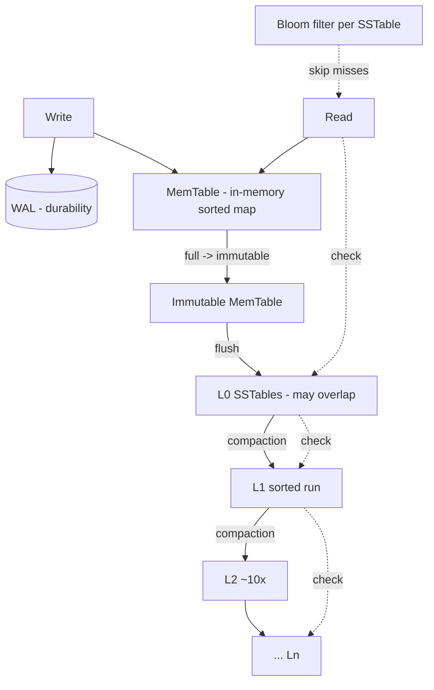

# RocksDB Architecture (LSM-tree Storage)

> System Design Discussion · Advanced DBMS · roll `24BCS10130`
> Amplification numbers come from a transparent LSM simulator
> ([`../experiments/lsm_sim.py`](../experiments/lsm_sim.py),
> output [`rocksdb_lsm.txt`](../experiments/output/rocksdb_lsm.txt)).

## 1. Problem Background

B-tree storage (PostgreSQL, InnoDB) updates data *in place*, which turns a write-
heavy workload into many random disk writes — the worst case for both spinning
disks and SSDs. RocksDB (a Facebook fork of Google's LevelDB) is built on the
**Log-Structured Merge tree (LSM)**, which makes the opposite bet: **never write
randomly — only append, then reorganize in the background.** This trades cheap,
sequential writes for more work on reads and periodic compaction. It powers
write-heavy systems (Kafka Streams state, CockroachDB, MyRocks, embedded stores).

## 2. Architecture Overview



**Write path:** a write is appended to the **WAL** (for durability) and inserted
into the in-memory **MemTable** (a sorted structure). When the MemTable fills, it
becomes immutable and is **flushed** to disk as an immutable, sorted **SSTable**
at level L0. **Compaction** later merges SSTables down into larger, non-
overlapping levels (each ~10× the previous).

**Read path:** check the MemTable, then L0, then each deeper level, newest-first,
until the key is found. A per-SSTable **Bloom filter** lets a lookup *skip* tables
that certainly don't contain the key — critical for keeping reads fast.

## 3. Internal Design

### 3.1 MemTable & WAL
Writes go to RAM (MemTable) for speed, but are first appended to the WAL so a
crash loses nothing. The MemTable is sorted, so a flush produces an already-
sorted SSTable in one sequential write.

### 3.2 SSTables (Sorted String Tables)
Immutable, sorted key→value files with a block index and a Bloom filter.
Immutability is what makes LSMs simple and concurrent: no file is ever modified,
only created and later deleted. Deletes are **tombstones** (markers), not in-place
removals.

### 3.3 Levels & compaction
- **L0** tables come straight from flushes and may have **overlapping** key
  ranges, so a read might check all of them.
- **L1…Ln** hold **non-overlapping** sorted runs; each level is ~10× larger.
- **Compaction** merges overlapping/old data downward, discarding superseded
  versions and tombstones. This is the background cost that keeps reads and space
  bounded.

### 3.4 The three amplifications
LSMs are understood through three ratios — the central trade-off space:
- **Write amplification** — bytes actually written to disk ÷ bytes the user
  wrote. Compaction rewrites data repeatedly, so this is > 1.
- **Read amplification** — SSTables (sorted runs) inspected per lookup. Bloom
  filters cut this dramatically.
- **Space amplification** — bytes on disk ÷ bytes of live data. Dead/old versions
  inflate this until compaction removes them.

### 3.5 Bloom filters
A probabilistic per-SSTable set membership test. A negative answer is always
correct ("key definitely not here → skip this file"); a positive has a small
false-positive rate. This converts read amplification from "check every run" to
"check ~the one run that has the key."

## 4. Design Trade-Offs

| Property | LSM (RocksDB) | B-tree (PostgreSQL / InnoDB) |
|---|---|---|
| Writes | Sequential appends → fast, SSD-friendly | Random in-place writes |
| Reads | Multiple runs to check (mitigated by Bloom filters) | ~one B-tree path |
| Space | Old versions linger until compaction | Compact (or vacuumed/undo) |
| Background work | Compaction (CPU + I/O) | VACUUM (PG) / none (InnoDB in-place) |
| Best for | Write-heavy, high-ingest workloads | Read-heavy, point-lookup OLTP |

The tunable knob is the **compaction strategy**: *leveled* compaction minimizes
space and read amplification at the cost of more write amplification; *tiered*
(size-tiered) compaction does the opposite. RocksDB lets you pick per workload —
that choice *is* the LSM design decision.

## 5. Experiments / Observations

The simulator does honest byte accounting for the real LSM operations (MemTable →
L0 → leveled compaction), inserting 200,000 writes over 20,000 keys (10× overwrite)
([`rocksdb_lsm.txt`](../experiments/output/rocksdb_lsm.txt)):

```
=== No compaction (writes cheap, reads/space blow up) ===
    sorted runs to search per read : 95
    WRITE amplification            : 0.95x
    SPACE amplification            : 9.49x
    READ probes/lookup (no bloom)  : 9.97
    READ probes/lookup (w/ bloom)  : 1.09

=== Leveled compaction (RocksDB default) ===
    sorted runs to search per read : 4
    WRITE amplification            : 3.06x
    SPACE amplification            : 1.28x
    READ probes/lookup (no bloom)  : 3.44
    READ probes/lookup (w/ bloom)  : 1.02
```

**What this shows:**
1. **Compaction is a trade, not a free win.** Turning on leveled compaction cut
   space amplification 9.49× → 1.28× and runs-to-search 95 → 4, but *raised* write
   amplification 0.95× → 3.06×. You pay writes to save space and reads — exactly
   RocksDB's central tension.
2. **Bloom filters are decisive for reads.** Without compaction, a lookup probes
   ~10 runs; a Bloom filter drops that to ~1.09. Even with 95 runs present, the
   filter makes most of them free to skip. This is why an LSM can stay read-
   competitive despite many SSTables.
3. **Why LSMs suit write-heavy loads:** writes only ever append (cheap), and the
   reorganization cost is deferred to background compaction rather than paid on
   the write path.

## 6. Key Learnings

- An LSM inverts the B-tree bargain: B-trees keep reads cheap and pay on writes;
  LSMs keep writes cheap and pay on reads + background compaction.
- The whole architecture is best understood as managing **three amplifications**
  at once — and you cannot minimize all three. Measuring them made the trade-off
  concrete: leveled compaction trading 3× write amp for an 8× space-amp reduction.
- Bloom filters are not an optimization detail — they are what makes the LSM read
  path viable, collapsing "check every sorted run" into "check roughly one."
- "Best storage engine" is workload-dependent. RocksDB/LSM for ingest-heavy
  systems; B-trees for read-heavy OLTP. The compaction strategy is the dial that
  moves an LSM along the read/write/space trade-off curve.
