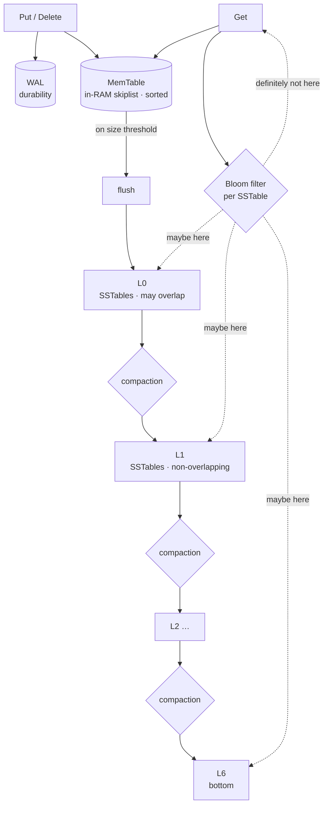

# RocksDB

> A log-structured merge tree storage engine. Never updates in place — every write is an append. The interesting consequence is that you pay *later*, in background compaction, for the cheap writes you got upfront. The job of the design is to keep that bill bounded.

## 1. Problem background

Take a B-tree-organized store under a heavy write workload and watch
what happens: every update walks the tree, dirties one or more interior
pages, and (if the right leaf is full) splits a page — meaning more
random I/O. Writes are *expensive* on a tree designed primarily for
fast reads.

An LSM flips that around:

- **Writes** become "append to a memtable; on overflow, dump that
  memtable to disk as one immutable, sorted file (an SSTable)."
  Sequential. Fast. No random page rewrites.
- **Reads** become "check the memtable, then check each SSTable on
  disk, newest first." This *would* blow up if the engine didn't
  periodically merge older SSTables together — that merging is called
  **compaction**, and it's what an LSM trades cheap writes against.

The architecture below is the bookkeeping needed to make that
trade-off bounded.

## 2. Architecture overview



| Piece | Role |
|---|---|
| **WAL** | Every `Put` is appended to a log before going into the memtable. Crash recovery replays it. |
| **MemTable** | An in-RAM skiplist that holds the most recent writes, sorted by key. Cheap to insert into, cheap to flush. |
| **SSTable** | A sorted, immutable on-disk file. Block-aligned, with an index footer and a Bloom filter. |
| **Levels (L0 … L6)** | Disk tiers. L0 holds the freshest flushes (may overlap each other). L1+ are non-overlapping; each level is ~10× the size of the one above. |
| **Bloom filter** | One per SSTable. A reader queries Bloom first; a "no" means the key is *guaranteed* not in that file, and we save a block read. |
| **Compaction** | Background job that merges old SSTables into new, larger ones at the next level, dropping shadowed and tombstoned entries. |

## 3. Internal design

### 3.1 The write path

```
Put(k, v)
  → append (k, v) to WAL (fsync depending on options)
  → insert (k, v) into MemTable skiplist  ──── O(log N), no disk
  ── on MemTable full ──→ swap, flush old memtable to a new L0 SST
```

Single-write latency is dominated by the WAL fsync (if you're durable)
or just memory writes (if you're not). The SSTable creation is
asynchronous to the writing thread.

### 3.2 SSTable layout

A sorted file of `(key, value)` blocks, plus:

```
| data block 0  |   ← keys K_a..K_b
| data block 1  |   ← keys K_b..K_c
| ...           |
| filter block  |   ← Bloom filter for the whole file (10 bits/key default)
| index block   |   ← {block_offset → first key} map
| footer        |   ← magic + pointer to index + filter
```

A Get walks the in-memory index → finds the right block offset → does
one block read. The filter is checked **before** the block read, so a
miss is zero I/O.

### 3.3 Leveled compaction

```
 L0: [a..f] [d..k] [c..m]              ← overlap allowed; flushed memtables
 L1: [a..d]   [e..h]   [i..n]          ← total ≤ 10 MB, no overlap
 L2: [a..b][b..c][c..d] …               ← total ≤ 100 MB
 ...
 L6: …                                  ← bottom
```

When `total_bytes(L_i) > threshold`, the engine picks a file in `L_i`
and merges it with the overlapping files in `L_{i+1}`. Output is one
or more new files in `L_{i+1}`; inputs are deleted.

Cost model:

- Each level is ~10× the previous one.
- A key passes through every level on its way down: each pass rewrites
  its bytes once.
- **Write amplification** ≈ levels touched × overlap fan-out — roughly
  `O(L × R)` where L is the number of levels and R is the fan-out
  ratio.

### 3.4 Universal compaction

```
 L0: [SST 0] [SST 1] [SST 2] [SST 3] [SST 4] …
              ↓
         merge a contiguous run of similar-size SSTs into one
```

Universal (also called "tiered" in the literature) keeps fewer big
sorted runs at the same level instead of spreading into many levels.
The result: less compaction I/O (the same byte is rewritten fewer
times), but more **read amplification** (you may need to check several
big files per Get) and more **space amplification** (because shadowed
data sticks around between compactions).

### 3.5 The amplification triangle

Pick any two:

```
              low write amp
                  /\
                 /  \
                /    \
        low    /      \   low
        space /        \  read amp
         amp / -------- \
```

- **Leveled**: low *space* amp, low *read* amp, higher *write* amp.
- **Universal / tiered**: low *write* amp, higher *space* + *read* amp.
- A pure log (no compaction at all) has the minimum write amp and
  unbounded read + space amp — that's why it doesn't exist as a
  shipping option.

## 4. Trade-offs

| Choice | Cost | Benefit |
|---|---|---|
| Append-only, no in-place updates | Compaction cost in background, complicated read path | Sequential writes; predictable insert throughput |
| Multi-level on-disk layout | More files, more bookkeeping | Bounds the "how many SSTs do I check per Get" question |
| Bloom filters per SSTable | ~10 bits/key memory or extra read | Most negative Gets become zero-block-read operations |
| WAL on every write | Extra disk traffic; fsync latency | Crash safety, replayable history |
| Compaction strategy | Tunable; choose one trade-off direction | None of the three amps go away — you trade them |

## 5. Experiments / observations

[`amp_bench.cpp`](./amp_bench.cpp) writes 1,000,000 random key/value
pairs (15-byte keys, 100-byte non-compressible values → ~110 MB
logical), forces a full compaction down to L6, then issues 100,000
point-Gets. All counters come from RocksDB's own
`Statistics::getTickerCount`. Captured output in
[`bench_results.txt`](./bench_results.txt) and
[`bench_natural.txt`](./bench_natural.txt).

### Side-by-side

| Metric | Leveled | Universal |
|---|---|---|
| Logical user bytes | 109.67 MB | 109.67 MB |
| Flush bytes (L0)   | 90.63 MB | 90.63 MB |
| Compaction bytes   | **143.77 MB** | **71.89 MB** |
| WAL bytes          | 123.98 MB | 123.98 MB |
| **Write amp (no WAL)** | **2.14×** | **1.48×** |
| Write amp (incl. WAL)  | 3.27× | 2.61× |
| Space amp (live / logical) | 0.66× | 0.66× |
| Final on-disk size | 9.6 MB (post Snappy) | 9.6 MB |
| Bloom skipped Gets | 38,085 | 38,085 |
| Data-block accesses | 103,469 | 85,047 |
| Write phase throughput | 393 kops/s | 417 kops/s |

What's actually going on:

- **Leveled rewrites the data ~2× more than universal**, on this 1M-key
  workload. The 50% saving on compaction bytes is the headline
  difference.
- **Both store the same final dataset.** Snappy compresses the 110 MB
  payload down to ~10 MB on disk; the space-amp number is identical.
- **Bloom filters skip ~38% of Gets** — those negatives never touch a
  data block. That's the whole reason multi-level reads are tolerable.
- **Universal does fewer block reads per Get** (85K vs 103K) because
  there are fewer sorted runs to check. So even though universal
  *theoretically* hurts read amp, in this fully-compacted state it
  actually wins. The story flips once L0 starts filling with
  overlapping universal runs.

### Why "write amp (no WAL)" matters more than "write amp (incl. WAL)"

The WAL line item (123.98 MB) is independent of compaction strategy —
every byte you Put is going to be WAL'd once, regardless of how the
engine moves it around afterwards. So when comparing compaction
strategies, the right number is the *non-WAL* one. Leveled rewrites
2.14 bytes for every byte you wrote; universal rewrites 1.48.

### Where the data lives after compaction

```
Level  Files  Size (MB)
  6        2         72       (compressed Snappy of ~110 MB logical)
```

Both runs put everything in L6 after `CompactRange(force=kForce)`. In
a real production setup with continuous writes you'd see steady-state
levels with files spread across L0..L6.

## 6. Key learnings

- **The amplification triangle is non-negotiable.** Write amp, read
  amp, and space amp move against each other. Picking a "compaction
  strategy" is picking which vertex of the triangle you want to be
  closer to.
- **Bloom filters earn their keep.** ~38% of point-Gets skipped a
  block read on negative lookups. Without them, every Get would scale
  with the number of SSTables visited.
- **Compaction is the slow part you don't see.** The flush bytes
  (90.6 MB) are roughly bounded by what you wrote. The compaction
  bytes (71.9 – 143.8 MB) are the *new* I/O the engine creates on your
  behalf. That number is what you're really tuning.
- **`Statistics::getTickerCount` is the only honest way to measure
  this.** Wall-clock writes look fast either way; the cost lives in
  the background. You have to ask the engine.
- **Storage engines aren't faster or slower — they're shaped.** An LSM
  *can't* beat a B-tree at point reads on a small dataset; a B-tree
  *can't* beat an LSM at write-heavy ingest. Picking is a function of
  workload, not benchmarks.
