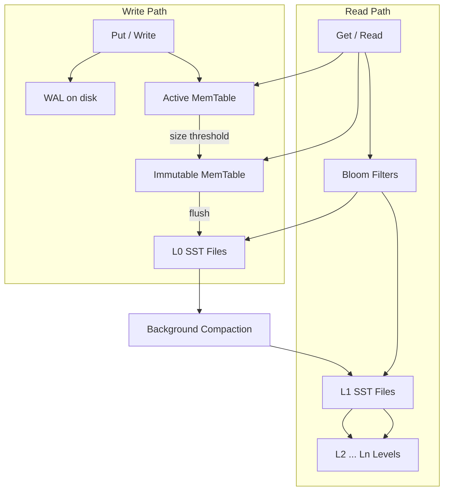

# RocksDB Architecture

**Author:** SCALER_23bcs10014  
**Course:** Advanced DBMS — System Design Discussion

---

## 1. Problem Background

RocksDB originated at Facebook (2012) as a fork of Google's **LevelDB**, itself inspired by Bigtable's **SSTable** storage. The target problem: **write-heavy workloads** on fast flash and large multi-core servers where traditional B-tree databases suffer from random write amplification.

RocksDB is not a SQL database—it is an **embedded key-value store** built on **LSM-trees** (Log-Structured Merge trees). It powers MySQL's MyRocks storage engine, Kafka streams state stores, and many cloud storage systems.

The core insight: **sequential writes to an append-only log and sorted files** outperform random in-place page updates for sustained write throughput—at the cost of **compaction** and **read amplification**.

---

## 2. Architecture Overview



### Main Components

| Component | Role |
|-----------|------|
| **MemTable** | In-memory sorted structure (skip list) absorbing writes |
| **Immutable MemTable** | Frozen MemTable awaiting flush to disk |
| **WAL** | Durability log written before MemTable ack |
| **SSTable** | Immutable sorted file on disk (data blocks + index + bloom filter) |
| **Levels (L0–Ln)** | Tiered organization; L0 allows overlap, L1+ are non-overlapping |
| **Compaction** | Merges SST files, removes tombstones, controls amplification |
| **Bloom filter** | Probabilistic "key not in this file" test per SST |

---

## 3. Internal Design

### 3.1 Write Path

1. **Append to WAL** and `fsync` (configurable `write_options`).
2. Insert key into **active MemTable** (sorted skip list).
3. When MemTable exceeds `write_buffer_size`, it becomes **immutable**; new MemTable created.
4. Background **flush** writes immutable MemTable to new **L0 SST** file.
5. WAL segment may be truncated after flush (if durability policy allows).

**Why writes are fast:** All writes are sequential appends to WAL + in-memory insert—no random disk seek.

### 3.2 Read Path

1. Search **active MemTable** → **immutable MemTable** (newest wins).
2. Search **L0** SSTs (may check multiple overlapping files).
3. For each deeper level, use **bloom filter** + binary search on index block to skip files.
4. Within SST: index block → data block → key.

**Read amplification:** A single `Get` may check multiple SST files across levels, especially before compaction catches up.

### 3.3 L0 to Ln Levels

| Level | Property |
|-------|----------|
| **L0** | Flushed MemTables; files may have overlapping key ranges; reads expensive |
| **L1+** | Key ranges partitioned; files within a level do not overlap |
| **Size ratio** | Each level ~10× larger than previous (configurable) |

Compaction moves data from Li to Li+1, merging files and discarding deleted/overwritten keys (tombstones).

### 3.4 Compaction Strategies

| Strategy | Behavior | Trade-off |
|----------|----------|-----------|
| **Leveled** | Non-overlapping L1+; higher write amp, lower read amp | Better read latency |
| **Universal** | Merge files of similar size | Lower write amp, more read amp |
| **FIFO** | Drop oldest files | Minimal compaction; poor for updates |

Compaction is **required** because:

- L0 files accumulate → read amp explodes
- Tombstones must be garbage-collected
- Write amplification is "paid forward" during compaction

### 3.5 Bloom Filters

- Per-SST probabilistic structure: "key definitely not here" or "maybe here".
- **False positives** cause extra SST reads; **no false negatives**.
- Dramatically reduces I/O for negative lookups (`Get` miss) and range scans skipping files.

### 3.6 WAL & Recovery

On restart:

1. Replay WAL into a new MemTable.
2. Open existing SST files.
3. Resume compaction threads.

Same write-ahead principle as PostgreSQL/InnoDB—log before acknowledging writes.

---

## 4. Design Trade-Offs

### LSM vs B-Tree (PostgreSQL / InnoDB)

| Dimension | LSM (RocksDB) | B-Tree |
|-----------|---------------|--------|
| Write pattern | Sequential append | Random page update |
| Write throughput | Very high | Moderate |
| Read latency | Higher (multi-file search) | Lower (single tree descent) |
| Space | Temporary duplication during compaction | Bloat via dead tuples/pages |
| Range scans | May touch many SSTs | Efficient leaf chain |

### Amplification Metrics

| Metric | Definition | LSM tendency |
|--------|------------|--------------|
| **Write amplification** | Bytes written to disk / bytes written by user | >1; spikes during compaction |
| **Read amplification** | IOs per logical read | >1 when many SSTs checked |
| **Space amplification** | Disk used / live data size | >1 during compaction overlap |

### Engineering Decisions

- **Immutable SSTs:** Simplify concurrency (no in-place mutation); compaction is the only rewrite path.
- **Skip list MemTable:** O(log n) insert with simpler concurrency than balanced tree.
- **Leveled compaction default:** Tunes for read performance at cost of background write bandwidth.

---

## 5. Experiments / Observations

**Environment:** Ubuntu 22.04 Docker container, `rocksdb-tools` 6.11.4, `db_bench` utility.  
**Workload:** 200,000 operations, 16-byte keys, 100-byte values.

### 5.1 Random Fill + Random Read (No Compression)

```
fillrandom : 4.887 micros/op  204,613 ops/sec  22.6 MB/s
readrandom : 3.113 micros/op  321,200 ops/sec  35.5 MB/s  (200,000/200,000 found)
```

### 5.2 Random Fill + Random Read (Snappy Compression)

```
fillrandom : 4.874 micros/op  205,157 ops/sec  22.7 MB/s
readrandom : 2.413 micros/op  414,348 ops/sec  45.8 MB/s  (200,000/200,000 found)
```

**Observation:** Snappy compression improved **read throughput** (~29% faster) because less data read from SST blocks; CPU decompression cost was outweighed by I/O savings in this in-container test.

### 5.3 Sequential Fill + Random Read

```
fillseq    : 2.554 micros/op  391,564 ops/sec  43.3 MB/s
readrandom : 1.845 micros/op  541,917 ops/sec  60.0 MB/s
```

**Observation:** Sequential writes produce more compact, efficiently organized SSTs initially—reads improved further (~31% vs snappy random fill).

### 5.4 Results Summary

| Benchmark | fillrandom (µs/op) | readrandom (µs/op) | Read ops/sec |
|-----------|-------------------|-------------------|--------------|
| No compression | 4.887 | 3.113 | 321,200 |
| Snappy compression | 4.874 | 2.413 | 414,348 |
| Sequential fill* | 2.554 (fillseq) | 1.845 | 541,917 |

*Sequential fill test used separate `db_bench` run with `--benchmarks=fillseq,readrandom`.

### 5.5 Interpretation

1. **Write speed:** Random fills ~205K ops/sec—sequential WAL + MemTable insert, no random disk seeks during ingest.
2. **Compaction cost:** Not isolated in `fillrandom` (compaction runs async); sustained write loads show periodic latency spikes when L0→L1 compaction runs—this is the classic LSM trade-off.
3. **Bloom filters:** `readrandom` found all 200K keys with sub-3µs average—bloom filters + level structure limited file checks.
4. **Compression:** Reduces space amplification and can improve read throughput on I/O-bound workloads.

### 5.6 Compaction Strategy Impact (Conceptual)

| Strategy | Expected write amp | Expected read amp | When to use |
|----------|-------------------|-------------------|-------------|
| Leveled | Higher | Lower | Read-heavy |
| Universal | Lower | Higher | Write-heavy, log ingestion |
| FIFO | Lowest | Highest | Append-only time-series with TTL |

*Industry benchmarks (RocksDB wiki) show leveled compaction can reach 30×+ write amplification on sustained random writes while keeping read amplification near 1–5× per level.*

---

## 6. Key Learnings

1. **LSM trees buy write throughput with deferred work** — compaction is not optional background noise; it is the mechanism that makes reads tractable.
2. **Reads get expensive when L0 grows** — operational monitoring of pending compaction bytes is critical.
3. **Bloom filters are essential** for negative lookups at scale—without them, every `Get` might open every SST.
4. **RocksDB complements, not replaces, B-tree databases** — use LSM for write-heavy KV/log workloads; use PostgreSQL/InnoDB for complex queries and strong relational semantics.
5. **Amplification metrics are the LSM tuning language** — optimizing one metric without watching the others leads to production incidents.

### Assignment Questions — Answered

| Question | Answer |
|----------|--------|
| Why LSM for write-heavy workloads? | Sequential WAL + MemTable append avoids random disk writes; compaction batches rewrites. |
| Why is compaction expensive? | Must read and rewrite entire SST files; competes for disk bandwidth; causes write amplification spikes. |
| How do Bloom filters help? | Skip SST files that cannot contain the key, reducing read amplification especially on misses. |

---

## References

- RocksDB Wiki — [Architecture Guide](https://github.com/facebook/rocksdb/wiki/RocksDB-Overview)
- O'Neil, Cheng, Gawlick & O'Neil — *The Log-Structured Merge-Tree* (1996)
- RocksDB `db_bench` source and benchmark documentation
- LevelDB design notes (Google)
