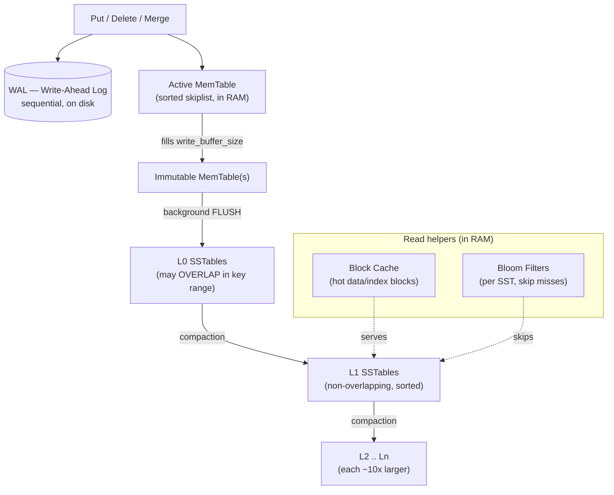

# RocksDB Architecture — An LSM-Tree Storage Engine

> RocksDB is an **embeddable, persistent key-value store** built around a **Log-Structured Merge-tree (LSM-tree)**. Its one defining decision: turn the random in-place writes of a B-tree into **sequential** writes by buffering in memory and merging on disk in batches. Almost every property below — fast writes, background compaction, the three amplifications — follows from that single choice. RocksDB sits at the **write-optimized** corner of the read/write/space trade-off space.

**TL;DR**

| Dimension | RocksDB (LSM-tree) |
|---|---|
| What it is | A C++ *library* / storage engine, not a server; you link it into your app |
| Lineage | Forked from Google's **LevelDB** at Facebook (Meta), tuned for flash/SSD + write-heavy workloads |
| Core structure | LSM-tree: in-memory **MemTable** → on-disk immutable **SSTables** in levels **L0..Ln** |
| Write path | Append to **WAL** (durability) + insert into **MemTable** (sorted skiplist); flush full memtables to L0 |
| Read path | MemTable → immutable MemTables → L0 (all files) → one file per level L1..Ln; **Bloom filters** skip files |
| Housekeeping | Background **compaction** merges SSTables to reclaim space and bound read cost |
| The tax | Writes are cheap, but **compaction** rewrites data repeatedly → **write amplification**; tuning trades write/read/space against each other |
| Used inside | MyRocks (MySQL), CockroachDB, TiKV, Kafka Streams, Ceph, and many others |

---

## 1. Problem Background

**The problem RocksDB solves.** A classic update-in-place B-tree (InnoDB, the PostgreSQL/SQLite heaps and indexes) keeps data sorted on disk and modifies pages *where they live*. On a write-heavy workload this means a **random** disk write per logical update — each modified page must be found and rewritten in place. Random I/O is the worst case for spinning disks and still costly on flash, where it also drives **write wear**. As the working set outgrows RAM, a B-tree's write throughput collapses into a storm of small random writes.

**The LSM-tree idea.** The Log-Structured Merge-tree (O'Neil, Cheng, Gawlick & O'Neil, 1996) attacks this by *never* updating data in place. Writes are buffered in a sorted **in-memory** structure and periodically flushed to disk as **immutable, sorted files**. Those files are later **merged** (compacted) in the background. Two consequences:

- Every disk write is **sequential** (append a new file or rewrite a sorted run front-to-back), which is dramatically faster than random in-place writes on both HDD and SSD.
- Reads may now have to look in **several places** (memory + multiple files), because a key's newest version could be anywhere that hasn't been merged yet. The LSM-tree therefore *buys cheap writes by spending on reads and on background merge work* — the central trade-off of this whole document.

**Where RocksDB came from.** RocksDB is a C++ store that began as a fork of Google's **LevelDB** and was developed at Facebook to exploit **fast storage (SSD/flash)** and to survive **write-heavy** server workloads. Per its homepage it is *"an embeddable persistent key-value store for fast storage"* using *"a log structured database engine, written entirely in C++."* Keys and values are arbitrary byte strings.

**It is a library, not a server.** This is the SQLite-style architectural decision (and the same one this course's PostgreSQL-vs-SQLite note pivots on): there is no daemon, no network port, no query language. You embed RocksDB *inside* a larger system, which supplies the SQL/transactions/networking. That is exactly why RocksDB shows up as the storage engine underneath **MyRocks** (MySQL), **CockroachDB**, **TiKV**, **Kafka Streams**, **Ceph**, and others — it provides the *write-optimized ordered map*, and the host provides everything else.

> Headline contrast with a B-tree engine: a B-tree asks *"how do I keep data perfectly sorted on disk at all times?"* and pays with random writes. An LSM-tree asks *"how do I make every write sequential?"* and pays with read fan-out and background compaction.

---

## 2. Architecture Overview

RocksDB's data flow is a one-way pipeline: writes enter memory, age out to disk as immutable files, and slowly sink through levels as compaction merges them.



**Reading the diagram.** A write is made durable in the **WAL** and inserted into the **active MemTable**. When the MemTable fills (`write_buffer_size`, default **64 MB**) it is sealed into an **immutable MemTable**; a background thread **flushes** it to a new SSTable at **Level 0**. L0 files can overlap (they are just dumped memtables); from **L1** down, each level is a single non-overlapping sorted run, ~10× larger than the level above. **Compaction** continuously merges files downward. The **block cache** and **Bloom filters** live in RAM to make reads cheap.

**Column families.** A RocksDB database can be partitioned into **column families** — independent key spaces that share one WAL (so writes across families are atomic via `WriteBatch`) but each have their **own MemTable and their own SST/level structure**. This lets one database hold logically distinct datasets (e.g. metadata vs. payload) with *different* tuning — different compaction style, memtable size, or Bloom settings — while still committing atomically. Every database has a `default` column family.

---

## 3. Internal Design

This is the core of the engine. The pieces below are introduced in roughly the order data flows through them.

### 3.1 MemTable & immutable MemTable

The **MemTable** is the in-memory write buffer and the first place every read looks. The default implementation is a **skiplist**, which keeps entries **sorted by key** and supports concurrent reads with ongoing writes, giving *"good performance to both read and write, random access and sequential scan."* Defaults that matter:

| Option | Default | Meaning |
|---|---|---|
| `write_buffer_size` | 64 MB | size at which the active MemTable seals |
| `max_write_buffer_number` | 2 | how many MemTables (active + immutable) may exist before writes stall |
| `memtable_factory` | SkipList | also available: HashSkipList, HashLinkList, Vector |

When the active MemTable reaches `write_buffer_size`, it is made **immutable** (read-only) and a fresh active MemTable takes new writes. A background thread then **flushes** the immutable MemTable to an SSTable. Because flushing is asynchronous, foreground writes keep flowing — *unless* immutable MemTables pile up faster than flush can drain them (capped by `max_write_buffer_number`), at which point writes **stall**. That stall is the first place LSM back-pressure becomes visible.

Alternative MemTable types trade generality for a niche: **HashSkipList**/**HashLinkList** speed up prefix-scoped lookups, and **Vector** favors bulk random-write ingestion. The skiplist is the default precisely because it is balanced.

### 3.2 Write-Ahead Log (WAL)

The MemTable lives in volatile RAM, so to make a write **durable** RocksDB first appends it to the **WAL**, an on-disk sequential log. *"In the event of a failure, WAL files can be used to recover the database to its consistent state, by reconstructing the memtable from the logs."*

Structure: the WAL is a sequence of fixed **32 KB blocks**; each record carries a **CRC32 checksum**, a length, and a **type** (`FULL`, or `FIRST`/`MIDDLE`/`LAST` when a record is fragmented across block boundaries). On restart, RocksDB replays the WAL to rebuild the MemTables that had not yet been flushed.

Crucially, the WAL's life is tied to the flush: **once the MemTable it covers has been safely flushed to an SSTable, that WAL is obsolete** and is archived/deleted. So the WAL only ever protects the *unflushed* tail of writes. This is the same write-ahead-logging discipline used by PostgreSQL and InnoDB — *log the change durably before acknowledging it* — applied to an LSM engine.

### 3.3 SSTable (SST file) format

An **SSTable** ("Sorted String Table") is the on-disk unit: **immutable** and **sorted by key**. Immutability is what makes the LSM design tractable — files are never edited, only created and later replaced wholesale by compaction, so there is no in-place page locking and old files can be read while new ones are written. Internally an SST file is, conceptually:

```
+-----------------------------------------+
| Data block 0   (sorted key→value pairs) |
| Data block 1                            |
| ...                                     |   <- compressed, cached in block cache
| Data block N                            |
+-----------------------------------------+
| Filter block   (Bloom filter for file)  |   <- "does this file maybe hold key K?"
+-----------------------------------------+
| Index block    (key → data block offset)|   <- binary-searchable
+-----------------------------------------+
| Footer (points to index + metaindex)    |
+-----------------------------------------+
```

Three details are essential for the read/compaction logic:

- **Sequence numbers.** Every write gets a monotonically increasing **sequence number**. A key may therefore appear *many times* across files; the version with the **highest sequence number wins**. This is how an immutable-file store expresses "update" without overwriting.
- **Tombstones.** A delete does **not** erase data; it writes a **tombstone** record (a marker keyed by the deleted key with its own sequence number). A read that finds a tombstone as the newest version returns **"not found."** The real bytes are only reclaimed later, during compaction.
- **Bloom filter (per file, optionally per block).** A compact probabilistic summary of which keys the file contains (see 3.5).

### 3.4 Levels L0..Ln

SSTables are organized into **levels**, and the level structure is what keeps reads bounded as data grows:

- **L0 is special.** Its files come *straight from flushed MemTables*, so different L0 files can have **overlapping key ranges**. A key could be in any of them → a read must check **all** L0 files. L0 is therefore kept small (compaction is triggered once it holds `level0_file_num_compaction_trigger` files).
- **L1 and below are non-overlapping.** Within each of L1..Ln the key space is **range-partitioned** across files with **no overlap**, so they form a single sorted run. A point lookup in such a level touches **at most one file**, found by binary search on the level's index.
- **Each level is ~10× larger** than the one above (`max_bytes_for_level_multiplier`, default 10; L1's target is `max_bytes_for_level_base`). With `level_compaction_dynamic_level_bytes` enabled (recommended), roughly **90% of all data lives in the last level**, which stabilizes the shape and bounds space overhead.

This exponential, mostly-non-overlapping shape is what guarantees a read checks only *one file per level* below L0 — the foundation of bounded read amplification.

### 3.5 Bloom filters

A **Bloom filter** is a probabilistic membership structure: it answers *"key K may be present"* or *"key K is definitely absent."* It can yield **false positives** (rarely says "maybe" when the key is absent) but — by construction — **never false negatives** (it never says "absent" for a key that is present). That one-sided guarantee is exactly what a correct lookup needs: a "definitely absent" answer is *trustworthy* and lets the reader **skip that SSTable's data blocks entirely**, avoiding a disk read.

Accuracy is tunable by **bits per key**, set via `NewBloomFilterPolicy(bits_per_key)`. The classic operating points (from the RocksDB wiki):

| Bits/key | False-positive rate |
|---|---|
| ~4.9 | ~10% |
| ~10 (typical) | ~1% |
| ~15.5 | ~0.1% |

Modern RocksDB uses **full filters** (one filter per SST file, laid out for cache-line-friendly probing) rather than the older per-block filters. The cost is **memory**: more bits/key means a bigger filter to keep resident. This is the read/memory half of the RUM trade-off made concrete — *spend RAM to avoid disk reads.*

### 3.6 Compaction (leveled vs. universal vs. FIFO)

**Why compaction exists at all.** Because files are immutable and updates/deletes are expressed as newer versions and tombstones, obsolete data accumulates and the same key can be scattered across many files. **Compaction** merges SSTables to (a) **reclaim space** by dropping overwritten values and resolved tombstones, and (b) **preserve the LSM shape** so that reads stay bounded. RocksDB ships three strategies that trade the three amplifications differently:

| Strategy | How it merges | Write amp | Read amp | Space amp | Use when |
|---|---|---|---|---|---|
| **Leveled** (default) | Picks a file in Ln, merges it with the overlapping files in Ln+1; data is rewritten as it sinks level by level | **High** | **Low** | **Low** (~1.1x with dynamic levels) | Read-heavy / space-sensitive; the general default |
| **Universal** (tiered / "size-tiered") | Waits for several **similarly-sized sorted runs** and merges them in larger batches; fewer rewrites per byte | **Low** | **Higher** | **Higher** (bounded by `max_size_amplification_percent`, default **200** → up to ~3x) | Very write-heavy; can't keep up with leveled's rewrite cost |
| **FIFO** | Treats SSTs as a time series; simply **drops the oldest** files once total size exceeds a threshold (almost no merging) | **Lowest** | Highest | n/a (data expires) | Caches / TTL data where old entries may be discarded |

The key intuition: **leveled** keeps each level a single tidy sorted run, which is great for reads and space but means a byte is **rewritten on the way down through every level** (hence high write amplification). **Universal** lets several runs coexist and merges them less often — far less rewriting (low write amp) — but at any moment there are *more runs to search* (higher read amp) and *more obsolete data lying around* (higher space amp, up to ~2–3× live data by default). **FIFO** barely compacts at all and just ages data out. These three are literally three points on the trade-off curve, selected by workload.

### 3.7 Write path (step by step)

1. The write (`Put`/`Delete`/`Merge`) is assigned a **sequence number**.
2. It is **appended to the WAL** (for durability) **and** inserted into the **active MemTable** (sorted). Both happen before the write is acknowledged — that is what makes it durable and immediately readable.
3. When the MemTable hits `write_buffer_size`, it becomes **immutable** and a new active MemTable is created.
4. A **background flush** writes the immutable MemTable out as a new **L0 SSTable** (with its Bloom filter and index), then retires the WAL segment it covered.
5. **Compaction** later merges L0 → L1 → … → Ln, discarding overwritten values and resolved tombstones along the way.

Every disk write in this path — WAL append, flush, compaction output — is **sequential**, which is the whole point.

### 3.8 Read path (step by step)

A `Get(key)` must return the version with the **highest sequence number**, searching newest-to-oldest and stopping at the first match:

1. **Active MemTable** → 2. **Immutable MemTable(s)** → 3. **all L0 files** (newest first; all of them, since L0 overlaps) → 4. **one file per level L1..Ln**, located by that level's index.
2. At each candidate SSTable, the **Bloom filter** is consulted first: "definitely absent" → **skip the file's data blocks** (no disk read). Only on "maybe present" does RocksDB read/decompress the data block (serving it from the **block cache** if hot) and binary-search it.
3. The **first** match wins. If that newest version is a **tombstone**, the key is reported **not found**; otherwise its value is returned.

So read cost is, worst case, *MemTables + every level* — but Bloom filters prune the SSTs that can't hold the key, and the per-level index limits each level below L0 to a single file. That is how an LSM keeps reads from degrading linearly with data size.

### 3.9 Block cache

SST **data and index blocks** are compressed on disk. The **block cache** is an in-RAM LRU cache of **uncompressed blocks**, so hot data is served without re-reading or re-decompressing from storage; it is the LSM analogue of a B-tree engine's buffer pool. RocksDB additionally benefits from the **OS page cache** as a second tier holding the compressed file bytes. (An older "compressed block cache" tier existed but is deprecated; the current design caches uncompressed blocks in the block cache and leans on the OS cache underneath.) Bloom filters and index blocks can also be pinned in the block cache so that the *prune* and *locate* steps of a read never themselves hit disk.

---

## 4. Design Trade-Offs

This is the heart of the topic: **you cannot have cheap reads, cheap writes, and cheap space all at once.** Every RocksDB tuning knob moves you along that surface.

### 4.1 The three amplifications — defined precisely (do not conflate them)

| Amplification | Definition | Driven by | Lowered by |
|---|---|---|---|
| **Write amplification** | bytes actually **written to storage** ÷ bytes **logically written** by the user | Compaction **rewriting** the same data as it sinks through levels | tiered/universal compaction, fewer levels, larger files |
| **Read amplification** | disk reads (or work) per logical **lookup** (worst case: check MemTables + every level) | Many places a key might live (L0 fan-out, more runs) | **Bloom filters**, per-level index, leveled (one run/level) |
| **Space amplification** | bytes **on disk** ÷ bytes of **live logical data** | Obsolete versions + tombstones **not yet compacted away** | leveled compaction (esp. dynamic levels), more frequent compaction |

These are **independent quantities** and a domain reviewer will expect them kept apart. A common error is to call any single number "amplification" — always say *which one*.

### 4.2 The RUM conjecture — why you can optimize at most two

The **RUM conjecture** (Athanassoulis et al., *Designing Access Methods: The RUM Conjecture*, EDBT 2016) formalizes the intuition: for **R**ead, **U**pdate, and **M**emory/space overhead, *an access method that sets a tight upper bound on **two** of the three necessarily relaxes the **third**.* You get **two degrees of freedom**, not three. The LSM-tree's three amplifications are precisely a RUM instance — read vs. write vs. space — and the compaction strategy is the dial that chooses *which two you favor*:

- **Leveled** → favors **read** + **space** (one sorted run per level, little stale data), pays in **write** amplification.
- **Universal/tiered** → favors **write** (few rewrites), pays in **read** + **space** amplification.

There is no setting that wins all three; the engine only lets you choose your corner.

### 4.3 Answering the assignment's guiding questions

**Why are LSM-trees preferred for write-heavy workloads?** Because they convert the B-tree's **random in-place writes into sequential writes**. A write is just (1) a sequential WAL append and (2) an in-RAM MemTable insert; the expensive sorted-on-disk work is **deferred and batched** into background flush + compaction, which themselves only ever write sequentially. Sequential I/O is far faster than random I/O on both HDD and SSD, and it reduces flash write-wear. So when writes dominate, the LSM amortizes them beautifully — at the cost of read fan-out and background CPU/I/O that read-heavy B-trees avoid.

**Why can compaction become expensive?** Compaction is the bill for deferring work. It consumes **CPU** (merge-sort + decompress/recompress + checksum), **disk I/O** (read old SSTs, write new ones), and it is the source of **write amplification** — in leveled compaction a byte may be **rewritten once per level** as it sinks (cumulative write-amp routinely reaches the low-to-mid tens; see §5). If ingest outruns compaction, **compaction debt** builds: levels exceed their target sizes, the engine throttles or **stalls writes** to let compaction catch up. So the same mechanism that keeps reads fast is also the engine's main resource cost and its main latency risk under heavy write load.

**How do Bloom filters improve read performance?** They let a lookup **skip SSTables that cannot contain the key without reading them**. Because a Bloom filter never returns a false negative, a "definitely absent" answer is safe to trust, turning a would-be disk read (open block, decompress, binary-search) into a couple of in-memory hash probes. This is decisive for the common case of **looking up a key that is present in only one level** (or absent entirely): instead of probing every level's file, Bloom filters prune almost all of them. The price is **memory** — ~10 bits/key for a ~1% false-positive rate — the read/memory leg of the RUM trade-off.

### 4.4 LSM (RocksDB) vs. B-tree (InnoDB / PostgreSQL)

| Aspect | LSM-tree (RocksDB) | B-tree (InnoDB, Postgres heap+btree) |
|---|---|---|
| Write pattern | **Sequential** (WAL append, flush, compaction) | **Random** in-place page updates |
| Write amplification | High (compaction rewrites) | Lower per write, but full-page writes + index updates |
| Read amplification | Higher (check MemTables + levels; Bloom-pruned) | Low (one root-to-leaf descent) |
| Space behavior | Stale versions until compacted; tombstones | Update-in-place; MVCC bloat (Postgres) needs VACUUM |
| On-disk order | Globally sorted *after* compaction | Always sorted |
| Best fit | **Write-heavy**, flash, large datasets | **Read-heavy**, point/range reads, in-place updates |

Both honor **write-ahead logging** for durability — the difference is *where the sorted data ends up* and *when the sorting work is paid for*. (See this repo's PostgreSQL-vs-SQLite note: even there, "every guarantee is paid for somewhere," and InnoDB/Postgres pay differently than RocksDB.)

---

## 5. Experiments / Observations

> **No live benchmarks were run for this document.** The commands below are the *exact, reproducible* invocations of RocksDB's own tools; the described effects are the **documented** behavior, and any concrete numbers are either **cited to a published source** or **explicitly labeled illustrative** with the command to reproduce them. (Academic-integrity requirement — see the constraints in the assignment.)

### 5.1 `db_bench` — the standard RocksDB benchmark

`db_bench` ships with RocksDB and runs named workloads. A typical write-then-read sweep:

```bash
# Load with random writes, then measure random point reads.
./db_bench \
  --benchmarks="fillrandom,readrandom,stats" \
  --num=10000000 \
  --value_size=800 \
  --statistics
```

| Benchmark | What it does |
|---|---|
| `fillseq` / `fillrandom` | write N values in sequential / random key order |
| `overwrite` | write N values in random order over existing keys (generates stale versions → exercises compaction) |
| `readrandom` / `readseq` | N random / sequential reads |
| `readwhilewriting` | concurrent reads during a background write load |
| `seekrandom` | N random range seeks |

To compare compaction strategies on the **same** workload, vary the compaction style and watch how the amplifications move (this is the §4 trade-off made empirical):

```bash
# Leveled (style 0): expect LOW space + read amp, HIGH write amp.
./db_bench --benchmarks="fillrandom,overwrite,readrandom,stats" \
           --compaction_style=0 --num=10000000 --statistics

# Universal/tiered (style 1): expect LOWER write amp, HIGHER space + read amp.
./db_bench --benchmarks="fillrandom,overwrite,readrandom,stats" \
           --compaction_style=1 --num=10000000 --statistics
```

**Documented expectation** (per the RocksDB wiki, not a run of mine): switching from leveled to universal **lowers write amplification** while **raising read and space amplification**; under default universal settings, on-disk size may reach up to ~2–3× live data (`max_size_amplification_percent=200`), whereas leveled with dynamic levels stays near ~1.1×.

### 5.2 Reading compaction stats / the LOG (where write-amp shows up)

RocksDB dumps a per-level compaction table to its **LOG** every `stats_dump_period_sec` (default 600 s), and you can pull it live:

```cpp
std::string stats;
db->GetProperty("rocksdb.stats", &stats);
std::cout << stats;   // prints the per-level table below
```

**Example table from the RocksDB wiki** (illustrative of the *format*; numbers are the wiki's example, not a measurement of mine — reproduce with the `db_bench ... --statistics` commands above):

```
Level Files  Size(MB) Score Read(GB)  Rn(GB) Rnp1(GB) Write(GB) Wnew(GB) W-Amp
L0      2/0        15   0.5     0.0     0.0      0.0      32.8     32.8   0.0
L1     22/0       125   1.0   163.7    32.8    130.9     165.5     34.6   5.1
Sum  3704/0     29342   0.0   690.1   100.8    589.3     718.7    129.4  21.9
```

How to read it (this is the crux of the whole topic):

- **Per-level `W-Amp`** = bytes written *to* that level ÷ bytes read *from the level above into it*. On the **L1** row, `Write(GB)/Rn(GB) = 165.5 / 32.8 ≈ 5.1` — i.e. merging L0's 32.8 GB into L1 wrote ~5× as much, because each L0 byte had to be rewritten alongside the overlapping L1 data.
- **`Sum` row `W-Amp` (21.9)** is the **cumulative** write amplification — total bytes written to storage across *all* levels ÷ bytes flushed out of the MemTable to L0. **This is the number people mean when they say "RocksDB's write amplification is N."** Here it is ~22×: every logical byte became ~22 bytes of physical writes by the time it reached the bottom level.
- **`Score`** > 1 means a level is over target and needs compaction (the trigger from §3.6); **`Files`** is `count/being-compacted`.

This single table is the most direct way to *see* leveled compaction's write-amplification cost — and the lever the universal strategy pulls down.

### 5.3 Inspecting files on disk: `sst_dump` and `ldb`

```bash
# Dump an SST's properties: key count, data/index/filter sizes, compression, seqno range.
sst_dump --file=/path/to/000123.sst --show_properties

# Verify integrity and scan keys (reveals tombstones and multiple seqno'd versions).
sst_dump --file=/path/to/000123.sst --command=scan

# ldb: admin/debug a whole DB — dump stats, list live files, force a full compaction.
ldb --db=/path/to/db get_property rocksdb.stats
ldb --db=/path/to/db compact          # force compaction → collapses stale versions, drops space-amp
```

**Observation (documented behavior).** `sst_dump --show_properties` exposes each file's **Bloom filter size** and **number of entries**, making the §3.5 memory cost concrete; a `scan` shows the same key recurring with different **sequence numbers** and any **tombstones** — the on-disk evidence that "update" and "delete" are just newer records, reclaimed only by the `ldb ... compact` above.

---

## 6. Key Learnings

1. **One decision explains the engine.** "Make every write sequential by buffering in RAM and merging on disk" is the seed from which the WAL, MemTable, immutable SSTables, levels, and compaction all grow. Find that root decision and the rest follows.
2. **The three amplifications are different quantities — never conflate them.** *Write* amp = physical ÷ logical bytes written; *read* amp = lookups per logical read; *space* amp = on-disk ÷ live bytes. A trade-off claim is only meaningful if you name *which* amplification moved.
3. **Compaction is the price of cheap writes.** Deferring and batching writes is what makes the LSM fast, but the deferred work comes due as CPU + I/O + write amplification, and if ingest outruns it you get compaction debt and write stalls. *Every guarantee is paid for somewhere.*
4. **You optimize at most two of read/write/space (RUM).** Leveled buys low read + low space with high write amp; universal/tiered buys low write amp with higher read + space. The compaction style is literally how you pick your corner.
5. **Bloom filters trade memory for read speed.** Because they have no false negatives, a "definitely absent" answer safely skips a whole SST's disk read; ~10 bits/key (~1% false-positive) is the usual buy-in. Pure RUM: spend M to lower R.
6. **LSM and B-tree are duals, not rivals.** Both use write-ahead logging; they differ in *when* sorting is paid for — B-trees keep data sorted always (random writes, cheap reads), LSMs sort lazily via compaction (sequential writes, fan-out reads). Choose by whether the workload is write- or read-dominated.

---

## References

- O'Neil, Cheng, Gawlick, O'Neil — *The Log-Structured Merge-Tree (LSM-Tree)*, Acta Informatica 33 (1996): https://link.springer.com/article/10.1007/s002360050048
- Athanassoulis et al. — *Designing Access Methods: The RUM Conjecture*, EDBT 2016 (PDF): https://cs-people.bu.edu/mathan/publications/edbt16-athanassoulis.pdf
- RocksDB — *Homepage / Overview*: https://rocksdb.org/
- RocksDB Wiki — *RocksDB Overview*: https://github.com/facebook/rocksdb/wiki/RocksDB-Overview
- RocksDB Wiki — *MemTable*: https://github.com/facebook/rocksdb/wiki/MemTable
- RocksDB Wiki — *Write Ahead Log File Format*: https://github.com/facebook/rocksdb/wiki/Write-Ahead-Log-File-Format
- RocksDB Wiki — *Leveled Compaction*: https://github.com/facebook/rocksdb/wiki/Leveled-Compaction
- RocksDB Wiki — *Universal Compaction*: https://github.com/facebook/rocksdb/wiki/Universal-Compaction
- RocksDB Wiki — *RocksDB Bloom Filter*: https://github.com/facebook/rocksdb/wiki/RocksDB-Bloom-Filter
- RocksDB Wiki — *Compaction Stats and DB Status*: https://github.com/facebook/rocksdb/wiki/Compaction-Stats-and-DB-Status
- RocksDB Wiki — *Benchmarking tools*: https://github.com/facebook/rocksdb/wiki/Benchmarking-tools
- RocksDB source — `include/rocksdb/universal_compaction.h` (default `max_size_amplification_percent = 200`): https://github.com/facebook/rocksdb/blob/main/include/rocksdb/universal_compaction.h

*All prose above is my own synthesis from the cited primary sources (the RocksDB wiki/docs, the 1996 LSM-tree paper, and the 2016 RUM-conjecture paper). Quoted phrases are explicitly marked and attributed; concrete numbers are either cited or labeled illustrative with the command to reproduce them.*
