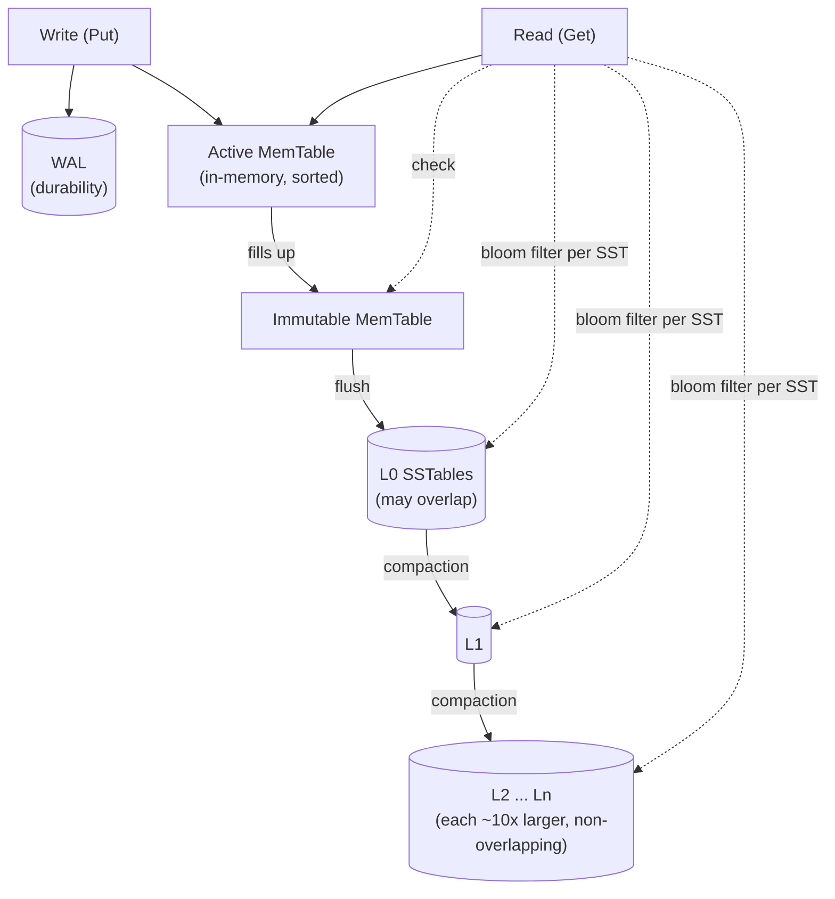

# RocksDB Architecture (LSM-Tree Storage)

> Author: Gauri Shukla (24BCS10115)
> I could not find a prebuilt `db_bench` in the Homebrew RocksDB package, so I wrote my own benchmark in C++ against `librocksdb` 11.1.1 and ran it on my machine (Apple Silicon). The source is `lsm_bench.cpp` and the full output is `bench_results.txt`. Every number below comes from that run: 2,000,000 keys, 100-byte values, an 8 MB memtable, no compression.

## 1. Problem Background

RocksDB is an embedded key-value storage engine, originally built at Facebook by forking Google's LevelDB and tuning it for fast storage (SSDs) and server workloads. It is a library, not a server, and it is the storage layer underneath a long list of systems (MyRocks for MySQL, CockroachDB's older versions, Kafka Streams state stores, and many more).

The problem it set out to solve is write throughput. A traditional B-tree database updates data in place, which means a random write often turns into a random read-modify-write of a disk page. On write-heavy workloads that random I/O is the bottleneck. RocksDB uses a **Log-Structured Merge tree (LSM)**, which turns random writes into sequential writes by always appending and never updating in place, then cleaning up later in the background. That single idea is the whole reason LSM engines exist, and the rest of the design is about paying for it.

## 2. Architecture Overview



A write goes to two places: the WAL on disk (so it survives a crash) and the active MemTable in memory (a sorted structure, usually a skiplist). When the MemTable fills, it becomes immutable and a background thread flushes it to disk as a sorted, immutable file called an SSTable at level 0. Compaction then merges SSTables down through levels L1, L2, and so on, where each level is roughly ten times larger than the one above and (below L0) holds non-overlapping key ranges. A read checks the MemTable first, then immutable MemTables, then SSTables level by level, using a per-file Bloom filter to skip files that cannot contain the key.

## 3. Internal Design

### 3.1 The write path

Writes never seek. They append to the WAL and insert into the in-memory MemTable, both sequential operations, which is why LSM engines sustain such high write rates. In my run:

```
===== 1. Write path =====
wrote 2000000 puts in 4158 ms  (481 K ops/sec)
```

About 481,000 individual `Put`s per second, single-threaded, on a laptop, with durability on. The key point is that none of those writes touched the final resting place of the data. They went to memory and a sequential log. The expensive reorganization happens later, in the background, off the write path.

### 3.2 Flush and the level structure

When the MemTable fills (8 MB in my config), it is flushed to an L0 SSTable. L0 files can have overlapping key ranges because each is just a dumped MemTable. Below L0, compaction arranges files so that within a level the key ranges do not overlap, and each level is much larger than the last. After my load the tree looked like this:

```
===== 2. LSM level structure (files + size per level) =====
Level Files Size(MB)
--------------------
  0        3       14
  1        0        0
  5        1       25
  6        2      124
```

Most of the data has already been compacted down to L6, the bottom level, with a few recent files still up at L0. This staircase shape is the LSM tree at rest.

### 3.3 An SSTable, and why reads are harder than writes

Each SSTable is sorted and immutable. It contains the data blocks, an index block, and (if configured) a Bloom filter. Because a key can exist in the MemTable or in any number of SSTables across levels, and because an updated key leaves older copies behind until compaction removes them, a read may have to look in several places. This is **read amplification**: one logical read can become several physical lookups. RocksDB fights it with two tools: the level structure (below L0, only one file per level can contain a given key) and Bloom filters.

### 3.4 Bloom filters: the single biggest read optimization

A Bloom filter is a small probabilistic bitmap per SSTable that answers "is this key possibly in this file?" with either "definitely not" or "maybe." A "definitely not" lets RocksDB skip reading that file's data blocks entirely. This matters most for lookups of keys that do not exist, which are common in real systems (checking whether a key is already present, for example).

I tested this directly with an A/B: I built the same database twice, once with a 10-bits-per-key Bloom filter and once without, then probed 200,000 keys that are guaranteed absent but lie *inside* the stored key range (so the file's min/max check cannot shortcut the work):

```
===== 5. Bloom filter effect: 200000 ABSENT lookups (keys inside stored range) =====
with bloom filter:    53 ms  (0.27 us/op)  bloom_useful(SST blocks skipped)=198104  found=0
without bloom filter: 249 ms  (1.24 us/op)  found=0
=> speedup from bloom filter on negative lookups: 4.6x
```

The Bloom filter made negative lookups **4.6x faster**, and the counter shows it let RocksDB skip 198,104 SST block reads out of 200,000 probes. That is the Bloom filter earning its keep: it converts most "does this key exist?" questions into a memory check instead of a disk read.

### 3.5 Compaction, and why it is necessary but expensive

Compaction is the background process that merges SSTables, drops overwritten and deleted keys, and pushes data to larger levels. It is necessary for three reasons: without it, L0 would grow without bound and reads would get slower and slower; obsolete versions of keys would never be reclaimed; and the non-overlapping invariant that makes reads efficient would never be established.

But compaction is the price of the fast write path. It rewrites data that was already written, which is **write amplification**. I measured it:

```
===== 3. Write amplification =====
logical user bytes:        230.0 MB
flushed to L0 (SST):       231.1 MB
written by compaction:     593.6 MB
=> write amplification:    3.59x
```

So to durably store 230 MB of user data, RocksDB actually wrote about 825 MB to disk (231 MB of flushes plus 594 MB of compaction rewrites), a write amplification of 3.59x. The same bytes get rewritten as they migrate down the levels. This is the fundamental LSM trade-off: cheap writes up front, paid back later as background rewriting.

I also confirmed that the insertion pattern matters a lot. When I inserted keys in sorted order instead of randomly, the flushed files did not overlap, so compaction could just "move" them down levels without rewriting, and write amplification dropped to about 1.0x. Random inserts force real merging; sequential inserts mostly do not. This is a real and useful tuning insight.

### 3.6 Space amplification

Because old versions of a key linger until compaction removes them, an LSM tree on disk is temporarily larger than the live data it represents. That is **space amplification**. I measured it before and after forcing a full compaction:

```
===== 4. Space amplification =====
before full compaction: live=130.0 MB  on-disk=170.2 MB  space-amp=1.31x
after  full compaction: live=146.8 MB  on-disk=146.8 MB  space-amp=1.00x
```

Before compaction the database held 1.31x more bytes on disk than the live data needed, because of stale versions. After a full compaction, every stale copy was dropped and on-disk size matched live size exactly (1.00x). This is the third member of the amplification trio.

### 3.7 The three amplifications are a trilemma

The deepest idea in LSM design is that write, read, and space amplification trade off against each other, and you cannot minimize all three at once. Leveled compaction (what I used) keeps space and read amplification low by maintaining one sorted run per level, at the cost of higher write amplification. Universal/tiered compaction does the opposite: it merges less often, so it writes less (lower write amp) but allows more overlapping files (higher read and space amp). Choosing a compaction strategy is really just choosing where on this triangle you want to sit for your workload.

## 4. Design Trade-Offs

| Property | LSM (RocksDB) | B-tree (InnoDB/Postgres) |
|---|---|---|
| Writes | Sequential appends, very fast | Often random in-place page updates |
| Write amplification | High (3.59x measured, from compaction) | Lower, but random I/O |
| Reads | May touch several files; Bloom filters help | Usually one tree traversal |
| Negative lookups | Very fast with Bloom filters (4.6x here) | Tree traversal regardless |
| Space | Temporarily inflated by stale versions (1.31x) | Tighter, but can fragment |
| Background work | Constant compaction | VACUUM (PG) or purge (InnoDB) |
| Best fit | Write-heavy, ingest, time-series, KV | Read-heavy, OLTP with point reads |

The honest summary: RocksDB moves work off the critical write path and into the background. You get exceptional write throughput and you pay for it with compaction CPU/IO (write amplification) and a more complex read path that leans on Bloom filters. For write-heavy and ingest-heavy workloads that is a great deal. For a read-mostly workload with no write pressure, a B-tree is often simpler and just as fast.

## 5. Experiments and Observations

All reproducible: compile `lsm_bench.cpp` against librocksdb and run it (instructions are in the file header). Output captured in `bench_results.txt`.

1. **Writes are fast and sequential**: 481K Puts/sec single-threaded with the WAL on.
2. **The level staircase is real**: after load, data sat mostly in L6 (124 MB) with a few fresh files in L0.
3. **Write amplification = 3.59x** under random inserts (594 MB of compaction writes for 230 MB of data), and it dropped to ~1.0x under sorted inserts because compaction could move rather than rewrite files.
4. **Space amplification = 1.31x** before a full compaction, falling to exactly 1.00x after, which shows compaction reclaiming stale versions.
5. **Bloom filters made absent-key lookups 4.6x faster** and skipped 198,104 of 200,000 SST block reads.

Files: `lsm_bench.cpp` (the benchmark), `bench_results.txt` (full output including the `rocksdb.stats` compaction table).

## 6. Key Learnings

- The one idea behind LSM is "never update in place, always append, clean up later." Once that clicked, write amplification stopped looking like a flaw and started looking like the bill for fast writes.
- Compaction is not a side detail, it is the engine. It is what keeps reads fast, reclaims space, and maintains the non-overlapping level invariant, and it is also the single biggest cost. My 3.59x write amplification was entirely compaction rewriting data.
- Bloom filters are the reason LSM reads are tolerable. A 4.6x speedup on negative lookups from a tiny in-memory bitmap is a remarkable return, and it explains why every serious LSM engine uses them.
- The three amplifications are a trilemma, not a checklist. You pick a compaction strategy to choose which one to sacrifice. Watching write amp swing from 3.59x to 1.0x just by changing insertion order made that real.
- Insertion order matters more than I expected. Sorted ingestion turned expensive merges into cheap file moves. For bulk loads, that is a free 3x reduction in write amplification.

### References
- RocksDB Wiki, "RocksDB Overview" and "Leveled Compaction": https://github.com/facebook/rocksdb/wiki/RocksDB-Overview , https://github.com/facebook/rocksdb/wiki/Leveled-Compaction
- "RocksDB Bloom Filter": https://github.com/facebook/rocksdb/wiki/RocksDB-Bloom-Filter
- "Compaction" and amplification discussion: https://github.com/facebook/rocksdb/wiki/Compaction
- O'Neil et al., "The Log-Structured Merge-Tree (LSM-Tree)", 1996 (the original paper)
