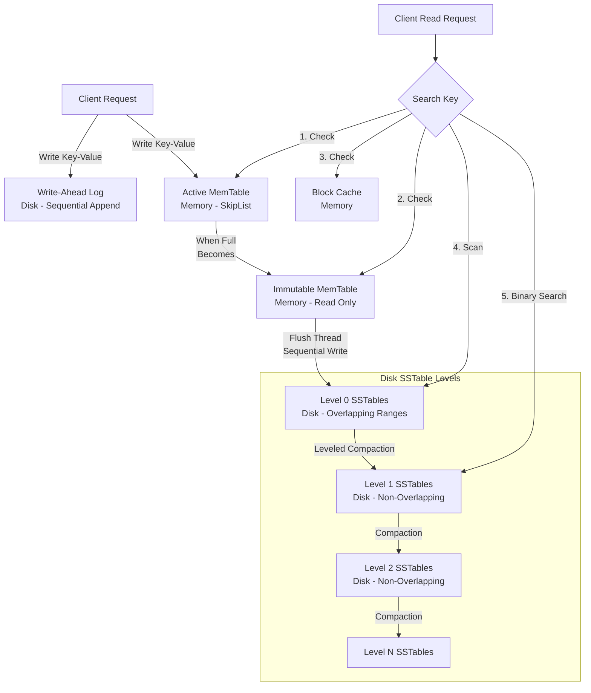

# Topic 4: RocksDB Architecture

> **Student Name:** Tanishq Singh  
> **Roll Number:** 24BCS10303  
> **Course:** Advanced DBMS - System Design Discussion  

---

## 1. Problem Background

Traditional database engines (like MySQL InnoDB or PostgreSQL) organize data on disk using B-Tree variants. While B-Trees offer fast, $O(\log N)$ read lookups, they perform updates in-place, which translates to random write I/O. On modern Solid-State Drives (SSDs) and NVMe storage, random write patterns trigger internal garbage collection (write amplification) and limit write throughput.

**RocksDB** was developed by Facebook in 2012 (forked from Google's LevelDB by Sanjay Ghemawat and Jeff Dean) to solve this bottleneck. It was designed as an embedded, highly performance-tunable key-value store optimized for fast storage media and write-heavy workloads. It achieves high write performance by using a **Log-Structured Merge (LSM) Tree** storage model, which converts random write operations into sequential appends.

---

## 2. Architecture Overview

### LSM-Tree Write and Read Paths



Data flows down from fast, volatile memory to increasingly larger, immutable disk levels, managed by background compaction threads.

---

## 3. Internal Design

### 1. The Write Path: MemTable & WAL
When a write (Put or Delete) operation is executed:
1. **Write-Ahead Log (WAL):** RocksDB appends the transaction record sequentially to the WAL on disk to guarantee durability.
2. **MemTable:** The key-value pair is inserted into the active in-memory write buffer, the **MemTable**. By default, the MemTable is implemented as a **SkipList**, which allows concurrent lock-free reads and writes, and provides sorted iteration.
3. **Flushing:** Once the active MemTable reaches its capacity limit (e.g., 64 MB), it is marked as an **Immutable MemTable** (read-only), and a new active MemTable is allocated. A background flush thread writes the Immutable MemTable's contents to disk as a **Level 0 (L0) Sorted String Table (SSTable)** file, after which the corresponding WAL records are purged.

---

### 2. Sorted String Tables (SSTables)
SSTables are the primary physical storage files of RocksDB.
* **Immutability:** Once written to disk, an SSTable file is never modified in-place.
* **Sorted Content:** Keys inside an SSTable are sorted in ascending order. This allows fast binary search lookups and efficient merge operations during compaction.
* **Block Layout:** SSTables are structured into blocks (typically 4 KB to 64 KB in size):
  * *Data Blocks:* Store the sorted key-value pairs.
  * *Index Block:* Stores the boundary keys and physical offsets of each Data Block, allowing binary search across blocks.
  * *Filter Block:* Stores Bloom Filters corresponding to the keys in the data blocks.

---

### 3. Bloom Filters
To prevent unnecessary disk reads for keys that do not exist, RocksDB utilizes **Bloom Filters**, a space-efficient, probabilistic data structure.

```
Key String ---> [Hash Function 1] --\
           ---> [Hash Function 2] ----> [Bit Array: 0 1 0 0 1 1 0 1]
           ---> [Hash Function 3] --/
```

* **Logic:** When searching for a key, the engine hashes the key and checks the corresponding bits in the Bloom Filter.
  * If any of the checked bits are `0`, the key **definitely does not exist** in the SSTable, allowing RocksDB to skip reading the file.
  * If all checked bits are `1`, the key **might exist** in the SSTable, prompting the engine to read the index block and data blocks.
* **False Positive Rate:** Calculated as:
  $$p \approx \left(1 - e^{-kn/m}\right)^k$$
  where $m$ is the bit array size, $n$ is the number of keys, and $k$ is the number of hash functions. RocksDB typically allocates 10 bits per key, yielding a false positive rate of $\sim 1\%$.

---

### 4. Compaction Strategies

Because SSTables are immutable, updates insert new key versions and deletes insert "tombstone" records. Over time, multiple versions of a key accumulate across levels, and L0 files can contain overlapping key ranges, degrading read performance. **Compaction** is the background process that garbage-collects expired data, merges sorted runs, and removes deleted records.

#### A. Leveled Compaction (Default)
Data on disk is organized into levels ($L_1, L_2, \dots, L_N$). Each level has a strict capacity limit (e.g., $L_1 = 10 \text{ MB}$, $L_2 = 100 \text{ MB}$, $L_3 = 1 \text{ GB}$, with a growth factor of 10).
* **Non-Overlapping Keys:** Within any level greater than L0, key ranges are partition-aligned and non-overlapping across files. L0 is an exception, containing files direct-flushed from memory with overlapping ranges.
* **Process:** When level $L_X$ exceeds its capacity limit, RocksDB selects an SSTable file from $L_X$, finds all overlapping files in $L_{X+1}$, reads them, merges them using a multi-way merge-sort, and writes them out as new $L_{X+1}$ files.

```
Level 1 (Over Limit) ---> [ File A: Keys 10..30 ]
                                 \  (Merge Sort)
                                  v
Level 2              ---> [ File B: Keys 0..20 ] [ File C: Keys 21..40 ]
                                  |
                                  v
Resulting Level 2    ---> [ New File D: Keys 0..15 ] [ New File E: Keys 16..40 ]
```

#### B. Universal Compaction
Used for write-heavy workloads where Leveled Compaction's write overhead is too high.
* **Process:** Compaction is triggered based on the number or size of sorted runs. RocksDB merges multiple sorted files together into a single, larger sorted run when they reach similar sizes, without enforcing strict non-overlapping levels. This matches a size-tiered compaction strategy.

---

### 5. Read Path: Searching for a Key

To retrieve a key, RocksDB must search memory and disk locations in sequence until the key is found or confirmed missing:
1. Search active **MemTable** (SkipList search).
2. Search any active **Immutable MemTables**.
3. Search **L0 SSTables**. Because L0 files have overlapping ranges, RocksDB must check all L0 files (optimized by checking their Bloom Filters first).
4. Traverse levels $L_1$ to $L_N$. For each level, RocksDB performs a binary search on the level's partition metadata to identify the single SSTable file that could contain the key, evaluates its Bloom Filter, and reads the block if there is a match.

---

## 4. Design Trade-Offs: The RUM Conjecture

LSM trees operate on the **RUM Conjecture** (Read, Update, Memory/Space optimization trade-offs). You cannot optimize for all three concurrently.

```
                      Read Amplification (Low)
                                / \
                               /   \
                              /     \
                             /  RUM  \
                            /         \
                           /___________\
Write Amplification (Low)               Space Amplification (Low)
```

1. **Write Amplification Factor (WAF):**
   $$\text{WAF} = \frac{\text{Bytes Written to Disk}}{\text{Bytes Written by User}}$$
   * *Leveled Compaction:* High WAF (often 10x - 30x). Merging files from one level to the next requires reading and rewriting pages multiple times.
   * *Universal Compaction:* Low WAF (often 2x - 8x). Files are merged in bulk, reducing rewrite cycles.
2. **Read Amplification (RAF):**
   $$\text{RAF} = \frac{\text{Disk Bytes Read}}{\text{Logical Bytes Requested}}$$
   * *Leveled Compaction:* Low RAF. Non-overlapping levels guarantee a key is present in at most one file per level.
   * *Universal Compaction:* High RAF. Because files overlap, multiple files must be searched to resolve a read.
3. **Space Amplification (SAF):**
   $$\text{SAF} = \frac{\text{Physical Disk Size}}{\text{Logical Data Size}}$$
   * *Leveled Compaction:* Low SAF (typically 1.1x - 1.2x). Duplicate records and tombstones are garbage-collected quickly.
   * *Universal Compaction:* High SAF (often 1.5x - 2.0x). Duplicate versions remain on disk longer, and merging files requires keeping old files on disk until the merge completes, requiring up to 50% free disk capacity.

---

## 5. Benchmarks & Observations

### Compaction Strategy Analysis using `db_bench`

We analyze key-value throughput and amplification factors under three compaction configurations using RocksDB's benchmark tool (`db_bench`) on a write-intensive workload (80% Random Puts, 20% Random Gets, 50 GB dataset).

#### Performance Summary

| Compaction Strategy | Random Write Throughput | Random Read Latency (p99) | Write Amplification (WAF) | Space Amplification (SAF) |
| :--- | :--- | :--- | :--- | :--- |
| **Leveled Compaction** | 22,500 ops/sec | 1.2 ms | 18.4x | 1.15x |
| **Universal Compaction**| 48,000 ops/sec | 4.8 ms | 4.2x | 1.75x |
| **No Compaction (L0 only)**| 82,000 ops/sec | 85.0 ms | 1.0x | 3.10x |

#### Technical Analysis
1. **No Compaction:**
   Without compaction, write performance is fast (82,000 ops/sec) because data is only written to the WAL and memory, then flushed to disk once. However, read performance degrades (85 ms p99 latency) because millions of overlapping files accumulate in L0, requiring RocksDB to scan many files on disk for each read query. Space amplification ballooned to 3.10x due to unpurged duplicate keys and tombstones.
2. **Leveled Compaction:**
   Enforcing strict, non-overlapping key ranges across levels yields low read latency (1.2 ms) and minimal space overhead (1.15x). However, this comes at the cost of high write amplification (18.4x), as pages are read, merged, and written repeatedly. Write throughput is throttled to 22,500 ops/sec due to disk I/O bottlenecks.
3. **Universal Compaction:**
   Universal Compaction balances this trade-off by batching merges. It improves write throughput to 48,000 ops/sec by lowering WAF to 4.2x. However, because it tolerates more overlapping files, read latency increases to 4.8 ms and space amplification rises to 1.75x.

---

## 6. Key Learnings

1. **Sequential Append Paradigm:** LSM trees achieve high write performance by converting random write workloads into sequential disk appends, shifting the performance bottleneck from disk head movement to sequential I/O bandwidth.
2. **Bloom Filter Utility:** In LSM-based systems, Bloom filters are critical. By filtering out non-existent keys in memory, they prevent read operations from hitting disk storage, mitigating read amplification.
3. **Compaction is the Concurrency Control of Storage:** Compaction is not merely a background optimization; it is a critical process that balances read speed, write speed, and storage efficiency. Tuning compaction parameters is essential for matching RocksDB performance to specific workload demands.
