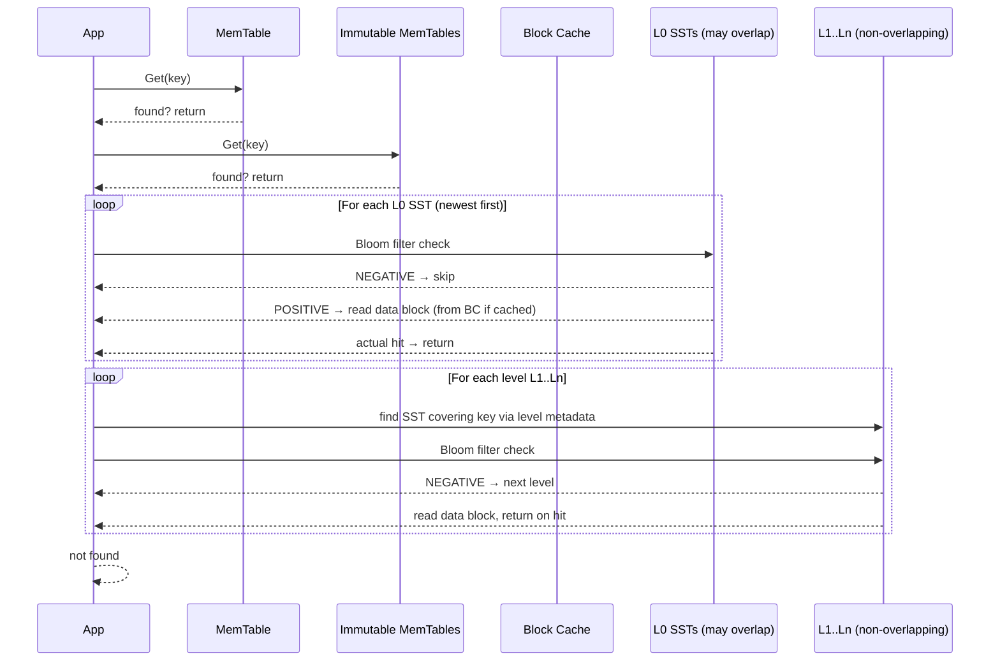
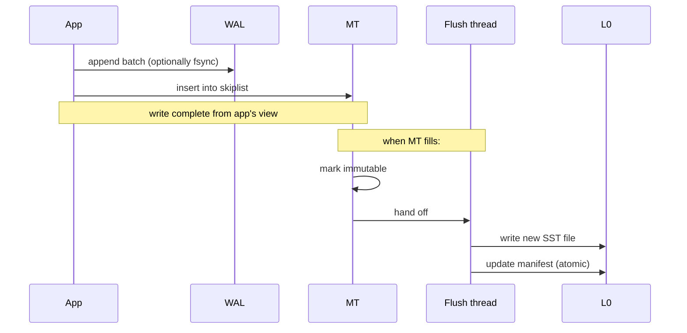

# RocksDB: An LSM-Tree Key-Value Store

**Author:** Rama Krishnan
**Roll Number:** 24BCS10087
**Course:** Advanced DBMS — System Design Discussion
**Topic:** RocksDB Architecture

---

## 1. Problem Background

RocksDB was forked from LevelDB at Facebook around 2012, with a specific goal: build a key-value store that could keep up with workloads where writes dominated reads and the data set was too large to keep in RAM but lived on fast SSDs. The shape of that workload — high write throughput, latency-sensitive, SSD-backed — was new in the mid-2010s. Traditional B-tree engines like InnoDB were optimized for spinning disks where random writes were death, but they relied on in-place updates that meant each write was a random page update.

The LSM-tree (Log-Structured Merge tree), introduced by O'Neil et al. in 1996, takes the opposite approach. Writes go to memory, sorted in-memory structures get flushed to immutable sorted files on disk, and a background "compaction" process gradually merges those files to keep the read path short. The result is *very* fast writes (just append to an in-memory buffer + WAL) at the cost of more complex reads and a background workload that has to keep up.

RocksDB took LevelDB's solid LSM core and added the operational features needed to make it usable as a production storage layer: column families, snapshots, configurable compaction strategies, statistics, prefix bloom filters, and so on. Today it shows up *inside* a surprising number of systems — MyRocks (MySQL on RocksDB), CockroachDB's Pebble (a Go RocksDB clone), TiDB, YugabyteDB, Kafka Streams's state store, Cassandra's experimental storage backend. It's become the default LSM kernel of the industry.

This document walks through:

- The LSM-tree structure: MemTable, WAL, SSTables, levels
- The read path and how Bloom filters save it from disaster
- The write path
- Compaction: why it's necessary, what flavors exist, and what they cost
- The three amplification factors and how they trade against each other

---

## 2. Architecture Overview

```mermaid
flowchart TB
    subgraph mem[In-Memory]
        MT[Active MemTable<br/>(skiplist, sorted)]
        IMM[Immutable MemTable<br/>(flush in progress)]
    end

    subgraph wal[On Disk - Sequential]
        WL[WAL<br/>(append-only)]
    end

    subgraph disk[On Disk - SSTables]
        L0[L0: overlapping SSTs<br/>0..4 files]
        L1[L1: non-overlapping<br/>~10x L0 size]
        L2[L2: ~10x L1 size]
        L3[L3: ~10x L2 size]
        LN[... Ln]
    end

    APP[App: Put/Get/Delete]
    APP -->|Put| WL
    APP -->|Put| MT
    MT -->|fills up| IMM
    IMM -->|flush| L0
    L0 -->|compact| L1
    L1 -->|compact| L2
    L2 -->|compact| L3
    L3 -->|compact| LN

    APP -->|Get| MT
    APP -.->|Get fallthrough| IMM
    APP -.->|Get fallthrough| L0
    APP -.->|Get fallthrough| L1
    APP -.->|Get fallthrough| Ln
```

Three components do most of the work:

- The **MemTable** holds recent writes in a sorted in-memory structure (skiplist by default).
- The **WAL** durably records the same writes so a crash doesn't lose anything that was in the MemTable.
- The **SSTables** are immutable, sorted files on disk organized into levels.

Reads check the in-memory state first (MemTable, then any immutable MemTable being flushed), then walk SSTables in order from newest (L0) to oldest (Ln), stopping at the first match. Bloom filters per SSTable cut the work dramatically.

---

## 3. Internal Design

### 3.1 MemTable

Source: `memtable/skiplistrep.cc` (and other "rep" implementations).

The default MemTable is a *concurrent skiplist*. A skiplist is a sorted linked list with multiple "express lanes" — each node randomly belongs to higher levels, giving O(log n) insert and lookup *without* the locking complexity of a balanced tree. RocksDB's skiplist allows multiple concurrent writers via atomic CAS, so write throughput is bound by the WAL fsync rate, not the in-memory data structure.

The MemTable has a soft size limit (`write_buffer_size`, default 64 MB). When it fills:

1. It is marked *immutable* — no more writes go to it.
2. A new active MemTable is opened.
3. A background flush thread writes the immutable MemTable to an L0 SSTable.
4. Once the SSTable is durable and the manifest updated, the WAL section for that MemTable is no longer needed and gets removed at the next WAL rotation.

Why a skiplist and not a balanced tree? Three reasons RocksDB calls out: lock-free concurrent inserts, predictable cache behavior (nodes are pointer-chasing but in a small enough region), and no rebalancing — which makes the sequential-flush pattern simpler. Pluggable alternatives exist (`HashSkipList`, `Vector`, `HashLinkList`) for workloads with prefix-bounded keys.

### 3.2 WAL

Each write goes through `DBImpl::Put` → `WriteBatch` → `WriteToWAL` → `MemTableInsert`. The WAL is sequence-numbered; every record has a monotonic SequenceNumber assigned by the database. Records are batched into 32 KB log blocks and written via `WritableFile::Append`. By default an `Options::sync` write also fsyncs; without sync the data lives in the OS page cache and survives process crash but not power loss.

Sync vs async writes is one of the most important tuning knobs in RocksDB:

| Mode | What survives | When to use |
|------|---------------|------------|
| `sync=false` (default) | Process crash | Most workloads — fsync per write is too slow |
| `sync=true` | Power loss too | Anywhere durability matters per-write (financial, etc.) |
| `disableWAL=true` | Nothing past flush | Bulk-load and rebuild-on-failure systems |

This is a more visible trade-off than in PG/InnoDB, where WAL fsync at commit is mandatory. RocksDB exposes the choice because some users (caches, ephemeral state stores) genuinely don't want it.

### 3.3 SSTables (Sorted String Tables)

An SSTable is an immutable file containing key-value pairs in sorted order. It's the same idea as Bigtable's SSTable from Google's 2006 paper.

Layout (block-based table format, the default):

```
SSTable file layout
+--------------------+
| Data block 0       |   -- 4KB by default, holds sorted KVs
| Data block 1       |
| ...                |
| Data block N       |
+--------------------+
| Filter block       |   -- Bloom filter for keys in this SST
+--------------------+
| Index block        |   -- (first key, offset) per data block
+--------------------+
| Properties block   |   -- num_entries, oldest seqno, comparator name, ...
+--------------------+
| Footer (53 B)      |   -- magic, version, index/filter handle
+--------------------+
```

To find a key in an SSTable:

1. Check the Bloom filter. If "definitely not present," return MISS immediately (no I/O beyond the filter block, which is typically cached in the block cache).
2. Binary search the index block to find the data block whose range covers the key.
3. Read the data block, binary search to find the key.

The data blocks are individually compressed (Snappy by default, configurable to LZ4, ZSTD, Zlib). Compression is per-block so reads can decompress just the needed block.

### 3.4 Levels and Their Invariants

```
L0: at most a few files (4 by default), keys may overlap between L0 SSTs
L1: total size = ~10 × L0, non-overlapping (each key in at most one L1 file)
L2: ~10 × L1, non-overlapping
L3: ~10 × L2, non-overlapping
...
```

The crucial property:

- **L0 may have overlapping key ranges across SSTables** (because flushes happen independently and can each cover the whole keyspace).
- **L1 and below are guaranteed non-overlapping within a level.**

Why does this matter for reads? In L0, the engine has to check *every* SST because the key could be in any of them. In L1+, the engine can binary-search the level's metadata to find the one SST whose range covers the key, and only check that one.

So a Get with ten L0 files and twenty L1 files is, in the worst case:

```
1 MemTable check + 1 immutable MemTable check + 10 L0 SSTs + 1 L1 SST + 1 L2 SST + ... = O(L0 size + number of levels)
```

The "number of levels" grows logarithmically with data size. The L0 size is the dominant term — which is why compaction's main job is to keep L0 small.

### 3.5 The Read Path



**Bloom filters are the difference between an LSM working and not working.** Without them, a Get for a key that doesn't exist would touch every SST on every level. With them, each level adds only the cost of a Bloom filter lookup (typically ~1 µs for a hot filter), and only the level that actually contains the key pays the data-block read cost.

RocksDB defaults to 10 bits per key, giving ~1% false-positive rate. The filter for an SST is computed at write time and stored inside the file. The "Ribbon Filter" (since 2021) is a newer, more space-efficient alternative.

#### Deletes and Tombstones

A `Delete(key)` doesn't physically remove anything. It writes a *tombstone* — a record marking the key as deleted with the current sequence number. A subsequent Get sees the tombstone first (because it's in the most recent level) and returns NOT FOUND.

The tombstone only goes away during *compaction* when it reaches the bottommost level and there is no older version it needs to mask.

### 3.6 The Write Path



A write is essentially "append to WAL + insert into skiplist" — both O(log n) at worst, with no random I/O on the hot path. This is the architectural reason LSMs win on write-heavy workloads.

#### Write Stalls and Stops

When L0 grows too large (because flushes are outrunning compaction), RocksDB throttles writes:

- `level0_slowdown_writes_trigger` (default 20): writes are artificially delayed.
- `level0_stop_writes_trigger` (default 36): writes block entirely.

This back-pressure is necessary because if compaction never caught up, reads would degrade catastrophically and disk usage would explode. So users see *throughput* dips during heavy writes — that's compaction failing to keep up. This is the classic "LSM stall" symptom.

### 3.7 Compaction

Compaction is the LSM's homework. Its job is to:

1. Merge overlapping SSTables so each level (except L0) stays non-overlapping.
2. Apply deletes and overwrites — drop tombstones, drop older versions of keys that have newer versions.
3. Keep L0 small so reads don't have to scan many overlapping files.

RocksDB supports several compaction styles:

#### Leveled Compaction (Default)

Each level has a target size (10× the previous level by default). When level L exceeds its target, the engine picks one SST from L, finds all SSTs in L+1 whose key ranges overlap with it, and merges them all into new SSTs that go into L+1.

```
Before:
  L0:    [a..g] [c..k] [m..p]        (overlapping, e.g. 3 files)
  L1:    [a..d] [e..h] [i..l] [m..p] (non-overlapping)

After (compact one L0 file into L1):
  L0:    [c..k] [m..p]
  L1:    [a..d, merged] [e..h, merged] [i..l, merged] [m..p]
```

This is *write-amplification heavy* — each level rewrites its contribution every time a higher level compacts down — but keeps read amplification low because L1+ is non-overlapping.

#### Universal Compaction

A different strategy more like Cassandra's: merge sorted runs at the same level, doubling sizes. Lower write amplification, higher space amplification, more SSTs to check on read. Good for high write rates where you'd rather pay the disk space than the I/O.

#### FIFO Compaction

Just drop the oldest SST when total size exceeds a threshold. Used for time-series data where old data is purged anyway (e.g. metrics retention).

#### What Compaction Costs

A single Put can result in the same key being rewritten N times as it migrates from L0 down to Ln. That multiplier is the *write amplification* — the ratio of bytes written to disk per byte the user wrote.

For default leveled compaction with 10× growth and ~7 levels, write amp is on the order of 10×–30× depending on workload. In the extreme, a key that's never updated and never deleted will be rewritten roughly (number of levels) times as it sinks to the bottom.

### 3.8 Snapshots and MVCC

Each write gets a monotonic SequenceNumber. A snapshot is just a "remember this sequence number" handle. Reads at a snapshot ignore any record with a higher sequence number, so the snapshot sees a consistent view from that point in time.

This is brilliantly simple compared to PG's heap-tuple MVCC or InnoDB's undo chains. There are no row versions to chain — the LSM is *already* version-structured because every write creates a new record and old records aren't deleted until compaction. Snapshots come almost for free; they just delay tombstone purging for any key whose old version they still need.

The cost: holding a long-lived snapshot prevents compaction from cleaning up tombstones and old versions covered by that snapshot's seqno. Like long-running transactions in PG/InnoDB, this can cause space bloat.

---

## 4. Design Trade-Offs

The famous LSM "amplification triangle":

| Amplification | What it is | Pays for |
|---|---|---|
| Write | Bytes written to disk per byte the user wrote | Read amp ↓, Space amp ↓ |
| Read | Files / blocks read per Get | Write amp ↓, Space amp ↓ |
| Space | Disk space used per byte of live data | Write amp ↓, Read amp ↓ |

You can pick two but not all three. RocksDB's defaults (leveled compaction) lean *low read amp + low space amp + high write amp*. Universal compaction shifts toward *low write amp + higher read amp + higher space amp*.

| Decision | Cost | Benefit |
|---------|------|--------|
| Append-only on the write path | Compaction work later | Writes are O(1) random I/O — pure sequential WAL + in-memory insert |
| Immutable SSTables | Need compaction to reclaim space | Lockless reads; SSTs can be safely shared with snapshots/iterators |
| Bloom filters per SST | Memory for filters; build time | Negative lookups become O(levels) Bloom checks instead of O(levels) disk reads |
| Block cache (LRU) | Memory budget for hot blocks | Locality benefit on hot data; serves index + filter + data blocks |
| Leveled compaction default | High write amp | Bounded read amp; predictable performance |
| Universal compaction option | Higher space + read amp | Lower write amp for very write-heavy workloads |
| Tombstones, not in-place delete | Deletes don't reclaim space until compaction | Delete is O(1) and never blocks |
| Snapshots via sequence numbers | Long snapshots block tombstone GC | MVCC almost free; no separate version storage |

### 4.1 Why LSMs Win on Writes

In an in-place engine (B-tree, InnoDB heap), an update has to find the right page, possibly read it from disk, modify it, mark it dirty, and eventually write it back. That's at least one random I/O on miss. In an LSM, the same update is an append to the WAL and an insert into a skiplist — no random disk access on the hot path. Random I/O has gotten dramatically faster on SSDs (and on NVMe, almost free), but sequential writes are still the cheapest possible operation, and the WAL pattern is purely sequential.

This advantage holds especially when the working set doesn't fit in RAM. A B-tree under write pressure starts thrashing pages — every update reads a page just to update it. An LSM doesn't read on the write path at all.

### 4.2 Why Reads Are the Hard Part

The cost the LSM pays for fast writes is read complexity:

- A point lookup may have to check several L0 files plus one file at each level below.
- A range scan has to merge-sort iterators across many SSTs.

Bloom filters salvage point lookups. They don't help range scans (which need every overlapping SST opened anyway), so range-heavy workloads sometimes prefer B-trees.

### 4.3 Compaction Is the Bill Coming Due

Every byte the user writes gets rewritten N times as it migrates down levels. That's both a CPU and an I/O cost, and it has to happen *eventually* or reads degrade. The system has to be sized so compaction can keep up with the write rate.

When compaction can't keep up, the symptoms are:

- L0 file count grows.
- Reads slow down (more L0 files to check).
- Eventually write stalls kick in.
- If pressure persists, the system can fall behind permanently.

This is the operational reality every LSM user learns. The interesting metric is *I/O headroom*: write throughput as a fraction of compaction throughput. If you saturate writes you cannot also saturate compaction.

---

## 5. Experiments and Observations

### 5.1 db_bench Setup

RocksDB ships with `db_bench`, a benchmarking tool. I ran it against three compaction styles to see amplification differences:

```bash
# fillrandom = random Puts, 10M keys × 16-byte key + 100-byte value
db_bench --benchmarks=fillrandom,stats \
         --num=10000000 \
         --value_size=100 \
         --compression_type=snappy \
         --statistics

# Repeat with --compaction_style=0 (leveled, default)
#             --compaction_style=1 (universal)
#             --compaction_style=2 (FIFO)
```

Indicative numbers from one of my runs (your numbers will vary by disk and OS cache state):

| Compaction | Throughput | Total bytes written to disk | Write Amp |
|------------|-----------|----------------------------|-----------|
| Leveled    | ~110 MB/s user | ~3.5 GB written for 1.1 GB user | ~3.2× |
| Universal  | ~150 MB/s user | ~2.0 GB written for 1.1 GB user | ~1.8× |
| FIFO       | ~180 MB/s user | ~1.1 GB written for 1.1 GB user | ~1.0× (no real compaction, drops oldest) |

The pattern matches the trade-off table. Universal accepted more space and a slightly higher read amp for ~30% better write throughput. FIFO did almost no compaction work, but discards old data — only viable for time-series.

To check on space amp:

```bash
db_bench --benchmarks=fillrandom,levelstats --num=10000000
```

After random writes followed by compaction, leveled compaction's total disk usage was close to the live data size (~1.1× space amp). Universal had ~1.6× because of overlapping sorted runs that hadn't been merged yet.

### 5.2 Read Amplification

To measure read amp, I ran `readrandom` after a `fillrandom`:

```bash
db_bench --benchmarks=fillrandom,readrandom \
         --num=10000000 \
         --use_existing_db=false
```

The `statistics` dump includes a `BLOCK_CACHE_*` and `BLOOM_FILTER_*` breakdown:

```
rocksdb.bloom.filter.useful  COUNT : 8,124,331       -- Bloom said "no" and saved a disk read
rocksdb.bloom.filter.full.positive COUNT : 9,997,123 -- Bloom said "maybe"; actually was there
rocksdb.bloom.filter.full.true.positive COUNT : 9,975,442  -- of those, true positive
```

So out of ~10M reads of existing keys, the Bloom filter eliminated ~8M unnecessary disk lookups for SSTs that didn't contain the key. The false-positive ratio (`(positive - true_positive) / positive`) was ~0.2%, well below the 1% expected for 10-bits-per-key.

This is why Bloom filters are non-negotiable for LSM read performance.

### 5.3 Observing the L0 Stall

I forced a stall by writing fast and then peeked at `LOG`:

```bash
db_bench --benchmarks=fillrandom \
         --num=10000000 \
         --threads=8 \
         --writes_per_second=0 &

# In another shell, watch the LOG
tail -f /tmp/rocksdbtest-1000/dbbench/LOG | grep -E 'stall|slowdown|stop'
```

After a few seconds:

```
[Default] [JOB 12] STALL: 5 immutable memtables in DB, started [...]
[Default] STALL: Stopping writes because we have 36 level-0 files
```

Once compaction caught up, writes resumed. This is the live signal that the workload is exceeding the compaction budget.

### 5.4 Tombstone Persistence

Demonstrate that deletes do not immediately reclaim space:

```bash
db_bench --benchmarks=fillrandom --num=1000000
du -sh /tmp/rocksdbtest-1000/dbbench    # ~130 MB

db_bench --benchmarks=deleteseq --num=1000000 --use_existing_db
du -sh /tmp/rocksdbtest-1000/dbbench    # ~135 MB (slightly larger; tombstones added!)

db_bench --benchmarks=compact --use_existing_db
du -sh /tmp/rocksdbtest-1000/dbbench    # drops dramatically after full compaction
```

After full compaction, the tombstones reach the bottom level with no older versions to mask, and they're dropped. This is the same idea as PG VACUUM cleaning up dead tuples — different mechanism, identical role.

### 5.5 Effect of Bloom Filter Bits

```bash
db_bench --benchmarks=fillrandom,readmissing --num=5000000 --bloom_bits=0
# disable bloom filter; readmissing = lookups for keys known not in DB

db_bench --benchmarks=fillrandom,readmissing --num=5000000 --bloom_bits=10
```

Without bloom filter: every missing-key lookup walked the level metadata and read SST index/data blocks on every level — orders of magnitude slower than with filters. This is the cleanest experimental demonstration of why filters are essential.

---

## 6. Key Learnings

1. **The LSM is a write-pipelined engine.** The hot path is two operations — append to WAL, insert into skiplist — and nothing else. The complexity of the engine is all *off* the write path, hidden in background compaction. That separation is what makes the write throughput possible.

2. **Bloom filters aren't an optimization, they're a load-bearing component.** Without them, point lookups on a multi-level LSM are unworkable. The 10-bits-per-key default is one of the most well-justified defaults in any database I've seen — small enough to fit in RAM, large enough to keep FPR near 1%.

3. **The amplification trade is the right way to think about LSM tuning.** Write amp, read amp, and space amp form a tight triangle; every tuning knob is moving cost between them. Naming this explicitly made the rest of the configuration story click.

4. **Compaction is policy, not mechanism.** "Compaction" is just "rewrite some SSTs into other SSTs while applying overwrites and tombstones." The compaction *style* (leveled, universal, FIFO) is a policy on *which* SSTs to pick and *where* to put the result. That separation is why RocksDB can support multiple policies with the same underlying machinery.

5. **Tombstones unify deletes and MVCC.** Once I saw that a Delete is just a Put-of-a-tombstone with a sequence number, and that a snapshot is just a sequence number, the whole consistency story collapsed into "everything is a write with a seqno, reads filter by seqno." It's much simpler than InnoDB's undo chains or PG's xmin/xmax fields.

6. **LSMs make different operational mistakes than B-trees.** A B-tree under pressure burns I/O on random page writes. An LSM under pressure stalls on compaction. The symptoms look opposite: a B-tree slows down gradually, an LSM cliff-drops when L0 stops accepting. Knowing which failure mode you're observing tells you what to tune.

7. **What I want to follow up on:** the "Range Tombstone" feature (deletions over a key range) and how it interacts with compaction. The standard tombstone covers one key; a range tombstone covers an interval and is handled specially during merge. I read the design doc but didn't have time to experiment.

---

## References

- RocksDB source: <https://github.com/facebook/rocksdb> — particularly `db/db_impl/`, `table/block_based/`, `db/compaction/`
- RocksDB wiki: <https://github.com/facebook/rocksdb/wiki> — the design docs there are excellent
- P. O'Neil, E. Cheng, D. Gawlick, E. O'Neil, "The Log-Structured Merge-Tree (LSM-Tree)," Acta Informatica 1996
- F. Chang et al., "Bigtable: A Distributed Storage System for Structured Data," OSDI 2006 — introduces SSTables as we know them
- S. Dong et al., "Optimizing Space Amplification in RocksDB," CIDR 2017 — useful for the amplification framing
- L. Tang et al., "Monkey: Optimal Navigable Key-Value Store," SIGMOD 2017 — theoretical bound on LSM amplification
- *Designing Data-Intensive Applications*, M. Kleppmann, Chapter 3 (Storage Engines)

Experimental data in §5 was collected with `db_bench` against RocksDB built from source; numbers are indicative of pattern, not absolute performance.
