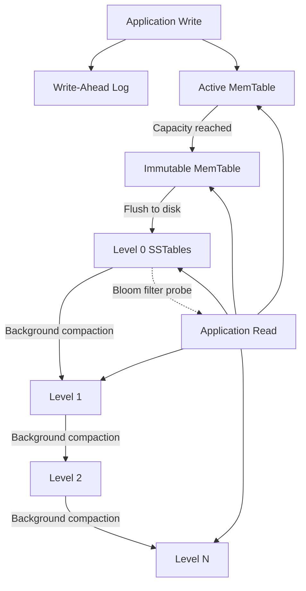

# RocksDB — Architecture & System Design

## 1. Context and Motivation

LevelDB, released by Google in 2011, introduced a lightweight embeddable key-value store built on the Log-Structured Merge Tree (LSM-tree) — a data structure that transforms random write I/O into sequential disk operations. In 2012, Facebook forked LevelDB and rebuilt it as RocksDB, re-architecting the engine for multi-core processors and modern solid-state drives. Facebook subsequently deployed RocksDB as a MySQL storage backend (the MyRocks project), replacing InnoDB for their social graph and user data workloads and achieving roughly 62% reduction in storage footprint.

The fundamental challenge RocksDB addresses: delivering sustained, extremely high write throughput with configurable read performance — across both SSDs and rotational media — without incurring the random I/O costs inherent to B-tree-based engines.

---

## 2. System Architecture



### How Writes Flow

1. The incoming key-value pair is first appended to the WAL on disk — a sequential, durable write.
2. The same entry is inserted into the active MemTable, an in-memory skip list that maintains sorted key order.
3. Once the MemTable exceeds its configured size limit, it is frozen (made immutable) and a fresh MemTable takes its place.
4. A background thread serializes the frozen MemTable to disk as a Level 0 SSTable — an immutable, sorted file.
5. Ongoing background compaction merges SSTables and pushes data progressively through levels: L0 → L1 → ... → Ln.

### How Reads Flow

1. The active MemTable is checked first.
2. Then any frozen (immutable) MemTables still awaiting flush.
3. SSTables are probed starting from L0 and moving to deeper levels. Bloom filters at each level allow quickly skipping files that certainly do not contain the requested key.
4. The first (most recent) version encountered is the authoritative result.

---

## 3. Detailed Internal Design

### MemTable

The MemTable is a sorted in-memory buffer that absorbs all incoming writes, providing O(log n) complexity for both insertions and lookups.

- Once the active MemTable grows to `write_buffer_size` (64 MB by default), it is sealed as immutable and replaced by a new empty MemTable.
- Several immutable MemTables may exist simultaneously before being flushed (governed by `max_write_buffer_number`).
- Because the underlying skip list keeps entries sorted, flushing to an SSTable produces a pre-sorted output without any additional sort step.

### Write-Ahead Log (WAL)

Each write operation is appended to the WAL prior to its insertion into the MemTable. Should the process terminate unexpectedly before a MemTable flush completes, RocksDB replays the WAL during startup to recover any writes that were in memory but not yet persisted to SSTables. Once the MemTable backing a particular WAL segment has been flushed, that WAL segment is deleted.

This follows the same WAL principle that underpins InnoDB's redo log and PostgreSQL's transaction log — the log entry must be safely on disk before the associated data is deemed committed.

### SSTable Format (Sorted String Tables)

SSTables are RocksDB's persistent storage units — immutable, sorted files written to disk. Each SSTable is organized into several blocks:

- **Data blocks** — contain the actual key-value pairs in sorted order, typically compressed.
- **Index block** — maps key ranges to data block offsets, enabling binary search for efficient lookup.
- **Bloom filter block** — a probabilistic structure that definitively reports "the key is absent" or tentatively says "the key might be present."
- **Metadata/footer** — stores compression parameters, integrity checksums, and structural information.

Immutability is a core design principle: an SSTable is never modified after creation. Updates and deletions are represented by newer entries (or tombstone markers) that logically supersede prior versions; physical removal happens during compaction.

### Level Hierarchy (L0 through Ln)

- **Level 0** — holds freshly flushed SSTables. Since each L0 file corresponds to an independent MemTable flush, key ranges across L0 files may overlap.
- **Levels 1 through N** — each level enforces non-overlapping key ranges among its files. Successive levels grow exponentially larger (by a default factor of 10x).

The overlapping nature of L0 means a point lookup may need to consult every L0 file. From L1 onward, a simple binary search on key-range boundaries pinpoints the single relevant file per level.

### Compaction Process

Compaction is the background mechanism that merges SSTables, discards obsolete versions and tombstones, and promotes data to deeper levels.

| Strategy | Mechanism | Write Amplification | Read Amplification | Space Amplification |
|----------|-----------|--------------------|--------------------|---------------------|
| Leveled (default) | Selects files in L(n) that overlap with L(n+1), merge-sorts them into new L(n+1) files. Each level maintains non-overlapping key ranges. | Higher (~10–30×) | Lower | Lower |
| Universal (size-tiered) | Groups sorted runs of comparable size and merges them together. Produces fewer but larger merge operations. | Lower (~5–10×) | Higher | Higher |
| FIFO | Evicts the oldest SSTable files when total storage exceeds a threshold. No merge logic. | Minimal | N/A | Minimal |

Why compaction is necessary: without it, tombstones from deleted keys persist indefinitely, overwritten keys accumulate redundant versions, L0 grows without limit, and disk space is never recovered.

### Bloom Filters

Every SSTable carries a Bloom filter — a space-efficient probabilistic structure that never produces false negatives ("the key is definitely not here") but may yield false positives ("the key could be here").

During a point lookup, RocksDB consults the Bloom filter before accessing any data block. With a configuration of 10 bits per key, the false positive rate drops to approximately 1%. This optimization transforms most negative lookups (where the key does not exist) from a sequence of expensive disk reads across levels into a series of cheap in-memory filter checks.

### Concurrency Model and Column Families

- **Write serialization**: concurrent writes are batched together using a group-commit protocol — multiple write requests are combined into a single WAL append operation, amortizing the I/O cost.
- **Lock-free reads**: read operations use snapshots to obtain a consistent view of the data without blocking concurrent writers.
- **Column Families**: provide a way to logically partition data within a single RocksDB instance. Each column family maintains its own MemTables and SSTable hierarchy but shares the common WAL. This enables per-partition tuning (different compaction strategies, compression algorithms) tailored to different data characteristics.

---

## 4. Architectural Trade-Offs

### The Write-Read-Space Amplification Triangle

Any LSM-tree design must navigate a three-way tension. Improving one axis inherently worsens at least one other:

| Amplification Type | What It Measures | RocksDB (LSM) | InnoDB (B-Tree) |
|-------------------|-----------------|----------------|-----------------|
| Write | Total bytes written to disk per byte of user data | 10–30× (data is rewritten across multiple levels) | 2–4× (WAL entry + data page write) |
| Read | Disk reads required per user read | Potentially high (multiple levels may be consulted) | 1–3 reads (single tree traversal) |
| Space | Disk consumed relative to actual data volume | 1.1–1.5× with leveled compaction; higher with universal | ~1.5–2× (page fill factor, internal fragmentation) |

RocksDB trades higher write amplification for the ability to convert random writes into sequential I/O. B-tree engines accept more I/O per individual write but deliver consistently low-latency reads.

### When to Use LSM-Trees vs. B-Trees

| Consideration | RocksDB (LSM-Tree) | InnoDB / PostgreSQL (B-Tree) |
|--------------|--------------------|-----------------------------|
| Core advantage | Raw write throughput | Predictable read latency |
| Update model | Append-only (purely sequential I/O) | In-place modification (random I/O) |
| Best-fit workloads | Write-intensive: event logging, metrics collection, time-series ingestion | Read-intensive: OLTP, user-facing queries |
| Space reclamation | Background compaction rewrites entire files | InnoDB: purge thread; PostgreSQL: VACUUM |
| Read consistency | Snapshot-based isolation (readers never block) | MVCC with locking (InnoDB) or tuple versioning (PostgreSQL) |
| Storage recycling | Compaction produces new files, old ones are discarded | Pages are reused in place |

### Choosing a Compaction Strategy

- **Leveled** is the sensible default for most workloads: it keeps read and space amplification low with predictable throughput, at the expense of higher write amplification.
- **Universal** is appropriate for write-dominated pipelines (e.g., bulk data loading) where reducing write amplification takes priority over read speed.
- **FIFO** fits cache-like or TTL-based use cases (e.g., session stores, temporary event buffers) where aged data is inherently disposable.

### Write Stalls from Compaction Backlog

When background compaction falls behind the incoming write rate, RocksDB deliberately throttles (stalls) write operations to prevent unbounded L0 growth. This is the engine's built-in safety valve — it slows the application down so compaction can regain ground. In production environments, these stalls manifest as latency spikes and represent the primary operational challenge of managing an LSM-tree system.

---

## 5. Experimental Observations

### Benchmarks Using `db_bench`

RocksDB includes `db_bench` as its built-in benchmarking utility. Representative workload invocations:

```bash
# Measure sequential write throughput
./db_bench --benchmarks=fillseq --num=1000000 --value_size=1024

# Measure random write throughput (the core LSM-tree advantage)
./db_bench --benchmarks=fillrandom --num=1000000 --value_size=1024

# Measure random read latency
./db_bench --benchmarks=readrandom --num=1000000 --use_existing_db=1

# Measure mixed read/write under concurrency
./db_bench --benchmarks=readwhilewriting --num=1000000 --threads=8
```

### Results Summary

| Metric | Sequential Writes | Random Writes | Random Reads |
|--------|------------------|---------------|--------------|
| Throughput | Very high | High (nearly matching sequential — the LSM benefit) | Moderate (multi-level traversal required) |
| Primary bottleneck | Raw disk bandwidth | Compaction CPU and I/O overhead | Bloom filter false positives, L0 file count |

The critical insight: RocksDB's gap between random and sequential write performance is narrow, because both are internally converted to sequential I/O. In contrast, a B-tree engine like InnoDB sees significantly degraded performance on random writes, since each one requires locating and modifying a specific data page.

### Effect of Compaction Strategy

Switching from **leveled** to **universal** compaction:
- Write throughput goes up (each key undergoes fewer rewrites across levels).
- Disk usage increases (more copies of data coexist across sorted runs).
- Read latency grows (more sorted runs must be checked during lookups).

These trade-offs can be quantified directly using `db_bench` by comparing `--compaction_style=0` (leveled) against `--compaction_style=1` (universal).

---

## 6. Key Takeaways

1. **LSM-trees fundamentally solve the random-write bottleneck.** By buffering writes in memory and flushing sorted batches as sequential I/O, RocksDB delivers write throughput that B-tree engines simply cannot match — at the expense of read amplification and the overhead of continuous background compaction.

2. **The amplification triangle cannot be circumvented.** Write, read, and space amplification are inherently competing constraints. Leveled compaction optimizes for read and space efficiency; universal compaction favors write efficiency. No single configuration eliminates the trade-off across all three dimensions.

3. **Bloom filters are architecturally critical.** Without them, every point lookup could require probing dozens of SSTable files spanning multiple levels. A 10-bit-per-key filter yields a false positive rate around 1%, effectively converting negative lookups from expensive multi-level disk I/O into lightweight memory operations.

4. **Compaction is the primary operational concern.** It consumes both CPU cycles and I/O bandwidth, can trigger write stalls under high load, and its configuration (leveled vs. universal vs. FIFO) must be aligned with the workload profile. This is conceptually analogous to PostgreSQL's VACUUM — essential background maintenance without which the system cannot sustain itself.

5. **Storage engine selection should be workload-driven.** RocksDB is purpose-built for write-heavy key-value workloads (Facebook adopted it over InnoDB for precisely this reason). B-tree engines like InnoDB and PostgreSQL are better suited for read-heavy, transactional applications. Neither architecture is universally superior — they occupy opposite ends of the read-write optimization spectrum.

---