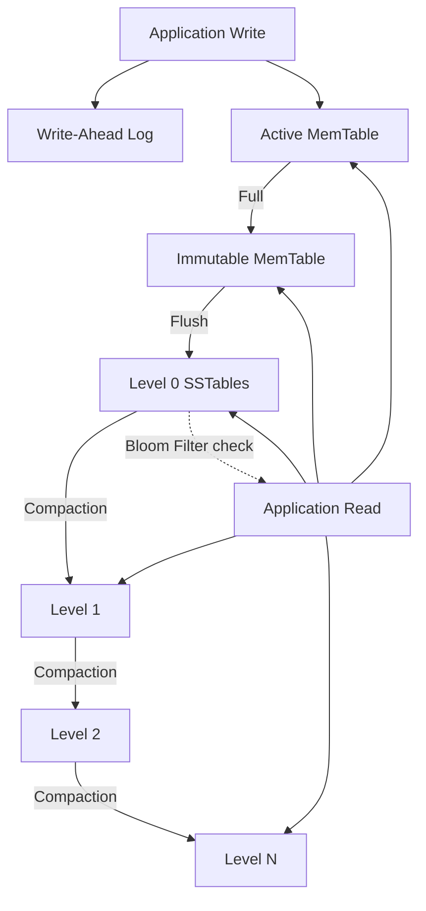

# RocksDB Architecture — System Design Document

## 1. Problem Background

Google's LevelDB introduced in 2011 is an embeddable key-value store based on the Log-Structured Merge Tree (LSM-tree), which converts random writes into sequential I/O. Facebook forked LevelDB in 2012 to create RocksDB, re-engineering it for multi-core CPUs and modern SSDs. Facebook later used RocksDB as a MySQL storage engine (MyRocks), replacing InnoDB for their user database and reducing storage by ~62%.

Core problem RocksDB solves: Sustain extremely high write throughput while providing tunable read performance, on both SSDs and spinning disks, without the random I/O penalty of B-tree engines.

---

## 2. Architecture Overview



### Write Path

1. Write is appended to the WAL on disk (sequential, for durability).
2. Write is inserted into the active MemTable (in-memory skip list, sorted by key).
3. When the MemTable reaches its size threshold, it becomes immutable and a new active MemTable is created.
4. A background thread flushes the immutable MemTable to disk as a Level 0 SSTable — a sorted, immutable file.
5. Background compaction merges and promotes SSTables through levels L0 → L1 → ... → Ln.

### Read Path

1. Check the active MemTable.
2. Check immutable MemTables.
3. Check SSTables from L0 downward. At each level, Bloom filters skip files that definitely do not contain the target key.
4. Return the first (newest) version found.

---

## 3. Internal Design

### MemTable

The MemTable is an in-memory sorted data structure that buffers all recent writes. It supports O(log n) inserts and lookups.

- When the active MemTable reaches `write_buffer_size` (default 64 MB), it is marked immutable and a new MemTable is allocated.
- Multiple immutable MemTables can coexist before flushing (`max_write_buffer_number`).
- The skip list keeps keys sorted, so flushing produces a sorted SSTable without additional sorting.

### Write-Ahead Log (WAL)

Every write is appended to the WAL before being inserted into the MemTable. If the process crashes before the MemTable is flushed, RocksDB replays the WAL to recover unflushed writes. The WAL is discarded once its corresponding MemTable has been flushed to an SSTable.

This is the same WAL principle used by InnoDB (redo log) and PostgreSQL — the log must be durable before the data is considered committed.

### SSTables (Sorted String Tables)

SSTables are the persistent storage format, immutable, sorted files on disk. Each SSTable contains:

- Data blocks- Key-value pairs in sorted order, compressed.
- Index block- Maps key ranges to data block offsets for binary search.
- Bloom filter block- A probabilistic structure that can definitively say "key is NOT here" or "key MIGHT be here."
- Metadata/footer- Compression info, checksums.

Immutability is critical: once written, an SSTable is never modified. Updates and deletes are handled by writing newer entries (or tombstone markers) that supersede older versions during compaction.

### Level Organization (L0 → Ln)

- Level 0- Contains recently flushed SSTables. Key ranges in L0 files can overlap (each file is an independent MemTable flush).
- Levels 1–N- Each level has non-overlapping key ranges within its files. Each level is exponentially larger than the previous (default 10x ratio).

Because L0 files can overlap, a read may need to check all L0 files. From L1 onward, binary search on key ranges identifies the single relevant file per level.

### Compaction

Compaction is the background process that merges SSTables, removes obsolete versions and tombstones, and promotes data to lower levels.

| Strategy | How It Works | Write Amp | Read Amp | Space Amp |
|----------|-------------|-----------|----------|-----------|
| Leveled (default) | Picks L(n) files overlapping with L(n+1), merge-sorts them into L(n+1). Non-overlapping key ranges per level. | High (~10–30x) | Low | Low |
| Universal (tiered) | Merges sorted runs of similar sizes. Fewer, larger merges. | Low (~5–10x) | Higher | Higher |
| FIFO | Drops oldest SSTable files when total size exceeds threshold. No merge. | Minimal | N/A | Minimal |

Why compaction is required: Without it, deleted keys remain as tombstones, overwritten keys accumulate redundant versions, L0 grows unboundedly, and disk space is never reclaimed.

### Bloom Filters

Each SSTable includes a Bloom filter — a probabilistic data structure with no false negatives ("definitely not here") but possible false positives ("maybe here").

For a point lookup, RocksDB checks the Bloom filter before reading any data block. With a 10-bit-per-key Bloom filter, the false positive rate is ~1%. This converts most negative lookups (key does not exist) from O(levels × disk reads) to O(levels × memory checks).

### Concurrency and Column Families

- Writes are serialized through a write batch mechanism. A group commit protocol batches multiple concurrent writes into a single WAL append for efficiency.
- Reads are lock-free — snapshots provide a consistent view without blocking writers.
- Column Families allow logical partitioning within a single database. Each column family has independent MemTables and SSTable levels but shares a single WAL. This enables different tuning parameters (compaction strategy, compression) per data type.

---

## 4. Design Trade-Offs

### The Amplification Triangle

Every LSM-tree must balance three competing costs. Optimizing one degrades the others:

| Amplification | Definition | LSM (RocksDB) | B-Tree (InnoDB) |
|--------------|-----------|----------------|-----------------|
| Write | Bytes written to disk / bytes written by user | 10–30x (data rewritten across levels) | 2–4x (WAL + data page) |
| Read | Disk reads per user read | Potentially many (check multiple levels) | 1–3 (single tree traversal) |
| Space | Disk used / actual data size | 1.1–1.5x (leveled), higher (universal) | ~1.5–2x (page fill factor, fragmentation) |

RocksDB accepts higher write amplification as the cost of converting random writes to sequential I/O. B-trees accept higher per-write I/O cost but deliver consistently fast reads.

### LSM-Tree vs. B-Tree: When to Choose

| Aspect | RocksDB (LSM) | InnoDB/PostgreSQL (B-Tree) |
|--------|--------------|---------------------------|
| Primary strength | Write throughput | Read latency |
| Update pattern | Append-only (sequential I/O) | In-place (random I/O) |
| Ideal workload | Write-heavy: logging, metrics, time-series | Read-heavy: OLTP, user-facing queries |
| Garbage collection | Background compaction | InnoDB: purge thread; PG: VACUUM |
| Read consistency | Snapshot isolation (lock-free reads) | MVCC with locking (InnoDB) or tuple versioning (PG) |
| Space reclamation | Compaction rewrites entire files | In-place page reuse |

### Leveled vs. Universal Compaction

- Leveled is the right default: low space and read amplification, predictable performance, at the cost of higher write amplification.
- Universal suits write-dominated workloads (e.g., bulk ingestion) where minimizing write amplification matters more than read latency.
- FIFO suits cache/TTL workloads (e.g., ephemeral session data) where old data has no value.

### Compaction Write Stalls

When compaction cannot keep up with the write rate, RocksDB stalls writes to prevent L0 from growing unboundedly. This is the system's self-defense mechanism — it throttles the application to let compaction catch up. This can cause latency spikes in production and is the primary operational challenge of LSM-tree systems.

---

## 5. Experiments / Observations

### Benchmarking with `db_bench`

RocksDB ships with `db_bench`, its standard benchmarking tool. Key workloads:

```bash
# Sequential write throughput
./db_bench --benchmarks=fillseq --num=1000000 --value_size=1024

# Random write throughput (primary LSM advantage)
./db_bench --benchmarks=fillrandom --num=1000000 --value_size=1024

# Random read latency
./db_bench --benchmarks=readrandom --num=1000000 --use_existing_db=1

# Mixed read/write workload
./db_bench --benchmarks=readwhilewriting --num=1000000 --threads=8
```

### Observations

| Metric | Sequential Write | Random Write | Random Read |
|--------|-----------------|-------------|-------------|
| Throughput | Very high | High (close to sequential — LSM benefit) | Moderate (multi-level search) |
| Bottleneck | Disk bandwidth | Compaction CPU/IO | Bloom filter misses, L0 file count |

Key insight: The gap between random and sequential write throughput in RocksDB is small (both are converted to sequential I/O internally). In a B-tree engine, random writes are significantly slower than sequential writes because each requires locating and modifying a specific page.

### Compaction Impact

Switching from **leveled** to **universal** compaction:
- Write throughput increases (fewer rewrites per key).
- Space usage increases (more redundant data coexists across runs).
- Read latency increases (more sorted runs to check).

These trade-offs are observable in `db_bench` by comparing `--compaction_style=0` (leveled) vs `--compaction_style=1` (universal).

---

## 6. Key Learnings

1. **LSM-trees solve the random write problem.** By buffering writes in memory and flushing sorted batches sequentially, RocksDB achieves write throughput that B-tree engines cannot match — at the cost of read amplification and background compaction overhead.

2. **The amplification triangle is inescapable.** Write, read, and space amplification are competing constraints. Leveled compaction minimizes read and space amplification; universal minimizes write amplification. No configuration eliminates all three.

3. **Bloom filters are essential, not optional.** Without them, every point lookup would require checking potentially dozens of SSTable files across levels. A 10-bit-per-key Bloom filter reduces false positive rate to ~1%, converting most negative lookups from disk I/O to memory checks.

4. **Compaction is the operational challenge.** It consumes CPU and I/O, can cause write stalls, and its strategy selection (leveled vs. universal vs. FIFO) must match the workload. This is analogous to PostgreSQL's VACUUM — background maintenance that is essential for the architecture to function.

5. **The right storage engine depends on the workload.** RocksDB excels at write-heavy key-value workloads (Facebook chose it over InnoDB for exactly this reason). B-tree engines (InnoDB, PostgreSQL) excel at read-heavy, transactional workloads. Neither is universally superior — they represent opposite ends of the read-write optimization spectrum.

---
