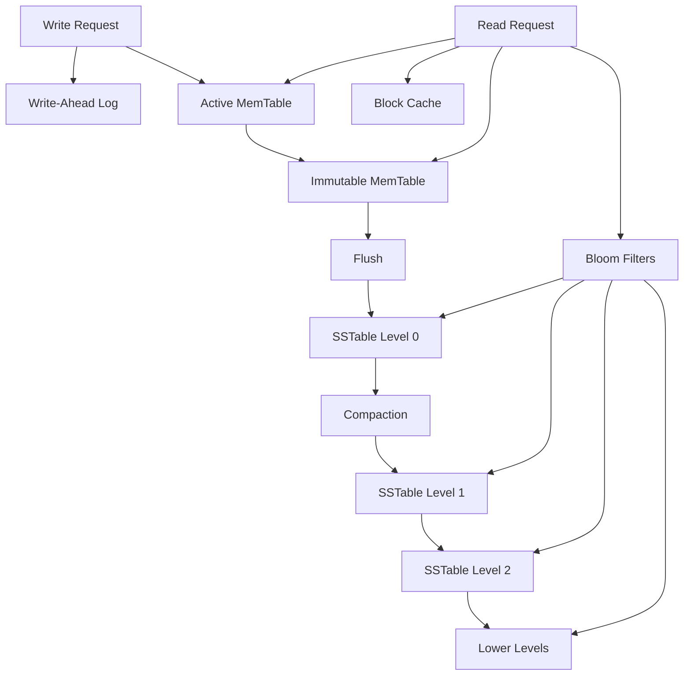
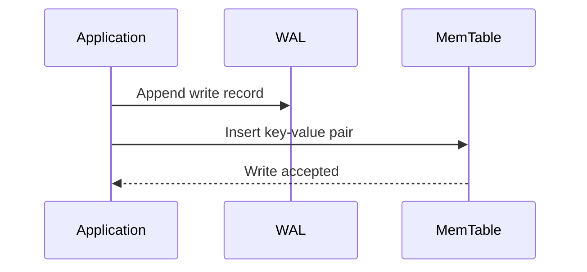
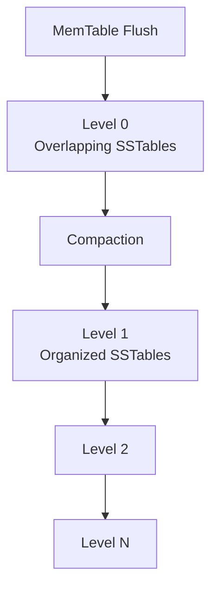
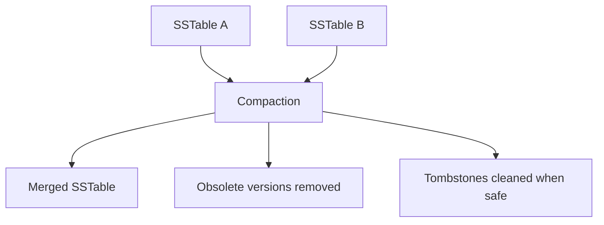

# RocksDB Architecture and LSM-Tree Storage Design

**Name:** Aparna Singha  
**Roll Number:** 24BCS10353  

---

## 1. Problem Background

RocksDB is an embeddable high-performance key-value storage engine. It is based on the Log-Structured Merge Tree, also called an LSM-tree.

Traditional B-Tree based engines are good for many read-heavy workloads, but random writes can become expensive because pages may be updated in place. RocksDB uses a different approach. It first writes data to memory and a write-ahead log, then flushes sorted immutable files to disk.

RocksDB is commonly used inside larger systems such as distributed databases, metadata stores, streaming systems, caching systems, and embedded storage layers.

The main design goal of RocksDB is:

> Convert random writes into sequential writes and manage disk data through sorted immutable files and compaction.

This makes RocksDB especially useful for write-heavy workloads.

---

## 2. Architecture Overview

RocksDB uses an LSM-tree architecture. Writes go to the WAL and MemTable. When the MemTable fills, it becomes immutable and is flushed to disk as an SSTable. SSTables are later merged and reorganized through compaction.



### High-Level Data Flow

| Operation | Path |
|---|---|
| Write | WAL → MemTable → Immutable MemTable → SSTable |
| Flush | Immutable MemTable → L0 SSTable |
| Compaction | Merge SSTables and move data to lower levels |
| Read | Check MemTables, cache, Bloom filters, and SSTables |
| Delete | Write tombstone, remove later during compaction |

---

## 3. Internal Design

## 3.1 MemTable

The MemTable is an in-memory structure that stores recent writes. RocksDB commonly uses skip lists for MemTables, although other MemTable representations can be configured.

When a write arrives:

1. The write is appended to the WAL.
2. The key-value pair is inserted into the active MemTable.
3. The write is acknowledged depending on durability settings.



### Why MemTable Helps

The MemTable allows RocksDB to absorb writes in memory instead of immediately performing random disk updates. This is one reason RocksDB performs well for write-heavy workloads.

---

## 3.2 Immutable MemTable

When the active MemTable becomes full, it is converted into an immutable MemTable. New writes go to a new active MemTable.

The immutable MemTable is then flushed to disk as an SSTable.

This design allows RocksDB to continue accepting writes while older memory data is being written to disk.

---

## 3.3 WAL

The Write-Ahead Log protects data that is currently only in memory.

If RocksDB crashes before the MemTable is flushed to disk, it can replay the WAL to recover the missing writes.

| Component | Purpose |
|---|---|
| MemTable | Fast in-memory write buffer |
| WAL | Durability before flush |
| SSTable | Persistent sorted file |
| Compaction | Reorganizes and cleans disk data |

The WAL is required because memory is volatile. Without WAL, recent writes could be lost before flush.

---

## 3.4 SSTables

SSTable means Sorted String Table. It is an immutable sorted file on disk.

Important SSTable properties:

- Stores keys in sorted order.
- Is not modified after creation.
- Contains blocks and index information.
- Can be checked using Bloom filters.
- Is merged with other SSTables during compaction.

Because SSTables are immutable, RocksDB avoids random in-place updates. Instead, new versions of keys are written to newer files.

---

## 3.5 Levels: L0 to Ln

RocksDB organizes SSTables into levels.

- **Level 0:** Receives newly flushed SSTables. Files in L0 may overlap in key ranges.
- **Level 1 and below:** Data becomes more organized. In leveled compaction, files usually have controlled overlap.



### Why Levels Exist

Levels prevent the system from having too many unordered files. Without compaction and levels, reads would become expensive because RocksDB might need to check many SSTables.

---

## 3.6 Read Path

A read may check multiple places:

1. Active MemTable
2. Immutable MemTable
3. Block cache
4. Bloom filters
5. SSTables from L0 to lower levels


Reads are more complex than writes because the latest value may exist in memory, in L0, or in lower-level SSTables.

---

## 3.7 Bloom Filters

Bloom filters help reduce unnecessary disk reads.

A Bloom filter can answer:

- The key is definitely not in this SSTable.
- The key may be in this SSTable.

If the Bloom filter says the key is definitely not present, RocksDB can skip reading that SSTable.

### Bloom Filter Trade-off

| Benefit | Cost |
|---|---|
| Reduces unnecessary SSTable lookups | Uses extra memory |
| Improves point reads | May have false positives |
| Helps when many files exist | Does not prove key exists |

Bloom filters are especially useful in LSM systems because reads may otherwise need to check multiple files.

---

## 3.8 Compaction

Compaction is the process of merging SSTables and moving data across levels.

Compaction is required because:

- Many SSTables are created over time.
- Newer values may override older values.
- Delete markers, called tombstones, must eventually be cleaned.
- Too many SSTables increase read cost.
- Space may be wasted by obsolete versions.



### Why Compaction is Expensive

Compaction reads existing SSTables and writes new SSTables. This causes extra I/O. In write-heavy systems, compaction can become one of the biggest internal costs.

---

## 3.9 Write Path

The RocksDB write path is optimized for high write throughput.


### Why Writes are Fast

Writes are fast because RocksDB does not immediately update random disk pages. It appends to the WAL and writes to memory first. Disk files are created later in sorted batches.

---

## 3.10 Deletes and Tombstones

RocksDB does not immediately remove a key from all SSTables when a delete happens. Instead, it writes a delete marker called a tombstone.

During compaction, RocksDB can remove older values and tombstones when it is safe.

This improves write speed but means deleted data may still consume space until compaction happens.

---

## 3.11 Leveled vs Universal Compaction

RocksDB supports different compaction strategies.

| Compaction Type | Basic Idea | Best For | Trade-off |
|---|---|---|---|
| Leveled compaction | Organizes data into levels with controlled overlap | Read-heavy or balanced workloads | Higher write amplification |
| Universal compaction | Merges similar-sized files | Write-heavy workloads | May use more temporary space |
| FIFO compaction | Drops old files based on order/size | Cache-like workloads | Not suitable for all persistence needs |

The compaction strategy affects write amplification, read amplification, and space amplification.

---

## 4. Design Trade-Offs

| Design Area | RocksDB Choice | Benefit | Trade-off |
|---|---|---|---|
| Storage structure | LSM-tree | High write throughput | More complex reads |
| Write buffering | MemTable | Fast memory writes | Needs WAL for durability |
| Disk files | Immutable SSTables | Avoids random in-place writes | Requires compaction |
| WAL | Append-only log | Crash recovery | Extra write overhead |
| Bloom filters | Probabilistic filtering | Fewer disk reads | Memory usage and false positives |
| Compaction | Merge and clean files | Improves reads and space usage | Causes write amplification |
| Tombstones | Delayed delete cleanup | Fast deletes | Space used until compaction |
| Levels | Organized SSTable hierarchy | Controls read cost | Background maintenance |

---

## 4.1 Write Amplification

Write amplification means RocksDB writes more data internally than the user writes.

Example:

A key written by the user may first go to WAL, then MemTable, then L0 SSTable, then be rewritten during compaction into lower levels.

Compaction is the main reason write amplification exists.

---

## 4.2 Read Amplification

Read amplification means RocksDB may need to check multiple places to answer one read.

A point lookup may check:

- MemTable
- Immutable MemTable
- L0 files
- Lower-level SSTables
- Bloom filters and indexes

Bloom filters reduce read amplification by skipping files that definitely do not contain the key.

---

## 4.3 Space Amplification

Space amplification means RocksDB uses more physical storage than the logical user data size.

This can happen because:

- Old versions still exist.
- Tombstones exist.
- Compaction has not cleaned obsolete data yet.
- Multiple SSTables temporarily exist during compaction.

---

## 5. Experiments / Observations

These are example commands that can be used with RocksDB benchmark tools. No fake benchmark numbers are included.

### 5.1 Write Workload

```bash
./db_bench --benchmarks=fillrandom --num=1000000
```

Expected observation:

This tests random write behavior. RocksDB should handle writes through WAL and MemTable before flushing to SSTables.

### 5.2 Read Workload

```bash
./db_bench --benchmarks=readrandom --num=1000000
```

Expected observation:

This tests random reads. Read performance depends on MemTables, block cache, Bloom filters, and SSTable organization.

### 5.3 Observe Stats

```bash
./db_bench --benchmarks=fillrandom,stats --num=1000000
```

Expected observation:

Statistics can show internal behavior such as compaction activity, level sizes, and write/read amplification indicators.

### 5.4 Compare Compaction Styles

```bash
./db_bench --benchmarks=fillrandom --compaction_style=level
```

```bash
./db_bench --benchmarks=fillrandom --compaction_style=universal
```

Expected observation:

Changing compaction style changes the balance between write amplification, read amplification, and space amplification.

### 5.5 Observe Bloom Filter Impact

A point-read workload can be run with Bloom filters enabled and disabled.

Expected observation:

Bloom filters should reduce unnecessary SSTable checks for point lookups, especially when keys are absent or spread across many files.

---

## 6. Key Learnings

RocksDB shows how storage engines can optimize for write-heavy workloads by changing the disk layout strategy.

Instead of updating disk pages in place like many B-tree systems, RocksDB writes to WAL and MemTable first, then creates immutable sorted SSTables. This improves write throughput but creates a more complex read path.

Compaction is the central maintenance process in RocksDB. It improves read performance and space usage by merging files and removing obsolete versions, but it also causes write amplification.

Bloom filters, block cache, MemTables, and compaction strategies are all used to control the cost of reads in an LSM-tree design.

The main takeaway is:

> RocksDB achieves high write performance by accepting background compaction cost, possible amplification, and a more complex read path.

---

## 7. References

1. RocksDB Official Website: https://rocksdb.org/
2. RocksDB Wiki: https://github.com/facebook/rocksdb/wiki
3. RocksDB Architecture Guide: https://github.com/facebook/rocksdb/wiki/RocksDB-Overview
4. RocksDB Compaction: https://github.com/facebook/rocksdb/wiki/Compaction
5. RocksDB MemTable: https://github.com/facebook/rocksdb/wiki/MemTable
6. RocksDB Bloom Filter: https://github.com/facebook/rocksdb/wiki/RocksDB-Bloom-Filter
7. RocksDB Benchmark Tools: https://github.com/facebook/rocksdb/wiki/Benchmarking-tools
8. RocksDB Tuning Guide: https://github.com/facebook/rocksdb/wiki/RocksDB-Tuning-Guide