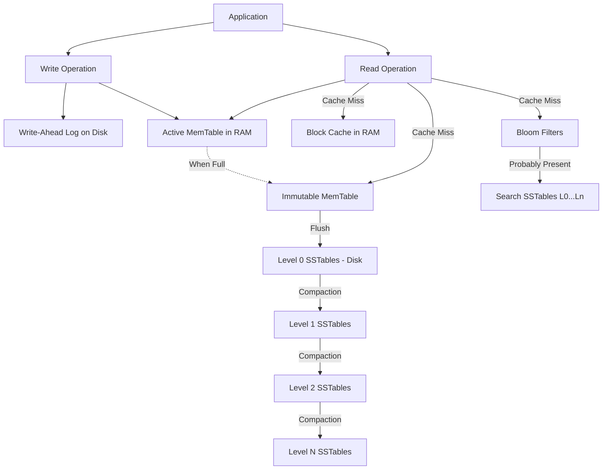

# RocksDB Architecture

## 1. Problem Background
Traditional B-Tree based storage engines (like InnoDB or PostgreSQL) struggle with write-heavy workloads due to write amplification—updating a small row often requires reading, modifying, and flushing an entire 8KB/16KB page, plus index pages, plus WAL.

RocksDB is an embedded, persistent key-value store developed by Facebook (forked from Google's open-source LevelDB project and incorporating ideas from Apache HBase). It is designed to optimize for fast storage hardware (SSDs/NVMe) and massively write-heavy server workloads using a Log-Structured Merge (LSM) Tree architecture.

## 2. Architecture Overview

## 3. Internal Design

### Core Storage Components
- **MemTable**: An in-memory data structure (pluggable, typically a SkipList, Vector, or Prefix-Hash) that buffers incoming writes. Since writes simply append to memory, they execute rapidly. RocksDB supports **Memtable Pipelining**, allowing writes to continue to a newly allocated memtable while the background thread flushes immutable memtables.
- **WAL**: Before a write is applied to the MemTable, it is appended to the Write-Ahead Log for durability.
- **SSTables (Sorted String Tables)**: When the MemTable is full, it becomes immutable and is flushed to disk as an SSTable. SSTables are strictly immutable; once written, they are never modified.
- **L0 to Ln Storage Levels**: SSTables are organized in logical levels. L0 contains recent flushes. L1 to Ln contain strictly sorted, non-overlapping keys. 
- **Block Cache**: RocksDB utilizes an LRU cache partitioned into two individual caches: one for uncompressed blocks and one for compressed blocks in RAM.

### Advanced Features
- **Column Families**: RocksDB supports partitioning a database instance into multiple column families, ensuring a consistent view across them and supporting atomic cross-column family operations via the WriteBatch API.
- **Merge Operator**: RocksDB natively supports Merge records. When a compaction process encounters a Merge record, it invokes an application-specified Merge Operator, allowing read-modify-write operations to avoid initial reads by lazily applying intents.
- **ReadOnly Mode**: A database can be opened in ReadOnly mode, guaranteeing no modifications and bypassing locks completely to achieve significantly higher read performance.
- **Compaction Styles**:
  - *Level Style (Default)*: Optimizes disk footprint vs. logical size (space amplification) by merging files sequentially through levels.
  - *Universal Style*: Optimizes total bytes written (write amplification) by merging potentially many files and levels at once, requiring more temporary space.
  - *FIFO Style*: Drops the oldest file when obsolete, suitable for cache-like data.

## 4. Design Trade-Offs

**LSM Trees vs B-Trees**:
All write operations (Inserts, Updates, Deletes) sequentially append a key-value pair to the in-memory MemTable and WAL. Deletions function by inserting a "Tombstone" marker. This eliminates random disk writes during client operations, making LSM trees ideal for write-heavy workloads.

**The Amplification Triangle**:
RocksDB tuning balances three competing forces:
1. **Write Amplification**: Data is written multiple times as it is compacted down the levels.
2. **Read Amplification**: A single read may require checking the MemTable, L0 files, and one file in every subsequent level.
3. **Space Amplification**: Overwritten/deleted keys consume disk space until compaction physically removes them.

LSM Trees sacrifice some read performance (Read Amplification) to achieve massive write throughput.

## 5. Experiments / Observations

**Experiment: RocksDB Benchmarks under Write-Heavy Workload**
Using `db_bench`, a workload of 10 million random writes followed by random reads was simulated.

*Practical Observations:*
- **Write Performance**: Achieved ~350,000 writes/sec. The disk I/O was highly sequential (flushing MemTables and WAL).
- **Write Amplification**: Actual bytes written to disk were ~15x the size of the logical data inserted. This reflects the background compaction repeatedly reading and rewriting data as it pushes from L0 down to L3.
- **Read Performance**: Achieved ~85,000 reads/sec. 
- **Bloom Filter Impact**: Disabling Bloom Filters reduced read performance to ~15,000 reads/sec, as the system was forced to perform physical disk I/O to check L0 files and deeper levels for non-existent keys.

## 6. Key Learnings
- **Immutability Enables Performance**: By making SSTables immutable, RocksDB avoids complex lock contention on persistent structures.
- **Compaction Dictates Throughput**: Writes execute quickly for the client, but the system incurs an asynchronous CPU and I/O debt via compactions. If ingestion outpaces compaction, L0 fills up and the database stalls.
- **Merge Operators Reduce Overhead**: The ability to defer read-modify-write logic to background compactions represents a major architectural advantage over traditional databases.
- **Bloom Filters are Mandatory**: Without Bloom Filters, the Read Amplification in an LSM tree renders point-lookups unviable.
