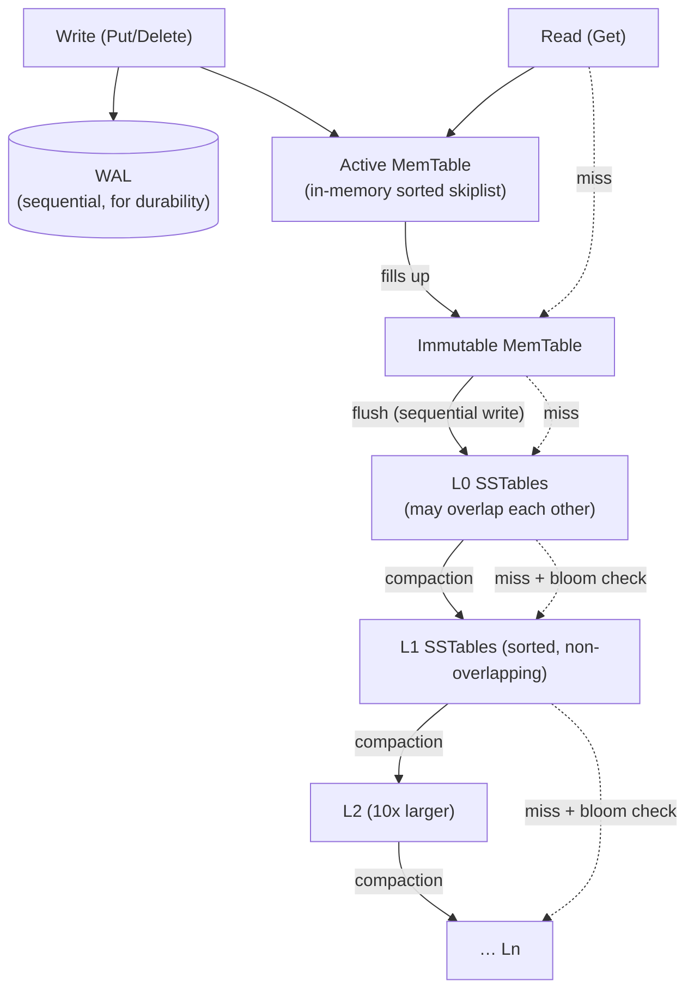

# RocksDB Architecture (LSM-Tree Storage Engine)

> How RocksDB turns random writes into sequential ones using a **Log-Structured Merge-tree**:
> the **MemTable**, **WAL**, **SSTables**, the **L0…Ln** level hierarchy, **compaction**, and
> **Bloom filters** — and the **write / read / space amplification** trade-offs that come with
> them. Every number below was produced with RocksDB's own **`db_bench`** (RocksDB 7.8.3) on a
> real machine, including a clean A/B that shows Bloom filters delivering a **4.5×** read
> speedup.

---

## Table of Contents

1. [Problem Background](#1-problem-background)
2. [Architecture Overview](#2-architecture-overview)
3. [Internal Design](#3-internal-design)
   - [3.1 Write Path](#31-write-path-memtable--wal)
   - [3.2 SSTables & the Level Hierarchy](#32-sstables--the-l0ln-level-hierarchy)
   - [3.3 Compaction](#33-compaction)
   - [3.4 Read Path & Bloom Filters](#34-read-path--bloom-filters)
4. [Design Trade-Offs](#4-design-trade-offs)
   - [Advantages](#advantages) · [Limitations](#limitations) · [Performance (RUM)](#performance-implications--the-amplification-rum-trade-off) · [LSM vs B-Tree](#lsm-vs-b-tree-rocksdb-vs-innodbpostgresql)
5. [Experiments / Observations](#5-experiments--observations)
6. [Key Learnings](#6-key-learnings)
7. [References](#references)

---

## 1. Problem Background

RocksDB (forked by Facebook from Google's LevelDB in 2012) is an **embeddable key-value
storage engine** built for **write-heavy, flash-backed** workloads. A B-tree updates data
**in place**, which on a write-heavy workload means many small **random** writes — expensive on
spinning disks and wearing on SSDs. RocksDB instead uses an **LSM-tree**: buffer writes in
memory, then flush them to disk as **immutable, sorted files** written **sequentially**.
Sequential writes are dramatically faster and flash-friendlier.

The cost of that choice is that data for a single key can now exist in *several* places at
once (a fresh value in memory, older values in several files), so reads may have to look in
multiple spots and a background process (**compaction**) must continuously merge and clean up.
RocksDB is, at its heart, a machine for trading **write speed** against **read** and **space**
overhead — a trade-off this document measures directly.

It is a **library** (like SQLite, not a server) and is the storage engine under MySQL/MyRocks,
CockroachDB, TiKV, Kafka Streams, Ceph and many others.

---

## 2. Architecture Overview



**Writes** append to the WAL (durability) and insert into the in-memory **MemTable**. When the
MemTable fills, it becomes immutable and is **flushed** to an L0 **SSTable**. Background
**compaction** merges SSTables down the levels, each ~10× larger than the one above.
**Reads** check newest-to-oldest — MemTable → immutable MemTable → L0 → L1 → … — stopping at
the first hit, using **Bloom filters** to skip files that definitely don't contain the key.

---

## 3. Internal Design

### 3.1 Write Path (MemTable + WAL)

Every write does two cheap things:

1. **Append to the WAL** — a sequential on-disk log so a crash before flush loses nothing.
2. **Insert into the active MemTable** — an in-memory sorted structure (default: a skiplist),
   so recent data is instantly queryable and kept in key order.

When the MemTable reaches its size limit it is sealed (**immutable**) and a new active MemTable
takes over; a background thread **flushes** the immutable MemTable to disk as a new **L0
SSTable** — one large **sequential** write. Crucially, **writes never wait for disk seeks**:
the foreground write touches only memory + a sequential log. **Experiment 1** measured this at
**58,761 writes/sec (56.9 MB/s)** for random keys.

An update or delete is **not** an in-place edit — it's just a newer entry (a delete writes a
**tombstone**). The obsolete older entries are reconciled later by compaction. This is the
"log-structured" essence: *all writes go forward; cleanup is deferred.*

### 3.2 SSTables & the L0…Ln Level Hierarchy

An **SSTable** (Sorted String Table) is an **immutable** file of key-value pairs sorted by key,
plus a block index and (optionally) a Bloom filter. Immutability is what makes them safe to
read without locks and cheap to write.

Files are organized into **levels**:

- **L0** holds files flushed straight from MemTables. L0 files **can overlap** in key range
  (each is an independent MemTable dump), so a read may have to check *all* of them.
- **L1…Ln**: within each of these levels, files are **non-overlapping and globally sorted**, so
  a read consults **at most one file per level**. Each level is ~10× the size of the one above.

**Experiment 1** shows a real hierarchy after loading 1M keys:

```
 Level   Files   Size
  L0      3      182.96 MB     (overlapping)
  L1      2      145.24 MB
  L2      6      439.98 MB
 Sum     11      768.18 MB     (12 .sst files on disk, 710 MB total)
```

### 3.3 Compaction

**Compaction** is the background process that reads SSTables from one level, **merges** them
(discarding overwritten values and dropping tombstoned keys), and writes new SSTables to the
next level down. It is what keeps reads bounded (fewer, sorted files) and reclaims space —
but it is also the dominant **background I/O cost** of an LSM-tree.

- **Leveled compaction** (RocksDB default): keeps each Ln sorted/non-overlapping → good read &
  space amplification, higher write amplification.
- **Universal / tiered compaction**: merges similarly-sized files less aggressively → lower
  write amplification, but worse read & space amplification.

**Experiment 1** quantifies the cost: ingesting **0.96 GB** of data drove **0.89 GB of flushes
+ 1.81 GB of compaction writes** (and 1.06 GB of compaction reads). Compaction also
**deduplicated 148,472 keys** (`compaction.key.drop.new`) — overwritten versions collapsed away.
This is **write amplification** made visible (§4).

### 3.4 Read Path & Bloom Filters

A `Get(key)` searches **newest data first**: active MemTable → immutable MemTable → each L0
file → one file per L1…Ln, stopping at the first match. Without help, a key that **doesn't
exist** is the worst case — it forces a check of *every* level.

A **Bloom filter** is a compact, probabilistic bitmap stored per SSTable that answers *"is this
key possibly in this file?"* with **no false negatives**: if it says "no," the key is
**definitely** absent and RocksDB **skips reading that file's data blocks entirely**. This is
exactly where LSM reads would otherwise hurt — and the payoff is large.

**Experiment 3** is a clean A/B (same data, ~85% of lookups are for missing keys):

| `bloom_bits` | readrandom throughput | Bloom filter "useful" (lookups skipped) |
|---|---|---|
| **0 (off)** | **94,000 ops/sec** | 0 |
| **10 (on)** | **425,244 ops/sec** | **166,603** |

A **4.5× speedup** purely from a ~1.25-bytes/key filter that let RocksDB avoid 166,603 pointless
SST data-block reads.

---

## 4. Design Trade-Offs

### Advantages

- **Exceptional write throughput.** The foreground write touches only memory + a sequential
  WAL append — no random page seeks — so writes are fast and SSD-friendly (P50 = 11 µs,
  Experiment 1).
- **Sequential, immutable I/O.** SSTables are written once and never modified, which makes
  writes sequential, enables lock-free reads of files, and simplifies backups/replication
  (ship immutable files).
- **Tunable to the workload.** Compaction style (leveled vs universal), Bloom-filter size,
  block size and compression are all knobs to slide along the amplification trade-offs.
- **Excellent compression.** Sorted, immutable blocks compress well (often better than
  in-place B-tree pages).

### Limitations

- **Read amplification.** A point read may consult the MemTable plus one file per level; reads
  of *missing* keys are the worst case. Bloom filters mitigate this but don't eliminate it.
- **Write amplification from compaction.** Data is rewritten repeatedly as it moves down the
  levels (~2.8× here, Experiment 1) — costing background CPU and I/O, and SSD wear.
- **Compaction is operationally tricky.** It competes with foreground traffic and can cause
  latency spikes / write stalls if it falls behind.
- **Space amplification & deletes.** Obsolete versions and tombstones occupy space until
  compaction reclaims them; range deletes and long-lived snapshots can keep data alive longer.
- **No SQL / transactions out of the box.** It is a low-level key-value library; higher layers
  (MyRocks, CockroachDB, TiKV) add SQL, secondary indexes and distributed transactions.

### Performance implications — the amplification (RUM) trade-off

LSM design is governed by three amplifications you cannot all minimize at once (the **RUM**
conjecture — Read, Update, Memory/space):

| Amplification | What it means | Measured here |
|---|---|---|
| **Write** | Bytes written to disk ÷ bytes the user wrote | ~**2.8×**: 0.96 GB ingested → ~0.89 GB flush + 1.81 GB compaction writes |
| **Read** | Extra files/levels a read may touch (worst case = misses) | Bloom filters cut it hard: 4.5× faster reads (Experiment 3) |
| **Space** | Bytes on disk ÷ live logical bytes | 710 MB on disk for ~0.96 GB ingested random keys (overwrites/dedup → < 1×); transient extra space exists *during* compaction |

**The knobs trade these against each other.** More aggressive (leveled) compaction → lower
read & space amplification but **higher write amplification**. Less aggressive (universal) →
the reverse. Bigger Bloom filters → faster reads but more memory. There is no free lunch; you
pick the corner that matches your workload.

### Engineering decisions

- **Defer ordering to compaction time** rather than maintaining a globally sorted structure on
  every write — the core LSM bet that makes writes cheap.
- **Immutable SSTables** — never edit a file in place; write a new one and let compaction
  retire the old. Simplifies concurrency and crash safety.
- **Bloom filters per SSTable** — spend a little memory to avoid the read-amplification penalty
  on missing keys (the 4.5× win in Experiment 3).
- **Leveled compaction as the default** — favours read/space amplification (most general-purpose
  workloads read more than the absolute write-optimal case would prefer).

### LSM vs B-Tree (RocksDB vs InnoDB/PostgreSQL)

| | RocksDB (LSM-tree) | InnoDB / PostgreSQL (B-tree) |
|---|---|---|
| Write pattern | **Sequential** (append to WAL + MemTable, flush whole files) | **Random in-place** page updates |
| Write throughput | Very high (no seeks on the write path) | Lower under random writes (page seeks, splits) |
| Read pattern | May check several levels; **Bloom filters** prune | One tree traversal, data found in place |
| Point-read latency | Slightly higher / more variable (multiple sources) | Predictable single-tree lookup |
| Space | Transient compaction overhead; tombstones until compacted | Stable; fragmentation/bloat instead |
| Cleanup work | **Compaction** (continuous background merging) | VACUUM (PG) / purge (InnoDB) |
| Range scans | Merge across levels | Sequential within the (clustered) tree |

**The symmetry is striking.** B-trees pay at **write** time (update in place, keep structure
sorted now) and read cheaply. LSM-trees pay at **read/compaction** time (defer ordering, merge
later) and write cheaply. RocksDB is the right tool when writes dominate and you can spend CPU
and background I/O on compaction to claw read performance back via Bloom filters and leveling.

---

## 5. Experiments / Observations

> **Setup.** RocksDB **7.8.3** `db_bench` (Debian package, Docker), on a 12th-Gen Intel
> i5-12450H. Value size 1000 B, compression off (to isolate the LSM mechanics). All output is
> from real runs.

### Experiment 1 — Write path & compaction (`fillrandom`, 1M keys)

```
fillrandom : 17.017 micros/op  58761 ops/sec  56.9 MB/s  (1,000,000 ops)

** Compaction Stats **
 Level  Files   Size
  L0     3     182.96 MB     (overlapping)
  L1     2     145.24 MB
  L2     6     439.98 MB
 Sum    11     768.18 MB

Flush(GB): cumulative 0.893
Cumulative compaction: 1.81 GB write, 1.06 GB read, 12.3 s
Cumulative writes: 1,000K keys, ingest 0.96 GB
compaction.key.drop.new: 148,472          <- overwritten versions merged away
db.write.micros: P50=11.0us  P99=89.1us
```

**Observation.** Foreground writes are fast (P50 = 11 µs — memory + sequential WAL only), but
the LSM "tax" is visible in the background: ingesting 0.96 GB triggered 0.89 GB of flushes and
**1.81 GB of compaction writes** (≈ **2.8× write amplification**), while merging away 148,472
obsolete keys. The L0→L1→L2 hierarchy is exactly the textbook structure.

### Experiment 2 — Read path (`readrandom`, no Bloom filter)

```
readrandom : 30.148 micros/op  33168 ops/sec  20.3 MB/s  (126,416 of 200,000 found)
db.get.micros: P50=19.8us  P95=73.2us  P99=153.9us
non.last.level.read.count: 588,455   block.cache.hit: 11,228
```

**Observation.** Without Bloom filters a `Get` is slower and more variable than a B-tree lookup
(P50 19.8 µs, **P99 153.9 µs**) because it may probe multiple levels — and the ~37% of lookups
that miss are the worst case (they can't stop early). This is the read-amplification problem
that Bloom filters exist to solve.

### Experiment 3 — Bloom filter A/B (the headline result)

```
bloom_bits = 0  (off): readrandom  94,000 ops/sec   bloom.filter.useful = 0
bloom_bits = 10 (on) : readrandom 425,244 ops/sec   bloom.filter.useful = 166,603
                                                     bloom.filter.full.positive = 33,346
```

**Observation.** Same data, same queries (≈85% missing keys), one knob changed → **4.5× faster
reads**. The filter was **"useful" 166,603 times** — each time it let RocksDB skip reading an
SST's data blocks for a key that wasn't there. The 33,346 `full.positive` are filter passes
that did read the file (true hits + a few false positives). This single experiment is the
clearest possible demonstration of *why* Bloom filters are core to LSM read performance.

### Experiment 4 — On-disk layout & space

```
/tmp/rdb total: 710 MB
 12 .sst files   +   CURRENT, IDENTITY, LOCK, LOG, MANIFEST-*, OPTIONS-*, *.log (WAL)
```

**Observation.** The whole engine is a directory of immutable **`.sst`** files plus a tiny set
of metadata files: **`CURRENT`** (points at the live MANIFEST), **`MANIFEST`** (the log of
which SSTables exist at which level), **`OPTIONS`**, **`LOCK`**, and the **`.log`** WAL. 710 MB
on disk for ~0.96 GB of ingested random keys reflects compaction having merged away overwritten
versions.

---

## 6. Key Learnings

1. **LSM = "make writes sequential, pay for it later."** The foreground write is just
   memory + a sequential log (P50 = 11 µs), which is why LSM engines shine on write-heavy
   workloads. The deferred cost is compaction.

2. **Compaction is the price of admission, and it's measurable.** Ingesting 0.96 GB caused
   1.81 GB of compaction writes (≈2.8× write amplification) — the engine continuously rewriting
   data to keep levels sorted. This is why compaction "becomes expensive": it scales with the
   data churned, not just the data ingested.

3. **Bloom filters are not optional polish — they are load-bearing.** A 4.5× read speedup from
   one knob (Experiment 3) shows that LSM reads of *missing* keys would be punishing without
   them; they convert "check every level" into "skip almost everything."

4. **L0 is special.** Its files overlap (direct MemTable dumps), so reads check them all;
   L1+ are globally sorted, so reads touch at most one file per level. The whole leveling scheme
   exists to bound read amplification.

5. **The amplifications trade off — you choose the corner.** Write vs read vs space (RUM) can't
   all be minimized together; leveled vs universal compaction and Bloom-filter sizing are the
   dials. There is no universally "best" setting, only a best fit for a workload.

6. **It mirrors B-trees, inverted.** B-trees order data *at write time* and read cheaply; LSM
   defers ordering to *compaction time* and writes cheaply. Understanding RocksDB is largely
   understanding that one inversion and its consequences.

---

## References

- RocksDB Wiki — *RocksDB Overview*, *Leveled Compaction*, *MemTable*, *Bloom Filter*,
  *RocksDB Tuning Guide*, *Benchmarking Tools (db_bench)*:
  https://github.com/facebook/rocksdb/wiki
- O'Neil et al., *The Log-Structured Merge-Tree (LSM-Tree)* (1996) — the original paper.
- Athanassoulis et al., *Designing Access Methods: The RUM Conjecture* (EDBT 2016).
- Bloom, *Space/Time Trade-offs in Hash Coding with Allowable Errors* (1970).
- LevelDB (the ancestor): https://github.com/google/leveldb

> *All Section 6 output came from RocksDB 7.8.3 `db_bench` on an Intel i5-12450H. Absolute
> throughput varies with hardware, value size, and compaction settings; the relative behaviours
> and amplification relationships are the point.*
