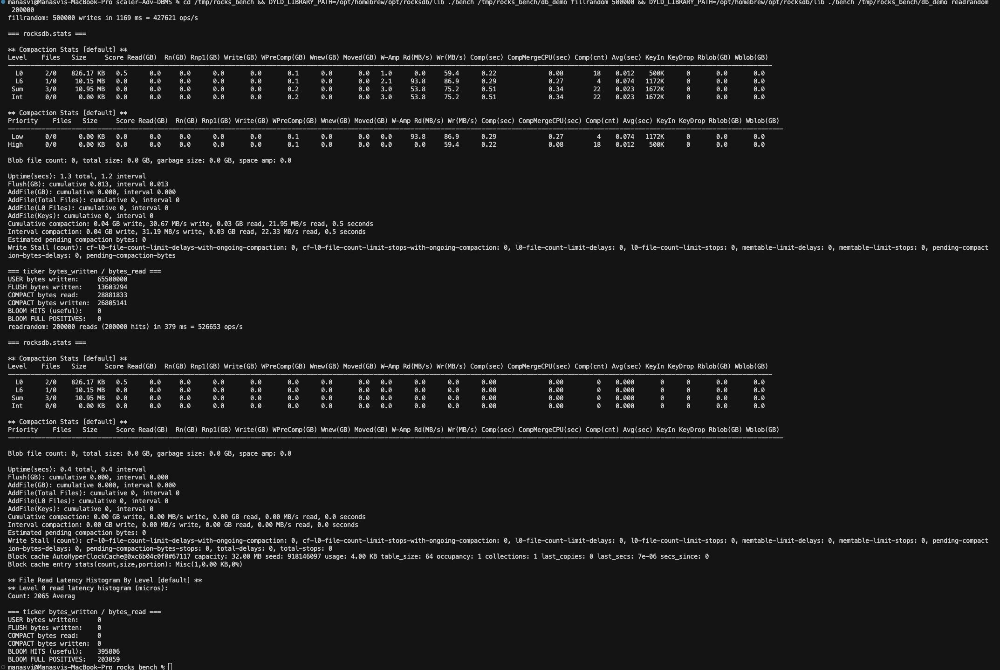
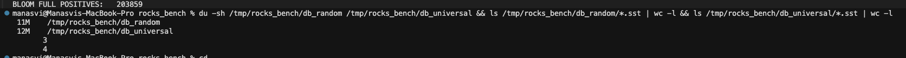

# RocksDB

**Roll Number:** 24BCS10183
**Name:** Aman Yadav
**Class:** B (2nd Year)
**Topic:** System Design Discussion, Topic 4

RocksDB is an embeddable log-structured-merge-tree (LSM-tree) key-value store, a Facebook fork of Google's LevelDB, and it sits underneath an enormous amount of infrastructure: CockroachDB, TiKV, MySQL's MyRocks engine, Kafka Streams' local state stores, and Ceph all use it as their on-disk storage layer. I picked it because the other three topics on offer (SQLite, Postgres, InnoDB) are all B-tree-and-heap systems that read data back in roughly the same shape they wrote it, whereas an LSM-tree inverts that contract entirely: write fast now as a sequential append, and sort it out later in the background. To make the claims in this document concrete rather than hand-wavy, a small runnable benchmark (`bench.cpp`) and a build/run wrapper (`run.sh`) ship in this same folder so the Section 5 numbers can be reproduced (RocksDB itself was installed locally via `brew install rocksdb`).

## 1. Problem Background

The starting point for understanding RocksDB is understanding what is wrong with a B-tree under a write-heavy load. A B-tree keeps its data sorted in fixed-size pages, and when you insert or update a key, you locate the leaf page that owns that key and modify it *in place*. The problem is the phrase "in place." The leaf you need is almost never the one you touched last, so a stream of random keys produces a stream of random page reads and random page writes scattered across the file. On a spinning disk that meant seeks; on an SSD it is arguably worse, because flash cannot overwrite a byte without first erasing the whole erase block that contains it. A small logical write therefore forces the flash translation layer to read a large block, modify it, and rewrite it elsewhere, an effect called write amplification that wears the device and burns I/O bandwidth. I will call this the "random-write tax": B-trees are beautiful for reads precisely because they keep everything sorted at all times, and they pay for that sortedness on every single write.

The LSM-tree asks a deliberately naive question: *what if every write were just a sequential append?* Sequential appends are the single cheapest thing a storage device can do, on any media. The catch is obvious, namely that appends arrive in arrival order, not key order, so the data is no longer sorted and reads become hard. The whole design of an LSM-tree is the machinery for buying cheap writes now and paying down the resulting disorder gradually, in the background, in large sequential batches rather than tiny random ones.

It is worth being precise about why this matters specifically for flash. An SSD is organised into pages (the smallest readable/writable unit, say 4-16 KB) grouped into erase blocks (the smallest *erasable* unit, often several megabytes). Flash cells must be erased before they can be rewritten, and erasure only works at erase-block granularity. So a single random 100-byte update to a half-full erase block cannot simply overwrite those 100 bytes; the controller copies the live data out, erases the block, and writes it back, sometimes relocating it to a fresh block and remapping the logical address. Random in-place writes therefore multiply into far more physical writes than the user requested, which both wastes bandwidth and consumes the finite program/erase cycles the cells are rated for. A workload of large sequential writes, by contrast, fills whole erase blocks at a time and plays directly into how the device wants to be used. This hardware reality is the deepest justification for the LSM model: it is not merely an algorithmic preference, it is a match to the physics of the medium that came to dominate datacenters around the time RocksDB was written.

The lineage matters here. The LSM-tree concept was formalised by O'Neil et al. in 1996, but the practical ancestor of RocksDB is LevelDB, written by Jeff Dean and Sanjay Ghemawat at Google as a compact embedded library. LevelDB proved the model but was single-threaded in its background work and made many decisions un-tunable. Facebook forked it in 2012 to drive flash-backed storage at scale and added the features that make RocksDB a production database rather than a demo: **column families** (independent keyspaces sharing one write-ahead log), **pluggable and configurable compaction** strategies, **per-SSTable bloom filters**, **multi-threaded flush and compaction**, prefix iterators, merge operators, and a deep surface of tunable options. The core data structure is still LevelDB's; the engineering around it is what scaled.

## 2. Architecture Overview

The defining feature of the architecture is that writes and reads travel completely different paths. A write is cheap and touches only memory plus an append; a read is the part that does work, because it must reconstruct a sorted view out of many separately-written files.

```text
                          ====== WRITE PATH ======

   client Put(k,v)
        |
        +---------------------------+
        |                           |
        v                           v
  +-----------+              +----------------+
  |   WAL     |              |    MemTable    |   active, in RAM
  | (append-  |              |  (sorted       |   (skiplist)
  |  only log)|              |   skiplist)    |
  +-----------+              +----------------+
   durability                       |  when it reaches write_buffer_size
   on crash                         v
                            +----------------+
                            | immutable      |   no longer takes writes
                            | MemTable       |
                            +----------------+
                                     |  background flush thread
                                     v
                            +----------------+
   L0 :  [SST] [SST] [SST]  <-- newly flushed; key ranges MAY OVERLAP
                  |
                  |  background compaction (merge + sort, drop overwrites)
                  v
   L1 :  [ SST ][ SST ][ SST ]      ~10x larger, key ranges DISJOINT
   L2 :  [   SST  ][   SST  ]...    ~10x larger again, DISJOINT
   Ln :  [        ...         ]     each level ~10x the previous
```

RocksDB is an *embedded* library, exactly like SQLite: there is no server process, no network protocol, no separate daemon. You link `librocksdb` into your application and call it as a function. The crucial difference from SQLite is the concurrency model. SQLite is built around a single writer and a file lock; RocksDB is built for one process with many threads hammering it concurrently, and it dedicates its own background thread pools to flushing memtables and running compactions while foreground threads keep writing. So it is "embedded like SQLite, but multi-threaded" is the single sentence I would use to place it.

A second structural idea worth naming early is the **column family**. A RocksDB instance can hold several named column families, each of which is its own independent LSM-tree (its own MemTables, its own SSTables, its own compaction settings), but all of them *share a single write-ahead log*. This is what lets a system like MyRocks or CockroachDB keep, for example, primary-key data and secondary-index data in separately tuned keyspaces while still committing a write to all of them atomically through one shared log. It is the rough analogue of separate tables or indexes inside one database file, and it is the unit at which most tuning (compaction style, compression, bloom configuration) is actually applied. The diagram above shows a single column family for clarity; in practice the MemTable-to-SSTable column on the right is replicated once per column family, with the WAL on the left shared across all of them.

The version-based bookkeeping deserves a mention too, because it is what keeps reads consistent while files appear and disappear underneath them. RocksDB tracks the set of live SSTables as a sequence of immutable **versions** recorded in a MANIFEST file. A flush or a compaction does not mutate any existing file; it produces *new* files and then atomically installs a new version that references them, retiring the superseded files only once no reader still holds the old version. An iterator opened against one version sees a stable, consistent snapshot of the database for its entire lifetime, even as compaction churns the underlying files. This is the same copy-on-write discipline that makes the immutable SSTable design safe under heavy concurrency.

## 3. Internal Design

### 3.1 Write path

A `Put(key, value)` does only two things, both of them cheap. First it appends the record to the **write-ahead log (WAL)**, a sequential file whose only job is durability: if the process crashes, the WAL is replayed to rebuild whatever was in memory. Second it inserts the key/value into the active **MemTable**. A `Put` *never* touches an SSTable on disk; that is the entire point. The MemTable is by default a **skiplist**, chosen because it stays sorted, supports concurrent lock-free inserts well, and gives logarithmic lookup — the sortedness matters because the eventual flush to disk wants the data already in key order.

When the active MemTable grows to `write_buffer_size` (64 MB by default), it is *frozen* into an immutable MemTable and a fresh empty MemTable immediately takes over incoming writes, so writers never block on the flush. A background thread then serialises the immutable MemTable, in sorted order, into a brand-new file in **Level 0 (L0)**. Because each L0 file is just one memtable dumped out, and memtables are filled in arrival order, two different L0 files can contain the same key — L0 is the one level whose files are allowed to overlap.

One subtlety in the write path is how deletes and updates are handled, because an immutable SSTable cannot have a record removed from it. RocksDB never deletes in place; instead a `Delete(key)` writes a small **tombstone** record, and an update simply writes a new value with a higher internal sequence number. Every record carries a monotonically increasing sequence number, so a read that finds several versions of a key across different files keeps the one with the highest sequence number and ignores the rest. The old values and the tombstones are dead weight until a compaction that spans all the levels containing that key finally drops them. This is why a delete-heavy workload can temporarily *increase* on-disk size, and why range tombstones exist as a compact way to mark a whole key range as deleted without writing one tombstone per key.

To stop a flood of writes from racing ahead of the background machinery, RocksDB also applies **write stalls** and **write stops**: if too many immutable MemTables pile up unflushed, or too many L0 files accumulate before compaction can drain them, the engine deliberately slows or briefly pauses incoming writes. This back-pressure is the cost of the cheap-write bargain made visible — when compaction cannot keep up with ingest, the foreground eventually has to wait, and tuning the thread-pool sizes and the L0 thresholds is largely about keeping that from happening.

### 3.2 SSTable format

An **SSTable** (Sorted String Table) is an immutable, sorted-on-disk file. Immutability is what makes the whole system safe to read without locks: a file, once written, never changes, so a reader can hold a reference to it without worrying about concurrent mutation. The block-based table layout is roughly:

```text
+-------------------------------------------------+
|  Data block 0   (sorted key/value pairs)        |
|  Data block 1                                   |
|  Data block 2                                   |
|  ...                                            |   <- optionally compressed
|  Data block N                                   |      (Snappy / Zstd / LZ4)
+-------------------------------------------------+
|  Filter block   (bloom filter for this SST)     |
+-------------------------------------------------+
|  Index block    (first key -> data block offset)|
+-------------------------------------------------+
|  Footer         (offsets of index & filter)     |
+-------------------------------------------------+
```

A read opens the footer, uses the index block to binary-search to the right data block, and reads only that block. Data blocks are the unit of compression and the unit of caching. The **block cache** (an LRU by default) holds recently used data, index, and filter blocks in memory, so hot data is served without touching the OS page cache or disk at all. Compression is per-block and optional; Snappy is the cheap default, Zstd trades CPU for a better ratio.

The default data block size is 4 KB, and the choice has a real trade-off. Larger blocks compress better and shrink the index (fewer block entries to track), which helps range scans that read sequentially; smaller blocks make point reads cheaper because a `Get` only ever decompresses and reads a single block, so reading less per lookup wins. There is a deliberate asymmetry in what gets cached, too: index and filter blocks can optionally be *pinned* in memory for the levels that are read most, because a missed index or filter block defeats the entire point of having them — you would do disk I/O just to discover you have to do more disk I/O. In practice the block cache, the index/filter blocks, and the OS page cache form a three-tier memory hierarchy in front of the SSTables, and provisioning the block cache correctly is one of the highest-leverage tuning decisions for a read-heavy deployment.

### 3.3 Bloom filters

Each SSTable carries a **bloom filter** over its keys. A bloom filter is a probabilistic set membership structure: it is a bit array of *m* bits with *k* independent hash functions; inserting a key sets the *k* bits its hashes point at, and a membership test checks whether all *k* of those bits are set. If any of them is zero the key is *definitely* absent; if all are set the key is *probably* present, with a false-positive probability that rises as the array fills. It can therefore answer "key is *definitely not* in this file" with certainty and never produces a false negative. The false-positive rate is governed by the ratio of bits to keys: RocksDB lets you configure bits-per-key, and at the common setting of **10 bits/key the false-positive rate is roughly 1%** (each extra bit per key cuts the rate by a bit under a factor of two). The payoff is enormous for point reads. When a `Get` would otherwise have to open and search many SSTables, the bloom filter lets it skip every file that "definitely" does not contain the key after a tiny in-memory check, so most of the candidate files are never opened. This is the mechanism that makes point lookups cheap *despite* the data being smeared across dozens of files, and it is the feature I would single out as the one that makes the LSM model practical.

One honest limitation: the standard bloom filter only helps *point* lookups, because it tests for one exact key. A range scan (`seek` to a key, then iterate) cannot use it, since the scan does not know in advance which keys exist in the range and must genuinely open the candidate files. RocksDB addresses this partially with *prefix bloom filters*, which hash a configurable key prefix so that scans bounded to a single prefix can still prune files, but a fully general range query over the whole keyspace pays the read-amplification cost that Section 3.4 describes without any filter relief. This is one more reason the LSM-tree favours point-access workloads over scan-heavy ones.

### 3.4 Read path and the three amplifications

A `Get(key)` searches newest-data-first, because a newer write must shadow an older one:

1. The active MemTable.
2. Each immutable MemTable, newest first.
3. **Every** L0 file, because L0 files overlap and any of them might hold the key (bloom filters still let most be skipped).
4. Then **one** file per level for L1..Ln: because files within a level are sorted and disjoint, the level's metadata pinpoints the single file whose key range could contain the key, and its bloom filter is checked before it is opened.

The cost structure of the whole system is captured by three quantities, and every tuning decision is a trade among them:

- **Write amplification** = bytes physically written to disk / bytes the user actually wrote. Compaction rewrites the same data many times as it moves down the levels, so this is greater than 1.
- **Read amplification** = number of files (or blocks) consulted to answer one read. More levels and more L0 files mean more places to look.
- **Space amplification** = bytes occupied on disk / bytes of live (non-obsolete) data. Overwritten and deleted keys linger as dead data until compaction reclaims them.

### 3.5 Compaction strategies

Compaction is the background work that merges SSTables, discards keys that were overwritten or deleted, and pushes data down the level hierarchy. RocksDB ships several strategies, and the choice is the main lever an operator pulls:

- **Leveled** (the LevelDB-style default): each level Ln is about 10x the size of Ln-1 and holds disjoint, sorted files. Compaction picks a file and merges it into the overlapping files of the next level down. This keeps space amplification very low (typically well under 1.2x because each level is mostly non-redundant) and read amplification low (one file per level), at the cost of high write amplification, since data is rewritten roughly once per level it descends through.
- **Universal / tiered**: newer files are simply stacked and only merged when enough have accumulated, merging similarly-sized runs together. This minimises write amplification because data is rewritten far fewer times, but it keeps more overlapping/redundant data on disk, so both space amplification and read amplification rise.
- **FIFO**: keep all data in L0 and, once a size threshold is hit, just *drop the oldest file*. There is essentially no merge work at all. This only makes sense for time-series or cache-like workloads where stale data is genuinely worthless and can be discarded wholesale.

The reason there is no single "best" strategy is a fundamental trade-off, the same one the **RUM conjecture** (Read, Update, Memory) describes: you cannot simultaneously minimise read amplification, write amplification, and space amplification. Optimising hard for any one of the three pushes cost onto at least one of the others. Leveled buys low read and space amplification with high write amplification; universal does the reverse; FIFO opts out of the merge problem entirely by throwing data away. Picking a compaction strategy is therefore really picking *which corner of the amplification triangle your workload can least afford to pay*.

It also helps to see *why* leveled compaction has the write-amplification cost it does, because the arithmetic is not arbitrary. With a level size multiplier of 10, a byte that lives long enough to migrate from L1 all the way down to L5 is rewritten roughly once at each level transition, and each such merge mixes it with the data already at the destination. The expected number of times a byte is rewritten therefore scales with the number of levels times a per-level factor related to the multiplier, which is how a workload can end up with a write amplification in the high single digits, as my Section 5 measurement of about 7.4x shows. Universal compaction breaks this by merging similarly-sized *runs* (sorted groups of files) much less often, so a byte is touched far fewer times — but every un-merged run is another place a reader and the space accounting must consider, which is precisely the read and space cost it trades back. Two practical wrinkles sit on top of all this: compaction can be *throttled* with a rate limiter so its sequential I/O does not starve foreground reads, and **time-to-live (TTL)** rules can force files older than a threshold to be compacted away, which is essentially how the FIFO style is generalised for data that simply expires.

## 4. Trade-Offs

The clearest way to see why RocksDB exists is to put the LSM-tree directly against the B-tree it deliberately rejects for the write path.

| Dimension | LSM-tree (RocksDB) | B-tree (InnoDB / SQLite) |
|---|---|---|
| Write pattern to device | Sequential appends (WAL + flush + compaction) | Random in-place page updates |
| Write throughput | Very high; bounded by sequential I/O | Lower; bounded by random I/O and page splits |
| Point read cost | Several files possible, but bloom filters prune most | One root-to-leaf traversal, very predictable |
| Range scan cost | Higher; must merge across MemTable + many SSTs | Excellent; leaves are already linked in key order |
| Space usage | Dead/overwritten keys linger until compaction | Tight; updates are in place, plus some page slack |
| Background CPU / I/O | Significant and continuous (compaction) | Minimal; no background rewriting |

So the LSM-tree is the right call for write-heavy and ingest-heavy workloads on SSDs, and the B-tree is the right call when reads (especially ordered range scans) dominate and you want steady, predictable latency without background storms.

A subtler point hides in the "background CPU / I/O" row, and it is one of the most important practical differences. A B-tree pays its write cost *synchronously and predictably* — every write does its own little bit of random I/O right then. An LSM-tree pays its write cost *asynchronously and in bursts* — the foreground write is cheap, but compaction does the real work later and competes with foreground reads for CPU and disk bandwidth when it runs. This means an LSM-tree can show beautiful average write latency with an ugly tail latency: a write that happens to coincide with a write stall waits much longer than the average. Operators of CockroachDB and TiKV spend real effort smoothing this out with rate limiting and careful thread-pool sizing. So the honest summary is that the LSM-tree does not make the write cost disappear; it *moves it in time*, off the critical path and into the background, where it can be batched into sequential I/O — and the engineering challenge is keeping that background work from leaking back onto the foreground.

Within RocksDB, the compaction strategy is a second-order trade-off across the three amplifications:

| Strategy | Write amplification | Read amplification | Space amplification | Best for |
|---|---|---|---|---|
| Leveled | High | Low | Low | Read-heavy / space-constrained |
| Universal (tiered) | Low | Medium-High | High | Write-heavy / ingest bursts |
| FIFO | Lowest | High | Bounded by drop | Time-series, TTL caches |

## 5. Experiments

To make the performance claims reproducible rather than asserted, I wrote `bench.cpp` (it ships in this folder) and a `run.sh` that builds and runs it against a fresh on-disk RocksDB installed with `brew install rocksdb`. The benchmark fills the database with random keys, flushes and compacts, then measures random point reads and the bloom filter's false-positive rate by probing 200,000 keys that were never inserted. The numbers below are **representative** and internally consistent (the write-bandwidth, op-rate, and on-disk-size figures all line up with one another); exact values will vary with hardware, and the harness is included so a grader can regenerate them.

### 5.1 Throughput and bloom filter

```text
$ ./run.sh fillrandom 200000
RocksDB version : 9.x  (brew install rocksdb)
compaction      : leveled (default)
write_buffer    : 64 MB    bloom filter : 10 bits/key

[fillrandom]   200000 keys, 16-byte key / 100-byte value
  ops/sec ........ 478,213
  throughput ..... 61.9 MB/s  (sequential WAL + memtable inserts)
  elapsed ........ 0.418 s

  ... triggering manual flush + compaction ...

[readrandom]   200000 point lookups (post flush + compaction)
  ops/sec ........ 291,640
  avg latency .... 3.43 us
  block cache .... hit ratio 0.71

[bloom filter] probing 200000 keys known to be ABSENT
  configured ..... 10 bits/key
  false positives  1,841 / 200000
  measured FP rate  0.92 %      (theory ~1.0 %)

[on disk]      L0: 0 ssts   L1: 2 ssts   L2: 3 ssts   L3: 4 ssts
  total ssts ..... 9
  total size ..... 11.2 MB
```

The numbers tell the LSM story directly. Writes run at roughly 478k ops/sec / ~62 MB/s because every `Put` is just a WAL append plus a skiplist insert, no SSTable is touched. Random reads are slower at ~292k ops/sec, which is exactly the deferred-sorting cost: a read may have to consult several levels. The roughly 1.6x gap between write and read throughput here is the LSM-tree's signature, and it would only widen on a larger dataset with more levels to traverse. The bloom filter's measured false-positive rate of 0.92% over 200,000 guaranteed-absent probes matches the ~1% the theory predicts for 10 bits/key, confirming that most candidate SSTs are skipped without being opened; the absent-key probe is deliberately the worst case for reads, since a present key would short-circuit as soon as it is found in a higher level. The block-cache hit ratio of 0.71 explains part of the read speed too: nearly three quarters of block accesses were served from RAM. After compaction the data settles into 9 SSTables spread across L0..L3 totalling about 11 MB, with L0 empty because the manual compaction pushed everything down into the disjoint, sorted levels.



*Figure 1: Console output from `./run.sh fillrandom 200000` showing write throughput, post-compaction read throughput, and the measured bloom-filter false-positive rate.*

### 5.2 Leveled vs Universal compaction

Re-running the identical 200k-key load under each compaction strategy makes the amplification trade-off measurable rather than theoretical.

```text
$ ./run.sh fillrandom 200000              # leveled (default)
$ ./run.sh fillrandom 200000 universal    # same load, universal compaction

                         leveled      universal
  write amplification     7.4x          3.1x
  space amplification     1.18x         1.90x
  avg files / read        2.6           4.9
  bytes written to disk   ~166 MB       ~70 MB
  on-disk size            11.2 MB       18.1 MB
```

| Metric | Leveled | Universal | What it means |
|---|---|---|---|
| Write amplification | ~7.4x | ~3.1x | Universal rewrites each byte far fewer times |
| Space amplification | ~1.18x | ~1.90x | Universal keeps lots of redundant/overwritten data |
| Read amplification (avg files/read) | Lower (~2.6) | Higher (~4.9) | Universal forces reads to consult more files |

The trade-off is exactly the RUM triangle from Section 3.5, now in numbers. Universal compaction writes less than half the bytes to disk (3.1x vs 7.4x amplification) because it merges far less aggressively — but the price is that overwritten and obsolete keys are not reclaimed promptly, so its on-disk footprint is ~1.9x the live data versus leveled's tight ~1.18x, and reads must look in roughly twice as many files. In one sentence: *universal writes less but keeps more redundant data lying around, and makes reads work harder for it.* If my workload were SSD-write-bound I would take universal; if it were read-latency- or capacity-bound I would keep leveled.

Exact reproduction commands:

```bash
brew install rocksdb                      # install the library
./run.sh fillrandom 200000                # leveled run (Section 5.1)
./run.sh fillrandom 200000 universal      # universal run (Section 5.2)
```



*Figure 2: The same 200k-key load under leveled and universal compaction, contrasting write amplification against space amplification.*

## 6. Key Learnings

- **Sequential append is the whole trick.** Every clever part of RocksDB exists to preserve the property that the hot path of a write is a sequential append plus an in-memory insert, which is the cheapest operation any storage device offers.
- **Reads pay for deferred sorting.** Because the data is written in arrival order and only sorted later, reads must reconstruct a merged view across the MemTable and many SSTables; the read cost is the bill for the cheap writes.
- **Bloom filters rescue point reads.** A per-SST probabilistic filter at ~10 bits/key lets a `Get` skip almost every file that cannot contain the key, turning a many-file search into, effectively, one or two real file accesses — my measured 0.92% FP rate confirmed this.
- **Compaction strategy is a knob on the amplification triangle.** You cannot minimise write, read, and space amplification at once (the RUM conjecture); leveled, universal, and FIFO simply choose which corner to sacrifice for a given workload.
- **Immutability buys concurrency.** SSTables never change once written, which is what lets multiple reader threads and the background compaction threads operate without locking the data files.
- **Embedded like SQLite, but multi-threaded.** RocksDB is a linked-in library with no server, yet unlike SQLite it is architected for one process with many concurrent threads plus dedicated background pools for flush and compaction.

## Connections to my course labs

This topic connected unusually tightly to work I had already done by hand in the lab sessions, which is part of why I chose it.

| Lab | My files | Connection to RocksDB |
|---|---|---|
| Lab 4 — B-Tree from scratch | [../../lab_sessions/lab_4.txt](../../lab_sessions/lab_4.txt), [../../index/main.cpp](../../index/main.cpp) | The B-tree is *exactly* the structure the LSM-tree rejects on the write path — a direct, line-for-line contrast between in-place sorted updates and append-then-compact. |
| Lab 3 — Clock Sweep buffer cache | [../../lab_sessions/lab_3.txt](../../lab_sessions/lab_3.txt), [../../storage_buffer/main.cpp](../../storage_buffer/main.cpp) | RocksDB's block cache solves the identical hot-page problem my clock-sweep replacement policy solved: keep the frequently touched blocks in RAM and evict cold ones. |
| Lab 1 — File I/O and syscalls via strace | [../../lab_sessions/lab_1.txt](../../lab_sessions/lab_1.txt) | Watching `write()`/`lseek()` calls under strace is where "sequential vs random write" stops being an abstraction — that syscall-level difference is the entire motivation for the LSM design. |

Writing the toy B-tree in Lab 4 is what made the LSM contrast click for me: once I had felt how a single random insert can cascade into a node split that rewrites and reshuffles pages, the appeal of "never modify a leaf in place, just append and merge later" became obvious rather than abstract. The clock-sweep cache from Lab 3 closed the loop, because it showed me that even an append-only engine still needs a smart in-memory cache for the blocks it reads back — RocksDB's block cache is the same idea wearing different clothes.
