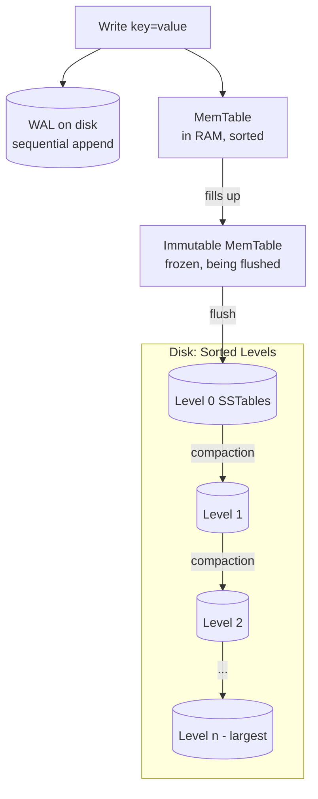
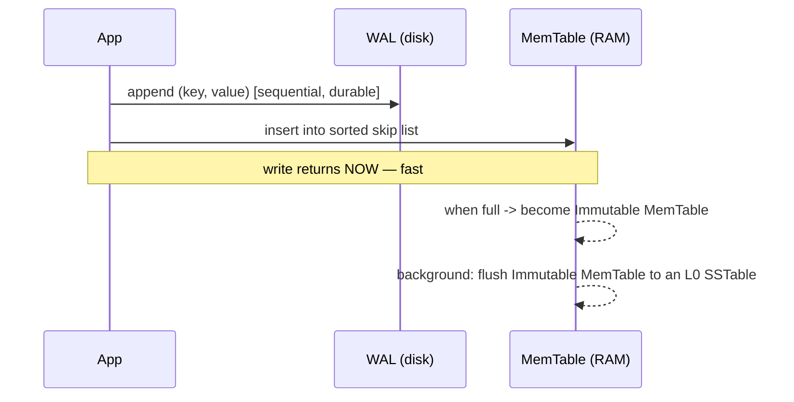
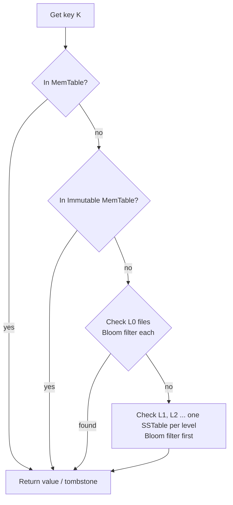
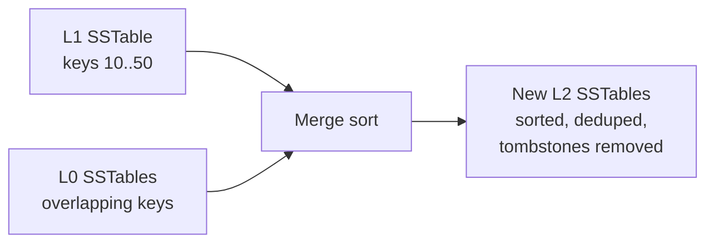

# RocksDB Architecture (LSM-Tree Storage)

**Author:** Ashutosh
**Roll Number:** 24BCS10111
**Topic:** RocksDB Architecture (Topic 4)

---

## Table of Contents

1. [Problem Background](#1-problem-background)
2. [Architecture Overview](#2-architecture-overview)
3. [Internal Design](#3-internal-design)
4. [Design Trade-Offs](#4-design-trade-offs)
5. [Experiments / Observations](#5-experiments--observations)
6. [Key Learnings](#6-key-learnings)
7. [References](#references)

---

## 1. Problem Background

### Why RocksDB exists

Classic databases (InnoDB, PostgreSQL) store data in **B-trees**, which update pages
**in place**. That's great for reads, but every write may turn into a **random write** to
some page on disk. On spinning disks random writes are slow, and even on SSDs they cause
extra wear and write amplification.

RocksDB was built for the opposite priority: **make writes fast, especially on SSDs**, for
workloads that ingest huge volumes of key-value data. It does this with an **LSM-tree**
(Log-Structured Merge tree), where writes are always **sequential appends** and the
expensive reorganizing happens later in the background.

> "Absorb a flood of writes cheaply by turning them into sequential I/O, and pay for
> tidying up later, in the background."

### A bit of history

RocksDB (Facebook/Meta, 2012) is a **fork of Google's LevelDB**, tuned for fast storage
(SSD/flash) and large servers. It's not a full SQL database — it's an **embeddable
key-value storage engine** (a library, like SQLite is a library). It now powers the
storage layer of many systems: MySQL's MyRocks engine, CockroachDB, TiKV, Kafka Streams,
and more.

---

## 2. Architecture Overview

An LSM-tree splits storage into a **fast in-memory part** (where writes land) and a
**sorted on-disk part organized into levels** (where data eventually settles). A
**Write-Ahead Log** protects the in-memory part against crashes.



### Main components

| Component | What it does (plain words) |
|-----------|----------------------------|
| **MemTable** | An in-RAM sorted structure (a skip list) where new writes go first. |
| **Immutable MemTable** | A full MemTable, frozen read-only while a background thread writes it to disk. |
| **WAL** | A sequential on-disk log of every write, so a crash doesn't lose the in-memory MemTable. |
| **SSTable** | "Sorted String Table" — an immutable, sorted file of key-value pairs on disk. |
| **Levels L0…Ln** | SSTables organized into levels; each level is ~10× bigger than the one above. |
| **Bloom Filter** | A tiny probabilistic structure per SSTable that says "this key is **definitely not** here" to skip reads. |
| **Compaction** | Background merging of SSTables to remove dead data and keep levels sorted. |

### Data flow (write, then settle)

A write hits the WAL and the MemTable instantly and returns — **that's the whole write
path on the hot path**. Everything after (freeze → flush to L0 → compact down the levels)
happens **later, in the background**, which is exactly why writes are so cheap.

---

## 3. Internal Design

### 3.1 Write path



1. The write is appended to the **WAL** (sequential, so fast) and inserted into the
   **MemTable**. The call returns immediately.
2. When the MemTable hits its size limit, it's **frozen** into an **Immutable MemTable** and
   a fresh MemTable takes new writes.
3. A background thread **flushes** the immutable MemTable to disk as a new **L0 SSTable**.

Crucially, **updates and deletes are also just appends.** An update writes a new version of
the key; a delete writes a special **tombstone** marker. The old value isn't erased — it's
shadowed by the newer entry and removed later during compaction.

### 3.2 SSTables and levels

An **SSTable** is an immutable file holding key-value pairs **sorted by key**, plus an index
block and a Bloom filter. Because it never changes after being written, it's cheap to read
and to share.

The levels are organized so that data gets more sorted and less redundant as it sinks down:

```
L0:  [sst][sst][sst][sst]      <- freshly flushed; key ranges may OVERLAP each other
L1:  [-------- sorted, non-overlapping --------]    (~10x size of L0)
L2:  [---------------- sorted, non-overlapping ----------------]   (~10x size of L1)
...
Ln:  [------------------------- largest level -------------------------]
```

- **L0 is special:** its SSTables come straight from MemTable flushes, so their key ranges
  can **overlap**. A read may have to check *every* L0 file.
- **L1 and below:** within each level, SSTables have **non-overlapping** key ranges and the
  whole level is sorted. So a read checks **at most one** SSTable per level.

### 3.3 Read path

A read for a key has to look in the most-recent place first and work backwards in time:



Order matters: **MemTable → Immutable MemTable → L0 → L1 → … → Ln**, newest to oldest, so
the first hit is the current value. This is why a read can touch many files — the data for
one key might be spread across several levels until compaction consolidates it.

### 3.4 Bloom filters — skipping reads cheaply

A read could waste a lot of disk I/O checking SSTables that don't contain the key. A
**Bloom filter** is a small in-memory bit-array per SSTable that answers one question very
fast:

- "Is key K **possibly** in this SSTable?" → if the filter says **NO**, K is *definitely*
  not there, so **skip the file entirely** (no disk read).
- If it says **YES**, K is *probably* there (with a small false-positive rate), so we read.

```
Bloom filter says NO  -> 100% certain not present -> skip the SSTable, save a disk read
Bloom filter says YES -> probably present (maybe a false positive) -> read and check
```

This turns "check every level" from many disk reads into mostly cheap in-memory rejections,
which is the single biggest reason LSM reads are tolerable.

### 3.5 Compaction — why and how

Over time, the same key can have many versions scattered across levels, plus tombstones for
deleted keys. **Compaction** is the background process that **merges SSTables**, keeps only
the newest version of each key, drops tombstoned keys, and writes fresh, non-overlapping
SSTables into the next level down.



**Why compaction is required:**
- Without it, reads would have to check more and more overlapping files → reads get slower.
- Dead/old versions and tombstones would never be reclaimed → space wasted.

**Two common strategies (the central tuning knob):**

| Strategy | How it works | Optimizes | Costs |
|----------|--------------|-----------|-------|
| **Leveled** (default) | Keep each level sorted & non-overlapping; merge a file down into the next level | Low **read** & **space** amplification | High **write** amplification (data rewritten many times as it sinks) |
| **Universal / Tiered** | Let files pile up; merge several similar-sized files together less often | Low **write** amplification | Higher **read** & **space** amplification |

This is the heart of LSM tuning — you pick *which amplification you can afford to pay*.

### 3.6 Durability and crash recovery

The MemTable lives in volatile RAM, so on its own a crash would lose recent writes. The
**WAL** prevents that: every write is appended to the WAL before being acknowledged. On
restart, RocksDB **replays the WAL** to rebuild the MemTable's lost contents. Once a MemTable
is safely flushed to an SSTable, the WAL segment covering it is no longer needed and is
deleted. SSTables themselves are immutable, so they're never left half-written.

---

## 4. Design Trade-Offs

### The three amplifications (the LSM vocabulary)

- **Write amplification** — bytes actually written to disk ÷ bytes the user wrote. LSM rewrites
  data during compaction, so this is **> 1** (often the dominant cost in leveled compaction).
- **Read amplification** — disk reads needed to answer one lookup. A key may live in several
  levels, so a read can touch many files (Bloom filters reduce this a lot).
- **Space amplification** — disk used ÷ live data size. Old versions and tombstones occupy
  space until compaction reclaims them.

You **cannot minimize all three at once** — improving one usually worsens another (the
"RUM conjecture": Read, Update, Memory — pick your trade-off).

### Advantages
- **Very fast writes** — every write is a sequential WAL append + an in-RAM insert. Random
  writes become sequential I/O, which is ideal for SSDs and write-heavy ingestion.
- **Great compression** — immutable, sorted SSTables compress well block-by-block.
- **Tunable** — pluggable compaction strategies let you trade read/write/space amplification.
- **Embeddable** — a library, no server; the storage engine for MyRocks, CockroachDB, TiKV.

### Limitations
- **Reads can be expensive** — a single key may require checking the MemTable plus several
  SSTables across levels (Bloom filters help, but range scans still touch many files).
- **Compaction is costly** — it consumes CPU, disk bandwidth, and causes I/O spikes; if it
  can't keep up, writes get **stalled/throttled**.
- **Write amplification** — under leveled compaction the same data is rewritten many times as
  it migrates down the levels.
- **Space overhead until compaction** — dead versions and tombstones linger.

### Engineering decisions (the "why")

| Decision | Reason |
|----------|--------|
| Buffer writes in a MemTable, append to WAL | Make writes cheap and sequential; defer the hard part |
| Immutable, sorted SSTables | Crash-safe (never overwritten), compress well, easy to merge |
| Bloom filter per SSTable | Skip disk reads for keys that aren't present — rescue read latency |
| Background compaction with choosable strategy | Let the operator pick which amplification to pay |

### Comparison with B-tree engines (e.g. InnoDB / PostgreSQL)

| | LSM-tree (RocksDB) | B-tree (InnoDB / Postgres) |
|---|--------------------|----------------------------|
| Writes | Sequential append, very fast | In-place page update, more random I/O |
| Reads (point) | May touch several files | Usually one tree traversal |
| Deletes | Tombstone now, reclaim later | Update the page in place |
| Background work | Compaction | VACUUM (Postgres) / purge (InnoDB) |
| Best for | Write-heavy ingestion | Read-heavy / mixed transactional |

---

## 5. Experiments / Observations

> Recommended exercise: run `db_bench` (RocksDB's benchmark tool) and watch write, read,
> and space amplification under different compaction strategies. Outputs below are
> illustrative — they show the *shape* and the *trends* to look for.

### 5.1 A write-heavy fill benchmark

```bash
./db_bench --benchmarks=fillrandom --num=10000000 --value_size=100
```

```
fillrandom : 1.85 micros/op  540,000 ops/sec;  ~51.5 MB/s
```

Random *writes* are fast because each one is just a WAL append + MemTable insert — RocksDB
isn't doing random disk seeks on the write path.

### 5.2 Leveled vs Universal compaction — the amplification trade-off

Same workload, two compaction styles (illustrative numbers showing the *direction*):

```
Compaction = Leveled (default)
  Write amplification : ~12x      <- data rewritten many times sinking through levels
  Space amplification : ~1.1x     <- tight, little wasted space
  Read (point lookup) : fast      <- at most one SSTable per level

Compaction = Universal
  Write amplification : ~4x       <- merged less often, written fewer times
  Space amplification : ~1.8x     <- more old versions linger
  Read (point lookup) : slower    <- more overlapping files to check
```

The takeaway you can *see* in the numbers: **leveled trades write amplification for low
space + good reads; universal trades space + reads for low write amplification.** You choose
based on whether your bottleneck is disk writes/wear or read latency/space.

### 5.3 Bloom filters at work

```bash
./db_bench --benchmarks=readrandom --bloom_bits=10
# vs
./db_bench --benchmarks=readrandom --bloom_bits=0   # filters disabled
```

```
readrandom (bloom on,  10 bits/key): 4.2 micros/op   (most missing keys skip disk)
readrandom (bloom off):              31.8 micros/op   (every lookup probes SSTables)
```

With Bloom filters on, lookups for **non-existent** keys are rejected in RAM and never touch
disk — roughly an order-of-magnitude difference on read-miss-heavy workloads.

### 5.4 Observed behavior summary

- Writes stay cheap and steady because the hot path is just WAL + MemTable.
- Compaction shows up as periodic background CPU/IO; if writes outrun it, throughput **stalls**.
- Bloom filters dramatically cut read cost for absent keys.
- The chosen compaction strategy visibly shifts *which* amplification you pay.

---

## 6. Key Learnings

1. **LSM trees win on writes by deferring work.** A write is just a sequential WAL append +
   an in-memory insert; all the sorting and cleanup is pushed to background compaction. That
   deferral is the entire idea.

2. **Everything is an append, even deletes.** Updates write a new version; deletes write a
   **tombstone**. Nothing is erased on the hot path — old data is reclaimed later by compaction.

3. **Reads are the price you pay.** A key can live across the MemTable and several levels, so a
   lookup may check many files. **Bloom filters** are what make this practical by skipping
   files that definitely don't hold the key.

4. **Compaction is mandatory, not optional.** Without it, reads slow down (too many overlapping
   files) and space leaks (dead versions never reclaimed). But compaction itself costs CPU and
   I/O — and can stall writes if it falls behind.

5. **You can't beat all three amplifications.** Write, read, and space amplification trade off
   against each other; the compaction strategy is how you choose which one to pay (leveled =
   low space/read but high write amp; universal = low write amp but higher space/read).

6. **LSM vs B-tree is a workload choice.** RocksDB-style LSM shines on write-heavy ingestion;
   B-tree engines like InnoDB/Postgres shine on read-heavy/transactional work. Both ultimately
   need background cleanup — compaction here, VACUUM/purge there.

---

## References

- RocksDB Wiki — *RocksDB Overview* and *RocksDB Architecture*
  https://github.com/facebook/rocksdb/wiki/RocksDB-Overview
- RocksDB Wiki — *Leveled Compaction* and *Universal Compaction*
  https://github.com/facebook/rocksdb/wiki/Compaction
- RocksDB Wiki — *MemTable*, *SST File Formats*, and *Write Ahead Log*
  https://github.com/facebook/rocksdb/wiki/MemTable
- RocksDB Wiki — *Bloom Filters*
  https://github.com/facebook/rocksdb/wiki/RocksDB-Bloom-Filter
- RocksDB Wiki — *Benchmarking Tools (db_bench)*
  https://github.com/facebook/rocksdb/wiki/Benchmarking-tools
- P. O'Neil et al., *The Log-Structured Merge-Tree (LSM-Tree)* (1996) — the original idea
- M. Athanassoulis et al., *Designing Access Methods: The RUM Conjecture* (2016)
