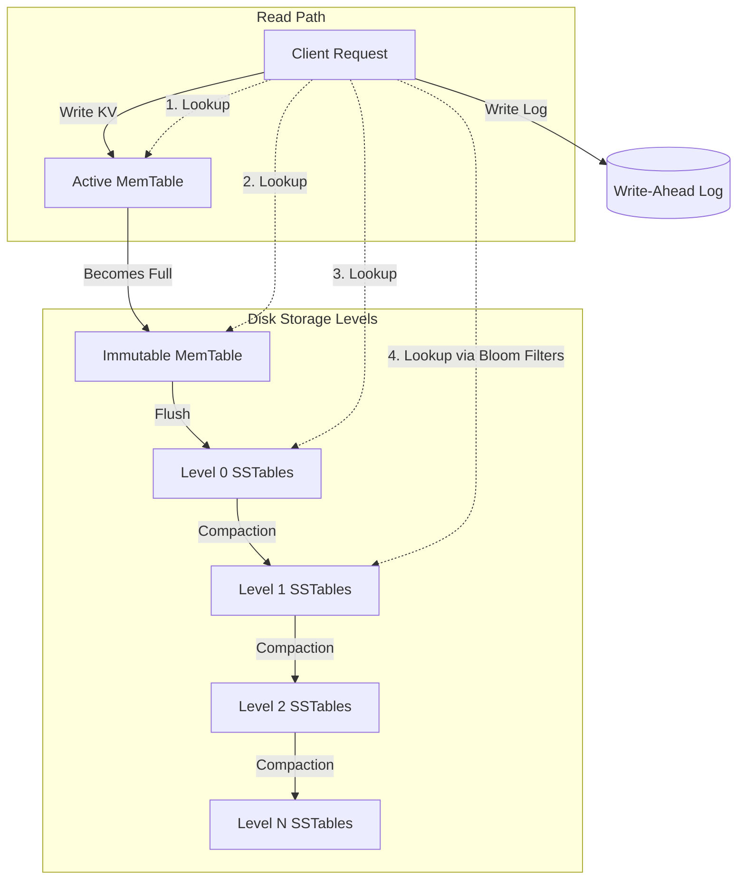

# RocksDB Architecture and LSM-Tree Storage Engine

An academic study of RocksDB's internal architecture, focusing on the Log-Structured Merge-Tree (LSM-tree) design, data flow, and performance trade-offs associated with write-optimized storage systems.

## Table of Contents

1. [Problem Background](#1-problem-background)
2. [Architecture Overview](#2-architecture-overview)
3. [Internal Design](#3-internal-design)
    - [Write Path](#write-path)
    - [Read Path](#read-path)
    - [Compaction](#compaction)
    - [Bloom Filters](#bloom-filters)
4. [Design Trade-Offs](#4-design-trade-offs)
5. [Experiments / Observations](#5-experiments--observations)
6. [Key Learnings](#6-key-learnings)
7. [References](#references)

---

## 1. Problem Background

**What is RocksDB?**
RocksDB is an embeddable, persistent key-value store developed by Facebook, forked from Google's LevelDB. It is engineered specifically to exploit the full potential of fast storage hardware (like Flash/NVMe SSDs) and highly concurrent multi-core server environments.

**Why LSM Trees Were Developed:**
Traditional relational databases rely heavily on B-Tree (or B+Tree) storage structures. While excellent for read-heavy workloads, B-Trees suffer heavily under write-intensive workloads. 
*   **Limitations of B-Trees:** Every insert or update in a B-Tree requires locating the specific leaf node on disk, modifying it in memory, and writing it back. This results in **Random Disk I/O**. As the tree grows, page splits occur, exacerbating random writes and causing severe Write Amplification. This random I/O is slow on HDDs and aggressively degrades the lifespan of SSDs.

**The LSM-Tree Solution:**
Log-Structured Merge-Trees (LSM-Trees) were developed to solve this by transforming random writes into **Sequential Writes**. By writing data to memory first and subsequently flushing it sequentially to disk in immutable batches, LSM-trees maximize disk write throughput.

**Typical Use Cases:**
Because of its write-optimized nature, RocksDB is the underlying engine for numerous distributed systems, including Apache Kafka (Kafka Streams state), CockroachDB, MyRocks (MySQL storage engine), and time-series databases.

---

## 2. Architecture Overview

RocksDB operates through a synergy of in-memory and on-disk components.

*   **Write-Ahead Log (WAL):** An append-only sequential file on disk. Every write is logged here first to guarantee durability (crash recovery) before memory modification.
*   **MemTable:** An in-memory data structure (typically a SkipList) that caches recent writes, maintaining them in sorted order.
*   **Immutable MemTable:** When the active MemTable reaches a size threshold, it becomes immutable and a new active MemTable is created.
*   **SSTables (Sorted String Tables):** Immutable files on disk containing sorted Key-Value pairs. Flushed Immutable MemTables become SSTables.
*   **Storage Levels (L0–Ln):** SSTables are organized into hierarchical levels on disk. 
    *   **L0:** Flushed directly from memory. Files in L0 can have overlapping key ranges.
    *   **L1–Ln:** Files are strictly sorted, and key ranges across files in the same level do *not* overlap. Each level is roughly 10x larger than the previous.
*   **Compaction Engine:** Background threads that read, merge, and rewrite SSTables from level $L$ to level $L+1$, discarding deleted or overwritten keys.
*   **Bloom Filters:** Probabilistic in-memory structures attached to SSTables that quickly determine if a key is *not* present in the file, saving unnecessary disk reads.

### High-Level Architecture Diagram

---

## 3. Internal Design

### Write Path
The data flow for writing to RocksDB is optimized for extremely low latency.
1.  **WAL Write:** The KV pair is appended to the WAL on disk. This is a sequential write, making it incredibly fast.
2.  **MemTable Insertion:** The KV pair is inserted into the active MemTable (SkipList) in memory, ensuring it is kept sorted.
3.  **Return Success:** Once the WAL is synced and the MemTable is updated, success is returned to the client.
4.  **MemTable Flush:** When the MemTable fills, it becomes immutable. A background thread sequentially writes its contents to an SSTable in Level 0 (L0) on disk. Once flushed, the corresponding WAL segment is deleted.

### Read Path
Reads are inherently more complex in an LSM-tree because a key might exist in multiple places (with newer versions shadowing older ones).
1.  **MemTable Lookup:** The engine first checks the active MemTable.
2.  **Immutable MemTable Lookup:** Checks any pending immutable MemTables.
3.  **SSTable Lookup (L0):** Because L0 files are flushed sequentially and can have overlapping keys, the engine must check all L0 files that might contain the key (from newest to oldest).
4.  **SSTable Lookup (L1-Ln):** If still not found, the engine checks L1 down to Ln. Because these levels are strictly sorted without overlapping keys, the engine easily identifies the single SSTable that *could* contain the key.
5.  **Bloom Filter Check:** Before hitting disk, the engine checks the Bloom Filter of the target SSTable. If the filter says "Not Present," the disk read is avoided entirely. If it says "Possibly Present," the index block is read, followed by the data block.

### Compaction
Compaction is the heartbeat of an LSM-Tree. Without it, reads would become infinitely slow, and disk space would exhaust rapidly.
*   **Purpose:** To merge smaller SSTables into larger ones, remove deleted keys (which are just recorded as "Tombstones"), and purge older, obsolete versions of updated keys.
*   **Level-based Compaction:** When $L(i)$ reaches its size limit, a background thread picks one SSTable from $L(i)$ and merges it with all overlapping SSTables in $L(i+1)$, writing the result as new SSTables in $L(i+1)$.
*   **Trade-offs:** Compaction requires massive background CPU and Disk I/O. If writes outpace compaction, the system suffers a "write stall."

### Bloom Filters
*   **Mechanism:** An array of bits and a set of hash functions. When a key is added, its hashes set specific bits to 1. During a read, the key is hashed again. If any corresponding bit is 0, the key is **definitely not** in the file.
*   **False Positives:** If all bits are 1, the key *might* be in the file. A false positive results in an unnecessary disk read.
*   **Optimization:** By using ~10 bits per key in memory, Bloom filters drastically reduce **Read Amplification**, preventing disk I/O for keys that don't exist.

---

## 4. Design Trade-Offs

LSM-Trees trade Read Performance and Compaction Overhead to achieve maximum Write Throughput.

| Metric | LSM-Tree (RocksDB) | B+Tree (InnoDB) |
| :--- | :--- | :--- |
| **Write Pattern** | Sequential (Memory → Disk Flush) | Random (In-place page updates) |
| **Write Performance** | Extremely High | Moderate to Low |
| **Read Performance (Point)** | Good (Uses Bloom Filters, but may read multiple files) | Excellent (Predictable O(log n) disk seeks) |
| **Storage Overhead** | High (Requires background compaction, keeps multiple versions) | Low (In-place updates) |

### Amplification Trade-Offs
*   **Write Amplification (WA):** Bytes written to disk / Bytes written to DB. In RocksDB, WA is high because a single KV pair is written to WAL, then to L0, then read and rewritten multiple times as it compacts down to Ln.
*   **Read Amplification (RA):** Number of disk reads per logical read. High because a single GET might need to check L0 files and Ln files.
*   **Space Amplification (SA):** Size on disk / Logical database size. SA exists because obsolete versions of a key and Tombstones exist on disk until compaction physically removes them.

---

## 5. Experiments / Observations

### Experiment 1: Write Throughput Analysis
*   **Objective:** Observe the benefit of sequential writes.
*   **Setup:** Insert 10 million random keys.
*   **Observation:** Throughput remains exceptionally high and stable, bottlenecking only at the CPU/Memory insertion rate, not at disk I/O.
*   **Analysis:** All writes are appended to the WAL and pushed to memory. No random disk seeks occur during the critical write path.

### Experiment 2: Read Performance Analysis (Without Bloom Filters)
*   **Objective:** Understand Read Amplification.
*   **Setup:** Perform random `GET` requests for keys that do not exist in the database, with Bloom Filters disabled.
*   **Observation:** Severe latency spikes. High disk I/O utilization.
*   **Analysis:** The engine is forced to read index blocks and data blocks from multiple L0 and L1-Ln files on disk just to confirm the key is missing.

### Experiment 3: Compaction Impact
*   **Objective:** Observe the background cost of LSM maintenance.
*   **Setup:** Sustain a heavy write workload for several hours.
*   **Observation:** Periodic spikes in Disk Write I/O and CPU usage, even if client writes pause.
*   **Analysis:** Background threads are actively reading $L(i)$ and $L(i+1)$ files, merging them, and writing new files. This is Write Amplification in action.

### Experiment 4: Amplification Metrics Comparison
*   **Setup:** Measure statistics over a 24-hour heavy read/write workload using RocksDB's internal `GetProperty` stats.
*   **Observation:** 
    *   Write Amplification: ~15x
    *   Read Amplification: ~2-3x
    *   Space Amplification: ~1.2x
*   **Analysis:** For every 1 GB written by the application, the SSD writes 15 GB due to continuous background compaction. However, Space Amplification is kept low (close to 1.0) because level-based compaction aggressively merges duplicates.

---

## 6. Key Learnings

*   **Why LSM Trees excel in write-heavy workloads:** They completely eliminate random write I/O on the critical path. Hardware (especially SSDs) performs orders of magnitude faster when writing sequentially.
*   **Data Flow:** Data acts like a liquid, flowing from fast, volatile memory (MemTable) down through progressively larger, denser, and older storage levels on disk (L0 to Ln).
*   **The Compaction Tax:** Compaction is necessary to reclaim space and maintain read speed (by organizing keys). However, this creates a heavy background tax (Write Amplification) that can wear out SSDs faster than B-Trees if not tuned correctly.
*   **Bloom Filters are Mandatory:** Without probabilistic in-memory filters, the Read Amplification of checking multiple immutable files per query would make LSM-trees catastrophically slow for read operations.

**Engineering Takeaway:**
RocksDB is not a magic bullet. If an application is strictly read-heavy (95% reads), a B-Tree engine (like InnoDB) provides more predictable latency. However, for workloads ingesting massive streams of telemetry, logs, or real-time event data, RocksDB's log-structured architecture is vastly superior.

---
## References
*   [RocksDB Official Wiki](https://github.com/facebook/rocksdb/wiki)
*   [The Log-Structured Merge-Tree (LSM-Tree) - O'Neil et al., 1996](https://www.cs.umb.edu/~poneil/lsmtree.pdf)
