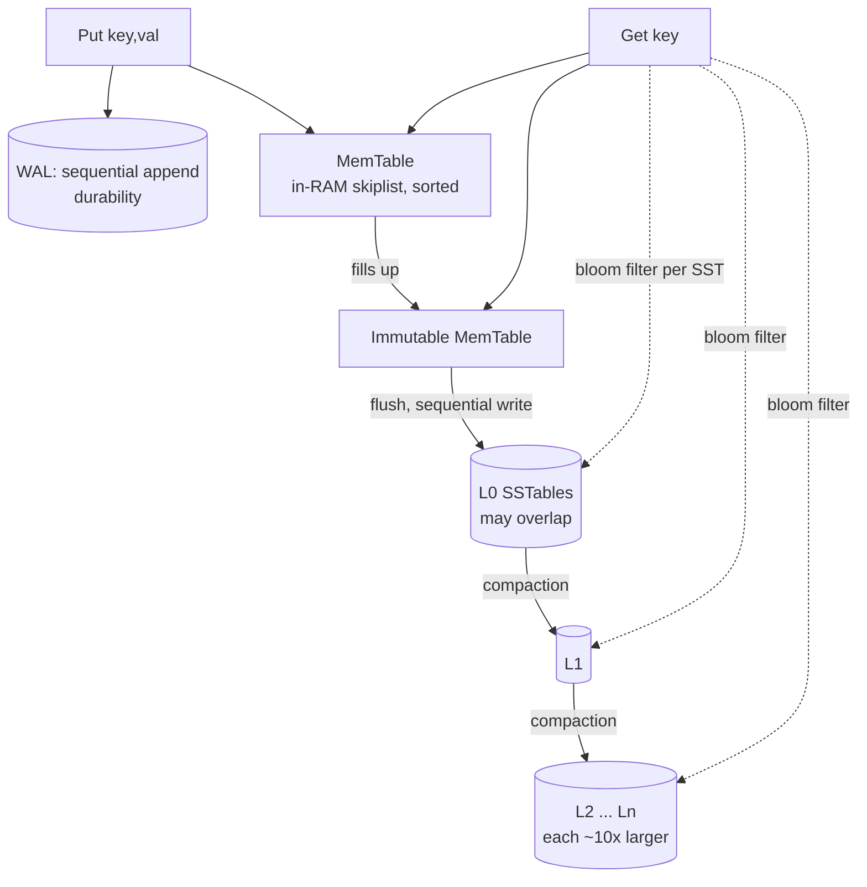

# RocksDB — LSM-Tree Storage Architecture

> RocksDB makes the opposite wager from every B-tree engine in this repo. A B-tree mutates data **in place** (random writes, read-optimized). RocksDB **never mutates in place** — it only ever *appends*, then tidies up later in the background. That one decision is what makes it write-optimized and is the root of every trade-off below. I measured all three amplifications (write / read / space) on a live **RocksDB 11.1.1** instance with a small C++ program linked against `librocksdb` (`amp_bench.cpp`); the raw output sits in `bench_results.txt` and `bench_natural.txt`.

> Context: the LSM design studied here is also the storage model behind a from-scratch MiniDB engine (Track C: LSM), so this writeup doubles as the theory underpinning that kind of build.

---

## 1. Problem Background

LSM-trees (Log-Structured Merge-tree, O'Neil et al. 1996) exist because of a single hardware fact: **sequential writes are dramatically faster than random writes**, on spinning disks *and* on SSDs (and on flash, random writes additionally cause wear and trigger garbage collection). A B-tree that updates a row in place is forced into a **random write** to wherever that page sits. Under a write-heavy workload — metadata stores, time-series, message queues, write-back caches — that random I/O turns into the bottleneck.

RocksDB (Facebook, 2012; forked from Google's LevelDB) responds: *convert every write into a sequential append and settle the cost later, in the background, in bulk.* It's an embedded key-value library (the same deployment model as SQLite, but an entirely different storage engine) and serves as the backend beneath MyRocks, CockroachDB, TiKV, Kafka Streams, and many more.

---

## 2. Architecture Overview



**Write path:** append to the WAL (crash safety) → insert into the in-memory **MemTable** (a sorted skiplist). Once the MemTable fills, it turns **immutable**, a fresh one takes over, and the immutable one is **flushed** to disk as a sorted, immutable **SSTable** at **L0**. Every disk write is sequential.

**Read path:** consult MemTable → immutable MemTable → L0 SSTables → L1 → … → Ln, newest to oldest, halting at the first hit. Since a key may exist in several places, each read first checks a per-SSTable **Bloom filter** to skip files that definitely lack the key.

**Compaction** is the background job that merges SSTables from level *Lk* down into *Lk+1*, discarding overwritten and deleted keys while keeping each level sorted and size-bounded. It's what stops reads and space from degrading — and it's the principal cost of the LSM design.

---

## 3. Internal Design

### 3.1 MemTable & WAL
A write lands in two places: the **WAL** (so a crash before the flush loses nothing) and the **MemTable** (a sorted skiplist for fast ordered access). In my run, 1M puts produced **124 MB of WAL** and **109.9 MB of flushed data** at L0 — both entirely sequential.

### 3.2 SSTables (Sorted String Tables)
An SSTable is an **immutable** on-disk file of key→value pairs **sorted by key**, carrying a block index and a Bloom filter inside it. Immutability is the defining trait: files are only ever created and deleted, never edited. That's what reduces flushes and compactions to pure sequential I/O and keeps concurrency simple (readers never glimpse a half-written file).

### 3.3 The level structure (L0 → Ln)
- **L0** holds files flushed straight out of MemTables; they **can overlap** in key range (a key may appear in several L0 files).
- **L1…Ln**: inside each of these levels, key ranges are **non-overlapping**, and every level is roughly **10× larger** than the one above it.

Captured natural level distribution (leveled compaction, no forced full compaction):
```
Level Files Size(MB)
  0      2       7       <- fresh flushes, overlapping
  5      9      34
  6     15      56       <- bottom level holds the bulk of the data
```
With a key in at most one file per level (L1+), read work is bounded; L0 overlap stays bounded by kicking off compaction once a handful of L0 files accumulate.

### 3.4 Bloom filters — the read-path saver
Lacking Bloom filters, a point lookup for a missing key would have to inspect an SSTable at *every* level. A **Bloom filter** (here 10 bits/key) is a compact probabilistic set: it answers either *"definitely not here"* (skip the file, no disk read) or *"maybe here"* (must check). It never returns a false negative. Measured impact across 100k lookups (80% targeting missing keys):
```
bloom filter useful (skips): 158546    <- file checks the bloom answered as "not present"
bloom full-positives:         21088    <- bloom said "maybe", key really was there
data blocks read from disk:   62022
```
The Bloom filter wiped out **~159k** would-be SSTable probes — without it, each of those negative lookups would fan out across L0/L5/L6 and pound the disk.

### 3.5 Compaction
Compaction merges overlapping/adjacent SSTables, throws away superseded versions and tombstones (deletes), and writes fresh non-overlapping files one level down. It's *why* the engine stays fast, and it's the dominant background cost. Two strategies, both measured below:
- **Leveled** (default): keeps each level strictly non-overlapping → low space amplification, low read amplification, **higher write amplification** (data gets rewritten as it sinks through levels).
- **Universal** (tiered): merges similarly-sized files lazily → **lower write amplification**, but higher space and read amplification.

---

## 4. Design Trade-Offs — the amplification triangle

The central idea in LSM tuning is **the RUM trade-off**: you can't minimize Read, Update (write), and Memory/space amplification simultaneously — pushing one down pushes another up. I measured all three. Two configurations of the *same* 1M-key workload:

| | Leveled (settled) | Leveled (natural) | Universal (natural) |
|---|---|---|---|
| Write amplification | **3.75×** | 2.36× | **2.36 / 3.21×** |
| Space amplification | **1.00×** | **1.99×** | 1.63× |
| Compaction bytes written | 301 MB | 149 MB | 148 MB |

Reading this table *is* the whole lesson:

- **Write amplification** = bytes actually written to storage ÷ logical bytes from the app. My 109 MB of user data drove **301 MB** of compaction writes once fully compacted (3.75×): each key is rewritten several times as it migrates L0→…→L6. That's the cost of the LSM design — but those writes are **sequential**, which is the entire point.
- **Space amplification** = on-disk size ÷ live data size. In the *natural* (steady-state) run, on-disk was **1.99×** the live data — older, overwritten versions hadn't been compacted away yet. After **forcing full compaction**, on-disk fell to exactly the live data (**1.00×**).
- **The trade-off, in one comparison:** forcing full compaction pulled space amp from 1.99× → **1.00×** but drove write amp from 2.36× → **3.75×**. *You spend extra writes to win back space.* That's the LSM tuning knob in miniature.
- **Leveled vs Universal:** universal performed **less** compaction write work (write amp 3.21× against leveled's 3.75× when settled) yet left **more** space slack and overlapping files (more to read). Write-heavy + space-tolerant → universal; read/space-sensitive → leveled.

**Read amplification** is the third corner: a point read may touch the MemTable plus several SSTables across levels, so reads do more work than a B-tree's single root-to-leaf descent. Bloom filters (§3.4) are what keep that in check — they convert "check every level" into "check only the level(s) that might actually hold the key."

**vs B-trees (every other engine in this repo).** B-tree: read-optimized (one descent), write-heavy (random in-place writes), low space amp. LSM: write-optimized (sequential appends), read-amplified (multi-level + bloom), tunable space amp. The same data-structure-vs-workload trade-off, with the default flipped.

---

## 5. Experiments / Observations

Workload: 1,000,000 `Put`s of 15-byte keys / 100-byte values in random key order (≈110 MB logical), no compression (to isolate amplification from compression), 8 MB MemTable to force many flushes.

1. **Writes are sequential and amplified.** 109.9 MB flushed to L0 + 301.7 MB of compaction writes = **3.75× write amplification** under leveled compaction. The engine traded extra total bytes for the guarantee that every one of those bytes was written sequentially.
2. **Space amplification is a dial, not a constant.** Steady-state leveled = **1.99×** on disk; after `CompactRange` (force full compaction) = **1.00×**. Same data, a different point on the trade-off curve.
3. **Leveled vs universal, side by side.** Universal wrote ~50 MB less during compaction (write amp 3.21× vs 3.75×) but held a higher space amp — exactly the documented behavior of tiered vs leveled.
4. **Bloom filters rule the read path.** Across 100k lookups (mostly misses), the Bloom filter skipped **~159k** SSTable probes. Of the lookups, ~21k were "full positives" (the key really was present) — i.e. Bloom's false-positive rate was low and most of the disk reads it allowed were productive.
5. **Levels behave as advertised.** The natural run spread data across L0 (fresh, overlapping), L5, and L6, with L6 carrying the bulk (56 MB of 87 MB) — the classic pyramid where the bottom level dwarfs everything above.

> Note on method: Homebrew's `rocksdb` ships the library but not the `db_bench` tool, so I wrote a focused benchmark directly against `librocksdb` using RocksDB's own `Statistics` tickers (`COMPACT_WRITE_BYTES`, `FLUSH_WRITE_BYTES`, `BLOOM_FILTER_USEFUL`) and `GetIntProperty` (`total-sst-files-size`, `estimate-live-data-size`). Those are the very counters `db_bench` reports.

---

## 6. Key Learnings

1. **"Never update in place" is the entire design.** Append to a MemTable, flush to immutable SSTables, repair it later through compaction. Everything else — write amplification, compaction, bloom filters — follows from that one choice.
2. **Write amplification is the price you accept for sequential writes.** 3.75× more bytes written, but all of them sequential — a great bargain on SSDs/HDDs where random writes are the real enemy. That's why LSM dominates write-heavy workloads.
3. **The three amplifications genuinely trade against each other.** I watched forcing compaction push space amp 1.99×→1.00× while write amp moved 2.36×→3.75×. No single setting is best at all three; you tune to your workload (leveled for read/space, universal/tiered for writes).
4. **Compaction is both the hero and the tax.** It reclaims space and keeps reads bounded, yet it's the dominant background I/O — and it contends with foreground traffic, which is why compaction tuning is most of what RocksDB operations comes down to.
5. **Bloom filters are what make LSM reads viable.** Without them, every negative lookup would touch every level. With a 10-bit filter, ~159k probes simply disappeared. They turn the LSM's inherent read amplification from "check everything" into "check almost nothing."
