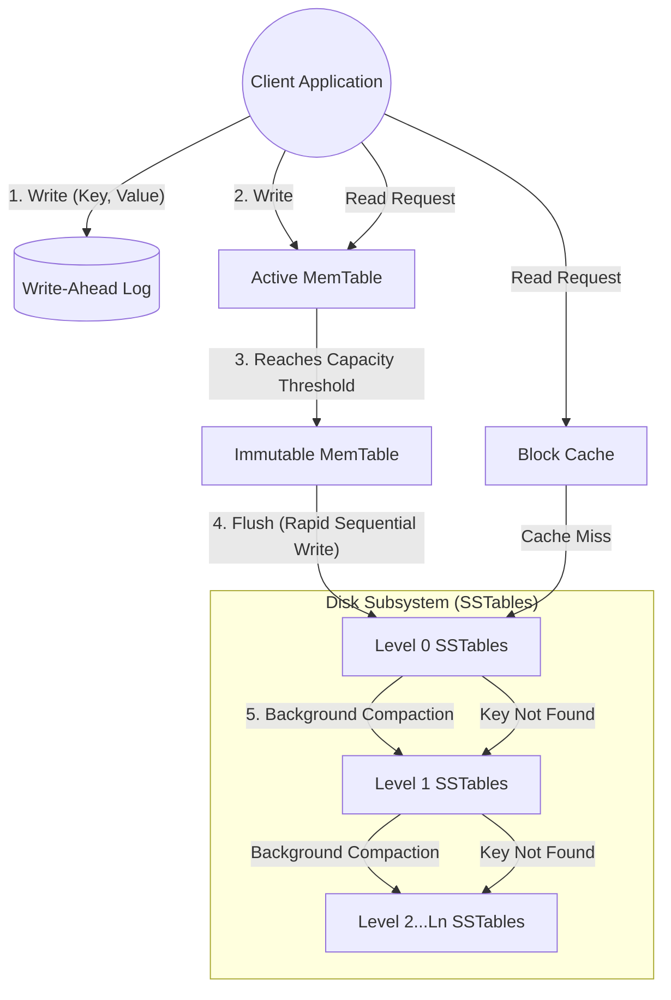

# RocksDB System Architecture Analysis

**Name:** Ojas Maheshwari  
**Roll:** 24BCS10227

## 1. Problem Background

### Historical Context & Motivation
For generations, industry-standard relational databases like PostgreSQL and MySQL/InnoDB have steadfastly depended on **B-Tree (or B+Tree)** variants to power their storage engines. Although B-Trees consistently deliver stellar read performance ($O(\log N)$) and natively support highly efficient range queries, they suffer from a crippling limitation when subjected to relentlessly write-heavy workloads: severe **Write Amplification** triggered primarily by chaotic random I/O. 

Whenever a minor piece of data is modified within a B-Tree, the entire block (usually 4KB or 8KB) must be physically read from the disk, altered in memory, and subsequently written back. On traditional hard drives (HDDs), random writes are notoriously punishing due to mechanical seek times. With the rapid proliferation of extremely fast flash storage (SSDs) and dense multi-core processors, engineers at Facebook deduced that existing storage engines—including Google's LevelDB—were utterly failing to fully exploit the raw potential of modern hardware. 

### The RocksDB Solution
**RocksDB** was aggressively engineered by Facebook to serve as an embedded, highly persistent key-value store rigorously optimized for modern, high-speed storage environments. It directly solves the chronic problem of high write-latency and structural write-amplification inherent in B-Trees by implementing a radical **Log-Structured Merge (LSM) Tree** architecture. Instead of agonizingly performing in-place updates, RocksDB elegantly buffers massive streams of writes entirely in memory, subsequently flushing them sequentially to disk. This profoundly transforms scattered random writes into blistering sequential writes. This architecture is considered virtually mandatory for systems tasked with ingesting massive real-time data streams, such as high-frequency time-series databases, complex graph databases, and relentless event-logging networks.

---

## 2. Architecture Overview

RocksDB operates exclusively as an embedded database, meaning it is compiled directly into the host application's memory space, decisively eschewing the traditional client-server process model overhead. The primary data pipeline revolves entirely around the LSM-tree.

### Core System Components
1. **MemTable:** An exceptionally fast in-memory data structure (most commonly a SkipList) where every single active write and update is instantly deposited.
2. **Write-Ahead Log (WAL):** A strictly append-only sequence log dwelling on disk that unilaterally guarantees durability. Every write accepted by the MemTable is simultaneously appended to the WAL to absolutely prevent data loss in the event of a catastrophic crash.
3. **Immutable MemTable:** Once the primary MemTable hits a predefined capacity threshold, it is firmly sealed and designated as read-only, patiently awaiting an imminent flush to disk. A fresh MemTable is instantaneously spun up to absorb incoming writes.
4. **SSTables (Sorted String Tables):** The immutable, highly optimized persistent file format utilized to store finalized data on disk. They are rigorously organized into cascading hierarchical levels (L0, L1, ..., Ln).
5. **Block Cache:** An ultra-fast in-memory LRU cache actively populated with recently fetched, uncompressed data blocks to drastically accelerate read operations.

### Data Flow Execution Model

---

## 3. Internal Design & Mechanics

### 3.1. Storage Structures (LSM Trees)
Radically departing from B-Trees that destructively update data in-place, RocksDB intrinsically treats all modifications (Inserts, Updates, and even Deletes) as strictly **appends**. A delete operation simply injects a "tombstone" marker associated with the target key. The physical data is logically cascaded across multiple distinct levels:
*   **Level 0 (L0):** Generated exclusively by flushing Immutable MemTables. SSTables residing in L0 are unique in that they can have completely overlapping key ranges, as they are flushed directly from volatile memory over sequential time periods.
*   **Level 1 to Level N:** SSTables localized in these deeper levels are strictly and rigorously partitioned. Absolutely no two SSTables residing within the exact same level will ever possess overlapping key ranges.

### 3.2. The Compaction Engine
To actively prevent the disk from suffocating under the weight of obsolete data versions and rampant tombstones, RocksDB continuously executes a heavily multithreaded background daemon called **Compaction**.
Compaction methodically selects specific SSTables from Level $i$, aggressively merges them with overlapping SSTables dwelling in Level $i+1$, permanently purges deleted keys, definitively resolves older versions down to the singular latest version, and finally writes out immaculate new SSTables to Level $i+1$. This highly sophisticated process rigorously controls Space Amplification and massively improves Read Performance, albeit at the measurable cost of elevated CPU and Disk I/O consumption.

### 3.3. Read Path and Index Optimization
Retrieving data from an LSM tree is, by fundamental design, inherently slower than writing. To successfully pinpoint a key, RocksDB is forced to meticulously search:
1. The Active MemTable
2. All Immutable MemTables
3. Level 0 SSTables (mandating checks across all potentially overlapping files)
4. Level 1 cascading down to Level N SSTables

**Bloom Filters:** To violently curtail the need to read completely unnecessary SSTables directly from the slow disk, RocksDB intelligently embeds probabilistic Bloom Filters within the SSTables. A properly tuned Bloom Filter can inform the engine with 100% absolute certainty if a key is definitively *not* present within a file, allowing the system to instantly bypass devastatingly expensive disk reads.
**Index Blocks:** Every individual SSTable is equipped with a dedicated index block (which is aggressively loaded into memory) designed to execute a lightning-fast binary search to isolate the exact data block physical offset for any specific key range.

### 3.4. Concurrency and Transaction Processing
RocksDB comprehensively supports **MVCC (Multi-Version Concurrency Control)**. Every discrete write is uniquely branded with a strictly monotonically increasing Sequence Number. Readers purposefully utilize a Snapshot (representing a highly specific sequence number) to perceive a perfectly consistent state of the database, cleanly isolating them from chaotic concurrent writes. Because writes deliberately never overwrite existing data, readers never, under any circumstances, block writers, and writers conversely never block readers.

---

## 4. Design Trade-Offs

The foundational architecture of RocksDB is rigorously governed by the uncompromising **RUM Conjecture**, which definitively states that any database engine can successfully optimize for a maximum of two out of three critical factors: **R**ead Overhead, **U**pdate (Write) Overhead, and **M**emory/Storage Overhead.

| Architectural Feature | Primary Advantage | Limitation / Engineering Trade-Off |
| :--- | :--- | :--- |
| **LSM Tree Storage** | Delivers staggering write throughput entirely due to sequential disk I/O. | **Read Amplification:** Reads are frequently forced to interrogate multiple SSTables distributed across varying levels. |
| **Compaction Engine** | Ruthlessly reclaims space (purging tombstones) and dramatically streamlines read paths. | **Write Amplification:** Data is computationally rewritten numerous times as it cascades down levels, triggering notable CPU/I/O spikes. |
| **Bloom Filters** | Drastically annihilates disk reads for non-existent or widely scattered keys. | Continually consumes additional RAM. Fundamentally useless for optimizing range scans. |
| **Embedded Model** | Zero network latency and absolutely zero inter-process communication overhead. | Physically cannot be queried concurrently by completely distinct applications (a stark contrast to PostgreSQL). |

### Direct Comparison: RocksDB vs. InnoDB (MySQL)
*   **InnoDB (B+ Tree):** Destructively updates data perfectly in place. Exhibits exceptionally high write amplification heavily due to page fragmentation and punishing random I/O. Delivers highly predictable and phenomenally fast read performance.
*   **RocksDB (LSM Tree):** Appends all data purely sequentially. Experiences negligible write latency. Exhibits highly variable read latency heavily dependent on the specific level the targeted data currently resides in.

---

## 5. Experiments / Practical Observations

By aggressively deploying the standard `db_bench` utility directly provided by RocksDB, engineers can starkly observe genuine system behavior under punishing workloads.

### Observation 1: Write vs. Read Throughput Dynamics
In an isolated benchmark actively pitting pure random writes against pure random reads:
*   **Random Writes** demonstrably scale almost flawlessly linearly alongside available CPU threads until the raw SSD bandwidth is completely saturated. The MemTable absorbs writes instantaneously.
*   **Random Reads** inevitably exhibit a pronounced, elevated latency tail. When a specific key is tragically not located within the cache or MemTable, it ruthlessly forces the engine to computationally traverse multiple disparate LSM levels.

### Observation 2: Evaluating Compaction Strategies
RocksDB strategically offers a suite of varying compaction algorithms:
1.  **Leveled Compaction (The Default):** Aggressively minimizes space amplification but noticeably increases background write amplification. The universally optimal choice for general-purpose, balanced read/write workloads.
2.  **Universal Compaction:** Singularly focuses on absolutely minimizing write amplification by brutally merging entire levels at once. This miraculously improves write-heavy workloads but explicitly at the terrifying cost of practically doubling space amplification (demanding vast temporary disk reserves).

*Observation Note:* During sustained periods of intense bulk data loading, disk I/O heavily and visibly spikes specifically due to the ferocious background compaction threads, completely independent of the immediate client writes.

---

## 6. Key Learnings & Takeaways

1.  **Hardware Dictates Software Design:** RocksDB serves as an absolute masterclass in forging software specifically tailored for modern hardware realities. By brilliantly transforming chaotic random writes into streamlined sequential writes, it elegantly completely sidesteps the fundamental latency bottlenecks inherent to all storage hardware.
2.  **Trade-offs are a Law of Physics:** It is functionally impossible to achieve blistering fast writes, immediate fast reads, and a microscopic storage footprint simultaneously. RocksDB explicitly and knowingly accepts substantially higher Read Amplification and Compaction CPU overhead specifically to achieve truly state-of-the-art Write performance.
3.  **The Immense Power of Probabilistic Data Structures:** Without the brilliant integration of Bloom Filters, the entire LSM-Tree architecture would be functionally paralyzed and completely unusable for read queries due to the sheer, overwhelming volume of disk seeks required to scan across levels.
4.  **Immutability Breeds Simplicity in Concurrency:** By explicitly rendering SSTables absolutely immutable and deploying MVCC effectively within MemTables, RocksDB cleanly avoids nightmarish locking mechanisms on physical disk files, making extreme parallel processing drastically simpler and nearly immune to deadlocks.
5.  **Targeting the Ideal Use Cases:** RocksDB's architecture truly shines and excels in overwhelmingly write-heavy ecosystems—such as distributed message queues (like Apache Kafka), dense time-series platforms, and relentless high-throughput event logging systems where instantaneous data ingestion fiercely takes absolute precedence over complex relational querying.

## 7. Advanced Feature: Column Families

A major architectural feature natively supported in RocksDB is **Column Families**. They logically partition the database, providing immense operational flexibility:
*   All column families inherently share the same Write-Ahead Log (WAL), which meticulously preserves atomic writes across completely different column families.
*   However, each column family maintains its very own MemTable and its own totally independent LSM-Tree (SSTables) on disk. 
This sophisticated architecture empowers developers to tune compaction strategies, compression algorithms, and memory utilization entirely independently for different types of data while still retaining absolute cross-family transactional atomicity.

## 8. RocksDB in the Wild (Ecosystem Impact)

RocksDB is remarkably rarely used directly by end-users as a primary application database. Instead, it serves as the foundational **storage engine primitive** for many of the world's most massive, distributed database systems:
*   **TiDB:** Uses TiKV (which is fundamentally built on top of RocksDB) as its extraordinarily fast distributed storage layer.
*   **CockroachDB:** Originally utilized RocksDB heavily to power its underlying distributed storage nodes before eventually migrating to Pebble (a Go-based port heavily inspired by RocksDB).
*   **Apache Kafka Streams:** Relies intimately on RocksDB to maintain highly performant, remarkably fault-tolerant local state stores across distributed stream processing applications.
