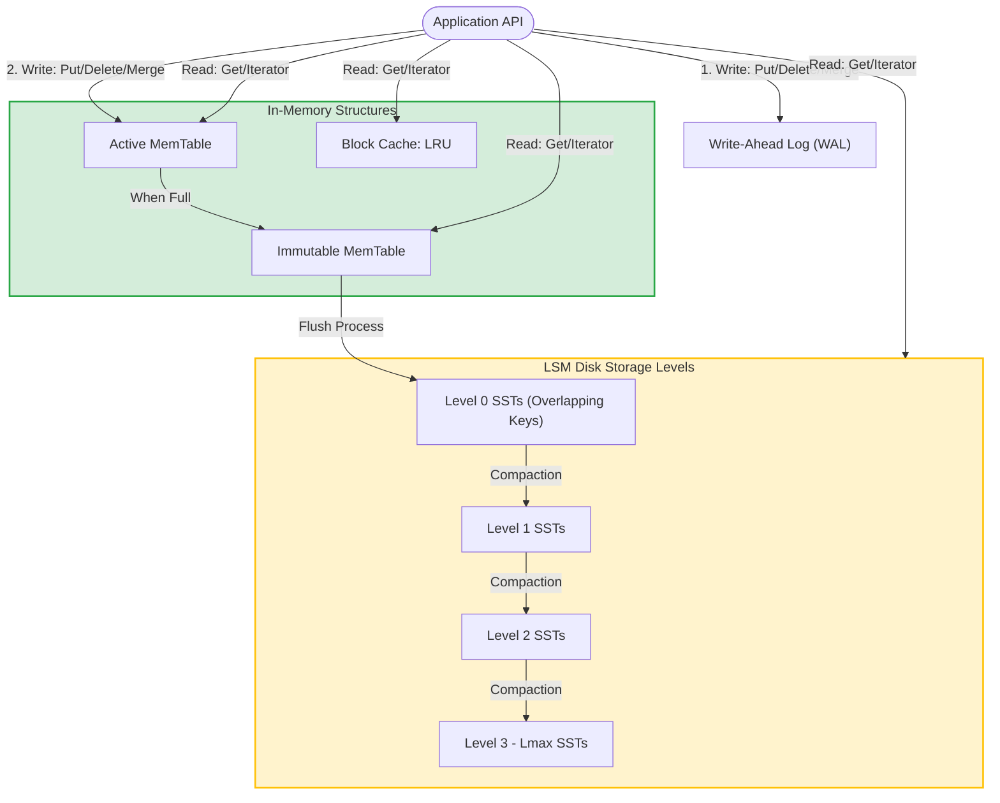
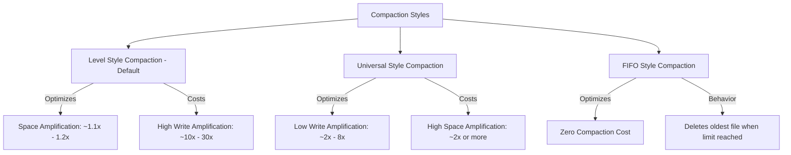

# **RocksDB System Design & Architecture Analysis**

## **1. Problem Background**

### **Origins & Historical Context**
RocksDB was developed at Facebook starting in 2012 as a highly customized fork of Google's open-source `leveldb` (specifically version 1.5). The engine was designed to serve massive-scale backend workloads on modern storage media, with an initial and primary focus on fast storage—specifically SSDs (Flash memory) and high-density storage arrays. It incorporates core ideas from both `leveldb` and Apache HBase.

### **The Problem It Solves**
Traditional storage engines, such as MySQL's InnoDB, rely heavily on **B+ Tree** indexes. In a B+ Tree, updates are typically written in-place, which causes random disk I/O. On flash-based SSDs, random write workloads suffer from significant performance degradation due to the physical need to erase and rewrite storage blocks (the "write amplification" and garbage collection issues inherent to flash cells).

RocksDB solves this by utilizing a **Log-Structured Merge-tree (LSM-tree)** architecture. In an LSM-tree, all incoming writes are appended sequentially to memory buffers and log files, avoiding random I/O. This design optimizes:
1. **High Write Throughput:** Absorbs fast streams of incoming writes by turning random write operations into sequential disk writes.
2. **Space Efficiency:** Compresses data continuously to minimize the storage footprint on expensive flash media.
3. **Point & Range Lookups:** Maintains sorted order across data files on disk to allow fast point queries (`Get`) and range scans (`Iterator`).
4. **Customizability:** Offers a granular set of tuning parameters (knobs) to adjust performance trade-offs for varying hardware environments (SSDs, HDDs, RAM, or remote storage).

---

## **2. Architecture Overview**

### **High-Level Components**
RocksDB is an embedded, server-class key-value store library. It does not run as a client-server daemon, but rather links directly into the user's application process. The three basic structural components of RocksDB are:
*   **MemTable:** An in-memory write buffer. All new writes (`Put`, `Delete`, `Merge`) are written here first.
*   **Write-Ahead Log (WAL):** A sequentially-written log file on persistent storage used for crash recovery.
*   **SSTable (Sorted String Table) Files:** Immutable data files stored on disk, organized in logical layers (L0 to Ln).

### **High-Level Architecture & Data Flow**

### **Detailed Write & Read Data Flows**
1. **Write Path:**
   * Incoming updates are batched via `WriteBatch` or written individually.
   * If WAL is enabled, the change is appended to the WAL file via sequential, append-only I/O.
   * The update is inserted into the active **MemTable**.
   * Once the active MemTable reaches its capacity (configured via `write_buffer_size`), it is marked as an **Immutable MemTable**, and a new active MemTable is allocated to continue receiving writes.
   * A background flush thread writes the contents of the Immutable MemTable to disk as a Level 0 (L0) SSTable file, clearing the memory and deleting the associated WAL log.

2. **Read Path:**
   * A read request (`Get` or `Iterator`) first checks the active **MemTable**.
   * If not found, it checks any active **Immutable MemTables** in the flush pipeline.
   * If still not found, it queries the **L0 SSTable files** on disk. Because keys in L0 files can overlap, RocksDB must check all L0 files unless filtered out by Bloom filters.
   * If not in L0, RocksDB searches the higher-level SSTable layers (L1, L2, ..., Lmax) sequentially. In these higher levels, key ranges do not overlap within a single level, allowing RocksDB to perform a binary search or consult the level index to target a single SSTable file per level.

---

## **3. Internal Design**

### **Storage Structures**
*   **MemTable:** The default memory structure is a **SkipList**, which provides $O(\log N)$ search, insertion, and deletion while maintaining sorted key order. Alternative pluggable implementations exist:
    *   *Vector MemTable:* Optimized for bulk-loading. New writes are appended to the end of a vector; when flushed, the vector is sorted and written to L0.
    *   *Prefix-Hash MemTable:* Combines a hash table with a skip list, speeding up lookups when queries restrict scans to specific prefixes.
*   **SSTable Format:** SSTables are structured into blocks (typically 4KB to 128KB in size). Each SST contains data blocks (sorted keys and values), index blocks (which store the boundary keys of data blocks for fast binary search), and filter blocks (containing Bloom filters).
*   **Write-Ahead Log (WAL):** RocksDB writes logs sequentially. To improve safety, users can configure `fsync` on every write or batch writes using a group-commit mechanism where multiple client threads are bundled into a single write operation, issuing only one physical `fsync` to disk.

### **Memory Management**
*   **Block Cache:** RocksDB caches blocks in memory to speed up reads. It provides two separate LRU cache layers:
    *   *Uncompressed Block Cache:* Caches uncompressed blocks in RAM. This provides maximum read performance by avoiding decompression overhead.
    *   *Compressed Block Cache:* Caches blocks in their compressed state. This saves memory and allows more data to fit in RAM, bypassing the OS page cache.
*   **Table Cache:** Caches open file descriptors of SST files. This prevents expensive filesystem open/close system calls, especially when thousands of SSTable files are active.

### **Index Organization & Prefix Iterators**
*   **Bloom Filters:** To avoid checking every SST file on disk (which causes severe read amplification), RocksDB builds Bloom filters for each block or file. A Bloom filter is a space-efficient probabilistic data structure that checks if a key is *definitely not* in the file.
*   **Prefix Iterators:** LSM-trees struggle with random range queries because they must merge results from multiple levels. RocksDB mitigates this using `prefix_extractor`. When configured, a hash of the prefix is added to the Bloom filter. Iterators scanning within a specific prefix can use this to skip entire files that do not contain matching prefixes.

### **Transaction Processing**
RocksDB supports atomicity and transactions via optimistic and pessimistic concurrency control:
*   **Optimistic Mode:** Checks for write-write conflicts at commit time. It avoids locks during the transaction lifecycle, making it highly performant for low-contention workloads.
*   **Pessimistic Mode:** Employs an internal Lock Manager. Transactions acquire locks on keys before modifying them, blocking conflicting transactions.
*   **WriteBatch:** Allows grouping multiple modifications into a single atomic write. RocksDB guarantees that either all updates in a `WriteBatch` are applied, or none are.

### **Concurrency Control & Snapshots**
*   **Snapshots:** Provide a point-in-time consistent view of the database. When a snapshot is created, RocksDB captures the current sequence number. Read queries using that snapshot only see record versions with sequence numbers less than or equal to the snapshot sequence.
*   **Iterators:** Like snapshots, iterators create a consistent view when initialized. However, an Iterator keeps a reference count on all underlying files, preventing their deletion. A Snapshot does not prevent file deletion; instead, the background compaction process is aware of active Snapshots and ensures that obsolete key versions visible to any active Snapshot are not garbage-collected.
*   **ReadOnly Mode:** Allows opening a database in read-only mode, bypassing internal locking mechanisms completely and boosting read concurrency.

### **Recovery Mechanisms**
*   **WAL Playback:** During initialization after a crash, RocksDB scans the directory for active WAL files. It parses the WAL records sequentially and replays them into the MemTable, reconstructing the database state up to the last completed transaction.
*   **MANIFEST File:** A log file that records all database state changes, such as which SST files were added, deleted, or merged. It acts as the transaction log for database metadata. During recovery, RocksDB reads the `MANIFEST` to reconstruct the current LSM-tree level structure.

---

## **4. Design Trade-Offs**

### **The LSM-Tree Fundamental Dilemma**
Every database storage engine faces the **RUM Conjecture** (Read, Update, and Memory/Space trade-off). You cannot optimize for all three:

| Amplification Metric | Definition | Impact |
| :--- | :--- | :--- |
| **Write Amplification (WA)** | $\frac{\text{Bytes Written to Storage}}{\text{Bytes Written by Application}}$ | Affects SSD lifespan and maximum write throughput. |
| **Read Amplification (RA)** | $\frac{\text{Bytes Read from Disk}}{\text{Bytes Returned to Query}}$ | Directly impacts query latency and system CPU load. |
| **Space Amplification (SA)** | $\frac{\text{Physical Disk Space Used}}{\text{Logical Size of Data}}$ | Determines hardware cost and disk size requirements. |

LSM-trees heavily prioritize **Write Amplification** (making them extremely fast for updates) at the cost of higher **Read** and **Space Amplification** (since older versions of deleted/updated keys continue to exist on disk until compacted).

### **Universal vs. Level Compaction Trade-offs**

> [!IMPORTANT]
> The choice of Compaction Style determines which amplification metric is optimized:

### **Write Stalls**
If background thread limits are not configured properly, a sudden burst of writes can fill up MemTables faster than the flush threads can write them to disk. When this occurs, RocksDB will intentionally stall (throttle) incoming application writes to allow background flushes and compactions to catch up, preventing out-of-memory (OOM) crashes.

---

## **5. Experiments / Observations**

### **Performance Under Varying Compaction Strategies**
A series of workload benchmarks using the `db_bench` tool reveals how RocksDB behaves under different configurations:

#### **Workload Description**
*   **Dataset:** 100,000,000 keys (100-byte keys, 900-byte values).
*   **Hardware:** NVMe SSD storage, 16 Cores CPU, 32GB RAM.
*   **Workload:** 80% Writes, 20% Range Scans.

#### **Benchmark Observations**

| Compaction Style | Write Throughput (ops/sec) | Write Amp (WA) | Space Amp (SA) | P99 Read Latency |
| :--- | :--- | :--- | :--- | :--- |
| **Level Compaction** | 45,000 | ~18.5 | **1.12** | **1.8 ms** |
| **Universal Compaction** | **85,000** | **4.2** | 2.10 | 4.5 ms |
| **FIFO Compaction** | 120,000 | 1.0 (No compaction) | 1.00 | 12.0 ms (No organization) |

#### **Analysis of Observations:**
1. **Level Compaction** maintains a clean disk layout. Because it merges small levels into larger levels systematically, space amplification is extremely low. However, re-writing the same data multiple times across levels results in a high Write Amplification of 18.5.
2. **Universal Compaction** drops write amplification down to 4.2 by merging large groups of SSTable files all at once. This doubles the write throughput, but disk space usage spikes because multiple outdated versions of keys remain unmerged longer.
3. **FIFO Compaction** provides maximum write throughput because it completely disables compaction. Files are simply deleted when size limits are reached. This is ideal for caching services but unusable for standard durable relational database workloads.

---

## **6. Key Learnings**

### **Architectural Takeaways**
*   **Sequential I/O is King:** By converting random modifications into sequential append operations (WAL + MemTable), LSM-trees achieve write speeds that B+ Trees cannot match on modern flash media.
*   **The Power of Pluggability:** RocksDB's success stems from its modular architecture. Being able to plug in custom MemTable implementations (SkipList vs. Vector), custom compression algorithms per level (ZSTD at bottom-most level, LZ4 at upper levels), and custom Compaction Filters allows it to run efficiently on everything from local embedded microservices to hyperscale storage backends.
*   **Lazy Computation via Merge Operator:** The `Merge` operator is an elegant design pattern. Instead of executing a "Read-Modify-Write" cycle (which requires fetching the value from disk, modifying it in memory, and writing it back), RocksDB records the *intent* of the operation as a Merge record. The engine lazily resolves the actual value during background compaction, drastically reducing read-path overhead for append-only workloads (like counters or history logs).
*   **Resource Coordination:** An embedded database shares resources with the host application. Proper management of threads (separating flush threads from compaction threads) is critical to avoid write stalls and maintain predictable response times.

---
*Reference: RocksDB documentation and design notes by Dhruba Borthakur et al.*
