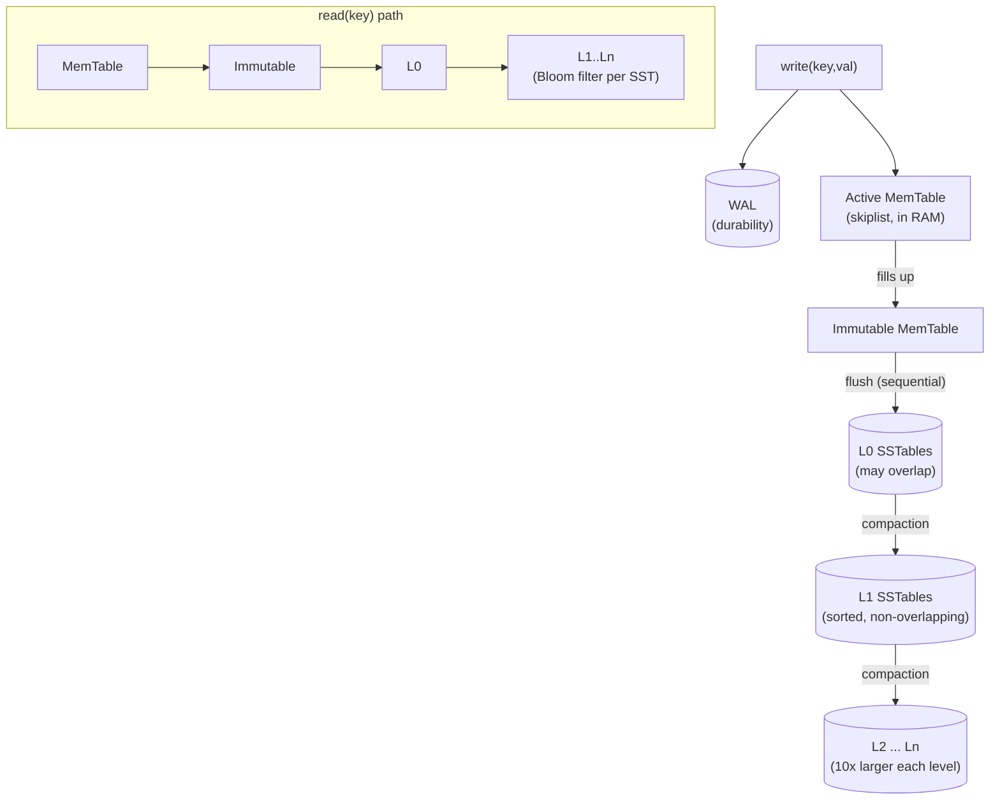

# RocksDB — LSM-Tree Storage Architecture

> Advanced DBMS · System Design Discussion · **Saswata Das (24BCS10248)**

RocksDB is an embeddable, persistent key-value store built on a **Log-Structured
Merge-tree (LSM-tree)**. Where PostgreSQL and InnoDB use B-trees that update pages
_in place_, RocksDB **never overwrites data**: it buffers writes in memory and
flushes them as immutable sorted files, later merging those files in the
background. This trades extra background work ("compaction") for very fast,
sequential writes. This document explains the design and backs it with **real
`db_bench` benchmarks** run against RocksDB (`rocksdb-tools`) in Docker.

---

## 1. Problem Background

A B-tree does roughly one random write per update (find the page, modify it,
write it back). On write-heavy workloads — logging, time-series, metrics, message
queues, the storage layer under MyRocks/CockroachDB/TiKV — random writes dominate
and disks (especially SSDs, which dislike small random writes) become the
bottleneck.

The **LSM-tree** (Google's LevelDB, which RocksDB forks and extends at Facebook)
inverts this: collect writes in a memory buffer, then write them out in **large
sequential batches** of sorted, immutable files. Reads may now have to consult
several files, and the files must be merged over time — but writes become cheap
and sequential. RocksDB is the storage engine of choice when **write throughput**
is the priority.

---

## 2. Architecture Overview



- **Write path:** append to the **WAL** (durability), insert into the in-memory
  **MemTable**. When full, the MemTable becomes **immutable** and a new one takes
  over; a background thread **flushes** it to an **L0 SSTable**. **Compaction**
  later merges SSTables down the level hierarchy.
- **Read path:** check the MemTable, then the immutable MemTable, then L0, then
  L1…Ln. Each SSTable has a **Bloom filter** to skip files that cannot contain the
  key. The newest version of a key wins.

---

## 3. Internal Design

### 3.1 MemTable, immutable MemTable & WAL

Writes go to two places: the **WAL** (an append-only log, so a crash before flush
loses nothing) and the **MemTable** (default a concurrent **skiplist** giving
sorted O(log n) inserts/lookups). When the MemTable reaches
`write_buffer_size`, it is sealed as an **immutable MemTable** and a fresh one is
created — so writes never block on the flush. The flush writes the sorted
contents out as one L0 file and lets the corresponding WAL be discarded.

### 3.2 SSTables (Sorted String Tables)

An SSTable is an **immutable**, sorted file of key→value entries, organised as
data blocks + an index block + a **Bloom filter** block + metadata. Immutability
is the linchpin: files are never modified, only created and deleted, which makes
writes sequential, caching simple, and concurrency lock-light.

### 3.3 Level structure (L0 → Ln)

```text
L0 : freshly-flushed files — key ranges MAY OVERLAP (a read must check all of them)
L1 : sorted run, non-overlapping files, total size ~ max_bytes_for_level_base
L2 : ~10x larger than L1, non-overlapping
...
Ln : largest, holds the bulk of the data
```

L0 is special: because files come straight from independent MemTable flushes,
their key ranges overlap, so a point read must consult every L0 file. From L1
down, each level is a single sorted run (non-overlapping), so a read touches **at
most one file per level** — which is why Bloom filters matter so much.

### 3.4 Bloom filters

Each SSTable stores a Bloom filter over its keys. Before reading a file's blocks,
RocksDB queries the filter: a _negative_ answer is exact ("key definitely not
here") and lets it **skip the file entirely**, avoiding disk I/O. A _positive_ may
be a false positive (tuned by `bloom_bits`, ~1% at 10 bits/key). This is what
keeps reads fast despite data being spread across many files (quantified in §5).

### 3.5 Compaction — why it is required

Without merging, L0 files pile up (slowing reads) and obsolete/deleted keys are
never reclaimed (wasting space). **Compaction** reads overlapping SSTables, merges
them keeping only the newest version of each key (dropping overwritten keys and
tombstones), and writes new files at the next level. Two main strategies:

|               | **Level** (`compaction_style=0`)                        | **Universal** (`compaction_style=1`)                      |
| ------------- | ------------------------------------------------------- | --------------------------------------------------------- |
| Layout        | Each level a non-overlapping sorted run, ~10x growth    | Size-tiered runs, merged when count/size triggers         |
| Optimised for | **Low space + read amplification**                      | **Low write amplification**                               |
| Cost          | Higher write amplification (data rewritten level→level) | Higher space + read amplification (more overlapping runs) |

### 3.6 The amplification triangle

LSM design is the management of three competing costs — you cannot minimise all
three at once:

- **Write amplification** = bytes written to storage ÷ bytes written by user
  (re-writing during compaction).
- **Read amplification** = files/blocks consulted per lookup (more files → more
  reads; Bloom filters reduce it).
- **Space amplification** = bytes on disk ÷ live data bytes (obsolete versions
  awaiting compaction).

---

## 4. Design Trade-Offs

| Decision                            | Benefit                                              | Cost                                           |
| ----------------------------------- | ---------------------------------------------------- | ---------------------------------------------- |
| Buffer + flush (no in-place update) | Sequential, fast writes; SSD-friendly                | Reads may consult many files; needs compaction |
| Immutable SSTables                  | Simple caching, lock-light concurrency, easy backups | Updates/deletes deferred to compaction         |
| Level compaction                    | Low space & read amplification                       | Higher **write** amplification                 |
| Universal compaction                | Low **write** amplification                          | Higher **space** & read amplification          |
| Bloom filters                       | Skip files without the key → fast reads              | Extra memory + small false-positive cost       |
| WAL                                 | Durability across crashes                            | Doubles bytes written (WAL + flush)            |

**Why LSM beats B-trees on write-heavy workloads.** B-trees do random in-place
page writes; LSM converts the same updates into sequential MemTable flushes and
batched compactions, which match how SSDs and OSes prefer to write. The price is
read and space amplification — paid back by Bloom filters, block cache, and
compaction.

**Why reads are the hard part.** A key may live in the MemTable, any L0 file, or
one file per lower level. Without help, a point read could touch many files. Bloom
filters (skip non-matching files) and the block cache make the common case touch
very few — but worst-case read cost is the fundamental LSM trade-off vs a B-tree's
single root-to-leaf path.

---

## 5. Experiments / Observations — real `db_bench`

Workload: 1,000,000 keys, 100-byte values, no compression, 4 MB MemTable (to force
real flushing/compaction), 8 MB block cache.

### 5.1 Write & read throughput (level compaction)

```text
fillrandom : 253,444 ops/sec  (28.0 MB/s)
readrandom : 188,530 ops/sec  (13.2 MB/s)
```

Writes outrun reads — the expected LSM signature (writes hit RAM + sequential WAL;
reads may probe several files).

### 5.2 Compaction strategy: level vs universal

Same user workload (~119 MB flushed in both):

```text
                W-Amp (from LOG)   on-disk size
 level   (0)         3.0               89 MB
 universal (1)       2.6               92 MB
```

**Observation / analysis.** Universal compaction did **less rewriting** (W-Amp
2.6 vs 3.0 → lower **write amplification**) but kept **more bytes on disk** (92 vs
89 MB → higher **space amplification**), exactly the trade-off in §3.5. It rewrites
data fewer times but tolerates more overlapping/obsolete data between compactions.
(The space gap is modest at this dataset size; it widens as data grows.)

### 5.3 Bloom filter effect (readrandom, same data)

```text
 bloom_bits = 10 : 306,234 ops/sec   bloom.filter.useful = 789,760
 bloom_bits =  0 : 201,490 ops/sec   bloom.filter.useful = 0
```

**Observation / analysis.** Enabling Bloom filters raised read throughput **~1.5×**
(306k vs 201k ops/sec). `bloom.filter.useful = 789,760` counts lookups where the
filter let RocksDB **skip an SSTable** that didn't contain the key — direct
evidence of read-amplification reduction. With filters off, every candidate file
must be opened and searched.

---

## 6. Key Learnings

1. **LSM is "make writes sequential, pay later."** Buffer in RAM, flush in big
   sorted batches, merge in the background — measured at 253k writes/sec, faster
   than reads, the inverse of a B-tree's profile.
2. **Compaction is the price of fast writes, and its policy is a dial.** I watched
   the _same_ workload produce different write vs space amplification purely by
   switching `compaction_style` (level 3.0/89 MB vs universal 2.6/92 MB) — you
   choose which amplification to pay.
3. **The three amplifications trade off; you cannot win all three.** Level
   minimises space/read at the cost of write; universal does the reverse. The
   "right" choice depends entirely on the workload.
4. **Bloom filters are what make LSM reads viable** — a 1.5× throughput gain, with
   ~790k SSTable lookups skipped, from a small per-file bitmap.
5. **Surprising takeaway.** Even with Bloom filters off, reads still completed
   correctly — filters are a pure _performance_ structure (no false negatives, so
   never wrong), a clean example of an optimisation that changes speed but not
   correctness.
6. **It is the mirror image of the B-tree engines.** PostgreSQL/InnoDB optimise
   for balanced read/write with in-place updates; RocksDB optimises for write
   throughput and accepts read/space amplification — different point on the same
   design spectrum.

---

### References (consulted and credited)

- RocksDB Wiki: _RocksDB Overview_, _MemTable_, _Flush_, _Compaction_ (Leveled &
  Universal), _Bloom Filters_, _Read/Write Amplification_, _Benchmarking Tools
  (db_bench)_ — github.com/facebook/rocksdb/wiki.
- P. O'Neil et al., _The Log-Structured Merge-Tree (LSM-Tree)_, 1996 (origin).
- Google LevelDB documentation (the engine RocksDB forks).

_All throughput, amplification, and Bloom-filter counters are verbatim from
`db_bench` (rocksdb-tools) in a Debian Docker container._
