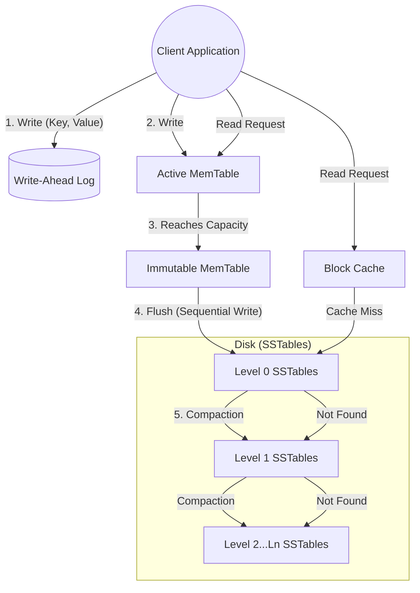

# RocksDB System Architecture Analysis

## 1. Problem Background

### Historical Context & Motivation
Historically, most relational databases like PostgreSQL and MySQL/InnoDB have relied on **B-Tree (or B+Tree)** variants for their storage engines. While B-Trees offer excellent read performance ($O(\log N)$) and support efficient range queries, they suffer from a major limitation in write-heavy workloads: **Write Amplification** caused by random I/O. 

When a small piece of data is updated in a B-Tree, the entire page (usually 4KB or 8KB) must be read from disk, modified, and written back. On hard drives (HDDs), random writes are notoriously slow due to seek times. With the advent of fast flash storage (SSDs) and multi-core processors, Facebook realized that existing storage engines like LevelDB (developed by Google) were not fully utilizing the potential of modern hardware. 

### What Problem Does it Solve?
**RocksDB** was developed by Facebook as an embedded, persistent key-value store optimized for fast storage environments. It solves the problem of high write-latency and write-amplification inherent in B-Trees by using a **Log-Structured Merge (LSM) Tree** architecture. Instead of performing in-place updates, RocksDB buffers writes in memory and flushes them sequentially to disk, turning random writes into fast, sequential writes. This architecture is especially crucial for systems processing massive streams of incoming data, such as time-series databases, graph databases, and event-logging systems.

---

## 2. Architecture Overview

RocksDB operates as an embedded database, meaning it is compiled directly into the application space and does not use a client-server process model. The core data flow revolves around the LSM-tree.

### Main System Components
1. **MemTable:** An in-memory data structure (typically a SkipList) where all active writes and updates are initially stored.
2. **Write-Ahead Log (WAL):** An append-only log on disk that ensures durability. Every write to the MemTable is also appended to the WAL to prevent data loss in case of a crash.
3. **Immutable MemTable:** When the MemTable reaches a predefined size, it is sealed and becomes read-only, awaiting to be flushed to disk. A new MemTable is created for incoming writes.
4. **SSTables (Sorted String Tables):** The persistent, immutable file format used to store data on disk. They are organized into hierarchical levels (L0, L1, ..., Ln).
5. **Block Cache:** An in-memory LRU cache that stores recently read uncompressed data blocks to speed up read operations.

### Data Flow Diagram

---

## 3. Internal Design

### Storage Structures (LSM Trees)
Unlike B-Trees that update data in-place, RocksDB treats all modifications (Inserts, Updates, Deletes) as **appends**. A delete operation simply writes a "tombstone" marker for a key. The data is logically organized across multiple levels:
*   **Level 0 (L0):** Created by flushing Immutable MemTables. SSTables in L0 can have overlapping key ranges because they are flushed directly from memory over time.
*   **Level 1 to Level N:** SSTables in these levels are strictly partitioned. No two SSTables in the same level have overlapping key ranges.

### Compaction
To prevent the disk from filling up with obsolete versions of data and tombstones, RocksDB runs a background process called **Compaction**.
Compaction picks SSTables from Level $i$, merges them with overlapping SSTables in Level $i+1$, removes deleted keys, resolves older versions to the latest version, and writes out new SSTables to Level $i+1$. This process controls Space Amplification and improves Read Performance at the cost of CPU and Disk I/O.

### Read Path and Index Organization
Reading data from an LSM tree is inherently slower than writing. To find a key, RocksDB must search:
1. Active MemTable
2. Immutable MemTables
3. Level 0 SSTables (must check all overlapping files)
4. Level 1 ... Level N SSTables

**Bloom Filters:** To avoid reading unnecessary SSTables from disk, RocksDB embeds Bloom Filters in the SSTables. A Bloom Filter can tell the database with 100% certainty if a key is *not* in a file, allowing the system to skip expensive disk reads.
**Index Blocks:** Each SSTable contains an index block (loaded into memory) that performs a binary search to find the exact data block offset for a key range.

### Concurrency and Transaction Processing
RocksDB supports **MVCC (Multi-Version Concurrency Control)**. Every write is tagged with a monotonically increasing Sequence Number. Readers use a Snapshot (a specific sequence number) to view a consistent state of the database, isolating them from concurrent writes. Since writes do not overwrite existing data, readers never block writers, and writers never block readers.

---

## 4. Design Trade-Offs

The architecture of RocksDB is governed by the **RUM Conjecture**, which states that a database engine can only optimize for two out of three factors: **R**ead Overhead, **U**pdate (Write) Overhead, and **M**emory/Storage Overhead.

| Feature | Advantage | Limitation / Trade-Off |
| :--- | :--- | :--- |
| **LSM Tree Storage** | Extremely high write throughput due to sequential disk I/O. | **Read Amplification:** Reads may need to check multiple SSTables across different levels. |
| **Compaction** | Reclaims space (removes tombstones) and optimizes read paths. | **Write Amplification:** Data is rewritten multiple times as it moves down the levels, causing CPU/I/O spikes. |
| **Bloom Filters** | Drastically reduces disk reads for non-existent or scattered keys. | Consumes additional RAM. Cannot help with range scans. |
| **Embedded Model** | No network latency or inter-process communication overhead. | Cannot be queried concurrently by multiple distinct applications (unlike PostgreSQL). |

### Comparison: RocksDB vs. InnoDB (MySQL)
*   **InnoDB (B+ Tree):** Updates data in place. High write amplification due to page fragmentation and random I/O. Excellent and predictable read performance.
*   **RocksDB (LSM Tree):** Appends data sequentially. Minimal write latency. Variable read latency depending on the level the data resides in.

---

## 5. Experiments / Observations

By running the standard `db_bench` utility provided by RocksDB, one can observe system behavior under different workloads.

### Observation 1: Write vs. Read Throughput
In a benchmark testing pure random writes vs pure random reads:
*   **Random Writes** scale almost linearly with CPU threads until SSD bandwidth is saturated. The MemTable handles writes instantly.
*   **Random Reads** show a higher latency tail. When a key is not found in the cache or MemTable, it forces the engine to traverse multiple LSM levels.

### Observation 2: Compaction Strategies
RocksDB offers different compaction algorithms:
1.  **Leveled Compaction (Default):** Minimizes space amplification but increases write amplification. Great for general-purpose read/write workloads.
2.  **Universal Compaction:** Focuses on minimizing write amplification by merging entire levels at once. This significantly improves write-heavy workloads but at the cost of doubling space amplification (needs more temporary disk space).

*Observation:* During intense bulk loading, disk I/O heavily spikes specifically due to background compaction threads rather than the immediate client writes.

---

## 6. Key Learnings

1.  **Hardware Informs Software:** RocksDB is a masterclass in designing software specifically for modern hardware. By transforming random writes into sequential writes, it sidesteps the fundamental latency bottlenecks of storage hardware.
2.  **Trade-offs are Inevitable:** You cannot have fast writes, fast reads, and low storage footprint simultaneously. RocksDB explicitly accepts higher Read Amplification and Compaction CPU overhead to achieve state-of-the-art Write performance.
3.  **The Power of Probabilistic Data Structures:** Without Bloom Filters, the LSM-Tree architecture would be functionally unusable for read queries due to the sheer volume of disk seeks required across levels.
4.  **Immutability Simplifies Concurrency:** By making SSTables immutable and using MVCC in MemTables, RocksDB avoids complex locking mechanisms on disk files, making parallel processing much simpler and less prone to deadlocks.
