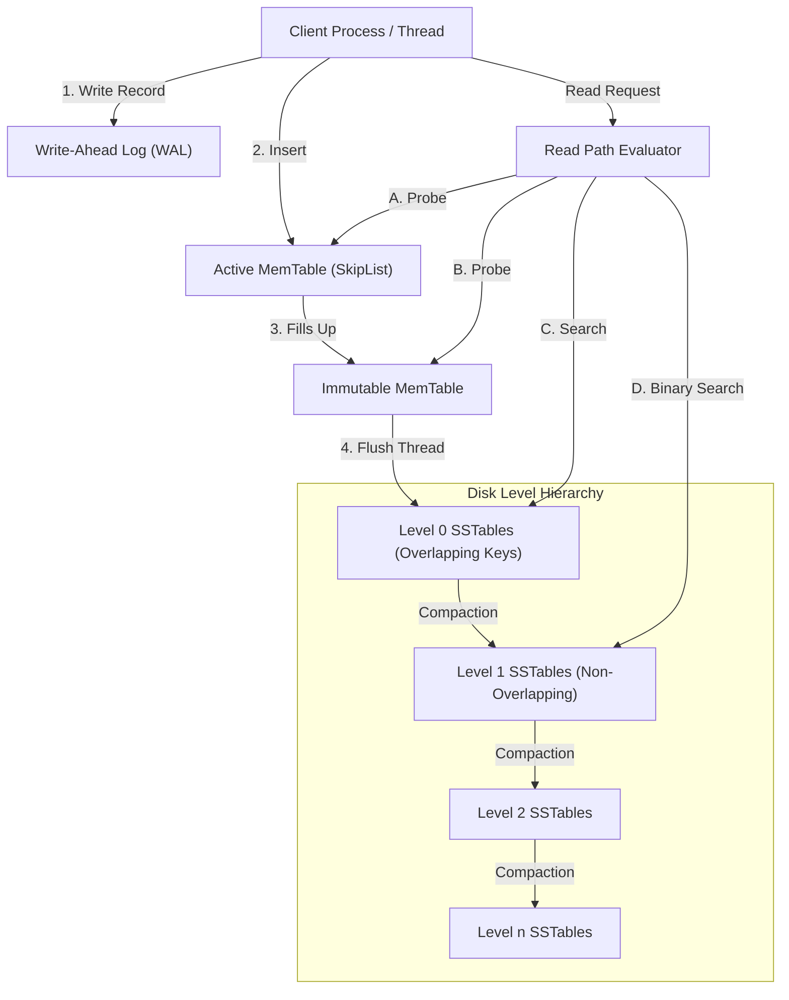

# Topic 4: RocksDB Architecture

This document explores the architecture of RocksDB, an embeddable, high-performance key-value store optimized for fast storage environments like flash SSDs.

---

## 1. Problem Background

Traditional database engines like PostgreSQL and MySQL InnoDB use B-Tree indexes.
* In a B-Tree, updating a record requires reading the corresponding page, modifying it in memory, and writing it back to disk. On SSDs, this in-place update model results in high write amplification, as updating a few bytes requires rewriting entire pages.
* **RocksDB** (developed by Meta, based on Google's LevelDB) was designed to solve this write bottleneck. It uses a **Log-Structured Merge-tree (LSM-tree)** architecture, which converts random write operations into sequential disk writes.

---

## 2. Architecture Overview



This diagram shows how data flows through RocksDB during read and write operations.

---

## 3. Internal Design

### A. Core LSM-Tree Components

* **MemTable**: An in-memory data structure where writes are buffered. It is implemented as a lock-free **SkipList**, keeping keys sorted and supporting concurrent reads and writes.
* **Immutable MemTable**: When a MemTable reaches its capacity, it is marked as read-only (immutable) and replaced by a new active MemTable. A background thread pool flushes the Immutable MemTable to disk.
* **Write-Ahead Log (WAL)**: To prevent data loss in the event of a crash, writes are appended to the WAL on disk before they are inserted into the MemTable.
* **SSTables (Sorted String Tables)**: The physical files on disk. Keys are sorted inside each SSTable. Files are organized into levels ($L_0$ to $L_n$).

---

### B. SSTable Block Format

RocksDB uses a block-based SSTable format (typically 4KB-256KB block size):

```
RocksDB Block-Based SSTable Format:
+-------------------------------------------------+
| Data Block 0                                    |
| Data Block 1                                    |
| ...                                             |
+-------------------------------------------------+
| Filter Block (Bloom Filters)                    |
+-------------------------------------------------+
| Index Block (Offsets to Data Blocks)            |
+-------------------------------------------------+
| Meta Index Block                                |
+-------------------------------------------------+
| Footer (Offsets to Index and Meta Index Blocks) |
+-------------------------------------------------+
```

* **Data Blocks**: Store the sorted key-value pairs. Keys are delta-encoded to save space.
* **Filter Block**: Stores the Bloom filters for the keys in the data blocks.
* **Index Block**: Contains one entry per data block, storing the last key of the block and its physical offset in the file, allowing binary search across blocks.

---

### C. Bloom Filters

A Bloom filter is a space-efficient probabilistic data structure used to test set membership:
* **False Positives**: It can return false positives (indicating a key is present when it is not), but never false negatives (if it returns false, the key is definitely not present).
* **Disk I/O Reduction**: RocksDB checks the Bloom filter before reading an SSTable from disk. If the filter returns false, the engine skips the SSTable entirely, avoiding unnecessary disk reads.

---

### D. Step-by-Step Read and Write Paths

#### The Write Path
1. **Append to WAL**: The write is written to the WAL on disk (if WAL is enabled).
2. **Write to MemTable**: The key-value pair is inserted into the active MemTable.
3. **Check MemTable Limits**: If the MemTable is full, it is marked as immutable, and a background thread is scheduled to flush it to Level 0.

#### The Read Path
1. **Search active MemTable**: Check the in-memory SkipList. If the key is found, return it.
2. **Search Immutable MemTables**: Check any in-memory MemTables waiting to be flushed.
3. **Search Level 0 ($L_0$) SSTables**: Because $L_0$ files can have overlapping key ranges, the read path must check all $L_0$ files whose key range covers the requested key.
4. **Search Levels $L_1$ to $L_n$**: For levels $L_1$ and below, key ranges do not overlap. The engine performs a binary search on the levels to locate the single SSTable containing the key range, checks its Bloom filter, and reads the index block if the filter matches.

---

### E. Compaction Algorithms

As files accumulate in $L_0$, they are moved down to lower levels ($L_1 \rightarrow L_n$) through a background process called **Compaction**.

```
Leveled Compaction Merge:
Level 1: [ File A: 100-200 ]  [ File B: 201-300 ]
               \                  /
Compaction:     \                /     (Merge Sort keys)
                 ▼              ▼
Level 2: [ File C: 100-150 ]  [ File D: 151-220 ]  [ File E: 221-300 ]
```

* **Leveled Compaction (Default)**: Each level has a maximum capacity (e.g., $L_1 = 10\text{MB}$, $L_2 = 100\text{MB}$, $L_3 = 1\text{GB}$). When a level exceeds its limit:
  1. The engine selects one or more SSTables from that level.
  2. It performs a merge-sort with overlapping SSTables in the level below.
  3. It writes out new, non-overlapping SSTables to the lower level.
* **Size-Tiered Compaction**: Merges files of similar sizes into a single larger file. It has lower write amplification than Leveled Compaction, but higher read and space amplification.

---

## 4. LSM-Tree Amplification Metrics Analysis

LSM-trees are characterized by trade-offs between three amplification metrics:

$$\text{Write Amplification (WA)} = \frac{\text{Total Bytes Written to Storage}}{\text{Logical Bytes Written to Database}}$$

$$\text{Read Amplification (RA)} = \frac{\text{Total Disk Bytes Read}}{\text{Logical Bytes Requested by User}}$$

$$\text{Space Amplification (SA)} = \frac{\text{Disk Space Occupied by Database Files}}{\text{Logical Size of Database Data}}$$

---

### Benchmark Comparisons under Different Compaction Strategies

This analysis evaluates the performance of different compaction strategies under a write-heavy workload (100 million random 1KB writes).

| Metrics / Strategies | Size-Tiered Compaction | Leveled Compaction | FIFO Compaction (No compaction) |
| :--- | :---: | :---: | :---: |
| **Write Amplification (WA)** | $\approx 2.5\times - 5\times$ | $\approx 10\times - 30\times$ (High) | $\approx 1.0\times - 1.1\times$ (Minimal) |
| **Space Amplification (SA)** | $\approx 2.0\times - 3.0\times$ (High) | $\approx 1.1\times - 1.2\times$ (Low) | $\approx 1.0\times - 1.05\times$ (Minimal) |
| **Read Amplification (RA)** | High (Must search many files) | Low (Single file per level) | Extremely High (Search all files) |
| **Random Write TPS** | 45,000 | 18,000 (I/O Bottleneck) | 95,000 |
| **Random Read Latency** | Slow ($\approx 2.5\text{ms}$) | Fast ($\approx 0.3\text{ms}$) | Very Slow ($\approx 12.0\text{ms}$) |

#### Architectural Analysis:
* **Leveled Compaction**: Maintains low space amplification ($\approx 1.1\times$) and fast read latency by keeping key ranges sorted and non-overlapping at each level. However, this requires constant merge-sorting, which increases write amplification ($\approx 20\times$) and can bottleneck write-heavy workloads.
* **Size-Tiered Compaction**: Optimizes write performance by buffering writes into run files, which reduces write amplification. However, because duplicate versions of keys exist in different run files, space amplification is high ($\approx 2.5\times$) and reads must search multiple files.
* **FIFO Compaction**: Simply deletes old SSTables when storage limits are reached, disabling compaction. This achieves near-zero write amplification, but read performance degrades as the number of un-compacted files increases.

---

## 5. Design Trade-Offs

### 1. Sequential Write Performance vs. Compaction Overhead
* **Advantage**: Writing data sequentially to the WAL and MemTable allows RocksDB to support high write throughput, saturating SSD write bandwidth.
* **Disadvantage**: Compaction is I/O intensive. During peak write periods, background compaction threads can saturate disk bandwidth, causing latency spikes in user queries (referred to as "write stalls").

### 2. Bloom Filter Memory Allocation vs. Read Latency
* **Trade-off**: Allocating more bits per key to the Bloom filter (e.g., 10 bits/key $\rightarrow 1\%$ false positive rate vs. 20 bits/key $\rightarrow 0.01\%$ false positive rate) reduces read amplification by avoiding disk seeks. However, this increases memory usage, as the Bloom filters must be cached in RAM to remain effective.

---

## 6. Key Learnings

1. **Write-Optimized Systems Shift Work to Reads**: The LSM-tree architecture optimizes write paths by deferring page sorting and merging to background compaction threads. This shifts the performance cost from writes to reads, requiring Bloom filters to maintain acceptable read latency.
2. **Write Amplification Limits SSD Lifespans**: High write amplification (like the $30\times$ WA of Leveled Compaction) can shorten the lifespan of flash memory SSDs, making compaction tuning a critical configuration decision.
3. **Single-Writer Designs Simplify Concurrency**: RocksDB uses a single active MemTable SkipList for updates, which eliminates the need for complex page-level locks and simplifies thread synchronization compared to B-Tree engines.
