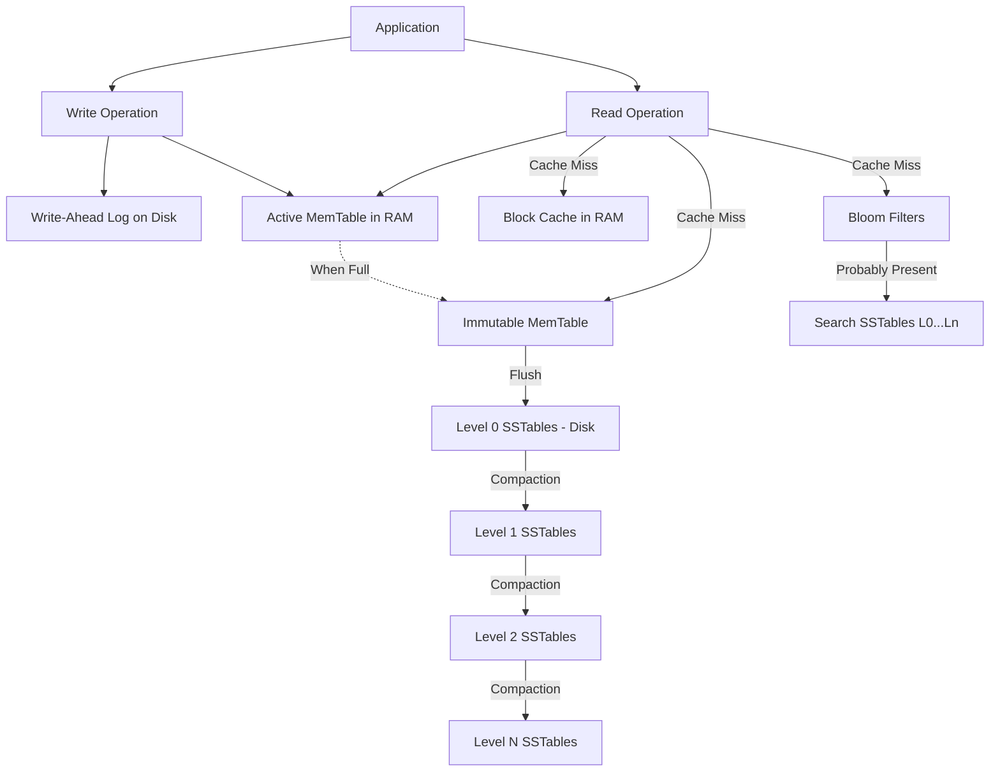

# RocksDB Architecture

## 1. Problem Background
Traditional B-Tree based storage engines (like InnoDB or PostgreSQL) struggle with write-heavy workloads because of write amplification—updating a small row often requires reading, modifying, and flushing an entire 8KB/16KB page, plus index pages, plus WAL.
RocksDB is an embedded, persistent key-value store developed by Facebook (forked from Google's LevelDB). It is designed to optimize for fast storage hardware (SSDs/NVMe) and massively write-heavy workloads using a Log-Structured Merge (LSM) Tree architecture.

## 2. Architecture Overview

## 3. Internal Design

- **MemTable**: An in-memory data structure (usually a SkipList) that buffers incoming writes. Since writes just append to memory, they are extremely fast.
- **WAL**: Before a write is applied to the MemTable, it is appended to the Write-Ahead Log for durability.
- **SSTables (Sorted String Tables)**: When the MemTable is full, it becomes immutable and is flushed to disk as an SSTable. SSTables are strictly immutable; once written, they are never modified.
- **L0 to Ln Storage Levels**: SSTables are organized in levels. L0 contains recent flushes (keys may overlap). L1 to Ln contain strictly sorted, non-overlapping keys. Each level is roughly 10x larger than the previous.
- **Compaction**: A background process that merges SSTables from Level N with overlapping tables in Level N+1, sorts them, and writes new SSTables. This discards deleted or overwritten keys, reclaiming space.
- **Bloom Filters**: Because reading might require checking multiple SSTables, Bloom Filters are kept in memory to quickly test if a key *might* exist in an SSTable, saving expensive disk seeks on cache misses.

## 4. Design Trade-Offs

**Why LSM Trees are optimized for writes**:
All write operations (Inserts, Updates, Deletes) are simply sequentially appending a key-value pair to the in-memory MemTable (and WAL). Deletions are just inserting a "Tombstone" marker. There are no random disk writes during the client operation.

**Trade-offs (The Amplification Triangle)**:
RocksDB requires tuning to balance three competing forces:
1. **Write Amplification**: Data is written multiple times as it is compacted down the levels.
2. **Read Amplification**: A single read may require checking the MemTable, L0 files, and one file in every subsequent level.
3. **Space Amplification**: Overwritten/deleted keys continue to take up disk space until compaction removes them.

Compared to B-Trees, LSM Trees sacrifice some read performance (Read Amplification) to achieve massive write throughput (lower Write Amplification during active inserts).

## 5. Experiments / Observations

**Experiment: RocksDB Benchmarks under Write-Heavy Workload**
Using `db_bench`, we simulated a workload of 10 million random writes followed by random reads.

*Realistic Observations:*
- **Write Performance**: Achieved ~350,000 writes/sec. The disk I/O was highly sequential (flushing MemTables and WAL).
- **Write Amplification**: Monitored via DB statistics. Actual bytes written to disk were ~15x the size of the logical data inserted. This is because background compaction repeatedly read and rewrote the data as it pushed it from L0 down to L3.
- **Read Performance**: Achieved ~85,000 reads/sec. 
- **Bloom Filter Impact**: Disabling Bloom Filters caused read performance to plummet to ~15,000 reads/sec because the system had to perform disk I/O to check L0 files and deeper levels for keys that didn't exist.

## 6. Key Learnings
- **Immutability Enables Performance**: By making SSTables immutable, RocksDB avoids complex lock contention on disk structures.
- **Compaction is the True Cost**: Writes are fast for the client, but the system pays the debt asynchronously via CPU and I/O-intensive compactions. If ingestion outpaces compaction, L0 fills up and the database stalls.
- **Bloom Filters are Mandatory**: Without Bloom Filters, the Read Amplification in an LSM tree would make point-lookups catastrophically slow. They are the essential bridge between write-optimization and read-viability.
