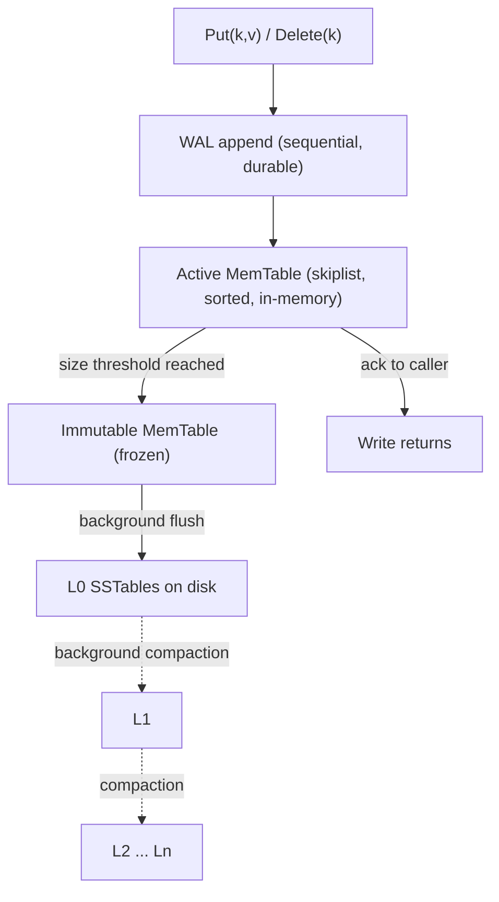
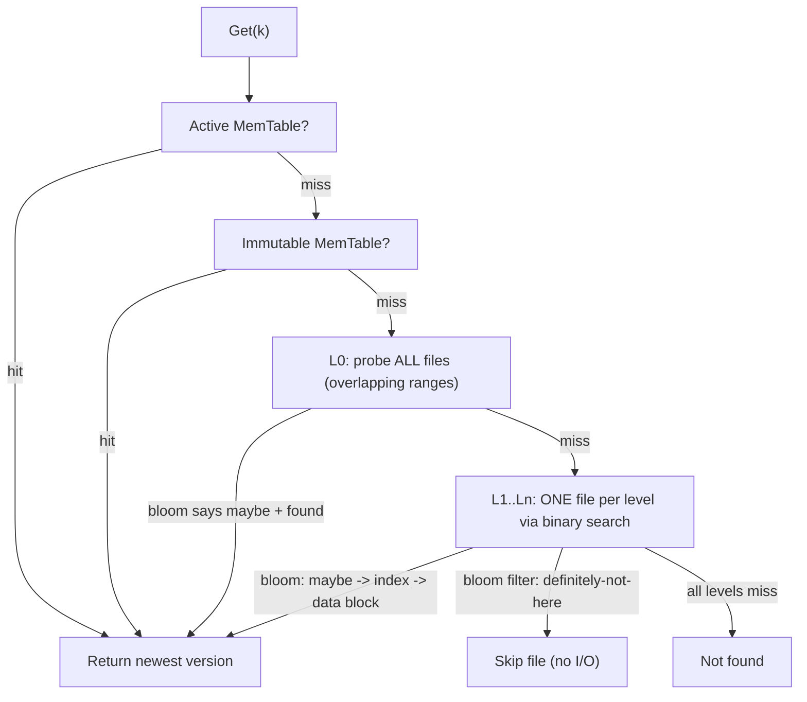
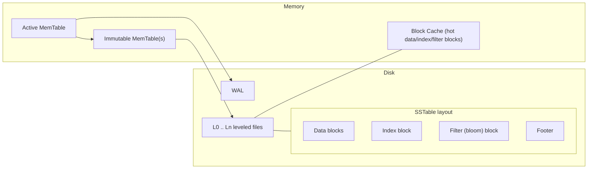

# RocksDB: An LSM-Tree Storage Engine — Architecture & Trade-Offs

RocksDB is an embedded key-value storage engine built on a **Log-Structured Merge-tree (LSM-tree)**. Its central design bet is that on flash/SSD, *random in-place writes are the enemy*: a B-tree updates pages where the key already lives, scattering small random writes across the device. An LSM-tree instead **buffers writes in memory and flushes them as large sequential files**, never overwriting data in place — it trades cheap sequential writes now for a background "merge" (compaction) cost later. This document analyzes *why* that architecture is shaped the way it is, and what it costs.

---

## 1. Problem Background

RocksDB was forked from Google's **LevelDB** by Facebook around 2012 and hardened for server-class flash storage and high-concurrency workloads. Two facts frame everything else:

- **It is an embedded *library*, not a database server.** There is no network protocol, no query planner, no SQL. It links into a host process and exposes `Get`/`Put`/`Delete`/`Iterator` over ordered byte keys. The host owns concurrency, schema, and transactions. This is why RocksDB became the *pluggable storage layer* underneath many systems: **MyRocks** (MySQL), **CockroachDB** and **TiKV** (distributed SQL/KV), **Kafka Streams** (state stores), and many others. It solves one problem — durable ordered KV storage on flash — and lets the host solve the rest.

- **The hardware shifted from disk to flash.** Spinning disks punish seeks; flash tolerates random reads well but has *asymmetric, block-erase write behavior* — small in-place overwrites cause write amplification inside the SSD's FTL and wear out cells. Server workloads also became write-heavy (logs, metrics, state, secondary indexes).

### The core insight

A classic **B-tree** keeps data sorted in fixed pages and performs **in-place random writes**: updating one row dirties one page somewhere in the tree, and high write rates produce scattered random I/O plus write amplification. An **LSM-tree** inverts this:

> **Turn random writes into sequential writes.** Accept writes into an in-memory sorted buffer, append a record to a log for durability, and *never modify on-disk files*. On-disk data lives in immutable sorted files; updates and deletes are new records with a newer version. Periodically merge files in the background to reclaim space and bound read cost.

The result: writes are fast and sequential, but reads and space must be *recovered* by background work. Every RocksDB design decision is a consequence of managing that recovery.

---

## 2. Architecture Overview

### Write path



A write is durable and acknowledged as soon as the **WAL append + MemTable insert** complete. Everything below the MemTable — flush and compaction — happens asynchronously on background threads.

### Read path



A point read walks newest-to-oldest data until it finds the first matching key (which is, by construction, the most recent version). **Bloom filters short-circuit the expensive part**: for any SSTable whose filter says the key is absent, the engine skips the file entirely without touching the data block.

### Component map



---

## 3. Internal Design

### 3.1 MemTable and Immutable MemTable

The **active MemTable** is the single write target — by default a **concurrent skiplist**, chosen because it keeps entries *sorted by key* (needed for ordered flush and range scans) while supporting fast concurrent insert. When it reaches `write_buffer_size`, it is **frozen into an immutable MemTable** and a fresh active MemTable is installed. Writes never block on flush: they continue into the new MemTable while the frozen one is flushed in the background. Reads consult the active MemTable, then any immutable MemTables still in memory, before going to disk.

### 3.2 Write-Ahead Log (WAL)

The MemTable is volatile, so each write is first appended to the **WAL** — a sequential on-disk log. On crash recovery, RocksDB replays the WAL to **reconstruct any MemTable contents that had not yet been flushed** to an SSTable. The WAL and flush are tightly coupled: once a MemTable is durably flushed to an L0 SSTable, the WAL segment covering it is obsolete and can be deleted. WAL writes are sequential appends — cheap on flash — which is what lets a write return quickly.

### 3.3 SSTables (Sorted String Tables)

An SSTable is an **immutable, sorted-on-key file**. Immutability is the linchpin: files are never edited, so they need no locking for readers, can be cached safely, and can be created/deleted atomically. Layout:

| Section | Purpose |
|---|---|
| **Data blocks** | Sorted key/value records, the actual payload (block-compressed). |
| **Index block** | Maps key ranges → data block offsets, enabling binary search within the file. |
| **Filter block** | Per-file **bloom filter** for fast "is this key possibly here?" checks. |
| **Footer** | Fixed trailer pointing to index and filter blocks; the entry point for opening the file. |

Each record carries an **internal key** = `user_key + sequence_number + value_type`. The monotonically increasing **sequence number** gives a global version order (newer seq wins) and underpins **snapshots** — a reader pinned to seq *N* simply ignores any record with a higher sequence number. The **value type** distinguishes a `Put` from a `Delete`. A delete is *not* an erasure; it writes a **tombstone** record that shadows older versions until compaction physically drops them.

### 3.4 Level structure: L0 vs L1..Ln

```
          (newest, smallest)
  MemTable  [ active | immutable ... ]      in-memory
  ─────────────────────────────────────────
  L0   [sst][sst][sst][sst]   <-- files OVERLAP in key range
  L1   [---a---][---b---][---c---]            non-overlapping, sorted run, ~10x L0
  L2   [--------][--------][--------][----]   ~10x L1
  L3   [-------------------------------- ...] ~10x L2
  ...
  Ln   (oldest, largest)
```

- **L0 is special.** Files here come straight from MemTable flushes, so their **key ranges overlap** — a given key could be in *any* L0 file. Each L0 file is sorted internally, but the level as a whole is not partitioned. Consequently a read must probe **every** L0 file (filtered by bloom), which is why too many L0 files inflates read latency and triggers compaction priority / write stalls.
- **L1 and below are partitioned.** Within any level ≥ 1, files have **disjoint, sorted key ranges**, so a key maps to **at most one file**, found by binary search. Each level is ~10× the size of the one above (`max_bytes_for_level_multiplier`), giving a logarithmic number of levels in total data size.

### 3.5 Bloom filters — the key read optimization

Without help, a point read would have to open and search a file at every level — many random I/Os for a key that may not exist. A **bloom filter** is a compact probabilistic set stored per SSTable: it answers *"is `k` in this file?"* with **"definitely no"** or **"maybe."** A "definitely no" lets the reader **skip the file with zero data-block I/O**.

The trade-off is **bits-per-key vs false-positive rate**. More bits → fewer false positives → fewer wasted block reads, but more memory/space:

| bits/key | ~false-positive rate |
|---|---|
| 8 | ~2% |
| 10 (common default) | ~1% |
| 16 | ~0.05% |

A false positive only costs a wasted block lookup (never a wrong answer). Bloom filters are what make **LSM reads competitive with B-trees** for point lookups; without them, read amplification would be ruinous.

### 3.6 Compaction — why it exists

Because files are immutable and updates/deletes are *new* records, the same key accumulates multiple versions across levels, and dead data piles up. **Compaction** is the background process that merges overlapping/adjacent SSTables into new ones. It is *not* optional housekeeping — it is what makes the LSM model work:

1. **Reclaim space** — drop overwritten versions and obsolete records (space amplification).
2. **Drop tombstones** — once a delete has been merged past all older versions of a key, the tombstone and the data it shadows are physically removed.
3. **Maintain the level invariant** — keep L1..Ln non-overlapping and within size targets.
4. **Bound read amplification** — fewer, well-partitioned files means fewer files to probe per read.

**Leveled vs Universal compaction:**

| | **Leveled** (style 0, default) | **Universal / size-tiered** (style 1) |
|---|---|---|
| Layout | Strict 10× levels, L1+ non-overlapping | Sorted runs merged by size tiers |
| Write amp | **Higher** (data rewritten as it descends levels) | **Lower** (fewer rewrites) |
| Space amp | **Lower** (~1.1×; tight invariant) | **Higher** (can transiently ~2× during merges) |
| Read amp | Lower (≤1 file/level past L0) | Higher (more overlapping runs to probe) |
| Best for | Read-heavy / space-constrained | Write-heavy / ingestion-bursty |

This single table is the heart of the engine: **you choose which amplification to pay.**

### 3.7 Read path in detail

A `Get(k)` checks, newest-to-oldest, stopping at the first match:

1. Active MemTable → immutable MemTable(s) (in-memory, cheap).
2. **L0**: probe *all* files (overlapping), newest sequence number wins; bloom filter skips files that lack the key.
3. **L1..Ln**: at each level, binary-search to the *single* candidate file, consult its bloom filter, then its index block, then read (and cache) the data block.

Reads can therefore touch many files, and the cost is mitigated by three mechanisms working together: **bloom filters** (skip absent files), the **block cache** (keep hot data/index/filter blocks in RAM), and **index blocks** (one binary search instead of a scan). A point read for a *non-existent* key is the worst case — but it is exactly the case bloom filters make cheap.

### 3.8 Write path in detail

`Put`/`Delete` does only two synchronous things: **append to the WAL** (durability) and **insert into the active MemTable** (visibility), then returns. All heavy work — freezing MemTables, flushing to L0, and compacting down the tree — is performed asynchronously by background threads. This is why LSM writes have low, predictable latency *in steady state*; the cost is deferred to compaction, and surfaces only when background work falls behind (write stalls).

---

## 4. Design Trade-Offs

### The RAUM trade-off triangle

Every LSM engine balances three amplifications, and **you cannot minimize all three simultaneously** — improving one worsens another:

```
            Write Amplification
                   /\
                  /  \
                 /    \
                /      \
   Read Amp  /__________\  Space Amp
```

- **Write amplification (WA)** — bytes written to storage ÷ bytes written by the user. Compaction rewrites the same data multiple times as it descends levels. **Leveled compaction has the highest WA.**
- **Read amplification (RA)** — files/blocks probed per logical read. A read may touch the MemTable plus one file per level plus all of L0. **Mitigated by bloom filters + block cache + index blocks.**
- **Space amplification (SA)** — bytes on disk ÷ bytes of live data. Obsolete versions and tombstones occupy space until compaction reclaims it. **Universal compaction trades higher SA for lower WA.**

Leveled compaction sits at "low SA + low RA, high WA"; universal sits at "low WA, high SA + higher RA." Tuning is choosing your corner of the triangle.

### Advantages

- **High, sequential write throughput** — no in-place random I/O; WAL + MemTable absorb writes; flushes are large sequential files. Ideal for write-heavy and ingestion workloads.
- **Flash-friendly** — sequential writes reduce device-level write amplification and wear.
- **Tunable** — compaction style, level sizes, bloom bits, and cache size let you move along the RAUM triangle per workload.
- **Cheap snapshots & MVCC** — sequence numbers give consistent point-in-time reads almost for free.

### Limitations

- **Reads can be expensive** — multiple sources to merge; pathological without bloom filters/cache. Range scans must merge across all levels.
- **Compaction is the price** — see below.
- **Space overhead** — dead data lingers between compactions.
- **Not a server** — no SQL, transactions, or networking; the host must provide them.

### Why compaction becomes expensive

Compaction reads large SSTables, merges them, and writes new ones — **CPU (merge, compression, checksums) + I/O (read old + write new)** proportional to the data volume. When write rate outpaces compaction throughput, L0 files accumulate and RocksDB applies **back-pressure: slowdowns and ultimately write stalls** (`level0_slowdown/stop_writes_trigger`) to protect read latency and avoid unbounded space growth. The visible symptom is **latency spikes** even though average write latency is low — the deferred cost coming due.

### LSM vs B-tree (the sibling PostgreSQL / InnoDB B+-tree docs)

| Dimension | **B-tree / B+-tree (PostgreSQL, InnoDB)** | **LSM-tree (RocksDB)** |
|---|---|---|
| Write model | In-place update of pages | Append + background merge |
| Write I/O pattern | Random | Sequential |
| Optimized for | **Reads** (one tree traversal) | **Writes** (buffered, sequential) |
| Point read cost | Predictable, ~1 path | Variable, multiple sources + bloom filters |
| Space behavior | Page fragmentation / bloat | Transient dead data until compaction |
| Worst-case cost | Write amplification under random writes | Compaction CPU/I/O, write stalls |

The clean summary: **B-tree = read-optimized, in-place; LSM = write-optimized, append + compact.**

### Tuning knobs that move you around the triangle

- `write_buffer_size` / number of MemTables — bigger buffers = fewer, larger flushes = less WA, more RAM and recovery time.
- `compaction_style` — leveled (low SA/RA) vs universal (low WA).
- `max_bytes_for_level_multiplier` / level sizes — deeper or shallower tree; affects RA vs WA.
- `bloom_filter` bits/key — RA (fewer wasted reads) vs memory/space.
- block cache size — RA vs RAM.

---

## 5. Experiments / Observations

> **All figures below are ILLUSTRATIVE / REPRESENTATIVE.** RocksDB and `db_bench` are **not installed in this environment**, so nothing here was run locally. The numbers reflect *documented, well-established LSM behavior* and the qualitative relationships in the RAUM triangle — they are for reasoning about trends, not measurements.

### Methodology (db_bench plan)

`db_bench` is RocksDB's bundled microbenchmark. A representative plan to observe the leveled-vs-universal trade-off:

```bash
# 1) Load phase: random-key writes (stresses the write path + compaction)
db_bench --benchmarks=fillrandom \
         --num=50000000 --value_size=100 \
         --compaction_style=0          # 0 = leveled

# 2) Point-read phase on the populated DB
db_bench --benchmarks=readrandom \
         --num=50000000 --use_existing_db=1 \
         --bloom_bits=10 --cache_size=1073741824

# 3) Repeat the load with universal compaction to compare amplifications
db_bench --benchmarks=fillrandom \
         --num=50000000 --value_size=100 \
         --compaction_style=1          # 1 = universal
```

What to measure: **write throughput** (ops/s) and **write amplification** (from compaction stats), **read throughput** and effective **read amplification** (files probed / bloom hit rate), and **space amplification** (on-disk size ÷ live data). Vary `--compaction_style`, `--bloom_bits`, and `--write_buffer_size` one at a time.

### Representative results: leveled vs universal

| Metric (illustrative) | Leveled (style 0) | Universal (style 1) |
|---|---|---|
| Random write throughput | baseline | ~1.3–1.8× higher |
| **Write amplification** | ~10–30× | ~3–7× |
| **Space amplification** | ~1.1× | ~1.5–2× (transient peaks) |
| Random read throughput | higher | lower |
| Read amplification | lower | higher |

The pattern is the point: **universal buys write throughput and lower WA by spending space (SA) and read cost (RA); leveled does the reverse.**

### Representative compaction-stats / LOG excerpt

A real `LOG` / `rocksdb.stats` dump looks structurally like this (numbers illustrative):

```
** Compaction Stats [default] **
Level  Files   Size    Score  W-Amp   Read(GB)  Write(GB)
-------------------------------------------------------------
  L0      4   240MB     1.0     1.0       0.0       2.1
  L1      8   1.0GB     0.9     6.4       3.8       3.9
  L2     70   9.8GB     1.0     5.1      18.2      18.0
  L3    520    96GB     0.8     3.7      71.0      70.4
-------------------------------------------------------------
 Sum    602   107GB      -     12.3      93.0      94.4

Cumulative writes: 7.6 GB user, 94.4 GB to storage  => W-Amp ~12.4x
Bloom filter: useful (negatives) 96.3%, full positives 3.7%
Block cache hit rate: 91.2%
```

Reading it: WA is dominated by the deep levels (L2/L3) where data is rewritten on each descent; the **bloom filter eliminates ~96% of would-be file probes**; and a high block-cache hit rate is what keeps read amplification's *cost* low even though many files are logically in scope.

---

## 6. Key Learnings

1. **The RAUM trade-off triangle is fundamental.** Write, read, and space amplification cannot all be minimized at once; an LSM engine's configuration is a *choice of which to pay*. Leveled favors space and reads; universal favors writes.
2. **"Write random, read merged."** The LSM trick is to accept random user writes into a sorted in-memory buffer and persist them sequentially, then reconstruct the logical view at read time by merging multiple versions newest-first. Cheap writes, costlier reads.
3. **Bloom filters make LSM reads viable.** Without per-file bloom filters, a point read — especially for an absent key — would probe a file at every level. They turn most of that into zero-I/O "definitely not here" answers, which is what closes the read-latency gap with B-trees.
4. **Compaction is the price of write-optimized storage.** Sequential, in-place-free writes are "free" only because background compaction later rewrites and reorganizes the data. That deferred cost is real CPU + I/O and surfaces as write stalls when it falls behind.
5. **Engine choice is workload-shaped.** B-tree engines (PostgreSQL, InnoDB) are read-optimized with in-place updates and predictable reads; LSM engines (RocksDB) are write-optimized with append + compact. Picking one is picking which amplification your workload can best afford.

---

## References

- **RocksDB Wiki & documentation** — *facebook/rocksdb* (github.com/facebook/rocksdb/wiki): MemTable, WAL, SST format, leveled & universal compaction, bloom filters, `db_bench`, tuning guide.
- **P. O'Neil, E. Cheng, D. Gawlick, E. O'Neil (1996), "The Log-Structured Merge-Tree (LSM-Tree)"** — the foundational LSM paper.
- **LevelDB** (Google) — the engine RocksDB was forked from; SSTable and compaction lineage.
- General LSM amplification analysis (RUM/RAUM trade-off literature).

> *Note: all experimental numbers, the results table, and the compaction-stats excerpt in Section 5 are **illustrative/representative of documented behavior**, not measurements from a local run — `db_bench` was not available in this environment.*
