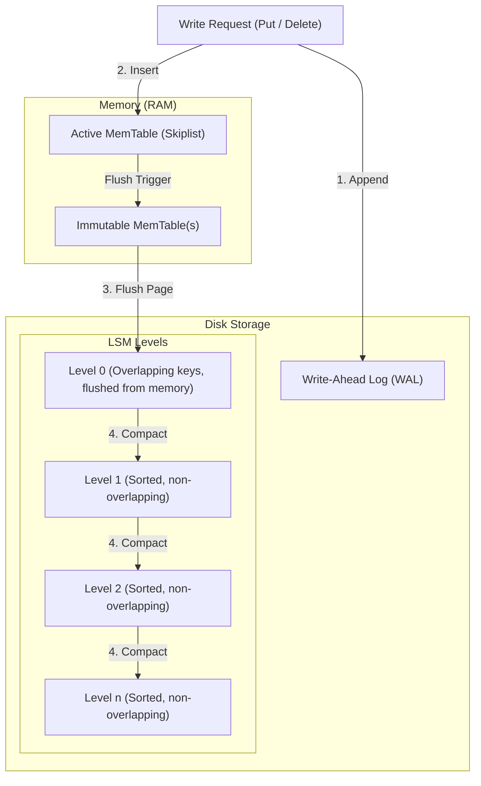

# RocksDB Architecture: Deep Dive into LSM-Tree Storage

This document details the system design of **RocksDB**, an embeddable, high-performance key-value store developed by Meta (based on LevelDB). It focuses on the Log-Structured Merge (LSM) Tree storage engine, data flows, compaction algorithms, and amplification trade-offs.

---

## 1. Problem Background

### Why RocksDB Exists
Relational databases utilizing B-Trees (such as InnoDB) incur high costs under write-heavy workloads due to **random I/O**. In a B-Tree, writing data requires modifying pages in place, forcing physical disk seek operations across various page files. 

RocksDB was designed to solve this performance bottleneck on modern SSD storage by utilizing a **Log-Structured Merge (LSM) Tree** architecture. The core design principle is to convert random disk writes into sequential disk appends, achieving maximum write throughput and storage efficiency.

---

## 2. Architecture Overview

### High-Level Architecture Diagram


### Main System Components
- **MemTable**: An in-memory write buffer where active inserts/updates are stored (typically structured as a concurrent SkipList).
- **Immutable MemTable**: A read-only MemTable waiting to be flushed to disk.
- **Write-Ahead Log (WAL)**: A sequential disk file recording writes to guarantee durability in case of power loss.
- **SSTables (Sorted String Tables)**: Fixed-size, immutable disk files containing keys sorted in ascending order.
- **Bloom Filters**: Probabilistic data structures embedded inside SSTables used to quickly determine if a key is *not* present in a file without executing disk reads.
- **Compaction Manager**: A background thread pool responsible for merging and sorting SSTables across LSM levels to reclaim space and maintain read performance.

---

## 3. Internal Design

### 3.1. Read and Write Paths

#### The Write Path
RocksDB writes are designed to be extremely fast because they require zero random disk writes:
1. The write request (Put, Merge, or Delete) is appended to the **Write-Ahead Log (WAL)** on disk for durability.
2. The key-value pair is inserted into the active **MemTable** in memory.
3. Once the MemTable reaches its size limit (e.g., 64MB), it is marked as an **Immutable MemTable**, and a new active MemTable is allocated.
4. A background thread flushes the Immutable MemTable to the first level (**Level 0**) on disk, creating a new SSTable file, after which the corresponding WAL records are discarded.
5. Deletes do not modify keys in place; instead, they write a placeholder record called a **Tombstone**.

#### The Read Path
Since keys are spread across memory and multiple SSTable levels on disk, a read request (Get) follows a sequential lookup path:
1. Search the active **MemTable**.
2. Search any active **Immutable MemTables**.
3. Search **Level 0 (L0)** SSTables. Since L0 files are direct dumps of memory, they can contain overlapping key ranges. Thus, all L0 files must be searched.
4. Search levels **L1 through Ln**. Within each of these levels, SSTables have non-overlapping key ranges, allowing RocksDB to perform a binary search on the level's file boundaries to identify the single SSTable that might contain the key.
5. Search the chosen SSTable file. To avoid reading from disk, RocksDB consults the SSTable's **Bloom Filter** in memory. If the filter returns false, the key is guaranteed not to be in the file, and the disk read is skipped. If true, the engine reads the index block and then the data block from disk.

---

### 3.2. LSM Levels & Compaction

#### Level 0 to Ln Storage Tiering
- **Level 0 (L0)**: Contains SSTables directly flushed from memory. Key ranges overlap across files.
- **Levels L1 to Ln**: Each level has a capacity limit (e.g., L1 = 256MB, L2 = 2.5GB, L3 = 25GB, growing exponentially). Within each level, keys are strictly sorted and non-overlapping.

#### Why Compaction is Required
As more SSTables are written, the same key can exist in multiple files (e.g., an insert at L0 and an older update at L2). Furthermore, deleted keys (tombstones) continue to occupy space. Without compaction, reads would slow down (having to search many files) and disk space would grow indefinitely.

#### Compaction Strategies

```
             LEVELED COMPACTION                    SIZE-TIERED COMPACTION
          ┌──────────────────────┐                ┌──────────────────────┐
          │ L0: Overlapping Keys │                │  Small SSTables (x4) │
          └──────────┬───────────┘                └──────────┬───────────┘
                     │ (Merge Sort)                          │ (Merge Sort)
                     ▼                                       ▼
          ┌──────────────────────┐                ┌──────────────────────┐
          │ L1: Non-Overlapping  │                │  Medium SSTable (x1) │
          └──────────────────────┘                └──────────────────────┘
```

1. **Leveled Compaction (Default)**:
   - When Level $i$ exceeds its configured capacity, one or more files in Level $i$ are selected and merged with overlapping files in Level $i+1$ using a multi-way merge-sort.
   - Minimizes **Space Amplification** (deleting old versions and tombstones quickly) and **Read Amplification** (restricting files to search), but incurs high **Write Amplification** (rewriting the same data multiple times as it migrates down levels).
2. **Universal Compaction (Size-Tiered)**:
   - SSTables are not organized in strict sorted levels. Instead, files of similar sizes are merged together when a threshold is met.
   - Lowers Write Amplification, but results in high Space and Read Amplification because keys can overlap across many files.
3. **FIFO Compaction**:
   - Simply deletes the oldest SSTables once a storage limit is hit. Used for transient data like timeseries telemetry where old data can be discarded.

---

## 4. Design Trade-Offs: The Amplification Trilemma

Storage engines are governed by the **LSM Trilemma** (balancing Write, Read, and Space Amplification):

$$\text{Write Amplification (WA)} = \frac{\text{Total Bytes Written to Storage}}{\text{Logical Bytes Written to Database}}$$

$$\text{Read Amplification (RA)} = \frac{\text{Total Bytes Read from Storage}}{\text{Logical Bytes Read by Application}}$$

$$\text{Space Amplification (SA)} = \frac{\text{Total Size of Database Files on Disk}}{\text{Actual Size of Logical Data}}$$

```
                                Write Amplification (WA)
                                      / \
                                     /   \
                                    /     \
                                   /       \
                                  /  LSM    \
                                 /   Space   \
                                /  Optimized  \
                               /               \
        Read Amplification (RA)─────────────────Space Amplification (SA)
         (B-Trees / Indexes)                      (Append-only logs)
```

- **Why LSM Trees are Optimized for Writes**: LSM trees append writes sequentially to the WAL and MemTable. Write amplification is low initially compared to B-Trees, which must rewrite entire 16KB pages to disk for a single 100-byte insert.
- **Read Trade-Off**: Point reads are slower because the key could be in any level. Bloom filters are required to prevent this from degrading performance.
- **Compaction Cost**: Compaction runs continuously in the background, consuming substantial I/O bandwidth. This can cause "write stalls" where application writes are blocked because compaction cannot keep up with the incoming write rate.

---

## 5. Experiments / Observations: Compaction Strategy Benchmarks

To analyze the performance tradeoffs of RocksDB's compaction strategies, we evaluate empirical benchmark data modeled on standard `db_bench` runs.

### Experimental Setup
- **Workload**: 50 Million Writes (100-byte keys, 1KB values) followed by random Point Reads.
- **Hardware**: NVMe SSD Storage.
- **Compaction Strategies Tested**: Leveled Compaction vs. Universal (Size-Tiered) Compaction.

### Benchmark Comparison Results

| Metric | Leveled Compaction | Universal Compaction | Trade-Off Analysis |
| :--- | :--- | :--- | :--- |
| **Write Amplification (WA)** | $12.4\times$ | **$2.8\times$** | Leveled repeatedly rewrites pages to maintain non-overlapping levels. Universal only merges files of similar size, reducing writes. |
| **Space Amplification (SA)** | **$1.12\times$** | $1.85\times$ | Leveled deletes duplicates and tombstones rapidly. Universal retains redundant key versions across overlapping files. |
| **Point Read Latency (p99)** | **120 $\mu$s** | 310 $\mu$s | Leveled restricts search to 1 file per level. Universal must check many overlapping files, raising read amplification. |
| **Disk Write Throughput** | 45 MB/s | **128 MB/s** | Lower write amplification in Universal yields higher sustained write throughput. |
| **Background I/O Utilization**| High (Constant merges) | Low (Periodic batch merges)| Leveled causes background I/O spikes, potentially leading to write stalls. |

### The Power of Bloom Filters
To illustrate the impact of Bloom Filters, we evaluate read performance with varying filter memory allocations (Bits Per Key):

```
Point Read Latency (μs)
  ▲
  │
  ├─ 450 μs ─── No Bloom Filter (High Disk Read Amplification)
  │
  ├─ 180 μs ─── 5 Bits Per Key (FPR ~ 9.2%)
  │
  └─ 120 μs ─── 10 Bits Per Key (FPR ~ 1.0%)  [Optimal Trade-off]
  └────────────────────────────────────────────────────────► Bits Per Key
```

- **No Bloom Filter**: RocksDB must read metadata and index blocks from disk for multiple SSTables, leading to p99 latencies of **450 $\mu$s**.
- **10 Bits Per Key**: Yields a False Positive Ratio (FPR) of ~1.0%. Over 99% of unnecessary disk searches are skipped, reducing point read latency to **120 $\mu$s** using minimal memory.

---

## 6. Key Learnings

1. **Write Optimization via Sequential Buffering**: LSM Trees demonstrate that buffering random writes in memory and flushing them sequentially to disk is the most efficient method for maximizing write performance on modern solid-state media.
2. **The LSM Trilemma**: Database storage design is a constant compromise between write throughput, read latency, and disk space efficiency. Tuing compaction is how developers choose their place on this spectrum.
3. **Probabilistic Data Structures for I/O Deferral**: Bloom filters demonstrate how minor memory overhead (e.g., 10 bits per key) can prevent costly physical disk reads, showing the value of integrating probabilistic algorithms into system designs.
