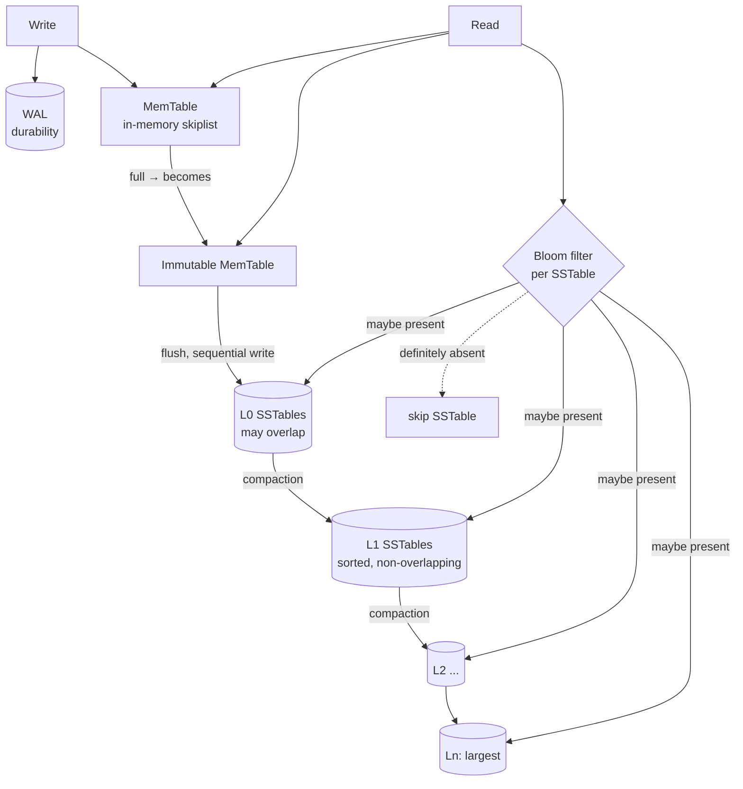

# RocksDB Architecture (LSM-Tree Storage Engine)

> RocksDB is an embeddable, high-performance key-value store built on a **Log-Structured Merge-tree (LSM-tree)**. It trades read and space efficiency for exceptional write throughput by turning random writes into sequential ones. All experiments below ran live against **RocksDB `db_bench` 7.8.3** (Debian `rocksdb-tools`) on 1,000,000 key-value pairs.

---

## 1. Problem Background

RocksDB was created at Facebook (2012), forked from Google's LevelDB, to serve **write-heavy, flash-based** workloads: message queues, metadata stores, stream processing state, and storage backends (MySQL's MyRocks, CockroachDB, TiKV, Kafka Streams).

The motivating problem: **B-trees are bad at high-volume random writes.** A B-tree updates pages in place, so a random insert may require a random read-modify-write of a disk/SSD page. On flash this also causes heavy write amplification at the device level and wears the drive. The LSM-tree answers this by **never updating in place**: all writes are appended to memory and flushed sequentially, with reorganization deferred to background **compaction**. This optimizes the write path at the cost of making reads and space management harder, the central trade-off of the whole design.

---

## 2. Architecture Overview



**Write path:** every write goes to the **WAL** (for crash recovery) and the in-memory **MemTable** (a sorted skiplist). When the MemTable fills, it becomes **immutable** and a new one takes over; a background thread **flushes** the immutable MemTable to an **SSTable** in **L0** as one sequential write. Compaction later merges SSTables down through levels L1…Ln.

**Read path:** a lookup checks the MemTable, then the immutable MemTable, then SSTables from L0 downward. Each SSTable has a **Bloom filter** that is consulted first, if it says "key absent", the SSTable is skipped without any I/O. A key may exist in several levels (newer wins), so reads may touch multiple files: this is **read amplification**.

---

## 3. Internal Design

### 3.1 MemTable, immutable MemTable, WAL
Writes land in the **MemTable** (default: a skiplist allowing sorted iteration and `O(log n)` insert) and are simultaneously appended to the **WAL**. When the MemTable reaches `write_buffer_size`, it is frozen into an **immutable MemTable** and a fresh MemTable serves new writes, so writes never block on flushing. On crash, the WAL replays whatever had not yet been flushed to an SSTable.

### 3.2 SSTables and levels (L0 → Ln)
A flushed MemTable becomes a **Sorted String Table (SSTable)**: an immutable file of key-value pairs sorted by key, with a block index and a Bloom filter. RocksDB organizes SSTables into levels of geometrically increasing size:
- **L0** holds freshly-flushed files that **may overlap** in key range (a read may check all of them).
- **L1…Ln** are kept **sorted and non-overlapping** within each level, so a read touches at most one file per level.

**Experiment: the level structure after loading 1M keys (level compaction):**
```text
Level  Files   Size      W-Amp
  L0    2/0    9.15 MB    1.0
  L1    1/1   40.64 MB    1.4
  L2    2/2   82.61 MB    2.0
 Sum    5/3  132.40 MB    3.2
```
Five SSTables formed a 3-level tree; data cascades downward as levels fill.

### 3.3 SSTable internals
```text
$ sst_dump --file=<one>.sst --show_properties
  # entries          : 378477
  raw key size       : 9,083,448
  raw value size     : 96,890,112
  data block size    : 67,109,498        # < raw value: compressed
  SST compression    : Snappy
```
Each SSTable is self-describing: sorted data blocks, an index, and (when enabled) a Bloom filter, with block-level **Snappy** compression (96 MB of raw values stored in 67 MB of data blocks).

### 3.4 Bloom filters: the key to LSM reads
A Bloom filter is a compact probabilistic structure that answers "is this key in this SSTable?" with **no false negatives** (if it says absent, it *is* absent) and a tunable false-positive rate. RocksDB checks it before reading any SSTable block, so most levels that don't contain the key are skipped without I/O. This is what makes point lookups in a multi-level LSM tractable.

### 3.5 Compaction
**Compaction** is the background process that merges SSTables, discards overwritten/deleted keys, and pushes data to larger levels to keep the tree shallow and read-efficient. It is the price paid for cheap writes: the same data is rewritten multiple times as it migrates down levels, **write amplification**. Two main strategies:
- **Level compaction** (default): merges a file into the next level, keeping each level non-overlapping. Lower space amplification, higher write amplification.
- **Universal compaction**: merges runs more lazily. Lower write amplification, higher space amplification.

---

## 4. The Three Amplifications (with measurements)

LSM design is governed by a trilemma, you cannot minimize all three at once.

| Amplification | Meaning | Measured (level compaction) |
|---|---|---|
| **Write** | bytes written to disk ÷ bytes of user data | **W-Amp 3.2** (≈386 MB compaction writes + 177 MB flush writes for 0.27 GB ingested) |
| **Read** | SSTables/blocks examined per lookup | reads may touch MemTable + multiple levels; Bloom filters cut the I/O (below) |
| **Space** | bytes on disk ÷ bytes of live data | 137 MB physical for ~270 MB raw user data (Snappy compression + level layout) |

### Experiment A: write amplification: level vs universal compaction
```text
                       fillrandom         W-Amp   compaction writes
level   (style 0)   :  126,167 ops/s       3.2      386 MB
universal (style 1) :  143,594 ops/s       3.0      354 MB
```
Universal compaction wrote less (lower W-Amp 3.0 vs 3.2) and ingested faster, at the cost of higher space usage, exactly the documented trade-off.

### Experiment B: Bloom filters slash read amplification
```text
readrandom WITH bloom (10 bits/key) :  97,769 ops/s   10.2 micros/op
readrandom WITHOUT bloom (0 bits)   :  54,605 ops/s   18.3 micros/op
rocksdb.bloom.filter.useful         :  547,380   <- SSTable reads avoided
```
The Bloom filter delivered **~1.8× read throughput** and avoided **547,380** SSTable lookups for keys not present in those files. Without it, every level must be probed on disk, halving throughput.

---

## 5. Design Trade-Offs

| Decision | Benefit | Cost |
|---|---|---|
| **Out-of-place writes (LSM)** | Sequential writes → very high write throughput; flash-friendly | Reads/space get harder; needs compaction |
| **Memtable + WAL** | Fast in-memory writes, durable via WAL | WAL is a second write; recovery replays it |
| **Leveled SSTables** | Bounded reads (1 file/level below L0); compact | Write amplification from re-writing data downward |
| **Bloom filters** | Avoid most disk reads for absent keys; make point lookups fast | Memory per key (~10 bits); useless for range scans |
| **Compaction (level)** | Low space amplification, predictable reads | High, bursty write amplification & CPU/IO |
| **Compaction (universal)** | Low write amplification | High space amplification (transient 2× disk) |
| **Block compression (Snappy)** | Smaller on-disk footprint | CPU on read/write; slight latency |

### Why compaction can become expensive
Compaction rewrites data every time it moves down a level. With L levels and a fan-out, each byte may be rewritten ~L times, our small DB already showed W-Amp 3.2. Under sustained writes, compaction competes with foreground traffic for CPU and I/O, causing **write stalls** if L0 accumulates faster than it can be drained. Tuning compaction is the central operational challenge of any LSM store.

---

## 6. Key Learnings

- **LSM trees are a write-optimized bet.** By appending to memory and flushing sequentially, RocksDB hit 126k–143k random-write ops/s; a B-tree would pay random-I/O per insert. The cost is paid later, in compaction.
- **The three amplifications are a budget, not a goal.** The level-vs-universal experiment made the write/space trade-off concrete: universal cut W-Amp 3.2 → 3.0 but uses more disk. You pick which amplification to spend.
- **Bloom filters are what make LSM reads viable.** Turning them off nearly **halved** read throughput (97.8k → 54.6k ops/s) and forced 547k extra SSTable probes. The single most important read optimization in the design.
- **Compaction is both the hero and the villain.** It keeps reads bounded and reclaims space, but it *is* the source of write amplification and write stalls, every LSM tuning conversation is really about compaction.
- **Surprising observation:** even an "absent" key lookup costs Bloom-filter checks across levels; and our DB stored 270 MB of user data in 137 MB on disk, showing how block compression interacts with space amplification to sometimes make physical size *smaller* than logical, the opposite of the naive "LSM wastes space" intuition.

### Why LSM trees are preferred in write-heavy workloads
All writes are sequential appends (MemTable + WAL flush), there is no in-place page update, and expensive reorganization is deferred to background compaction off the write path. This is ideal for ingest-heavy systems (logs, metrics, queues, KV state) on SSDs, which is why RocksDB underpins MyRocks, TiKV, CockroachDB, and Kafka Streams.

---

### Reproducing
```bash
docker run -d --name rocks debian:12 sleep 3600
docker exec rocks bash -c "apt-get update && apt-get install -y rocksdb-tools"
docker exec rocks db_bench --db=/tmp/d --benchmarks=fillrandom,stats \
  --compaction_style=0 --num=1000000 --value_size=256 --statistics
# add --bloom_bits=10 vs 0 and --benchmarks=fillrandom,readrandom for the read test
```
*Engine: RocksDB 7.8.3 `db_bench` (Debian rocksdb-tools, Docker). Sources: RocksDB Wiki (Architecture Guide, Leveled/Universal Compaction, Bloom Filters), the original LSM-tree paper (O'Neil et al., 1996), and LevelDB design notes.*
