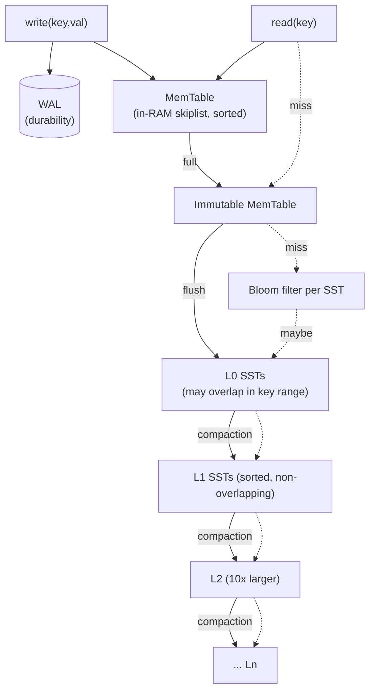
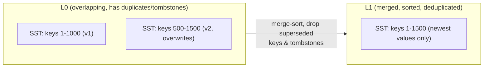

# RocksDB — LSM-Tree Storage Architecture

> Every database so far (SQLite, PostgreSQL, InnoDB) is a **B-tree** system: update data
> structures *in place* on disk. RocksDB is the opposite philosophy — a **Log-Structured
> Merge tree** that *never updates in place*. It turns random writes into sequential writes
> and pays for it later, during **compaction**. This document traces a write through the
> LSM and shows real SST files merging.

All output below was captured on **RocksDB 11.1.1** using the `ldb` admin tool.

---

## 1. Problem Background

RocksDB (Facebook, 2012) is a fork of Google's LevelDB, built for **write-heavy, flash-storage** workloads — think the storage engine *under* other systems (MySQL's MyRocks, CockroachDB, TiKV, Kafka Streams state stores).

The motivating problem: **B-trees are bad at sustained random writes.** Updating a B-tree means reading a page, modifying it, and writing it back at a random location — every write is a random I/O, and the write-ahead log doubles it. On a write-saturated workload that random-I/O pattern is the bottleneck.

The LSM-tree's answer: **never write randomly.** Buffer writes in memory, then flush them as large *sequential* files. Reconcile the resulting mess in the background. This is a fundamentally different point on the [read, write, space] amplification triangle than a B-tree.

---

## 2. Architecture Overview



**Write path:** append to **WAL** (durability) + insert into the in-memory **MemTable** (a sorted skiplist). When the MemTable fills, it becomes **immutable** and a new one takes over; the immutable one is **flushed** to disk as a sorted **SSTable (SST)** at **level 0**. Background **compaction** merges L0 files into L1, L1 into L2, etc., each level ~10× larger than the one above.

**Read path:** check MemTable → immutable MemTable → L0 → L1 → … → Ln, stopping at the first hit. A **Bloom filter** per SST lets a level be skipped without any disk read when the key is definitely absent.

---

## 3. Internal Design

### 3.1 MemTable → Immutable MemTable → SSTable

The MemTable is a sorted in-memory structure (skiplist by default) absorbing all writes. Crucially, an **update or delete is just another insert** — a newer entry for the same key, or a **tombstone**. Nothing is modified in place, ever.

When full, it freezes (immutable) so writes never stall, and is flushed to an immutable, sorted **SST file**. We can watch flushes create L0 files: loading six batches of 2000 keys each (with deliberate overwrites of earlier keys) produced SST files on disk:

```
$ ldb --db=lsmdb --create_if_missing --disable_wal load < batch.txt   (x6 batches)
$ ls lsmdb/*.sst
000036.sst  (26812 bytes)
000037.sst  (18366 bytes)
000044.sst  (18358 bytes)
SST count BEFORE manual compaction: 3
$ ldb --db=lsmdb dump   ->  "Keys in range: 6000"   (12000 written, 6000 logically distinct)
```

Note: 12 000 key-writes (with 6000 of them overwriting earlier keys) collapsed to **6000 logically distinct keys**, already merged by *automatic* background compaction into 3 SSTs. The duplicates aren't gone from disk yet — they're superseded entries that compaction will physically drop.

### 3.2 SSTable structure & Bloom filters

An SST is an **immutable, sorted** file of key→value blocks, plus an index block and (optionally) a **Bloom filter** block. The Bloom filter is the key to making reads tolerable in an LSM:

- A read may have to consult *many* SSTs across many levels.
- Before doing any I/O on an SST, RocksDB queries its Bloom filter: *"could key K be in here?"*
- If the filter says **no** (definitely absent), that SST is skipped with **zero disk reads**.
- If it says **maybe**, RocksDB reads the index + data block.

A Bloom filter never produces false negatives, so this is safe; its (tunable) false-positive rate just causes occasional wasted reads. Without it, a point lookup for a non-existent key would have to touch every level — Bloom filters convert that into an in-RAM bit-check.

### 3.3 L0 → Ln levels and compaction

The level invariant: **L0 SSTs may have overlapping key ranges** (they're just flushed MemTables), but **L1 and below are each fully sorted and non-overlapping**. Compaction is what maintains this:



**Forcing a full compaction** on our DB physically merged everything and dropped the superseded entries:

```
$ du -ch lsmdb/*.sst        ->  Total SST bytes BEFORE: 68K  (3 files)
$ ldb --db=lsmdb compact
$ ls lsmdb/*.sst            ->  000051.sst  (39578 bytes)
$ du -ch lsmdb/*.sst        ->  Total SST bytes AFTER : 40K  (1 file)
```

**68K / 3 files → 40K / 1 file.** The ~40% shrink is exactly the obsolete overwritten values being garbage-collected during the merge — the LSM equivalent of VACUUM. And lookups still return the **newest** value, proving merge correctly resolved version conflicts by recency:

```
$ ldb --db=lsmdb get key00100500     ->  v06_01500   (overwritten across 6 batches; newest wins)
$ ldb --db=lsmdb get key00600000     ->  v06_00000   (a batch-6 fresh key)
```

### 3.4 WAL

Like every other system here, RocksDB writes a **WAL** before acknowledging a write, so an unflushed MemTable survives a crash (replayed on restart). With `--disable_wal` (used above for bulk load speed) that guarantee is traded away for throughput — a legitimate choice for rebuildable/bulk data.

---

## 4. Design Trade-Offs — the amplification triangle

LSM design is the art of balancing three competing costs:

| Amplification | Definition | LSM behavior |
|---|---|---|
| **Write** | bytes written to disk ÷ bytes of user data | **High** — each key is rewritten every time it moves down a level during compaction |
| **Read** | I/Os per logical read | **Higher than B-tree** — a key may live in any level; mitigated by Bloom filters + caching |
| **Space** | disk used ÷ live data size | **Temporarily high** — superseded values & tombstones linger until compaction (we saw 68K→40K) |

**Compaction is the central trade-off knob**, and the two main strategies trade these against each other:

- **Leveled compaction** (default): aggressive merging keeps few overlapping files per level → **low read & space amplification**, but **high write amplification** (data rewritten repeatedly as it sinks).
- **Universal / tiered compaction**: merges less often → **low write amplification**, but **high space & read amplification** (more files to search, more dead data retained).

> There is no free lunch: **you cannot minimize write, read, and space amplification simultaneously** — improving one worsens another. Choosing a compaction strategy *is* choosing which amplification your workload can least afford.

**Why LSM beats B-tree on writes:** all writes are sequential appends (MemTable flush + compaction output are large sequential I/Os), versus a B-tree's random in-place page updates. On flash/SSD and write-heavy workloads this is a decisive win. **Why compaction is expensive:** it reads whole SSTs and rewrites merged output — pure background I/O and CPU that competes with foreground traffic, and can cause latency spikes ("compaction stalls") if it can't keep up with ingest.

**Compared to the B-tree systems in this repo:** PostgreSQL/InnoDB optimize for **balanced read/write with in-place updates**; RocksDB optimizes for **write throughput and write-once-sequential storage**, accepting read and space amplification that it claws back with Bloom filters and background compaction.

---

## 5. Experiments / Observations

| Observation | Measured result | Interpretation |
|---|---|---|
| Flush creates SSTs | 6 batches → 3 L0 SSTs (auto-compacted) | each MemTable flush = one immutable sorted file |
| Logical dedup | 12 000 writes → **6000 distinct keys** | overwrites are new entries, not in-place edits |
| Compaction reclaims space | **68K / 3 files → 40K / 1 file** (~40% smaller) | superseded values & tombstones dropped on merge — LSM's "VACUUM" |
| Version resolution | overwritten key returns `v06` (newest) | merge resolves conflicts by recency |
| WAL | `--disable_wal` used for bulk speed | durability traded for throughput, by choice |

**On the recommended `db_bench` exercise:** the canonical way to quantify write/read/space amplification is RocksDB's `db_bench` (e.g. `--benchmarks=fillrandom,readrandom` under `leveled` vs `universal` compaction). The Homebrew RocksDB 11.1.1 build ships the admin tools (`ldb`, `sst_dump`) but not `db_bench`, so the amplification story here is demonstrated **directly from disk** — observing real SST files accumulate at L0 and then shrink/merge under compaction — rather than from a synthetic benchmark. The 68K→40K compaction result *is* a measurement of space amplification being reclaimed.

---

## 6. Key Learnings

1. **"Never update in place" is the whole idea.** Inserts, updates, and deletes are all just *appends* (the last being a tombstone). This is why writes are fast and sequential — and why you need compaction to ever reclaim space.
2. **Compaction is the LSM's garbage collector** — and it's directly observable: forcing it shrank our DB 68K→40K by dropping superseded values, while lookups still returned the newest version. This is conceptually the **same job as PostgreSQL's VACUUM**, just structural rather than tuple-by-tuple.
3. **Bloom filters make LSM reads viable.** Without them, every point lookup risks touching every level; with them, absent keys are rejected by an in-RAM bit-check. They're not an optimization detail — they're load-bearing.
4. **The amplification triangle is the real design space.** You pick a compaction strategy to choose *which* amplification (write, read, or space) your workload tolerates least — there is no setting that minimizes all three.
5. **LSM and B-tree are answers to different questions.** B-trees (PostgreSQL/InnoDB) give balanced, read-friendly, in-place storage. LSM trees (RocksDB) give write-optimized, sequential-only storage. The right choice is dictated by the read/write ratio and the storage medium — which is why RocksDB shows up underneath so many write-heavy distributed systems.

---

### References
- RocksDB Wiki — *RocksDB Overview*, *Leveled Compaction*, *Universal Compaction*, *Bloom Filters*: https://github.com/facebook/rocksdb/wiki
- O'Neil et al. (1996), *The Log-Structured Merge-Tree (LSM-Tree)* — the original paper
- Mark Callaghan, *Read, write & space amplification* — the amplification-triangle framing
- LevelDB design docs (RocksDB's ancestor)

*All `ldb` load/compact/get output and SST file sizes above are live capture from RocksDB 11.1.1.*
