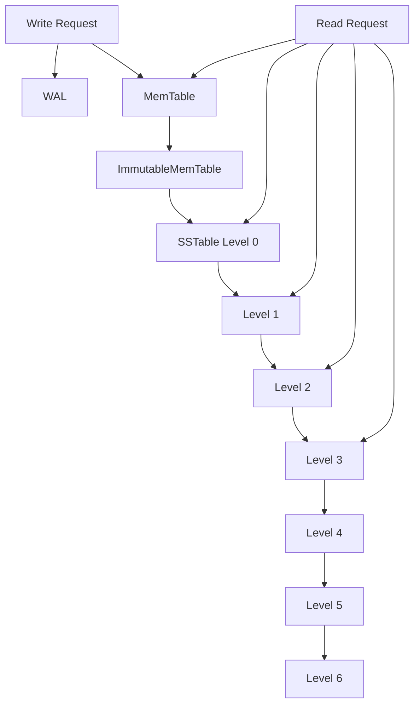

# RocksDB Architecture

## 1. Problem Background

RocksDB is a high-performance key-value storage engine developed by Facebook. It is based on the Log Structured Merge Tree (LSM Tree) architecture and is optimized for write-heavy workloads.

Traditional B-Tree based databases update data in-place, which can become expensive under high write rates. RocksDB takes a different approach by buffering writes in memory and performing sequential disk writes, improving write throughput while accepting additional complexity during reads and compaction.

RocksDB is widely used in systems such as caching layers, stream processing engines, distributed storage systems, and metadata services where write performance is critical.

The objective of this study was to understand how RocksDB manages writes, reads, storage organization, and compaction, and to observe the trade-offs introduced by the LSM-tree architecture.

---

# 2. Architecture Overview

## High-Level Architecture



---

## Main Components

| Component          | Purpose                           |
| ------------------ | --------------------------------- |
| WAL                | Durability before flushing        |
| MemTable           | In-memory write buffer            |
| Immutable MemTable | Waiting to be flushed             |
| SSTables           | Immutable disk files              |
| Bloom Filters      | Reduce unnecessary disk reads     |
| Compaction         | Merge and reorganize SSTables     |
| Levels (L0-Ln)     | Hierarchical storage organization |

---

# 3. Internal Design

## 3.1 Write Path

The RocksDB write path follows:

```text
Write
  ↓
WAL
  ↓
MemTable
  ↓
Immutable MemTable
  ↓
SSTable (Level 0)
```

### WAL

Every write is first recorded in the Write Ahead Log.

Purpose:

* Durability
* Crash recovery

If the system crashes before data reaches disk, RocksDB can replay the WAL.

---

### MemTable

Writes are stored in memory inside a MemTable.

Observation during benchmarking:

```text
Memtablerep: SkipListFactory
```

The MemTable uses a Skip List structure to maintain sorted keys.

Advantages:

* Fast insertion
* Sorted order maintained

---

### Immutable MemTable

When the MemTable becomes full:

```text
MemTable
     ↓
Immutable MemTable
```

The immutable MemTable stops accepting writes and is scheduled for flushing.

---

### SSTables

Flushing produces SSTables.

Characteristics:

* Immutable
* Sorted
* Sequentially written

This is one of the reasons RocksDB achieves high write throughput.

---

## 3.2 LSM Levels

RocksDB organizes SSTables into levels.

Observation:

```text
Level 0
Level 1
Level 2
Level 3
Level 4
Level 5
Level 6
```

The database contains the standard leveled storage hierarchy.

### Purpose

Level organization reduces:

* Read amplification
* Space amplification

while maintaining good write performance.

---

## 3.3 Compaction

Compaction is the process of merging SSTables and moving data between levels.

Example:

```text
L0 SSTs
    ↓
Merge
    ↓
L1 SSTs
```

Without compaction:

* Too many SST files accumulate.
* Reads become slower.
* Storage usage increases.

### Why Compaction Is Necessary

Advantages:

* Reduces duplicate keys
* Improves read performance
* Improves storage efficiency

Trade-offs:

* Additional CPU usage
* Additional disk I/O
* Write amplification

---

## 3.4 Read Path

Reads may check multiple structures.

```text
MemTable
   ↓
Immutable MemTable
   ↓
Level 0
   ↓
Level 1
   ↓
Level 2
   ...
```

Because data may exist in multiple levels, reads can be more expensive than writes.

This is one of the fundamental trade-offs of LSM trees.

---

## 3.5 Bloom Filters

Bloom Filters help reduce unnecessary SSTable lookups.

Instead of opening every SSTable:

```text
Bloom Filter
      ↓
Probably Present
```

or

```text
Definitely Not Present
```

This significantly improves read performance.

Advantages:

* Fewer disk accesses
* Faster negative lookups

Trade-off:

* Additional memory usage
* False positives possible

---

# 4. Benchmark Experiments

All benchmarks were executed using RocksDB's db_bench utility.

Dataset:

```text
100000 key-value entries
```

Compression:

```text
NoCompression
```

---

## Experiment 1: Write-Heavy Workload

Command:

```bash
db_bench --benchmarks=fillrandom
```

Result:

```text
47008 ops/sec
5.2 MB/s
100000 operations
```

### Observation

Random write throughput remained high because writes were first absorbed by the MemTable and WAL before being flushed to disk.

This demonstrates why LSM trees are considered write-optimized structures.

---

## Experiment 2: Read-Heavy Workload

Command:

```bash
db_bench --benchmarks=readrandom
```

Result:

```text
778046 ops/sec
1.284 microseconds/op
```

### Observation

Read throughput was significantly higher than write throughput for this small dataset.

The entire working set was likely cached, reducing disk access costs.

---

## Experiment 3: Mixed Read/Write Workload

Command:

```bash
db_bench --benchmarks=readwhilewriting
```

Result:

```text
193584 ops/sec
2.4 MB/s
```

### Observation

Performance decreased compared to pure reads because the system handled reads, writes, and background maintenance simultaneously.

This demonstrates the overhead introduced by compaction and concurrent write activity.

---

# 5. Amplification Analysis

## Write Amplification

Write amplification occurs because data is rewritten multiple times during compaction.

Example:

```text
Write once
Flush to SST
Compaction
Rewritten to higher level
```

A single logical write may result in multiple physical writes.

---

## Read Amplification

Reads may need to examine:

```text
MemTable
Level 0
Level 1
Level 2
...
```

before locating a key.

Bloom Filters reduce this cost.

---

## Space Amplification

Duplicate versions and overlapping SSTables may temporarily consume additional disk space.

Compaction eventually reclaims this space.

---

# 6. Design Trade-Offs

## Advantages

* Excellent write throughput
* Sequential disk writes
* Efficient ingestion of large datasets
* Scales well for write-heavy workloads

---

## Disadvantages

* Compaction overhead
* Write amplification
* More complex read path
* Additional storage overhead during compaction

---

# 7. Comparison with B-Tree Databases

| Feature                | RocksDB (LSM Tree)    | PostgreSQL / InnoDB (B-Tree) |
| ---------------------- | --------------------- | ---------------------------- |
| Write Performance      | High                  | Moderate                     |
| Read Complexity        | Higher                | Lower                        |
| Update Method          | Append + Compaction   | In-place or MVCC             |
| Storage Layout         | SSTables              | Pages                        |
| Background Maintenance | Compaction            | VACUUM / Purge               |
| Best Use Case          | Write-heavy workloads | General OLTP workloads       |

---

# 8. Key Learnings

1. RocksDB is optimized primarily for write-intensive workloads.

2. Writes follow the path: WAL → MemTable → SSTable.

3. SSTables are organized into multiple levels to balance read and write efficiency.

4. Compaction is the most important background process in an LSM-tree system.

5. Bloom Filters reduce unnecessary disk lookups and improve read performance.

6. LSM trees achieve high write throughput by avoiding random in-place updates.

7. The main trade-off is that write optimization introduces read amplification, space amplification, and compaction overhead.

8. RocksDB demonstrates how engineering decisions involve balancing competing goals rather than maximizing a single metric.

---

# References

1. RocksDB Official Documentation

2. Facebook RocksDB Wiki

3. RocksDB Source Code

4. "The Log Structured Merge Tree (LSM Tree)" – O'Neil et al.

5. RocksDB db_bench Documentation
