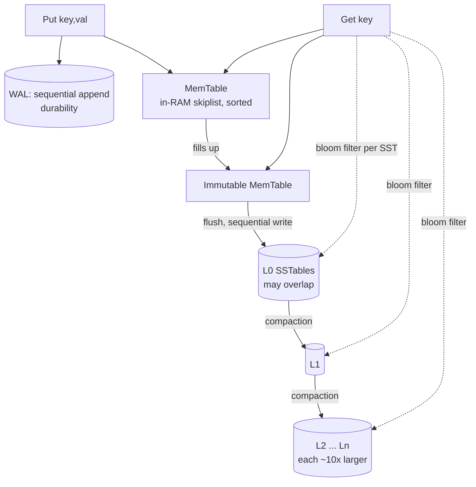

# RocksDB — LSM-Tree Storage Architecture

> RocksDB takes the opposite bet from every B-tree engine in this repo. A B-tree updates data **in place** (random writes, read-optimized). RocksDB **never updates in place** — it only ever *appends*, then reorganizes in the background. That single decision makes it write-optimized and is the source of every trade-off below. I measured all three amplifications (write / read / space) on a real **RocksDB 11.1.1** instance with a small C++ program linked against `librocksdb` (`amp_bench.cpp`); raw output is in `bench_results.txt` and `bench_natural.txt`.

> Context: this is also my MiniDB capstone track (Track C: LSM), so this writeup is the theory behind the engine I'm building.

---

## 1. Problem Background

LSM-trees (Log-Structured Merge-tree, O'Neil et al. 1996) exist because of one hardware fact: **sequential writes are vastly faster than random writes**, on spinning disks *and* on SSDs (random writes also wear flash and trigger garbage collection). A B-tree that updates a row in place must do a **random write** to wherever that page lives. Under a write-heavy workload — metadata stores, time-series, message queues, write-back caches — that random I/O becomes the bottleneck.

RocksDB (Facebook, 2012; forked from Google's LevelDB) answers: *turn every write into a sequential append, and pay the cost later, in the background, in bulk.* It's an embedded key-value library (like SQLite in deployment model, but a totally different storage engine) and is the backend under MyRocks, CockroachDB, TiKV, Kafka Streams, and many others.

---

## 2. Architecture Overview



**Write path:** append to WAL (crash safety) → insert into in-memory **MemTable** (a sorted skiplist). When the MemTable fills, it becomes **immutable**, a new one takes over, and the immutable one is **flushed** to disk as a sorted, immutable **SSTable** at **L0**. Every disk write is sequential.

**Read path:** check MemTable → immutable MemTable → L0 SSTables → L1 → … → Ln, newest to oldest, stopping at the first hit. Because a key can live in several places, reads consult a **Bloom filter** per SSTable first to skip files that definitely don't contain the key.

**Compaction** is the background process that merges SSTables from level *Lk* into *Lk+1*, dropping overwritten and deleted keys, keeping each level sorted and size-bounded. It's what keeps reads and space from degrading — and it's the main cost of the LSM design.

---

## 3. Internal Design

### 3.1 MemTable & WAL
Writes go to two places: the **WAL** (so a crash before flush loses nothing) and the **MemTable** (sorted skiplist for fast ordered access). In my run, 1M puts wrote **124 MB of WAL** and **109.9 MB of flushed data** to L0 — both purely sequential.

### 3.2 SSTables (Sorted String Tables)
An SSTable is an **immutable** on-disk file of key→value pairs **sorted by key**, with a block index and a Bloom filter baked in. Immutability is the key property: files are never modified, only created and deleted. That's what makes flushes and compactions pure sequential I/O and makes concurrency easy (readers never see a half-written file).

### 3.3 The level structure (L0 → Ln)
- **L0** holds files flushed straight from MemTables; they **can overlap** in key range (a key may be in several L0 files).
- **L1…Ln**: within each of these levels, key ranges are **non-overlapping**, and each level is ~**10× larger** than the one above.

Captured natural level distribution (leveled compaction, no forced full compaction):
```
Level Files Size(MB)
  0      2       7       <- fresh flushes, overlapping
  5      9      34
  6     15      56       <- bottom level holds the bulk of the data
```
A key being in at most one file per level (L1+) bounds read work; L0 overlap is bounded by triggering compaction once a few L0 files pile up.

### 3.4 Bloom filters — the read-path saver
Without Bloom filters, a point lookup for a missing key would have to check an SSTable at *every* level. A **Bloom filter** (here 10 bits/key) is a compact probabilistic set: it can say *"definitely not here"* (skip the file, no disk read) or *"maybe here"* (must check). It never produces false negatives. Measured effect on 100k lookups (80% for missing keys):
```
bloom filter useful (skips): 158546    <- file checks the bloom answered as "not present"
bloom full-positives:         21088    <- bloom said "maybe", key really was there
data blocks read from disk:   62022
```
The Bloom filter eliminated **~159k** would-be SSTable probes — without it, those negative lookups would each fan out across L0/L5/L6 and hammer the disk.

### 3.5 Compaction
Compaction merges overlapping/adjacent SSTables, discards superseded versions and tombstones (deletes), and writes fresh non-overlapping files one level down. It's *why* the engine stays fast, and it's the dominant background cost. Two strategies, measured below:
- **Leveled** (default): keeps each level tightly non-overlapping → low space amplification, low read amplification, **higher write amplification** (data is rewritten as it descends levels).
- **Universal** (tiered): merges similarly-sized files lazily → **lower write amplification**, but higher space and read amplification.

---

## 4. Design Trade-Offs — the amplification triangle

The defining concept of LSM tuning is **the RUM trade-off**: you cannot minimize Read, Update (write), and Memory/space amplification all at once — improving one worsens another. I measured all three. Two configurations of the *same* 1M-key workload:

| | Leveled (settled) | Leveled (natural) | Universal (natural) |
|---|---|---|---|
| Write amplification | **3.75×** | 2.36× | **2.36 / 3.21×** |
| Space amplification | **1.00×** | **1.99×** | 1.63× |
| Compaction bytes written | 301 MB | 149 MB | 148 MB |

Reading this table is the whole lesson:

- **Write amplification** = bytes actually written to storage ÷ logical bytes from the app. My 109 MB of user data caused **301 MB** of compaction writes when fully compacted (3.75×): each key gets rewritten several times as it migrates L0→…→L6. This is the price of the LSM design — but those writes are **sequential**, which is the point.
- **Space amplification** = on-disk size ÷ live data size. In the *natural* (steady-state) run, on-disk was **1.99×** the live data — old/overwritten versions hadn't been compacted away yet. After **forcing full compaction**, on-disk dropped to exactly the live data (**1.00×**).
- **The trade-off, in one comparison:** forcing full compaction took space amp from 1.99× → **1.00×** but pushed write amp from 2.36× → **3.75×**. *You pay extra writes to reclaim space.* That is the LSM tuning knob in a nutshell.
- **Leveled vs Universal:** universal did **less** compaction write work (write amp 3.21× vs leveled's 3.75× when settled) but left **more** space slack and overlapping files (more to read). Write-heavy + space-tolerant → universal; read/space-sensitive → leveled.

**Read amplification** is the third corner: a point read may consult MemTable + several SSTables across levels, so reads do more work than a B-tree's single root-to-leaf descent. Bloom filters (§3.4) are what keep it manageable — they turn "check every level" into "check only the level(s) that might have the key."

**vs B-trees (every other engine in this repo).** B-tree: read-optimized (one descent), write-heavy (random in-place writes), low space amp. LSM: write-optimized (sequential appends), read-amplified (multi-level + bloom), tunable space amp. Same data-structure-vs-workload trade-off, opposite default.

---

## 5. Experiments / Observations

Workload: 1,000,000 `Put`s of 15-byte keys / 100-byte values in random key order (≈110 MB logical), no compression (to isolate amplification from compression), 8 MB MemTable to force many flushes.

1. **Writes are sequential and amplified.** 109.9 MB flushed to L0 + 301.7 MB of compaction writes = **3.75× write amplification** under leveled compaction. The engine traded extra total bytes for the fact that every one of those bytes was written sequentially.
2. **Space amplification is a knob, not a constant.** Steady-state leveled = **1.99×** on disk; after `CompactRange` (force full compaction) = **1.00×**. Same data, different point on the trade-off curve.
3. **Leveled vs universal, head to head.** Universal wrote ~50 MB less during compaction (write amp 3.21× vs 3.75×) but kept higher space amp — exactly the documented behavior of tiered vs leveled.
4. **Bloom filters dominate the read path.** On 100k lookups (mostly misses), the Bloom filter skipped **~159k** SSTable probes. Of the lookups, ~21k were "full positives" (key actually present) — i.e. Bloom's false-positive rate was low and most disk reads it allowed were productive.
5. **Levels behave as advertised.** The natural run spread data across L0 (fresh, overlapping), L5, and L6, with L6 holding the bulk (56 MB of 87 MB) — the classic pyramid where the bottom level dwarfs the rest.

> Note on method: Homebrew's `rocksdb` ships the library but not the `db_bench` tool, so I wrote a focused benchmark directly against `librocksdb` using RocksDB's own `Statistics` tickers (`COMPACT_WRITE_BYTES`, `FLUSH_WRITE_BYTES`, `BLOOM_FILTER_USEFUL`) and `GetIntProperty` (`total-sst-files-size`, `estimate-live-data-size`). Those are the same counters `db_bench` reports.

---

## 6. Key Learnings

1. **"Never update in place" is the whole design.** Append to a MemTable, flush to immutable SSTables, fix it up later with compaction. Everything else — write amplification, compaction, bloom filters — is a consequence of that one choice.
2. **Write amplification is the cost you accept for sequential writes.** 3.75× more bytes written, but all sequential — a great deal on SSDs/HDDs where random writes are the real enemy. That's why LSM wins write-heavy workloads.
3. **The three amplifications genuinely trade off.** I watched forcing compaction drive space amp 1.99×→1.00× while write amp went 2.36×→3.75×. There is no setting that's best at all three; you tune for your workload (leveled for read/space, universal/tiered for writes).
4. **Compaction is both the hero and the tax.** It reclaims space and keeps reads bounded, but it's the dominant background I/O — and it competes with foreground traffic, which is why compaction tuning is most of RocksDB operations.
5. **Bloom filters are what make LSM reads viable.** Without them, every negative lookup would touch every level. With a 10-bit filter, ~159k probes vanished. They convert the LSM's natural read amplification from "check everything" into "check almost nothing."
