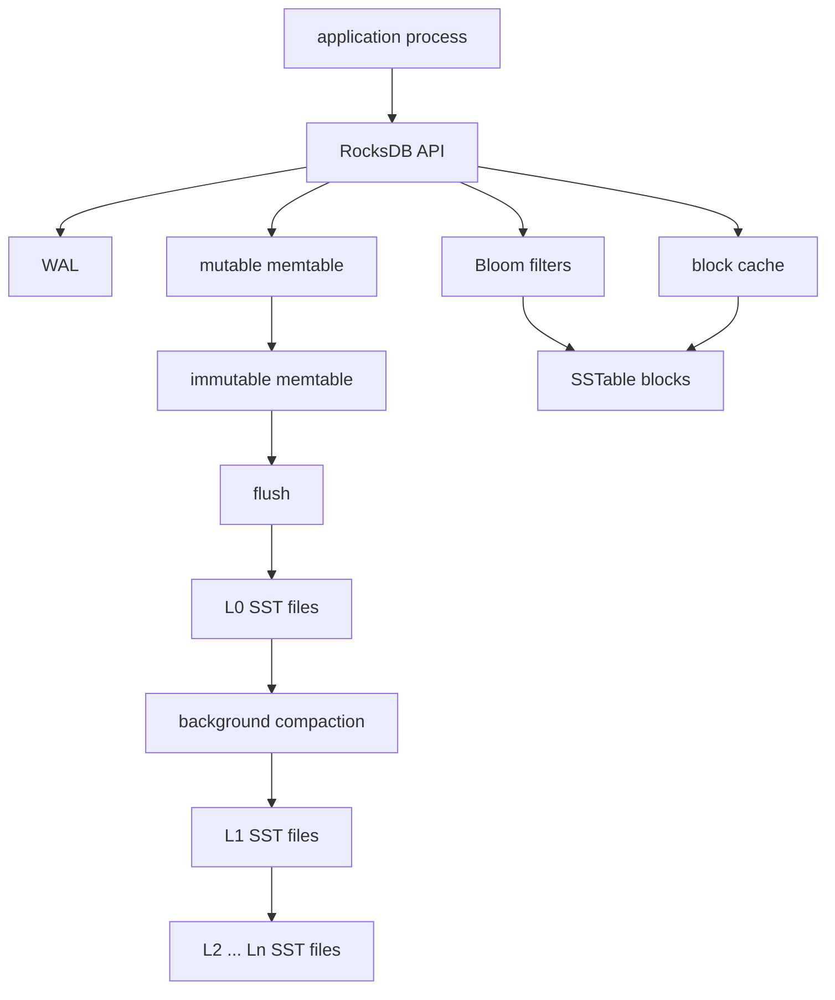

# RocksDB Architecture

## 1. Problem Background

RocksDB is an embedded key-value storage engine based on log-structured merge trees. It was designed for high write throughput on modern storage devices, especially SSDs. Unlike PostgreSQL or MySQL, RocksDB is not a SQL server. Applications link it as a library and use operations such as `Put`, `Get`, `Delete`, and iterators.

The central problem RocksDB solves is fast persistent writes. Instead of updating random disk pages in place, RocksDB writes new data sequentially to a write-ahead log and an in-memory memtable. Later, immutable sorted files are merged through background compaction.

This design is excellent for write-heavy workloads, but it moves complexity into read amplification, compaction cost, and space amplification.

## 2. Architecture Overview



| Component | Role |
| --- | --- |
| MemTable | In-memory sorted write buffer |
| Immutable MemTable | Filled memtable waiting to flush |
| WAL | Sequential recovery log for recent writes |
| SSTable | Sorted string table stored on disk |
| Levels | L0 through Ln hierarchy of sorted files |
| Bloom filters | Avoid unnecessary SST lookups for absent keys |
| Compaction | Merges files, removes overwritten/deleted keys, controls level size |
| Block cache | Caches frequently read data/index/filter blocks |

## 3. Internal Design

### Write Path

A write first enters the WAL so it can be recovered after a crash. It is then inserted into the mutable memtable. The memtable is usually implemented with an ordered structure such as a skip list, so writes are fast while keys remain sorted logically.

When the memtable reaches its size limit, it becomes immutable and a new memtable accepts writes. A background flush writes the immutable memtable as an SSTable in L0. L0 files may overlap in key ranges because they are created from independent flushes.

This path turns many small random updates into sequential log writes and sorted-file creation.

### Read Path

A point lookup checks the newest data first: mutable memtable, immutable memtables, L0 files, then lower levels. In leveled compaction, lower levels usually have non-overlapping key ranges, so RocksDB can identify candidate files quickly. L0 is more expensive because files can overlap.

Bloom filters reduce read amplification by quickly saying "this key is definitely not in this file" for most absent keys. They can return false positives but not false negatives, so correctness is preserved.

### SSTables and Levels

SSTables store sorted key-value data in blocks with metadata, indexes, and optional filters. Sorted order enables binary search and range scans. Levels give RocksDB a way to bound the number of files a read has to check.

L0 is special: it receives flushed files directly, so overlapping key ranges are expected. Compaction moves data from L0 to lower levels and then recursively downward as target sizes are exceeded.

### Compaction

Compaction is the heart of the LSM trade-off. It reads existing SSTables, merges sorted runs, discards obsolete versions and tombstones, and writes new SSTables. This improves read performance and space efficiency, but it consumes I/O and CPU.

The common amplification terms are:

| Amplification | Meaning |
| --- | --- |
| Write amplification | User writes cause extra internal writes during compaction |
| Read amplification | A lookup may check multiple memtables/files/levels |
| Space amplification | Old versions and tombstones take extra space until compacted |

## 4. Design Trade-Offs

| Design Choice | Benefit | Cost |
| --- | --- | --- |
| LSM write path | High write throughput and sequential I/O | Background compaction is mandatory |
| Many SST files | Flushes are cheap and independent | Reads may check multiple files |
| Bloom filters | Lower point-lookup read amplification | Extra memory/storage for filters |
| Leveled compaction | Better read and space amplification | Higher write amplification |
| Universal compaction | Lower write amplification for some workloads | Can increase read/space amplification |
| Embedded library | Low-latency in-process storage | Application owns operational integration |

RocksDB is a good fit for write-heavy event stores, metadata indexes, queues, stream processors, and storage engines inside larger systems. It is not a relational database by itself; applications must build schemas, secondary indexes, transactions, or query layers if needed.

## 5. Experiments / Observations

Run from the repository root:

```bash
./System_Design_Docs/RocksDB/experiments/run_experiments.sh
```

The script creates a RocksDB database under `.local/rocksdb`, inserts deterministic keys with a small write buffer and Bloom filters enabled, disables automatic compaction, inspects live files, manually compacts, writes [EXPERIMENT_RESULTS.md](./EXPERIMENT_RESULTS.md), and leaves only ignored local data under `.local`.

Key observations from RocksDB 11.1.1:

- Inserted 300 keys named `user:001` through `user:300`.
- Before manual compaction, RocksDB estimated `300` keys and `427292` pending compaction bytes.
- Because automatic compaction was disabled and the script opened the DB repeatedly, the database accumulated `299` SST files in L0.
- After manual compaction, live SST files dropped to `1`, placed in the bottom level shown by `list_live_files_metadata`.
- A point lookup for `user:128` returned the expected value after compaction.
- The estimated range size for `user:001` through `user:300` was `3056` bytes.

The experiment intentionally exaggerates L0 file buildup. It demonstrates why compaction is not just an optimization. Without compaction, reads can face many overlapping files. After compaction, the same logical data is represented by one sorted file, which reduces read amplification.

## 6. Key Learnings

1. RocksDB is optimized for writes by avoiding immediate in-place page updates.
2. The WAL plus memtable makes writes fast and recoverable.
3. SSTables make persisted data immutable and sorted, which enables efficient merging.
4. L0 overlap is the first read-amplification pressure point.
5. Compaction trades background write work for better reads and lower space usage.
6. Bloom filters are a practical read-path optimization, especially for point lookups that miss.

## References

- RocksDB wiki: [RocksDB Overview](https://github.com/facebook/rocksdb/wiki/RocksDB-Overview), [Leveled Compaction](https://github.com/facebook/rocksdb/wiki/Leveled-Compaction), [RocksDB Bloom Filter](https://github.com/facebook/rocksdb/wiki/RocksDB-Bloom-Filter), [RocksDB Tuning Guide](https://github.com/facebook/rocksdb/wiki/RocksDB-Tuning-Guide)
