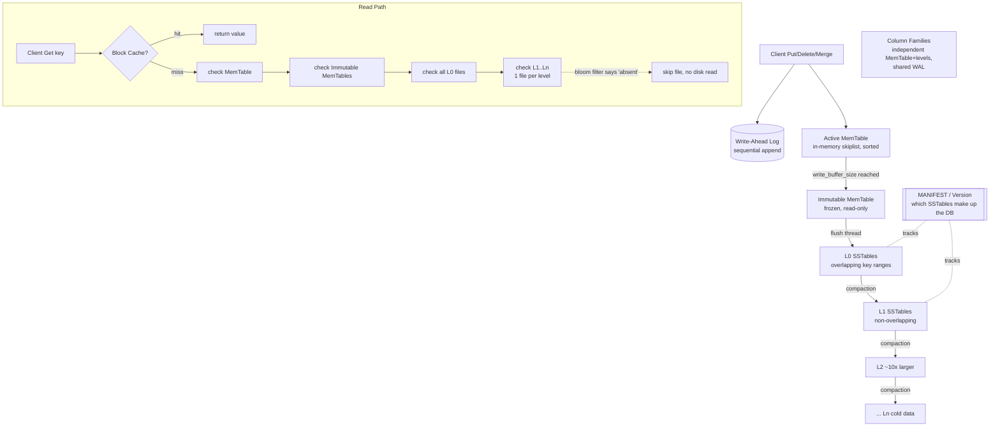

# RocksDB Architecture — An LSM-Tree Storage Engine

> Advanced DBMS — System Design Discussion
> Topic: RocksDB internals and the log-structured merge-tree storage model

This document is written as an *argument*, not a feature list. The central claim is
simple: **RocksDB is a machine for turning random writes into sequential writes, and
then paying back the resulting mess incrementally through compaction.** Almost every
design decision below — the MemTable, the WAL, immutable SSTables, levels, bloom
filters — is downstream of that single idea. The interesting part is not *what* the
components are, but *why* they have to exist for the trade to be worth making.

---

## 1. Problem Background

### Where it came from

RocksDB is an embeddable, persistent **key-value store** developed at Facebook/Meta,
forked in 2012 from Google's **LevelDB**. LevelDB was elegant but single-threaded in
spirit and tuned for a different era of storage; Facebook needed something that could
saturate modern **SSDs and NVMe** on **write-heavy, high-concurrency** server
workloads. So RocksDB kept LevelDB's log-structured merge-tree (LSM) core and rebuilt
the surroundings: multi-threaded compaction, column families, tunable compaction
styles, prefix bloom filters, rate limiting, and a large pluggable configuration
surface.

Crucially, RocksDB is a **library, not a server**. Like SQLite, it links directly into
your process and reads/writes local files — there is no network protocol, no query
language, no separate daemon. It exposes a small ordered-map API (`Put`, `Get`,
`Delete`, `Merge`, iterators). That is *deliberately* minimal: RocksDB wants to be the
**storage engine underneath** something bigger, and it shows up exactly there:

| System | What RocksDB is doing for it |
|---|---|
| **MyRocks** (MySQL engine) | replaces InnoDB's B-tree storage with an LSM engine |
| **CockroachDB** (historically), **TiKV** | the local KV store under a distributed transaction/Raft layer |
| **Kafka Streams** | local state store for stream processing |
| **Ceph BlueStore, various queues/caches** | embedded durable metadata/data store |

The recurring pattern: a higher layer owns *distribution, transactions, or
semantics*; RocksDB owns *getting bytes onto local disk fast and reading them back
correctly*.

### Why LSM-trees exist at all (the core motivation)

To justify the whole architecture you have to understand what's wrong with the obvious
alternative — the **B-tree** (or B+-tree), which has dominated databases for decades.

A B-tree keeps data in fixed-size pages arranged so that a key lives in *one* place.
To write a single key you must:

1. find the leaf page that owns it,
2. read that page (often from disk — a random read),
3. modify it in memory,
4. write the whole page back **in place** (a random write).

This **read-modify-write of a page per logical write** has three costs that get worse,
not better, on flash:

- **Random I/O.** Updates scatter across the device. On spinning disks this means seeks;
  on SSDs it means the write doesn't align to the device's erase/program model.
- **Write amplification from page granularity.** Changing one 100-byte row can rewrite
  a 4–16 KB page. And SSDs internally erase in large blocks, so small in-place writes
  trigger flash-level read-erase-rewrite cycles — write amplification *under* the OS.
- **Fragmentation and locking.** Pages split and merge; in-place mutation needs latches
  that contend under concurrent writers.

The LSM insight is to **refuse to do in-place writes at all**. Instead:

- **Buffer writes in memory** (sorted), and
- **flush them to disk as new, immutable, sequentially-written files**, and
- **merge those files in the background** (compaction) to keep the structure tidy.

Every disk write becomes a **large sequential append or a bulk sequential merge** —
exactly the access pattern flash and HDDs are fastest at. The price is that a key may
now exist in *several* files at once (an old version here, a newer version there), so
*reads* and *space* get harder. The rest of this document is the story of managing that
price.

> One-line mental model: **B-trees pay on write to stay cheap on read; LSM-trees pay on
> read (and on background compaction) to stay cheap on write.**

---

## 2. Architecture Overview

The data flow is a one-way conveyor belt: writes enter at the top in memory and
gradually sink down through on-disk levels, getting merged and sorted as they go.



### The components, in one place

| Component | Lives | Role |
|---|---|---|
| **WAL (Write-Ahead Log)** | disk, sequential | durability — replayed after a crash to recover un-flushed writes |
| **Active MemTable** | memory (skiplist) | absorbs new writes, kept sorted |
| **Immutable MemTable** | memory | a full MemTable frozen for flushing while writes continue elsewhere |
| **SSTable** (Sorted String Table) | disk, immutable | sorted on-disk file: data + index + bloom + footer |
| **Levels L0..Ln** | disk | tiered organization of SSTables; each level ~10x the previous |
| **Block cache** | memory | caches hot SSTable data blocks (and optionally filter/index) |
| **Bloom filter** | per SSTable | "is this key *definitely not* here?" → lets reads skip files |
| **Compaction threads** | background | merge SSTables down levels, drop dead keys |
| **MANIFEST / Version** | disk | the source of truth for *which* SSTables currently form the DB |
| **Column Family** | logical | an independent keyspace (own MemTable + levels) sharing one WAL |

Note the asymmetry already visible: the **write path is short and linear** (WAL +
MemTable, done). The **read path is a search across many places** (MemTable →
immutable → L0 → each deeper level), rescued from disaster by the block cache and bloom
filters. This asymmetry is the whole personality of the engine.

---

## 3. Internal Design

### 3.1 MemTable — the in-memory write buffer

The MemTable is where every write lands first (after the WAL). The default
implementation is a **skiplist**, chosen for two properties that matter together:

- It keeps entries **sorted by key**, so a flush can emit a sorted SSTable for free and
  point reads/range scans over recent data are cheap.
- It supports **concurrent lock-free-ish inserts**, so many writer threads can append
  without serializing — important on the high-core servers RocksDB targets.

The MemTable grows until it hits **`write_buffer_size`** (e.g. 64 MB). It does *not*
update keys in place either: a `Put` of an existing key just inserts a newer entry with
a higher **sequence number**; a `Delete` inserts a **tombstone**. The newest sequence
number wins on read. This append-only discipline is what makes the structure both
concurrent and trivially flushable.

### 3.2 Immutable MemTable + flush — why double-buffering

When the active MemTable fills, RocksDB does *not* block writers while it writes 64 MB
to disk. Instead:

1. The full MemTable is **frozen** → it becomes an **immutable MemTable** (read-only).
2. A **brand-new active MemTable** is created and immediately starts taking writes.
3. A background **flush thread** serializes the immutable MemTable into a new **L0
   SSTable**, then drops it from memory and retires its WAL.

```
   writes ──▶ [ active MemTable ]
                     │ full
                     ▼
              [ immutable MemTable ] ──flush thread──▶ L0 SSTable on disk
                     ▲
              (new active MemTable already serving writes)
```

This **double-buffering keeps writes non-blocking**: the expensive disk flush overlaps
with new writes hitting fresh memory. Writers only stall (back-pressure / "write stall")
if flushes/compactions fall *so* far behind that too many immutable MemTables or L0
files pile up — a deliberate safety valve, not the normal path.

### 3.3 WAL — durability before the data is safe on disk

A MemTable lives in volatile memory. If the process crashes before that MemTable is
flushed, those writes would vanish. The **Write-Ahead Log** prevents this: **every write
is appended to the WAL before (or atomically with) being applied to the MemTable.** The
WAL is a pure sequential append file — cheap to write.

- **Recovery:** on restart, RocksDB replays the WAL to reconstruct the MemTables that
  were in memory at crash time. No data lost.
- **Retirement:** once a MemTable is safely flushed to an L0 SSTable, the WAL segment
  that backed it is **obsolete** and gets deleted or recycled (recycling avoids
  filesystem allocation churn).
- **Durability knob:** with **synchronous** WAL (`sync=true` / `fsync` per write or per
  batch) a `Put` is durable the instant it returns, at the cost of an fsync on the write
  path. With **buffered** WAL (the common default) writes hit the OS page cache and a
  power loss can lose the last few; you choose where you sit on the
  durability-vs-throughput line. Group commit batches many writers into one fsync to
  soften the cost.

So the WAL is the *only* part of the write path that touches disk synchronously, and
even that is a sequential append. Everything else is deferred.

### 3.4 SSTables — immutable sorted files

An **SSTable** is the on-disk unit. It is **written once and never modified** — this
immutability is what makes compaction, caching, and concurrent reads simple (no reader
ever sees a half-written file). Internally:

```
 ┌──────────────────────────────────────────────┐
 │  Data Block 0   (sorted KV pairs)             │
 │  Data Block 1   (sorted KV pairs)             │  ← actual records, sorted by key
 │  ...                                          │     each block compressed independently
 │  Data Block N                                 │
 ├──────────────────────────────────────────────┤
 │  Filter Block   (Bloom filter for this file)  │  ← "is key X possibly here?"
 ├──────────────────────────────────────────────┤
 │  Index Block    (first key → block offset)    │  ← binary-search to the right data block
 ├──────────────────────────────────────────────┤
 │  Footer  (offsets of index & filter blocks)   │  ← fixed-size entry point, read first
 └──────────────────────────────────────────────┘
```

To read a key from an SSTable: read the footer → find the index → binary-search the
index to the one data block that could hold the key → read (or cache-hit) that block →
search within it. Each key entry carries a **sequence number** (for MVCC-style version
ordering across files) and a **type** byte that marks whether it's a value or a
**tombstone** (a delete marker). Tombstones are vital: since files are immutable, you
can't erase the old value — you write a "this key is dead" marker that shadows it until
compaction finally drops both.

### 3.5 Levels L0..Ln — the geometry that bounds reads

SSTables are organized into levels, and the levels have *different rules*:

- **L0 files have OVERLAPPING key ranges.** They are just-flushed MemTables, dumped in
  arrival order, so file A and file B in L0 can both contain key `"cat"`. Consequence:
  a point read **may have to check every L0 file**. L0 is therefore kept small (few
  files) on purpose.
- **L1 and below are PARTITIONED into non-overlapping SSTables.** Within a level, key
  ranges are disjoint, so **at most one file per level** can contain a given key. Reads
  become a binary search to the single relevant file.
- Each level is roughly **10× larger** than the one above (`max_bytes_for_level_multiplier`).

```
 L0 (overlapping — must scan all):
     [ a .. z ] [ c .. y ] [ b .. m ]      ← ranges overlap, any could hold the key

 L1 (partitioned — at most ONE matches):
     [ a .. f ] [ g .. m ] [ n .. s ] [ t .. z ]

 L2 (~10x larger, also partitioned):
     [ a .. c ][ d .. f ][ g .. i ]...[ ... .. z ]
```

**Why this geometry matters:** because L1+ are non-overlapping, a read touches **at most
one file per level**, and because each level is 10× bigger, you only have **O(log N)**
levels. So the *worst-case* number of files a point read inspects is roughly
`(#L0 files) + (#levels)` — a small, bounded number, **regardless of total dataset
size**. Without the non-overlapping invariant, read cost would grow with the number of
files. The level structure is the thing that keeps reads from degenerating.

### 3.6 Bloom filters — what makes LSM reads acceptable

Even bounded to "one file per level," a read could still touch ~7 files for a key that
lives only in the deepest level — most of those touches being **wasted disk reads** for
a key that isn't in that file. This is where the **bloom filter** earns its keep.

Each SSTable carries a **bloom filter**: a compact probabilistic structure answering
*"is key X possibly in this file?"* with two guarantees:

- **No false negatives.** If the filter says "absent," the key is *definitely* not in
  the file → **skip it without any disk read.**
- **Small, tunable false-positive rate** (e.g. ~1% at 10 bits/key). Occasionally it says
  "maybe" when the key is absent, costing one wasted block read.

The effect is transformative. A point lookup checks each level's candidate file's bloom
filter *first*; for all the levels that don't have the key, the filter says "absent" and
the read **skips straight past them**. So a read that *looked* like "inspect 7 levels"
collapses in practice to **"inspect ~1 level (the one that actually has the key) plus a
handful of cheap in-memory filter checks."**

> This is the single most important reason LSM reads are tolerable. The level geometry
> *bounds* the files to one-per-level; the bloom filter *eliminates* almost all of even
> those. Together they convert "check everything" into "usually check one." Note bloom
> filters help **point lookups**, not range scans — range queries still must merge
> across levels, which is the LSM's genuine weak spot.

### 3.7 Compaction — the bill comes due

Flushing keeps creating new files full of overlapping, stale, and deleted data. Left
alone, the DB would accumulate infinite L0 files, reads would slow, deletes would never
reclaim space, and the level invariants would break. **Compaction** is the background
process that fixes all of this: it reads some SSTables, **merge-sorts** them, drops
shadowed/old versions and tombstoned keys, and writes fresh non-overlapping SSTables one
level down.

Compaction is doing three jobs at once:

1. **Reclaim space** — physically discard overwritten values and honor deletes.
2. **Bound read amplification** — fewer, non-overlapping files means fewer files per read.
3. **Push cold data down** — frequently-touched keys stay shallow; stable data sinks to
   big deep levels that rarely get rewritten.

There are two main **strategies**, and choosing between them is choosing which pain you
accept:

| | **Leveled compaction** | **Universal / tiered compaction** |
|---|---|---|
| How it merges | merges a file into the *next level*, keeping each level non-overlapping and ~10x sized | merges similarly-sized files into bigger sorted runs; tolerates overlap longer |
| **Write amplification** | **higher** — data is rewritten as it crosses each level | **lower** — fewer rewrites |
| **Space amplification** | **lower** — aggressive merging keeps few stale copies | **higher** — more stale data lingers |
| **Read amplification** | low–moderate (few non-overlapping files) | **higher** — more overlapping runs to check |
| Sweet spot | read-heavy / space-constrained | write-heavy / can spare disk |

This is a genuine **three-way tension** (write-amp vs read-amp vs space-amp): tightening
any one tends to loosen another. Leveled spends *write work now* to keep space and reads
tight; universal saves write work but pays in space and reads. You can't have all three —
which is the heart of Section 4.

### 3.8 Putting it together: write path and read path

**Write path (short, mostly memory):**

```
Put(k,v) → append to WAL (durability)
        → insert into active MemTable (sorted, new seq#)
        → [later, async] MemTable full → freeze → flush thread → L0 SSTable
        → [later, async] compaction merges L0 → L1 → ... → Ln
return to caller after WAL + MemTable (fast)
```

A write is acknowledged after just a sequential WAL append and an in-memory insert.
All disk merging happens **later, in the background** — that's the cheap-write win.

**Read path (search, rescued by filters/cache):**

```
Get(k):
  1. block cache?           → hit: done
  2. active MemTable        → newest data
  3. immutable MemTable(s)  → still-in-flight flushes
  4. L0: check EVERY file (overlapping), bloom-filter each first
  5. L1..Ln: one candidate file per level, bloom-filter each first;
             only on "maybe" do we read its data block (maybe from cache)
  → return the entry with the highest sequence number; a tombstone means "not found"
```

The read stops at the **newest** version it finds (highest sequence number), which is
how MVCC ordering and deletes are honored across many files.

---

## 4. Design Trade-Offs

Everything above can be compressed into one framework: the **three amplifications**.
They are the currency in which an LSM engine's design decisions are paid for.

### The three amplifications

- **Write amplification (WA)** = *bytes physically written to disk ÷ bytes the user
  wrote.* A single logical write gets re-written every time compaction moves it down a
  level. If data crosses ~5 levels, you may write each byte ~5–30× over its lifetime.
  **Cause: repeated compaction rewrites.**
- **Read amplification (RA)** = *storage reads performed per logical read.* A `Get` may
  consult the MemTable, several L0 files, and one file per deeper level.
  **Mitigated by bloom filters (skip absent files) and the block cache (skip disk).**
- **Space amplification (SA)** = *disk bytes used ÷ live (logical) data bytes.* Stale
  versions and not-yet-collected tombstones occupy disk until compaction reclaims them.
  **Cause: dead data awaiting compaction.**

### The RUM-style conjecture — pick two

These three pull against each other, much like the **RUM conjecture** (Read,
Update/write, Memory/space — you can optimize for at most two, at the expense of the
third). Concretely in RocksDB:

- **Leveled compaction** optimizes **read-amp + space-amp** (few non-overlapping files,
  little stale data) → sacrifices **write-amp** (constant rewrites down the levels).
- **Universal compaction** optimizes **write-amp** (rewrite less) → sacrifices
  **space-amp + read-amp** (more stale data, more overlapping runs to read).

There is **no configuration that minimizes all three at once.** Tuning RocksDB is
literally the act of choosing which corner of this triangle your workload tolerates. A
larger block cache and more bloom bits buy back read-amp; a bigger `write_buffer_size`
and fewer levels buy back write-amp; more aggressive compaction buys back space-amp — each
at the others' expense.

### LSM vs B-tree — who wins where

| Dimension | **LSM-tree (RocksDB)** | **B-tree (e.g. InnoDB)** |
|---|---|---|
| Random writes | **sequential, batched, append** → fast | in-place random page rewrites → slow |
| Write amplification | high (compaction), but *sequential* I/O | lower count, but *random* + page-granular |
| Point reads | several files; saved by bloom + cache | usually one page traversal → predictable, low latency |
| Range scans | must merge across levels → harder | leaf pages are linked → naturally strong |
| Space amplification | higher (stale versions) | lower (in-place, one copy) |
| Concurrency on writes | excellent (append + background merge) | latch contention on hot pages |

**Why LSM wins on write-heavy workloads:** writes are turned into **sequential appends
and batched background merges**, which is the access pattern SSDs/HDDs execute fastest,
and writers don't contend on shared pages. **Where B-trees still win:** read-heavy
workloads with **light range scans and predictable point reads**, and workloads where
**low space amplification** matters, because the B-tree keeps one copy of each key in
place with no stale versions to garbage-collect.

### Answering the assignment's questions directly

- **Why is LSM preferred for write-heavy workloads?** Because it never does in-place
  random writes. New data is buffered in memory and flushed/merged as large **sequential**
  files. Throughput is bounded by sequential bandwidth (high) rather than random IOPS or
  page latch contention (low), so it absorbs bursts of writes far better than a B-tree.
- **Why is compaction expensive?** It must **read multiple SSTables, merge-sort them, and
  rewrite new files** — re-reading and re-writing data that was already on disk, possibly
  several times over as the data descends levels. That is the *write amplification* you
  pay; it competes with foreground traffic for disk bandwidth and CPU, which is why
  compaction is rate-limited and runs on dedicated background threads.
- **How do bloom filters improve reads?** By answering "is this key possibly here?" per
  SSTable with **zero false negatives**, they let a read **skip files that definitely
  don't contain the key without touching disk.** This turns a read that would have to
  probe every level into one that, in the common case, reads only the single file that
  actually holds the key.

---

## 5. Experiments / Observations

> **Honesty note:** The assignment suggests running RocksDB's `db_bench`. **I was not
> able to build or run `db_bench` on this machine** (no local RocksDB build available).
> The numbers below are **representative figures based on documented `db_bench`
> behavior — they were NOT produced on this machine.** They are included to make the
> *interpretation* concrete and are explicitly marked **illustrative**. The reasoning
> about how the three amplifications move is the point; the exact digits are not.

### Conceptual command lines

```bash
# Random insert throughput (write path stress)
./db_bench --benchmarks=fillrandom --num=10000000 --value_size=100 \
           --compaction_style=0    # 0 = leveled

# Random point reads (read path; bloom filters in play)
./db_bench --benchmarks=readrandom --num=10000000 --use_existing_db=1

# Overwrites (forces compaction churn → exposes write-amp)
./db_bench --benchmarks=overwrite  --num=10000000

# Same write workload under universal compaction to compare amplifications
./db_bench --benchmarks=fillrandom,readrandom --compaction_style=1   # 1 = universal
```

### Representative `db_bench` output (documented behavior — NOT run on this machine)

```
*** ILLUSTRATIVE — not executed locally ***

fillrandom :    2.351 micros/op  425000 ops/sec;   47.0 MB/s
overwrite  :    3.980 micros/op  251000 ops/sec;   27.8 MB/s   (compaction contends)
readrandom :    5.120 micros/op  195000 ops/sec;   21.6 MB/s   (cold cache, bloom on)
readrandom :    1.430 micros/op  699000 ops/sec;   77.4 MB/s   (warm block cache)
```

Two things to read out of this *shape* (not the digits):

- **`fillrandom` > `overwrite`.** Fresh inserts are nearly pure sequential flush.
  Overwrites generate stale versions, so compaction works harder and steals disk
  bandwidth — throughput drops. This *is* write amplification showing up as a slowdown.
- **`readrandom` warm ≫ cold.** With a cold cache every read may hit disk; once the
  block cache is warm, hot blocks are served from memory and ops/sec multiplies. Bloom
  filters keep even the cold case from being catastrophic by skipping absent files.

### Leveled vs Universal — the three amplifications (illustrative)

| Metric (lower = better) | **Leveled** | **Universal / Tiered** | What moved and why |
|---|---:|---:|---|
| Write amplification | ~20× | ~7× | universal rewrites data fewer times |
| Read amplification | ~1.3× | ~3.5× | universal leaves more overlapping runs to probe |
| Space amplification | ~1.1× | ~1.8× | universal lets stale versions linger longer |

*(Figures illustrative; real values depend on key distribution, value size, level
sizing, and hardware.)*

### Interpretation

The table is the trade-off triangle made numeric. Switching **leveled → universal**:

- **Write-amp falls** (~20× → ~7×): data crosses fewer merges, so write throughput and
  device endurance improve — the win you'd choose for a write-saturated workload.
- **Read-amp rises** (~1.3× → ~3.5×): more overlapping sorted runs means more files to
  consult per read; you lean harder on bloom filters and a big block cache to stay
  acceptable.
- **Space-amp rises** (~1.1× → ~1.8×): you're now spending ~80% extra disk on stale data
  awaiting collection — fine if disk is cheap, painful if it's the constraint.

The arrows always point in **opposite directions** across the three columns. There is no
row where one style dominates on all three. That is the experimental confirmation of the
"pick two" claim: **compaction style is a dial that trades one amplification for another,
never a free improvement.**

---

## 6. Key Learnings

- **You pay either way — only the timing changes.** An LSM makes the *write* cheap by
  deferring work, but that deferred work returns as **compaction** (write amplification)
  and as **multi-file reads** (read amplification). "Cheap writes now" is a loan against
  "compaction work later." The engine doesn't abolish the cost; it *reschedules* it to a
  time and access pattern (sequential, background) the hardware prefers.

- **Immutability is the quiet hero.** Because SSTables are never modified, RocksDB gets
  crash-safety (no torn writes), trivial concurrency (readers never block writers),
  simple caching (cached blocks never go stale), and clean compaction (just produce new
  files and atomically swap them in via the MANIFEST). Many "hard" database problems
  dissolve once you forbid in-place updates — at the cost of needing a janitor
  (compaction) to clean up the discarded versions.

- **The level geometry and the bloom filter are a team.** Neither alone makes LSM reads
  fast: the non-overlapping levels *bound* reads to one file per level, and the bloom
  filters *eliminate* almost all of even those. Remove either and read amplification
  blows up. It's a nice example of two modest mechanisms composing into a strong
  guarantee.

- **Surprising bit: more writing can mean less total work.** Aggressive (leveled)
  compaction *increases* write amplification yet often *improves* overall performance,
  because it shrinks read and space amplification and keeps the structure healthy. The
  optimum is rarely "do the least I/O now."

- **There is no universally best storage engine — only a best fit.** B-trees, leveled
  LSM, and universal LSM are three different *choices of which cost to pay*. A write-heavy
  log ingester, a read-mostly catalog, and a space-constrained edge device should each
  pick differently — and RocksDB exposes the knobs precisely so the *workload* gets to
  decide.

- **Practical takeaways for tuning:** size `write_buffer_size` and L0 limits to control
  flush/stall behavior; give bloom filters enough bits/key (≈10) if reads matter; size
  the block cache to your hot set; pick **leveled** when space and reads are tight,
  **universal** when write throughput/endurance dominates and disk is cheap; watch the
  compaction-debt metrics, because a backed-up compactor is the usual cause of write
  stalls.

> **The thesis, restated.** A database storage engine is a collection of engineering
> trade-offs wearing a trench coat. RocksDB doesn't beat the laws of storage physics — it
> chooses, very deliberately, to be excellent at sequential writes and to *manage* the
> resulting read and space costs with caches, bloom filters, and background compaction.
> Understanding RocksDB is mostly understanding **which costs it chose to pay, and why
> that's the right bet for write-heavy work on modern flash.**

---

## References

- **RocksDB Wiki — Architecture Guide.** Overview of MemTable, WAL, SSTable, levels, and
  the read/write paths. <https://github.com/facebook/rocksdb/wiki/RocksDB-Overview>
- **RocksDB Wiki — Compaction** (Leveled and Universal compaction styles, and their
  amplification trade-offs). <https://github.com/facebook/rocksdb/wiki/Compaction>
- **RocksDB Wiki — Leveled Compaction** / **Universal Compaction** (level geometry, L0
  overlap, size multipliers).
- **RocksDB Wiki — Bloom Filters / Full Filter Block** (membership filtering, bits/key,
  false-positive behavior). <https://github.com/facebook/rocksdb/wiki/RocksDB-Bloom-Filter>
- **RocksDB Wiki — MemTable, Write-Ahead Log, and Block-Based Table Format** (skiplist
  MemTable, WAL recovery, SSTable internal layout).
- **RocksDB Wiki — Benchmarking with `db_bench`** (fillrandom / readrandom / overwrite,
  ops/sec and MB/s reporting). <https://github.com/facebook/rocksdb/wiki/Benchmarking-tools>
- **RocksDB Wiki — RocksDB Tuning Guide** (write buffers, block cache, the three
  amplifications). <https://github.com/facebook/rocksdb/wiki/RocksDB-Tuning-Guide>
- **LevelDB** (Sanjay Ghemawat & Jeff Dean, Google) — the LSM lineage RocksDB forked from.
- **P. O'Neil, E. Cheng, D. Gawlick, E. O'Neil — "The Log-Structured Merge-Tree (LSM-Tree),"
  *Acta Informatica*, 1996.** The original formulation of the LSM idea this engine implements.
- **M. Athanassoulis et al. — "Designing Access Methods: The RUM Conjecture," EDBT 2016.**
  The Read/Update/Memory trade-off framing used in Section 4.
