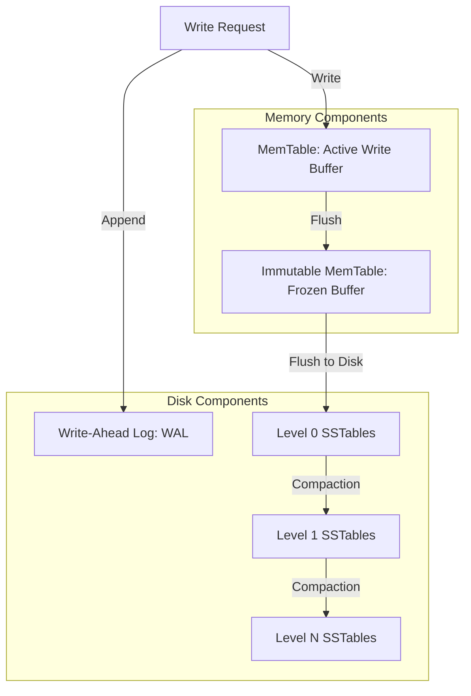

# RocksDB Architecture
## 1. Problem Background
RocksDB was developed by Facebook (now Meta) as an fork of Google's LevelDB. It is a high-performance, embedded key-value store optimized for fast, low-latency storage devices such as flash drives and SSDs.
The primary problems RocksDB was designed to solve are:
- **Write Amplification on SSDs**: Traditional B-Trees perform random in-place updates, which trigger frequent block rewrites on SSDs, wearing out the hardware quickly and degrading write performance.
- **Fast Writes under Heavy Load**: Traditional databases struggle to keep up with write-heavy workloads because they force random I/O.
- **Efficient Disk Space Utilization**: Storing data compactly to minimize storage footprint on expensive flash storage.
## 2. Architecture Overview
### High-level architecture diagram

### Main system components
- **MemTable**: An in-memory data structure (typically a skip list) where active writes are buffered.
- **Immutable MemTable**: A MemTable that is full and frozen, waiting to be flushed to disk.
- **SSTables (Sorted String Tables)**: Structured, immutable files stored on disk. Data inside each SSTable is sorted by key.
- **Write-Ahead Log (WAL)**: A sequential file on disk used to recover in-memory MemTable data in case of a crash.
- **Compaction Engine**: A background process that merges SSTables, removes deleted/obsolete keys, and promotes data across levels (Level 0 to Level N).
### Data flow
- **Write Path**: A write request appends the key-value pair to the WAL on disk and writes it into the active `MemTable` in memory. Once the `MemTable` fills up, it becomes an `Immutable MemTable`, and a background thread flushes it to Level 0 on disk as an SSTable.
- **Read Path**: The read search path follows a strict order:
  1. Active `MemTable`
  2. `Immutable MemTables`
  3. Level 0 SSTables (multiple files checked, as keys can overlap)
  4. Level 1 to Level N SSTables (binary search within files, as keys do not overlap within these levels)
## 3. Internal Design
### MemTable and Immutable MemTable
- The **MemTable** acts as the primary write buffer. It is implemented as a Skip List, which allows concurrent, lock-free inserts and sorted iterations.
- When it reaches its size limit, it is marked as **Immutable** and a new active MemTable is created. This ensures writes are never blocked while flushing data to disk.
### SSTables (Sorted String Tables)
- SSTables are divided into data blocks and index blocks.
- Each table contains data sorted by key. At the end of the file, an index block lists the offsets of the data blocks to allow quick search.
### L0 to Ln Storage Levels
- **Level 0 (L0)**: Contains flushed SSTables. Keys in different L0 files can overlap.
- **Level 1 to N**: Keys do not overlap within the same level. The size limit of each level grows exponentially (e.g., Level 1 is 10MB, Level 2 is 100MB, Level 3 is 1GB).
### Bloom Filters
- Since searching disk files for non-existent keys is expensive, RocksDB uses **Bloom Filters** (probabilistic data structures) associated with each SSTable.
- A Bloom Filter can determine with 100% certainty if a key is *not* present in the SSTable, skipping unnecessary disk reads.
### Compaction
- Background process that reads SSTables from Level $L$, merges overlapping ranges, discards deleted or overwritten keys, and writes new sorted SSTables to Level $L+1$.
- Helps reclaim disk space and bounds read amplification.
---
## 4. Design Trade-Offs (LSM-Tree vs B-Tree)
### Why LSM Trees are Optimized for Writes
In B-Trees (used by InnoDB), writes require finding and modifying pages in-place on disk (random I/O). In contrast, Log-Structured Merge-Trees (LSM-Trees) convert all writes into sequential I/O (appending to WAL and memory buffer), deferring disk organization (sorting and merging) to background compaction processes.
### Trade-Offs
- **Write Amplification**: B-Trees write entire pages (e.g., 16KB) for small updates. LSM-Trees write data sequentially, but background compaction reads and writes the same data multiple times across levels. However, LSM compaction is still generally gentler on SSDs than B-Tree random updates.
- **Read Amplification**: Reading in a B-Tree is fast (single path traversal). LSM-Trees may have to check the MemTable, L0 files, and multiple levels to find a key (partially mitigated by Bloom Filters).
- **Space Amplification**: B-Trees have unused page space due to fragmentation. LSM-Trees keep multiple versions of the same key across levels until compaction cleans them up, leading to temporary space amplification.
---
## 5. Experiments / Observations
**Observation on Compaction Strategies**:
RocksDB supports different compaction styles:
- **Leveled Compaction (Default)**: Minimizes space amplification but results in high write amplification.
- **Universal Compaction**: Low write amplification (ideal for extreme write throughput) but high space amplification because files are merged less frequently.
**Bloom Filter Impact**:
- Without Bloom Filters, point lookups for missing keys require checking every level's index.
- With Bloom Filters configured (e.g., 10 bits per key), read performance for missing keys improves significantly as $>99\%$ of files are bypassed without disk I/O.
---
## 6. Key Learnings
- **Important insights**: Sequential writes are orders of magnitude faster than random writes on modern storage. Decoupling the write path from disk indexing is the core mechanism behind RocksDB's performance.
- **Architectural lessons**: Bloom Filters and Compaction are not optional tuning parameters; they are fundamental requirements to make read paths viable in LSM-Tree databases.
- **Practical takeaways**: RocksDB is best suited as an embedded storage engine for write-heavy services, caches, stream processing engines (like Kafka Streams), or underneath distributed databases (like CockroachDB or TiDB).