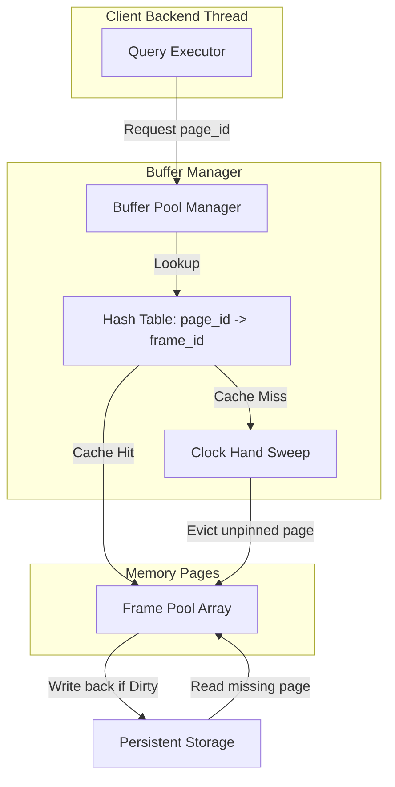

# System Design: Buffer Pool Caching and Replacement

## 1. Problem Background
Relational databases store data on persistent block devices (SSDs, HDDs) which have access speeds orders of magnitude slower than volatile system RAM. Reading a page from disk on every query results in severe execution bottlenecks.
To resolve this, database engines implement a **Buffer Pool**—a region of shared RAM allocated to cache frequently accessed disk pages.
The critical design challenges in a Buffer Pool include:
1. **Eviction Strategy**: Identifying which pages to remove (evict) when the buffer pool is full and a new page needs to be read from disk.
2. **Lock Contention**: Traditional LRU (Least Recently Used) lists require updating pointer links on *every single read*, which becomes a serialization bottleneck under highly concurrent environments.
3. **Dirty Page Flushing**: Managing when to write modified pages back to disk without halting transaction execution.

---

## 2. Architecture Overview



---

## 3. Internal Design

### Page Caching and Pinning
- **Shared Memory Slots**: The buffer pool is allocated as a contiguous array of fixed-size memory slots called **frames**. PostgreSQL uses 8 KB frames, matching its standard page size.
- **Buffer Tag**: Each frame has an associated header containing metadata:
  - `page_id` (representing the file/block identifier).
  - `pin_count` (or reference count): Tracks how many active transactions are reading or modifying this specific page. A page cannot be evicted if `pin_count > 0`.
  - `dirty_bit`: A boolean flag indicating if the page was modified in memory but not yet written back to disk.

### The Clock-Sweep Algorithm
PostgreSQL implements **Clock-Sweep** (a second-chance replacement algorithm) to find eviction candidates:
1. Each frame header holds a `usage_count` (0 to 5) indicating its access frequency.
2. A virtual "clock hand" points to the current frame index in the buffer pool.
3. When eviction is required, the clock hand sweeps sequentially:
   - If the frame is **pinned** (`pin_count > 0`), the hand skips it.
   - If `usage_count > 0`, the hand decrements `usage_count` by 1 and advances to the next frame.
   - If `usage_count == 0` and the frame is unpinned, it is selected as the eviction candidate. If the page is dirty, it is scheduled for writing to disk before eviction.
4. When a transaction accesses a page (cache hit), its `usage_count` is incremented by 1 (capped at 5).

---

## 4. Design Trade-Offs

### Clock-Sweep vs Least Recently Used (LRU)

| Trade-Off Dimension | Clock-Sweep | Least Recently Used (LRU) |
| :--- | :--- | :--- |
| **Data Structure** | Simple circular array of metadata headers. | Doubly-linked list of pages + a hash map. |
| **Locking Cost** | **Low**: A single atomic fetch-and-add to increment/decrement `usage_count`. No global list pointers to lock on page read. | **High**: Reading a page requires moving it to the head of the list, requiring lock acquisition and pointer updates. |
| **Sweep Overhead** | $O(N)$ worst-case scan under high cache pressure, but typically fast. | $O(1)$ to find the tail page, but list maintenance is expensive. |
| **Sequential Scan Protection** | Natural protection. Capping `usage_count` at 5 ensures that a large scan incrementing count to 1 doesn't evict hot pages (count=5). | No protection. A full table scan will evict the entire cache unless separate scan buffers are used. |

---

## 5. Experiments / Observations

### Clock-Sweep Simulation Trace (from `lab3`):
A 4-frame pool executing the page access sequence: `1 2 3 4 1 2 5`

```
Access 1: Miss -> Load page 1 into Frame 0, usage=1
Access 2: Miss -> Load page 2 into Frame 1, usage=1
Access 3: Miss -> Load page 3 into Frame 2, usage=1
Access 4: Miss -> Load page 4 into Frame 3, usage=1
Access 1: Hit  -> Frame 0 (page 1) usage incremented to 2
Access 2: Hit  -> Frame 1 (page 2) usage incremented to 2
Access 5: Miss -> Eviction Sweep begins:
          Frame 0 (page 1): usage=2 -> decrement to 1, skip.
          Frame 1 (page 2): usage=2 -> decrement to 1, skip.
          Frame 2 (page 3): usage=1 -> decrement to 0, skip.
          Frame 3 (page 4): usage=1 -> decrement to 0, skip.
          Frame 0 (page 1): usage=1 -> decrement to 0, skip.
          Frame 1 (page 2): usage=1 -> decrement to 0, skip.
          Frame 2 (page 3): usage=0 -> selected for eviction!
```
- **Analysis**: The two hot pages (1 and 2) survived the eviction sweep because their `usage_count` was incremented to 2 on cache hits. The sweep decremented them but skipped them, eventually evicting page 3. This trace confirms how Clock-Sweep approximates LRU recency with minimal overhead.

---

## 6. Key Learnings

1. **Avoid Pointer Manipulation in Critical Paths**: Clock-sweep’s use of atomic operations on usage counts avoids the lock contention that makes traditional linked-list LRU slow in highly multi-threaded database systems.
2. **Buffer Pinning prevents corruption**: Pinning ensures that data pages are not evicted while an executor thread is actively reading or writing them, preventing concurrency faults.
3. **Scan Resistance is vital**: A database must protect its cache from bulk sequential scans. Capping usage counts and using separate ring buffers prevents transient scans from wiping out the shared buffer pool cache.
