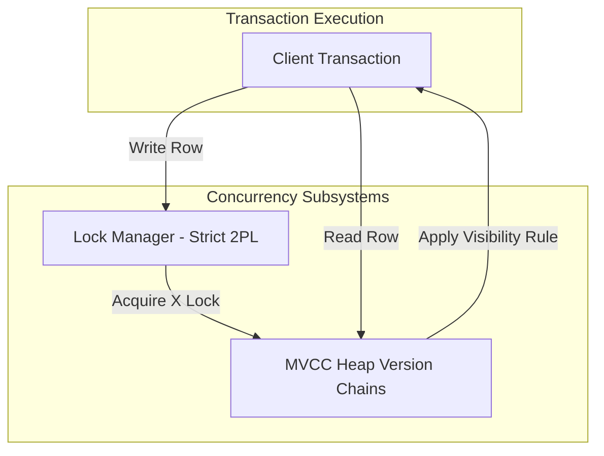

# System Design: Concurrency Control (MVCC & Locking)

## 1. Problem Background
In database systems, multiple client transactions execute simultaneously. Without proper isolation, transactions can read uncommitted data (dirty reads), see different values for the same row on repeated reads (non-repeatable reads), or observe new rows inserted by other transactions (phantom reads).
To solve this, database engines implement Concurrency Control. The two primary strategies are:
1. **Multi-Version Concurrency Control (MVCC)**: Allows readers to view consistent snapshots of data as of a specific point in time, avoiding read-write locking contention.
2. **Locking (2PL)**: Coordinates writes and prevents write-write conflicts or serialization anomalies by blocking conflicting transactions.

---

## 2. Architecture Overview

- **Strict 2PL**: Ensures serializability by holding all exclusive and shared locks until the transaction commits or aborts.
- **MVCC**: Creates a chain of row versions. Readers walk the version chain and skip locked or uncommitted versions based on snapshot transaction IDs.

---

## 3. Internal Design

### MVCC Version Visibility Rules
In an MVCC system, every write creates a new tuple version. The header of each version contains:
- `xmin`: The transaction ID that inserted the version.
- `xmax`: The transaction ID that deleted or updated the version (0 if active).

A tuple version is **visible** to a transaction with snapshot `T` if:
1. The transaction `xmin` is committed and `xmin <= T.snapshot_xid`.
2. The transaction `xmax` is either 0 (not deleted), aborted, or is uncommitted and `xmax > T.snapshot_xid`.

### Two-Phase Locking (2PL)
2PL ensures serializability by dividing lock operations into two phases:
1. **Growing Phase**: Transactions can acquire locks but cannot release any.
2. **Shrinking Phase**: Transactions can release locks but cannot acquire new ones.
- **Strict 2PL**: All exclusive (X) locks (and optionally shared (S) locks) acquired by a transaction must be held until the transaction commits or aborts. This prevents cascading aborts.

### InnoDB vs PostgreSQL MVCC Comparison

#### PostgreSQL (Out-of-Place Updates)
- Updates append a new tuple version to the heap file. The old version remains in place with its `xmax` set to the updating transaction ID.
- Requires a background garbage collection process (**VACUUM**) to clean up stale versions once they are no longer visible to any active transaction.

#### InnoDB (In-Place Updates + Undo Logs)
- Updates modify the row in-place within the page.
- The previous state of the row is written to an **Undo Log**, and the row header's `ROLL_PTR` points to this log.
- Older versions are reconstructed dynamically by applying the undo log changes in reverse.

---

## 4. Design Trade-Offs

| Concurrency Method | Advantages | Disadvantages |
| :--- | :--- | :--- |
| **MVCC Alone** | No read-write blocking; readers get consistent snapshots instantly. | Lost Update problem (two concurrent transactions write to the same row). |
| **2PL Alone** | Guarantees complete serializability. | High contention; readers block writers, and writers block readers; prone to deadlocks. |
| **MVCC + Strict 2PL** | Combines snapshot reads (no read-write blocking) with exclusive locks on writes to prevent write-write conflicts. | Deadlocks are still possible on concurrent writes; require a Waits-For graph and cycle detection. |

---

## 5. Experiments / Observations

### Transaction Manager Simulation (from `lab6`):
In the C++ simulation combining MVCC with Strict 2PL:
- **Write Conflict Resolution**: When a transaction attempts to update a row, it must first acquire an Exclusive (X) lock. If another transaction holds a lock on that row, the requesting transaction blocks, preventing write-write conflicts.
- **Deadlock Detection**: If Transaction A holds a lock on Row 1 and waits for Row 2 (held by Transaction B), while Transaction B waits for Row 1, a deadlock cycle forms. The transaction manager constructs a **Waits-For Graph** and runs Depth-First Search (DFS) to detect the cycle:
  $$\text{Tx A} \longrightarrow \text{Tx B} \longrightarrow \text{Tx A}$$
  Once detected, the younger transaction is aborted, and its changes are rolled back using the xmin/xmax version rules.

---

## 6. Key Learnings

1. **MVCC and Locking are complementary**: MVCC eliminates read-write contention, while 2PL serializes write-write access, providing optimal throughput and safety.
2. **Aborts require clean metadata updates**: When a transaction aborts, its changes must be hidden. In PostgreSQL, this is as simple as marking the transaction as aborted in the commit log, making all its created tuples (`xmin = aborted_xid`) instantly invisible.
3. **Deadlocks are unavoidable with locks**: As write volume increases, locking inevitably leads to deadlocks. Efficient deadlock detection (like Waits-For graph analysis) is critical to prevent system hangs.
