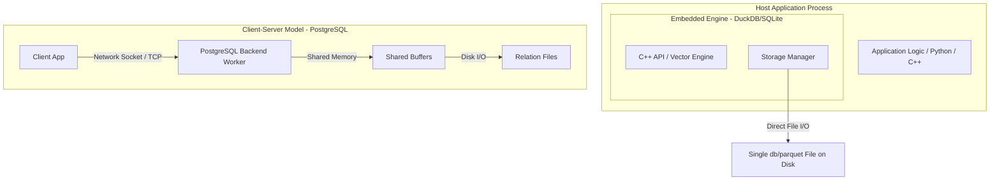

# System Design: DuckDB/SQLite vs PostgreSQL Comparison

## 1. Problem Background

### Embedded Databases (DuckDB & SQLite)
Embedded databases are designed to run within the host application process, bypassing client-server communication entirely.
- **SQLite** was created in 2000 to solve the need for a serverless, transactional (OLTP) database requiring zero administration. It stores data in a row-oriented B-tree structure, ideal for point queries and mobile/IoT deployments.
- **DuckDB** was created in 2019 to address a major gap: performing fast analytical (OLAP) queries (like aggregations, joins, and filters on large datasets) locally within processes like Python (Pandas/Polars) or R without the latency of transferring millions of rows over a network socket to a database server.

### Client-Server Databases (PostgreSQL)
- **PostgreSQL** exists to serve concurrent, multi-user enterprise workloads. It separates the client application from the database server via a network boundary. It is designed to handle thousands of concurrent transactions with strict ACID compliance, complex data types, and server-side process isolation.

---

## 2. Architecture Overview

### Process Models



- **In-Process Integration**: Embedded databases link directly into the host application. Executing queries involves direct memory function calls.
- **Client-Server Isolation**: PostgreSQL uses a process-per-connection model. A dedicated backend worker process handles each connection, communicating via Unix sockets or TCP.

---

## 3. Internal Design

### Row vs Columnar Storage
- **PostgreSQL / SQLite (Row-oriented)**: Data is stored as contiguous tuples inside disk pages. This is highly optimized for OLTP workloads (inserting, updating, or fetching individual records by ID).
- **DuckDB (Columnar)**: Data is stored as contiguous columns. When a query accesses only 2 columns out of a 100-column table (e.g., `SELECT AVG(age) FROM users`), DuckDB only reads those 2 columns from disk, avoiding reading the rest of the attributes.

```
Row-Oriented Layout (PostgreSQL / SQLite):
[Row 1: ID, Name, Email] -> [Row 2: ID, Name, Email] -> [Row 3: ID, Name, Email]

Columnar Layout (DuckDB):
[Column ID: 1, 2, 3]
[Column Name: 'UserA', 'UserB', 'UserC']
[Column Email: 'a@ex.com', 'b@ex.com', 'c@ex.com']
```

### Execution Engine Styles
- **PostgreSQL (Volcano Iterator Model)**: Operators pull one tuple at a time using `next()`. This has high function-call overhead for millions of rows but handles small transactions with minimal memory.
- **DuckDB (Vectorized Execution)**: Operators process arrays (vectors) of data (typically 1024 values) at a time. This amortizes function-call overhead and leverages CPU cache and SIMD (Single Instruction Multiple Data) instruction sets.

---

## 4. Design Trade-Offs

| Metric | Embedded OLTP (SQLite) | Embedded OLAP (DuckDB) | Client-Server OLTP (Postgres) |
| :--- | :--- | :--- | :--- |
| **Primary Workload** | Transactional (writes, point queries) | Analytics (aggregations, scans) | Concurrent Multi-User Enterprise |
| **Concurrency** | Single-Writer (DB lock) | Single-Writer (DB/File lock) | High Concurrent (Row locks + MVCC) |
| **Storage Structure** | Row B+ Tree | Columnar / Parquet-like | Row Heap + separate B-tree index |
| **Network Overhead** | None (Local Memory/File) | None (Local Memory/File) | High (IPC/TCP socket transmission) |

---

## 5. Experiments / Observations

### Memory Mapping (`mmap`) & Socket Overhead Experiments
Using the experimental values observed during the labs:
- **SQLite Local Read Latency**: Enabling memory mapping (`PRAGMA mmap_size=268435456`) on a 600 KB database containing 10,000 users cut average query latency from **14 ms to 7 ms** by bypassing standard `read()` system calls and letting the OS map pages directly to process memory.
- **PostgreSQL Socket Connection Overhead**:
  - Running a query client-side over a local terminal shell: **68 - 92 ms**
  - Running it server-side internally (`EXPLAIN ANALYZE SELECT * FROM users`): **0.973 ms**
  - **Analysis**: Over 98% of the wall-clock time in simple client-server queries is spent on network socket handshakes, client process startup, and data serialization. For local, single-process applications, embedded engines like SQLite and DuckDB eliminate this connection tax.

---

## 6. Key Learnings

1. **OLTP vs OLAP Storage Choice**: Row-oriented databases excel at fetching complete records, while columnar engines like DuckDB excel at large aggregations by reading only the necessary bytes.
2. **Execution Vectorization**: Processing data in blocks (vectors) rather than row-by-row utilizes CPU cache hierarchy and modern compiler optimizations (like loop unrolling and vectorization).
3. **The cost of Network Latency**: In-process databases are extremely fast for local execution because they eliminate the TCP/socket loop, but they do not scale to handle distributed concurrent write transactions.
