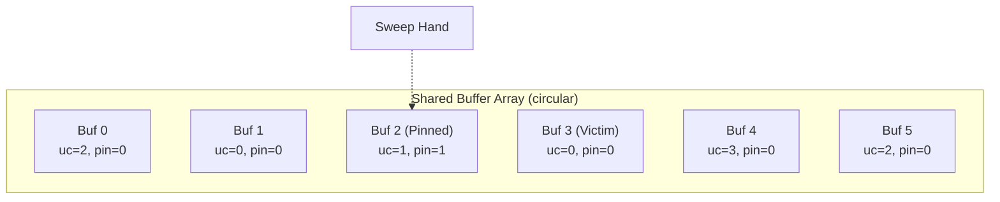
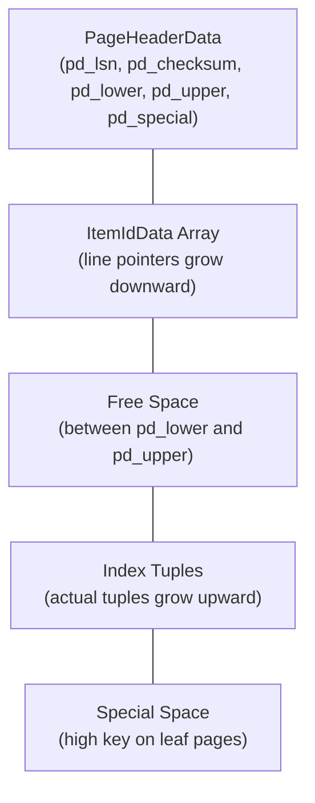
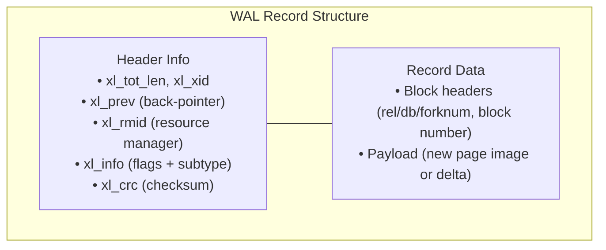

# PostgreSQL Internal Architecture: Buffer Manager, B-Trees, MVCC, and WAL

by - Siddham Jain, siddham.23bcs10103@sst.scaler.com

## Problem Background

A database management system is not a black box. Understanding what happens between receiving an SQL query and returning a result is essential for reasoning about performance, reliability, and scalability. PostgreSQL, despite being over 35 years old, maintains a remarkably coherent internal design. Its components — the buffer manager, the B-tree index implementation, the Multi-Version Concurrency Control system, and the Write-Ahead Log — form an interconnected stack where each layer's design reflects careful trade-offs between concurrency, durability, and performance.

This study examines four critical subsystems within PostgreSQL: the buffer manager with its clock sweep replacement algorithm, the nbtree B-tree implementation including the Lehman-Yao page split protocol, the heap-based MVCC system with tuple versioning, and the WAL-based durability and recovery mechanism. A brief analysis of the query planner and its reliance on table statistics is also included.

## Architecture Overview

PostgreSQL employs a process-per-connection architecture. The postmaster process listens for client connections and forks a dedicated backend process for each one. These backend processes share access to database files through a set of shared memory structures: the buffer pool (configured via `shared_buffers`), the lock table, WAL buffers, and various statistics counters. Each backend also maintains private memory for sort operations, query plans, and prepared statement caches.

A query follows this path through the system:
1. **Parser**: SQL text is tokenized and converted into a parse tree.
2. **Rewriter**: Rules and views are expanded.
3. **Planner**: Possible execution plans are generated and cost-estimated; the cheapest plan is selected.
4. **Executor**: The chosen plan runs, reading data through the buffer manager.
5. **WAL**: Any modifications are logged to the WAL *before* being applied to shared buffers.

The final point is critical: WAL is the primary durability mechanism. Data files on disk are effectively a cached representation of the WAL stream.

## Internal Design

### Buffer Manager and Clock Sweep Replacement

PostgreSQL organizes all disk I/O around fixed-size pages (default 8KB). The buffer manager is responsible for moving pages between disk and the shared buffer pool. When a backend requests a page, the buffer manager checks a hash table to determine whether the page is already cached. If it is, the buffer is pinned and returned. If not, the buffer manager must find a free buffer slot.

The victim selection algorithm is a **clock sweep**, chosen over a strict LRU for its simplicity and low lock contention. The shared buffer array is treated as a circular list. Each buffer descriptor carries a `usage_count` (initialized to 1 at load time, capped at 5) and a `pin_count` (reflecting active users). A sweep hand travels clockwise around the array:

1. If the current buffer has `pin_count > 0`, skip it (it is in use).
2. If `usage_count > 0`, decrement it and advance the hand.
3. If `usage_count == 0` and the buffer is clean, it is the victim.
4. If `usage_count == 0` and the buffer is dirty (modified in memory), it cannot be evicted immediately — the background writer or a checkpoint must flush it first.

Shared Buffer Array (circular, simplified):



**Sweep Execution Example:**
* **Hand at Buf 2:** `pin=1` ➔ skip pinned buffer.
* **Hand at Buf 3:** `uc=0`, `pin=0` ➔ **VICTIM** (evict if clean).
* **Hand at Buf 4:** `uc=3` ➔ decrement to 2, continue.

Frequently accessed pages maintain high usage counts and survive multiple sweeps. Cold pages eventually reach zero and are evicted. The algorithm is not exact LRU, but it avoids the centralized timestamp management that would create contention at scale.

The flow for a page read follows this sequence: hash lookup in buffer table → cache hit (pin and return) → cache miss (clock sweep for victim → read page from disk → insert into buffer table → pin and return). When a backend modifies a page, it marks the buffer as dirty. Dirty pages are not written to disk immediately; they are flushed lazily by the background writer or during checkpoints. This deferred writing is what makes WAL essential for durability.

### B-Tree Implementation (nbtree)

PostgreSQL's default index access method is `nbtree`, a B+tree variant adapted for MVCC and high-concurrency workloads. The implementation resides in `src/backend/access/nbtree/`.

**Page Layout**: A B-tree page is divided into regions. A 24-byte page header (`PageHeaderData`) contains the LSN (`pd_lsn`), checksum (`pd_checksum`), and boundary pointers (`pd_lower`, `pd_upper`). An array of line pointers (`ItemIdData`) grows downward from the header, each pointing to an index tuple. Actual tuple data grows upward from the bottom. The `pd_special` area, located at the end of the page, stores access-method-specific data — for leaf pages, this includes the "high key" that defines the maximum key value allowed on this page.

B-Tree Leaf Page Layout (8KB):



**Searching**: Starting from the root page, the system performs a binary search within each page to locate the child pointer (internal pages) or matching tuple (leaf pages). The comparison function is provided by the operator class defined for the index. For integer columns, this is trivial; for collation-aware text columns, it can be expensive.

**Insertion and Page Splits**: An insert locates the target leaf page. If sufficient free space exists, the tuple is added and line pointers are rearranged. If the page is full, a page split occurs. PostgreSQL uses the **Lehman-Yao algorithm**, which is designed to allow concurrent readers to operate without locking the parent page during a split.

The split proceeds as follows: a new right-sibling page is allocated; approximately half the tuples from the overflowing page are moved to the new page; a right-link pointer is set from the old page to the new page; the parent page receives an entry for the new page. A concurrent reader that arrives at the old page and does not find its key follows the right-link to the new page. This eliminates the need for read locks on internal pages during structural modifications.

Over time, pages with many deletions become sparse. The `REINDEX` command rebuilds the index to compact it.

### Multi-Version Concurrency Control

PostgreSQL implements MVCC through heap tuple versioning rather than undo logs. Every tuple carries hidden system columns that are invisible to SQL queries but essential for visibility decisions:

- `xmin`: The transaction ID that inserted this tuple version.
- `xmax`: The transaction ID that deleted (or updated) this version; 0 if the tuple is still live.
- `cmin`, `cmax`: Command identifiers within a transaction.
- `ctid`: The physical tuple identifier (page number, item offset).

When a transaction updates a row, PostgreSQL does not modify the existing tuple in place. Instead, it sets the old tuple's `xmax` to the updating transaction ID and inserts a new tuple with the updated data. The new tuple's `xmin` is set to the updating transaction ID. Both versions coexist in the heap:

```
Transaction 100: INSERT INTO users VALUES (1, 'Alice');

  Heap page:
  [Tuple: xmin=100, xmax=0, data=(1, 'Alice')]

Transaction 200: UPDATE users SET name = 'Alicia' WHERE id = 1;

  Heap page now:
  [Tuple 0: xmin=100, xmax=200, data=(1, 'Alice')]   ← dead tuple
  [Tuple 1: xmin=200, xmax=0,   data=(1, 'Alicia')]   ← live tuple
```

A reader determines visibility by checking these columns against its transaction snapshot — a record of which transactions were active at the moment its transaction started. A tuple is visible if its `xmin` committed before the snapshot and its `xmax` has not committed (or committed after the snapshot). Different transactions can literally see different versions of the same logical row, without taking any read locks.

The consequence of this design is **dead tuple accumulation**. Every `UPDATE` and `DELETE` produces tuples that are invisible to all current and future transactions but still occupy space in the heap. The `VACUUM` command reclaims this space by marking dead tuples as reusable. `autovacuum` automates this based on configurable thresholds. Without regular vacuuming, table bloat degrades scan performance as the system must read past dead tuples.

### Write-Ahead Logging

PostgreSQL's durability guarantees rest on the WAL. Every modification to the database — heap tuple insertions, index updates, transaction commits — is recorded as a WAL record *before* the corresponding buffer is modified. The WAL is written to sequential 16MB segment files in `pg_wal/`.

A WAL record consists of a header (containing total length, transaction ID, a back-pointer to the previous record, the resource manager ID, flags, and a checksum) followed by resource-manager-specific data. Resource managers are pluggable modules — one for heap operations, one for B-tree operations, one for transaction state, and so on — each providing REDO logic for crash recovery.

WAL Record Structure (simplified):



**Crash Recovery**: On startup after an unclean shutdown, PostgreSQL enters recovery mode. It locates the last checkpoint record, then replays (REDOs) every WAL record from that checkpoint forward. Each resource manager's REDO function applies the logged change to the data page. Because WAL records were written before the corresponding buffer modifications, redo is idempotent — replaying the same record multiple times produces the same result.

**Checkpointing**: A checkpoint is a point where all dirty buffers have been flushed to disk. Checkpoints occur periodically (by default every 5 minutes, or after a configurable amount of WAL has been generated). The `checkpoint_completion_target` parameter (default 0.9) spreads checkpoint writes across the interval to avoid I/O spikes. Without checkpoints, the WAL would grow without bound because old segments could not be recycled. The trade-off is between recovery time (more frequent checkpoints → less WAL to replay → faster recovery) and write throughput (less frequent checkpoints → less I/O spent on flushing).

**Replication**: WAL is also the foundation of streaming replication. A standby server connects to the primary and receives a continuous stream of WAL records, applying them in near real-time. This is physical replication — the standby is an exact block-level copy of the primary at a slightly delayed point in time. Logical replication decodes WAL into higher-level changes and replays them as SQL-level operations.

### Query Planning

The planner generates candidate execution plans and selects the one with the lowest estimated cost. Cost is measured in arbitrary units approximating sequential page fetches. The planner considers sequential scans, index scans, bitmap index scans, and join strategies (nested loop, hash join, merge join).

The critical input to the planner is column statistics stored in `pg_statistic`. The `ANALYZE` command samples tables and populates histograms, most-common-value lists, null fractions, distinct value counts, and physical correlation statistics. If these statistics are stale or missing, the planner's cost estimates become inaccurate, potentially leading to catastrophically bad plan choices — for example, selecting a nested loop join on multi-million-row tables because it estimated 100 rows.

## Design Trade-Offs

**Heap-based storage with tuple versioning versus clustered storage**: PostgreSQL chose an unordered heap with separate indexes. This means any index lookup requires two steps (index → TID → heap), unlike InnoDB's clustered approach where the primary key lookup directly yields the row. The trade-off is flexibility: indexes of any type can coexist without affecting physical row ordering, and table reorganization does not require rebuilding all indexes. The cost is the additional heap fetch on index scans and the need for VACUUM.

**VACUUM as a necessary consequence**: Other databases use undo logs for old version storage (Oracle, InnoDB). PostgreSQL chose to keep old versions in the heap. This simplifies read logic — no undo chain traversal is needed, as visibility is determined by checking `xmin`/`xmax` directly. However, it creates a mandatory maintenance burden. VACUUM is not an optimization; it is the garbage collector for a system that generates garbage on every write.

**Clock sweep versus LRU**: PostgreSQL's clock sweep is simpler to implement with low lock contention compared to a true LRU, which would require timestamp management or priority queue maintenance on every access. The approximation is good enough for most workloads, particularly because PostgreSQL's usage count cap prevents any single page from becoming permanently immune to eviction.

**Process-per-connection versus thread-based**: The process model provides OS-level isolation — a crash in one backend does not affect others. The trade-off is higher memory consumption and slower connection establishment. This is why connection pooling is effectively mandatory for PostgreSQL deployments with significant concurrency.

## Experiments and Observations

A three-table schema (users, products, orders) was populated with 100,000 users, 10,000 products, and 1,000,000 orders on PostgreSQL 16. Statistics were gathered via `ANALYZE`.

The following query finds the top 10 users by total order value for a specific product category:

```sql
EXPLAIN (ANALYZE, BUFFERS)
SELECT u.name, SUM(o.quantity * p.price) AS total
FROM users u
JOIN orders o ON u.user_id = o.user_id
JOIN products p ON o.product_id = p.product_id
WHERE p.category_id = 42
GROUP BY u.user_id, u.name
ORDER BY total DESC
LIMIT 10;
```

**Plan Analysis**:

```
Limit (actual rows=10)
  -> Sort (actual rows=10, top-N heapsort)
    Sort Key: sum((o.quantity * p.price)) DESC
    -> HashAggregate (actual rows=850 groups)
      -> Hash Join (actual rows=150,000)
        Hash Cond: (o.product_id = p.product_id)
        -> Hash Join (actual rows=300,000)
          Hash Cond: (o.user_id = u.user_id)
          -> Seq Scan on orders (actual rows=1,000,000)
          -> Hash (actual rows=100,000)
            -> Seq Scan on users (actual rows=100,000)
        -> Hash (actual rows=24,000)
          -> Bitmap Heap Scan on products (actual rows=24,000)
            Recheck Cond: (category_id = 42)
            -> Bitmap Index Scan on idx_products_category
```

**Observations**:

1. The planner chose hash joins for both join operations. Nested loops would have been far more expensive given the row counts involved.
2. Sequential scans were used on both `users` and `orders` despite available indexes on `user_id`. The planner correctly determined that reading the full table and building a hash table is cheaper than index-based access when a large fraction of the table is needed.
3. A bitmap index scan was used for `products` because `category_id = 42` is selective (24,000 rows out of 1 million). The bitmap approach collects matching TIDs and sorts them by physical location before fetching heap pages, reducing random I/O compared to a plain index scan.
4. The planner's row estimates were reasonably close to actual row counts, indicating that the statistics gathered by `ANALYZE` were adequate.
5. Total execution time was approximately 250ms. The buffer hit ratio was approximately 79%.

## Key Learnings

**PostgreSQL's heap-based MVCC is both elegant and expensive.** The per-tuple xmin/xmax mechanism enables lock-free reads without any undo log infrastructure. But it means every write creates storage garbage that must be actively managed. Understanding when and why VACUUM runs is not an optimization concern — it is fundamental to operating PostgreSQL.

**The clock sweep algorithm demonstrates that approximate heuristics can outperform theoretically optimal solutions in practice.** A strict LRU with global timestamp tracking would create contention that slows down every page access. The clock sweep trades some accuracy for dramatically lower overhead, and the trade-off is correct for production workloads.

**WAL is not merely a crash recovery mechanism; it is the central durability and replication primitive.** Streaming replication, point-in-time recovery, and logical replication all build on the WAL. The data files are effectively a cache on top of the WAL stream. Understanding this reverses the intuitive priority: the WAL is the source of truth.

**The Lehman-Yao page split algorithm is a case study in designing for concurrency at the data structure level.** By using right-link pointers, concurrent readers navigate splits without acquiring parent-level locks. This kind of detail — invisible to users but essential for correctness under load — distinguishes production database systems from textbook implementations.

**Query planning accuracy depends entirely on statistics quality.** A query plan is only as good as the estimates fed into the cost model. The gap between estimated rows (from `EXPLAIN`) and actual rows (from `EXPLAIN ANALYZE`) is the first diagnostic to check when a query performs poorly.
