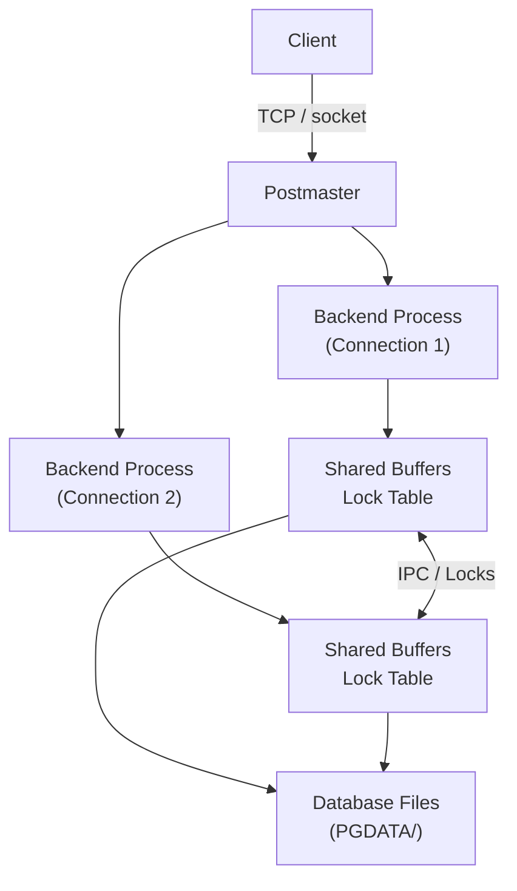
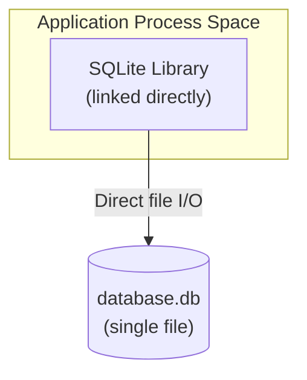

# PostgreSQL vs SQLite

by - Siddham Jain, siddham.23bcs10103@sst.scaler.com

## Problem Background

Databases are not interchangeable. The architectural decisions made by a database system ripple through every aspect of its deployment — from how you configure it to how it handles concurrent access to what happens when the power fails. PostgreSQL and SQLite represent two fundamentally different answers to the question "how should a relational database be built?" Despite sharing SQL as a query language and B-trees as an indexing structure, their underlying architectures diverge at almost every level.

PostgreSQL was developed at UC Berkeley in the 1980s as the POSTGRES project under Michael Stonebraker's direction. It was designed from the start as a research-grade database server capable of handling complex queries, multiple concurrent users, and large datasets — a client-server relational database for data centers before data centers had that name.

SQLite was created by Richard Hipp in 2000 under a contract for the US Navy. The target environment was embedded systems aboard guided-missile destroyers. The requirements were unusual: zero configuration, zero administration, resilience to sudden power loss, and operation on hardware where a full database server process would be impractical. SQLite's answer was to not be a server at all — it is a library, a file format with an SQL parser attached, designed to be linked into the host application.

This study examines the architectural choices made by both systems, explains why those choices differ, and analyzes the resulting trade-offs.

## Architecture Overview

### PostgreSQL: Client-Server Model

PostgreSQL operates as a standalone server process (the postmaster) that listens on a network port (default 5432). Clients connect over TCP/IP or Unix domain sockets. For each connection, the postmaster forks a dedicated backend process that handles query parsing, planning, execution, and result delivery for the lifetime of that connection.

Backend processes coordinate through shared memory segments that house the buffer pool, lock tables, and transaction state. The OS isolates each process; a crash in one backend does not affect others. The cost is memory — each backend accumulates private sort buffers and query plans, making connection pooling (PgBouncer, Pgpool-II) essential for deployments with large numbers of simultaneous clients.

### SQLite: Embedded Library

SQLite has no server process. The entire database engine compiles into the host application as a single C library. When the application calls `sqlite3_open()`, SQLite opens a file — that file is the database. Queries execute within the application's process space.

This eliminates network latency entirely — a query is a function call. The overhead of opening a SQLite connection is essentially the cost of the `open()` system call (measured in microseconds). For embedded systems, mobile applications, and single-user desktop software, this simplicity is a decisive advantage.

## Internal Design

### Process Model

PostgreSQL inherits a Unix-oriented fork-per-connection model. On Linux, `fork()` benefits from copy-on-write semantics — the child process initially shares memory pages with the parent, reducing the immediate cost. However, as each backend executes queries, it accumulates private memory for sort operations, cached plans, and per-connection state. With thousands of connections, memory consumption scales linearly.

SQLite runs in the calling thread. If the application is single-threaded, SQLite is single-threaded. If the application opens multiple database handles from different threads, each handle operates independently on the same file. There is no process lifecycle to manage.

### Storage Engine and File Organization

PostgreSQL organizes data as a directory tree under a `PGDATA` path. Each database is a subdirectory under `base/`, identified by an OID. Each table is represented by multiple files: the main heap (containing tuple data), a free space map (`_fsm`), and a visibility map (`_vm`). Indexes are separate files. The WAL resides in `pg_wal/`, transaction status in `pg_xact/`. This multi-file design allows independent growth of tables and indexes, supports tablespaces for distributing data across different physical storage, and enables TOAST (The Oversized-Attribute Storage Technique) for handling rows that exceed the 8KB page size.

SQLite stores everything in a single disk file organized into fixed-size pages (default 4KB). Every table is a B-tree keyed by the implicit 64-bit `rowid` (or by an explicit `INTEGER PRIMARY KEY`). Every index is also a B-tree. The schema is stored in a `sqlite_master` table on page 1. Even the free page list lives within the same file. This single-file design is what makes SQLite databases trivially portable and backup-friendly.

### Page Layout

PostgreSQL uses 8KB pages. A heap page contains a 24-byte header with checksum and free space pointers, an ItemId array of line pointers growing downward, and tuple data growing upward. Free space occupies the region between the ItemId array and tuple data.

SQLite uses 4KB pages. A B-tree page contains a page header, a cell pointer array sorted by key, and cell content growing upward from the bottom. The space between the pointer array and cell content is unallocated.

A critical architectural difference follows from this: in PostgreSQL, the heap is unordered and separate from all indexes. In SQLite, the table B-tree *is* the storage — the rowid determines physical row placement. A primary key lookup in SQLite requires one B-tree traversal. In PostgreSQL, it requires two: traverse the index B-tree to find the TID, then read the corresponding heap page.

### Index Implementation

Both databases use B-trees as their primary index structure. PostgreSQL implements a pluggable access method architecture with support for B-tree, Hash, GiST, SP-GiST, GIN, and BRIN indexes, each optimized for different data types and query patterns. A B-tree leaf page stores index tuples containing the key value and a TID (tuple identifier — a physical pointer to the heap page and item offset).

SQLite uses one B-tree implementation for everything: table B-trees store rows, index B-trees store keys and rowids, and the schema table itself is a B-tree. Index leaf pages store the key and the corresponding rowid. The `WITHOUT ROWID` option creates a clustered index where the table B-tree is ordered by the declared primary key rather than the implicit rowid.

### Transaction Management and Concurrency Control

PostgreSQL uses Multi-Version Concurrency Control (MVCC) through heap tuple versioning. Every row carries hidden system columns: `xmin` (the creating transaction ID) and `xmax` (the deleting transaction ID; 0 if still live). An UPDATE does not overwrite the existing tuple. It marks the old tuple's `xmax` with the updating transaction ID and inserts a new tuple with the updated data. Readers determine visibility by comparing these columns against their transaction snapshot — they never block writers, and writers never block readers.

SQLite uses file-level locking. In default rollback journal mode, a writer acquires an exclusive lock on the entire database, blocking all other writers and readers. In WAL mode, readers can proceed concurrently with a single writer — the writer appends to a separate WAL file while readers continue reading from the main database file. However, write operations remain serialized through a single write lock.

### Durability

Both databases use Write-Ahead Logging for durability. PostgreSQL writes every change to sequential WAL segment files under `pg_wal/` before modifying the heap, then fsyncs the WAL at commit. On crash recovery, PostgreSQL replays WAL from the last checkpoint to reconstruct a consistent state. The WAL also enables streaming replication — standby servers receive and replay the primary's WAL stream continuously.

SQLite in WAL mode appends changes to a separate WAL file, atomically updating the WAL header on commit. Periodically, a checkpoint copies WAL pages back into the main database file. On crash, SQLite replays any existing WAL. Both systems guarantee ACID compliance; the architectural difference manifests in concurrent-writer scalability rather than durability guarantees.

## Design Trade-Offs

### Concurrency vs. Simplicity

PostgreSQL's MVCC allows multiple readers and writers to operate concurrently without blocking. This is essential for multi-user web applications. The trade-off is visible: every UPDATE creates a dead tuple that must be reclaimed by VACUUM. Table bloat degrades performance if vacuuming is neglected.

SQLite's single-writer model is simpler but caps write throughput. For a mobile application saving user preferences, this limitation is irrelevant. For a web server handling concurrent order processing, it becomes a bottleneck. WAL mode partially mitigates this by decoupling readers from the writer, but the single-writer constraint is fundamental to the architecture.

### Scalability

PostgreSQL scales upward — it runs on servers with hundreds of cores, supports parallel query execution, table partitioning, and replication. It is built for data center deployments.

SQLite scales downward — it runs on microcontrollers, is the default database on every mobile platform, and compiles to a library under 1MB. It is built for devices.

### Administration

PostgreSQL requires operational knowledge: buffer pool sizing, checkpoint tuning, autovacuum configuration, replication setup, and connection management. Its configuration file has hundreds of parameters. This reflects its target deployment model where database administration is a dedicated role.

SQLite requires essentially no administration. There is no server to start, no authentication system, no replication to configure. Backups are file copies. This reflects its design goal of zero-configuration operation.

### Network Overhead

Every PostgreSQL query involves network or IPC round-trips. For simple queries, the network time can dominate total latency.

SQLite has no network latency — a query is a function call executed within the host process. For latency-sensitive local applications, SQLite can deliver lower query latency than PostgreSQL on identical hardware.

## Experiments and Observations

The following experiments were run on a MacBook Pro (M2, 16GB RAM) with PostgreSQL 16 and SQLite 3.43.

### File Size Under Data Growth

A table with an integer primary key and three text columns was populated with 100-character random strings.

| Rows | SQLite | PostgreSQL (heap) | PostgreSQL (index) |
|------|--------|-------------------|--------------------|
| 100K | ~18 MB | ~14 MB | ~2 MB |
| 1M | ~185 MB | ~145 MB | ~22 MB |

PostgreSQL adds approximately 23 bytes per row for MVCC metadata (xmin, xmax, and other header fields). The gap widens at scale.

### Point Lookup Performance

`SELECT * FROM table WHERE id = <random>` executed 10,000 times:

| Database | Mode | Total Time |
|----------|------|-----------|
| SQLite (in-process) | — | ~1.2 ms |
| PostgreSQL (local socket, per-query connection) | — | ~45 ms |
| PostgreSQL (persistent connection) | — | ~8 ms |

The PostgreSQL overhead is dominated by connection/IPC latency, not execution time.

### Full Table Scan Performance

`SELECT COUNT(*)` on 1,000,000 rows:

| Database | Time |
|----------|------|
| PostgreSQL | ~80 ms |
| SQLite | ~120 ms |

PostgreSQL's sequential scan optimization and planner advantage emerge when the working set exceeds available cache.

### Concurrent Write Throughput

Ten threads each inserting 1,000 rows:

| Database | Time | Notes |
|----------|------|-------|
| SQLite (WAL mode) | ~12 seconds | Serialized through write lock; CPU mostly idle |
| PostgreSQL | ~3 seconds | All connections wrote in parallel |

The single-writer bottleneck limits SQLite's write scalability regardless of available hardware.

### Connection Overhead

Open connection, execute `SELECT 1`, close — repeated 1,000 times:

| Database | Total Time |
|----------|-----------|
| SQLite | ~0.3 seconds |
| PostgreSQL | ~8 seconds |

The fork-per-connection cost makes connection pooling mandatory for PostgreSQL deployments.

## Key Learnings

**The client-server versus embedded architectural choice is the single most consequential decision in database design.** It determines the process model, the concurrency mechanism, the deployment paradigm, and the administration burden. PostgreSQL and SQLite share SQL syntax and B-tree indexing, but the structural constraint shapes everything else.

**PostgreSQL's MVCC model represents a deliberate trade-off: lock-free reads at the cost of storage bloat and mandatory garbage collection.** Other databases store old versions in separate undo segments. PostgreSQL chose to retain them in the heap, simplifying read logic but creating a maintenance burden (VACUUM) that must be actively managed.

**SQLite's WAL mode is a more significant improvement than commonly recognized.** It provides MVCC-like snapshot isolation for readers during writes, making the database viable for many concurrent-read workloads that would be impossible under the default rollback journal.

**Page size reflects deployment assumptions.** PostgreSQL's 8KB pages match server OS page sizes and RAID configurations. SQLite's 4KB pages minimize wasted space and suit the broadest range of hardware — from microcontrollers to desktop systems.

**The practical choice between these databases is primarily about operational model and concurrency requirements, not about raw single-query performance.** File sizes and lookup speeds differ less than their architectures suggest. The deciding factors are deployment complexity tolerance, concurrent access patterns, and administration resources.
