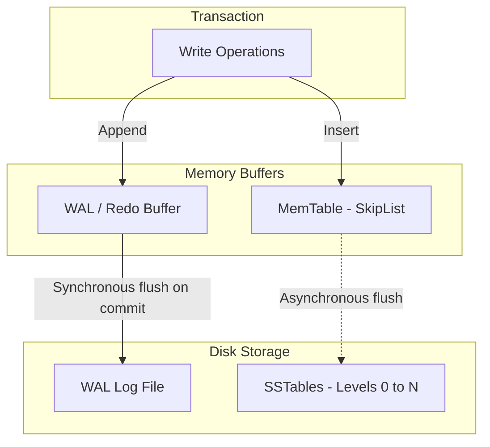

# System Design: Recovery Strategies (WAL & Compaction)

## 1. Problem Background
Durability (the "D" in ACID) guarantees that once a transaction commits, its updates survive even in the event of a system crash, power failure, or operating system panic.
However, writing every modified data page directly to disk at commit time is extremely slow because it requires random I/O.
To solve this, modern databases use **Recovery Strategies**:
1. **Write-Ahead Logging (WAL)**: Records changes in a fast, sequential log file before applying them to database pages, converting random writes into sequential writes.
2. **LSM-Tree Compaction**: Sorts and merges files in background threads, optimizing storage layouts for read performance while keeping write paths fast.

---

## 2. Architecture Overview

- **Write-Ahead Rule**: No data page modifications can be written to disk until the corresponding log records are written and synchronized to persistent storage.

---

## 3. Internal Design

### Write-Ahead Logging (WAL)
During normal operations, every page update writes a log record to the WAL buffer. On commit, only the WAL buffer is flushed and fsynced to disk sequentially.
- **LSN (Log Sequence Number)**: Each WAL record is assigned a monotonically increasing 64-bit integer called a Log Sequence Number. Every database page header stores the LSN of the last update that modified it (`pd_lsn`).
- **Recovery Phase (ARIES)**:
  1. **Analysis**: Scan the log forward from the last checkpoint to identify active transactions and dirty pages.
  2. **Redo**: Replay all logged modifications forward to reconstruct the state up to the point of the crash (including uncommitted transactions).
  3. **Undo**: Scan backward and roll back the changes of transactions that were active but uncommitted at the time of the crash.

### RocksDB LSM-Tree Write Path and Compaction
RocksDB optimizes write performance by avoiding in-place updates entirely:
1. Writes are written to a WAL and inserted into an in-memory **MemTable**.
2. When the MemTable fills up, it is flushed to Level 0 disk files as sorted, immutable **SSTables**.
3. **Compaction**: Because Level 0 files can contain overlapping key ranges, background threads merge and sort SSTables into lower levels (Level 1 to $N$) to keep read paths fast.

---

## 4. Design Trade-Offs

### Compaction Amplification Trade-offs (The RUM Conjecture)
LSM-tree recovery and storage are governed by:
- **Write Amplification (WA)**: Data is written multiple times during compaction. High write amplification wears out SSDs.
- **Read Amplification (RA)**: A single read query may need to search multiple levels and SSTables, though this is mitigated by **Bloom Filters** (which determine if a key is absent with 100% certainty before doing disk I/O).
- **Space Amplification (SA)**: Stale data versions and deleted keys (marked with deletion markers called **Tombstones**) persist on disk until compaction purges them.

| Strategy | Write Amplification | Read Amplification | Space Amplification | Best Fit |
| :--- | :--- | :--- | :--- | :--- |
| **Leveled Compaction** | High | Low | Low | Read-heavy / Mixed workloads |
| **Size-Tiered / Universal** | Low | High | High | Write-heavy workloads |

---

## 5. Experiments / Observations

### RocksDB Compaction and Performance
LSM trees are optimized for write-heavy workloads because the write path only appends to the WAL and writes to memory (MemTable). However, compaction can become expensive under heavy write loads:
1. Compaction threads consume substantial I/O bandwidth, which can lead to **write stalls** (temporary pauses in client writes to allow compaction to catch up).
2. CPU utilization spikes during compaction due to block decompression, key sorting, and compression.
3. Bloom Filters are critical; without them, read amplification would degrade lookup performance as every level is searched.

---

## 6. Key Learnings

1. **Sequential Writes enable high performance**: Writing transaction logs sequentially (WAL) allows database engines to achieve high transactional throughput while maintaining durability.
2. **LSNs coordinate recovery**: Comparing a page’s `pd_lsn` with the LSN of a log record prevents the recovery manager from replaying updates that are already present on disk, ensuring recovery is idempotent.
3. **Compaction is a necessary cost**: LSM-trees trade write latency for background compaction overhead, showing that storage systems must choose which amplification factor (Read, Write, or Space) to optimize.
