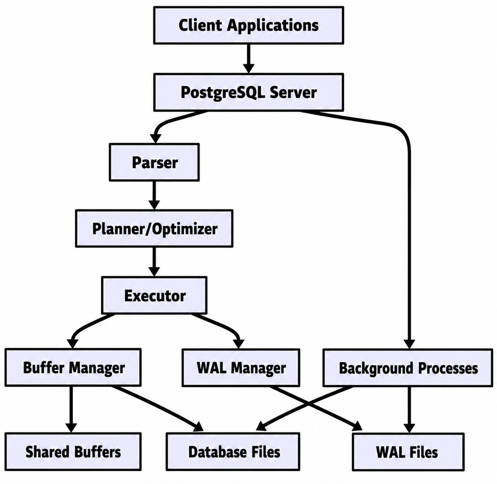
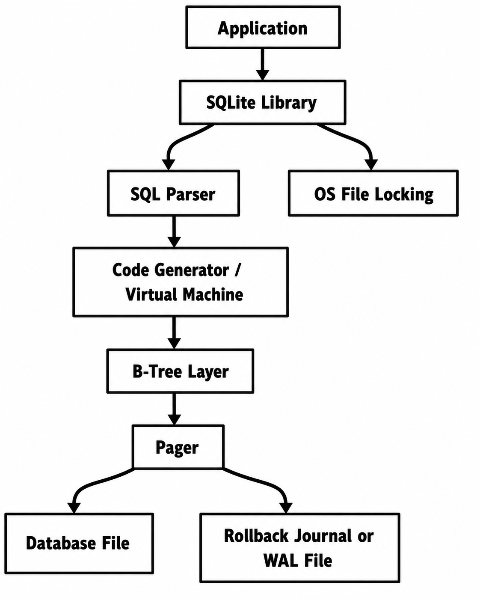

# PostgreSQL vs SQLite Architecture Comparison

This README analyzes the internal architecture of PostgreSQL and SQLite, two widely used relational database systems built for very different environments. Rather than listing features, the goal here is to explain why each system is designed the way it is, what engineering trade-offs follow from those choices, and how those choices affect real-world behavior.

PostgreSQL is designed as a general-purpose, multi-user, client-server database for applications that need concurrency, extensibility, reliability, and scale. SQLite is designed as a lightweight embedded database library for applications that need simplicity, portability, and minimal administration. Their differences are not accidental; they come directly from the problems each system was created to solve.

# Problem Background

A database system exists to store, retrieve, and protect data efficiently while supporting correctness under failures and concurrent access. However, not all applications need the same kind of database.

PostgreSQL was built for environments where multiple users and applications access the same data at the same time, often over a network. Such systems need:

- Strong transactional guarantees
- Sophisticated query optimization
- Fine-grained concurrency control
- Recovery after crashes
- Support for large datasets and many clients

Historically, PostgreSQL evolved from the POSTGRES research project at UC Berkeley. That research background is visible in its architecture: it emphasizes correctness, extensibility, and support for advanced database features.

SQLite, in contrast, was created for applications that need a database inside the application itself, without running a separate server. Typical examples include:

- Mobile apps
- Browsers
- IoT devices
- Desktop applications
- Local caches and configuration stores

Its design goal is different: make the database easy to deploy, easy to embed, and reliable enough to work even on constrained systems. In SQLite, the database is just a file, and the database engine is a library linked directly into the program.

So the fundamental contrast is this:

| System | Primary goal | Typical environment |
|----------|----------|----------|
| PostgreSQL | Multi-user, scalable, feature-rich database service | Servers, web backends, enterprise systems |
| SQLite | Lightweight embedded storage with zero administration | Mobile apps, desktop apps, edge devices |

# Architecture Overview

The biggest architectural difference is client-server vs embedded design.

## PostgreSQL architecture

PostgreSQL runs as a database server process. Client applications connect to it over IPC or TCP. The server accepts connections, parses SQL, plans queries, executes them, reads and writes storage, and manages transactions centrally.

A simplified diagram:

Main components:

- Client connections send SQL requests.
- The parser converts SQL text into an internal representation.
- The planner/optimizer chooses an execution strategy.
- The executor runs the plan.
- The buffer manager caches disk pages in memory.
- The WAL manager records changes for durability.
- Background processes handle checkpoints, vacuuming, replication support, and cleanup.

## SQLite architecture

SQLite does not run as a separate server. Instead, the application links against the SQLite library and calls it directly. SQL execution, storage management, locking, and recovery all happen inside the same process space as the application.

A simplified diagram:

### Main Components

- The application directly calls SQLite APIs.
- The SQL parser and code generator compile SQL into bytecode.
- The virtual machine executes that bytecode.
- The B-tree layer manages tables and indexes.
- The pager manages pages, caching, locking, and durability.
- The OS file locking layer coordinates concurrency.

## Why These Architectures Differ

### PostgreSQL Uses Client-Server Architecture Because It Is Meant to Support

- Many simultaneous clients
- Centralized access control
- Shared memory coordination
- Background maintenance
- Network-based access

### SQLite Uses Embedded Architecture Because It Optimizes For

- No separate service to install or manage
- Very low resource overhead
- Direct local access
- Easy bundling inside applications
- Simplicity of deployment

This architectural choice influences almost every other design decision.

# Internal Design

## Storage Structures

### PostgreSQL Storage Engine

PostgreSQL stores data in files organized into pages, typically 8 KB each. A table is physically stored as a heap file made up of many pages. Each page contains multiple tuples and metadata.

#### Important Storage Properties

- Tables are stored as heap-organized storage
- Indexes are stored separately from table data
- A row version update usually creates a new tuple version
- Visibility information is managed using transaction metadata

PostgreSQL uses MVCC by storing multiple row versions. Instead of overwriting a row in place for every update, it often writes a new version and marks the old version as obsolete later. This improves concurrency but increases storage complexity and creates dead tuples that must eventually be cleaned up by VACUUM.

### SQLite Storage Engine

SQLite also stores data in fixed-size pages, but its internal design is more tightly integrated around a B-tree-based file format. Both tables and indexes are represented using B-trees.

#### Important Storage Properties

- The whole database is usually a single file
- Tables are often stored in table B-trees
- Indexes are stored in index B-trees
- The pager sits underneath the B-tree layer and manages page movement and durability

SQLite's design is simpler because the database is intended to be portable and self-contained. A single file can be copied, moved, backed up, or embedded with minimal complexity.

## Database File Organization

### PostgreSQL

PostgreSQL stores a database cluster as a directory structure containing:

- Data files for tables and indexes
- Write-ahead log files
- System catalog files
- Temporary files
- Configuration files

A single logical table may span multiple physical files as it grows. PostgreSQL's on-disk layout is not meant to be human-portable in the same way as SQLite's single-file model. It is optimized more for a full database server's needs than for simple embedding.

### SQLite

SQLite stores the entire database in one primary file, plus temporary durability-related files such as:

- Rollback journal, or
- WAL file and shared memory support files

This is one of SQLite's strongest engineering decisions. It makes deployment and backup easy, but it also means concurrency and recovery mechanisms must work within the constraints of a file-based embedded model.

## Table Storage and Page Layout

### PostgreSQL Page Layout

A PostgreSQL page typically contains:

- Page header
- Item identifier array
- Tuple data
- Free space

The item identifier array points to tuple locations inside the page. This indirection allows tuples to move within a page without changing all external references to item slots.

Each tuple contains metadata such as:

- Transaction visibility information
- Tuple length and flags
- Actual column values

This design supports MVCC efficiently, but it adds per-row metadata overhead.

### SQLite Page Layout

SQLite pages are also highly structured. A page may represent:

- B-tree interior page
- B-tree leaf page
- Overflow page
- Freelist page

A B-tree page contains:

- Page header
- Cell pointer array
- Cells containing keys and payload references
- Free space region

SQLite uses this structure for both table storage and indexes. The format is compact and optimized for reliable file-based access. Compared to PostgreSQL, SQLite's page design is more tightly tied to its B-tree-centric storage model.

## Index Organization

### PostgreSQL Indexes

PostgreSQL supports multiple index types, including:

- B-tree
- Hash
- GIN
- GiST
- BRIN
- SP-GiST

This reflects PostgreSQL's goal as a general-purpose extensible DBMS. Different workloads need different indexing strategies.

### SQLite Indexes

SQLite primarily uses B-tree indexes. Its index design is simpler and narrower in scope than PostgreSQL's, which fits SQLite's lightweight goals.

## Memory Management

### PostgreSQL

PostgreSQL uses shared memory extensively:

- Shared buffers cache data pages
- WAL buffers hold pending log records
- Per-process memory supports sorting, hashing, and execution operators

### SQLite

SQLite typically runs inside one process and uses a simpler memory model:

- Page cache managed by the pager
- Memory for SQL execution and temporary structures
- No large standalone shared server memory subsystem in the PostgreSQL sense

## Transaction Processing

### PostgreSQL

PostgreSQL follows write-ahead logging (WAL).

#### Transaction Flow in PostgreSQL

1. A transaction begins.
2. Reads use MVCC snapshots.
3. Updates create new row versions.
4. WAL records are generated.
5. On commit, commit state is recorded durably.
6. Background processes later flush dirty pages and clean old row versions.

### SQLite

SQLite supports transactions through its pager and journaling mechanisms.

#### Durability Modes

- Rollback journal
- Write-ahead logging (WAL) mode

## Concurrency Control

### PostgreSQL

#### Key Ideas

- Readers typically do not block writers
- Writers typically do not block readers
- Multiple row versions enable snapshot isolation behavior
- Cleanup is deferred to vacuuming

### SQLite

#### Typical Behavior

- Multiple readers can coexist
- Writers require stronger locking
- Only limited simultaneous writing is possible
- Long write transactions can delay others

## Recovery Mechanisms

### PostgreSQL

- Write-ahead log replay
- Checkpoints
- Background writer and checkpointer processes

### SQLite

- Rollback journal undo, or
- WAL replay/checkpointing depending on mode

# Design Trade-Offs

## Why PostgreSQL Uses Client-Server Architecture

### Advantages

- Supports many concurrent clients
- Centralizes authentication and authorization
- Enables shared caching and coordinated transaction management
- Supports background tasks like vacuum, checkpointing, and replication
- Better fit for scalable web and enterprise deployments

### Limitations

- Requires installation, configuration, and administration
- Higher memory and CPU overhead
- More complex operational model
- Network round trips add latency for some workloads

## Why SQLite Is Embedded

SQLite is designed for the opposite problem: make local persistent storage easy to use anywhere.

### Advantages

- No server setup
- Tiny footprint
- Single-file database
- Easy backup and distribution
- Very low latency for local access
- Excellent reliability for embedded scenarios

### Limitations

- Limited write concurrency
- Not designed for networked multi-user access
- Fewer advanced server-side features
- Scalability ceiling is lower for shared workloads

SQLite accepts concurrency limitations in exchange for simplicity and deployability.

# PostgreSQL vs SQLite at a Glance

| Aspect | PostgreSQL | SQLite |
|----------|----------|----------|
| Architecture | Client-server | Embedded library |
| Process model | Multiple server/backend processes | Runs inside application process |
| Storage model | Heap tables + separate indexes | B-tree-based file structure |
| Deployment | Dedicated database service | Single library + database file |
| Concurrency | High read/write concurrency with MVCC | Many readers, limited writers |
| Durability | WAL, checkpoints, crash recovery | Rollback journal or WAL mode |
| Scalability | Strong for multi-user systems | Best for local/small-scale use |
| Administration | Requires setup and tuning | Minimal administration |

# Scalability Implications

The architectural decisions directly affect scalability.

### PostgreSQL Scales Well When

- Many users connect concurrently
- Complex queries need optimization
- Large datasets require advanced indexing and planning
- Transactions overlap heavily
- The database is part of a backend service architecture

### SQLite Scales Well When

- The database is local to one application
- The workload is read-heavy or lightly write-heavy
- Deployment simplicity matters more than centralized control
- The dataset is moderate and accessed from one device or process context

A key insight is that SQLite is not a smaller PostgreSQL, and PostgreSQL is not just a "bigger SQLite." They solve different system design problems.

# Real-World Use Cases

## SQLite Works Well for Mobile Applications Because

- Mobile apps need an embedded local database
- Installing and managing a database server on a phone is impractical
- Single-user access is the normal case
- Local file-based storage is efficient
- Battery, memory, and storage efficiency matter

### Examples

- Offline note-taking apps
- Mobile messaging caches
- Local settings/configuration stores
- Browser storage
- Edge-device logging

## PostgreSQL Is Preferred for Large Multi-User Systems Because

- Many users must read and write concurrently
- Access control and centralized management matter
- Complex joins, aggregations, and indexing are common
- Backup, replication, and server-side tooling are important
- Long-term maintainability and extensibility matter

### Examples

- E-commerce backends
- Banking and finance systems
- SaaS platforms
- ERP/CRM systems
- Analytics and reporting systems

# Experiments / Observations

This section can be strengthened with practical testing. Even simple observations help connect architecture to behavior.

## Suggested Experiment 1: Concurrent Writes

Run multiple concurrent write-heavy workloads on both systems.

### Expected Observation

- PostgreSQL continues to support concurrent writers reasonably well because of MVCC and server-side coordination.
- SQLite shows contention earlier because write access is more serialized.

## Suggested Experiment 2: Local Single-User Reads

Run repeated read queries from one application process.

### Expected Observation

- SQLite can perform extremely well for local reads because there is no network or server communication overhead.
- PostgreSQL may have slightly higher overhead for the same tiny workload because it is a full server system.

## Suggested Experiment 3: Query Plans

Compare query execution plans for indexed and non-indexed queries.

### Expected Observation

- PostgreSQL often shows more sophisticated planning behavior, especially for joins and larger datasets.
- SQLite's planner is effective but generally simpler, reflecting its lightweight design goals.

## Suggested Experiment 4: Update-Heavy Workloads

Perform repeated updates on the same table.

### Expected Observation

- PostgreSQL may accumulate dead tuples that later require vacuuming.
- SQLite avoids this exact MVCC cleanup pattern, but write serialization may become more visible.

## Example Observation Table

| Experiment | PostgreSQL Likely Behavior | SQLite Likely Behavior |
|------------|---------------------------|------------------------|
| Many concurrent writers | Better throughput under contention | Lock contention appears sooner |
| Single-app local queries | More overhead | Very efficient |
| Complex joins | Better optimizer choices | Simpler planning |
| Frequent updates | MVCC cleanup overhead | Less MVCC-style bloat, but writes serialize |

If actual benchmarks are added, they should not just report numbers. They should explain why the numbers appear.

# Key Learnings

Several architectural lessons emerge from this comparison.

- Architecture follows workload. PostgreSQL and SQLite differ because they target different environments, not because one is universally better.
- Concurrency has a cost. PostgreSQL's strong concurrency support requires MVCC, vacuuming, WAL, background processes, and more metadata.
- Simplicity is a design achievement. SQLite's embedded single-file design is not a limitation alone; it is a highly effective engineering choice for local storage.
- Storage design shapes behavior. Heap storage plus MVCC in PostgreSQL leads to different update and cleanup behavior than SQLite's pager and B-tree-centric file structure.
- Operational complexity is a trade-off. PostgreSQL offers stronger multi-user scalability, but SQLite offers easier deployment and lower administrative burden.
- System behavior becomes easier to predict when internal design is understood. Locking, performance, durability, and scaling characteristics all make more sense once the architecture is examined.

# Conclusion

PostgreSQL and SQLite are both excellent database systems, but they represent two different philosophies of database engineering.

PostgreSQL is designed for shared, concurrent, long-running, server-managed workloads. It embraces architectural complexity to provide powerful concurrency control, extensibility, and scalability.

SQLite is designed for embedded, local, low-administration workloads. It minimizes moving parts and operational overhead, even if that means limiting write concurrency and large-scale multi-user behavior.

The most important takeaway is that database architecture is not only about storing data correctly. It is about making deliberate trade-offs between simplicity, concurrency, portability, performance, and operational complexity. PostgreSQL and SQLite are useful precisely because they optimize different points in that design space.