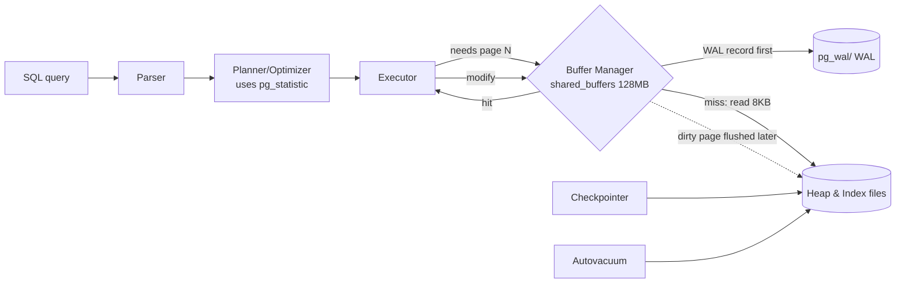

# PostgreSQL Internal Architecture — Key Points

## 1. Problem Background

PostgreSQL addresses four fundamental challenges in shared, durable, multi-user database design:

| Problem | Component |
|---|---|
| Disk is slow; don't read the same page twice | **Buffer Manager** (shared buffers) |
| Find one row among millions without scanning | **B-tree indexes** (nbtree) |
| Let many transactions read/write concurrently without locking each other | **MVCC** (multi-version rows) |
| Survive a crash with no committed data lost | **WAL** (write-ahead log) |

The overarching principle emphasizes: "PostgreSQL almost never overwrites or blocks when it can instead *append a new version* and *log the intent first*." This design choice enables concurrency and crash-safety while necessitating the `VACUUM` process.

---

## 2. Architecture Overview



The fundamental rule: "a change is written to WAL (and fsync'd) before the modified data page is allowed to reach the heap on disk." This ordering underpins crash recovery.

---

## 3. Internal Design

### 3.1 Buffer Manager — the 8 KB page cache

PostgreSQL operates on fixed 8 KB pages. The `shared_buffers` parameter (128 MB = 16,384 slots in this instance) serves as a shared-memory cache. Query execution plans report statistics:

```
Bitmap Heap Scan on enrollments  (student_id = 12345)
  Buffers: shared hit=11 read=1        
  Execution Time: 0.048 ms
```

Post-workload cache state shows:

```
 relname          | buffers | cached
------------------+---------+--------
 enrollments      |   1406  | 11 MB
 idx_enr_student  |    255  | 2040 kB
 students         |    141  | 1128 kB
```

Replacement uses a clock-sweep algorithm approximating LRU behavior. Each buffer maintains a usage counter; eviction occurs when the counter reaches zero for unpinned pages. Background processes (`bgwriter` and `checkpointer`) handle dirty-page flushing asynchronously, preserving foreground query performance.

### 3.2 Heap tuple & page layout (via `pageinspect`)

Heap pages organize as: header → line-pointer array → free space → tuples. Real page 0 of `students` demonstrates:

```
 lp | lp_off | lp_len | t_xmin | t_xmax | t_ctid
----+--------+--------+--------+--------+--------
  1 |      0 |      0 |        |        |          
  2 |   8144 |     48 |    812 |    814 | (0,2)
  3 |   8096 |     48 |    812 |    814 | (0,3)
```

A row's location is its `ctid = (page, line-pointer)`. Indexes reference `ctid`, not byte offsets, allowing tuple movement within pages or vacuuming without index rewrites—only the line pointer changes.

### 3.3 B-tree indexes (via `pageinspect`)

The primary-key index metadata shows:

```
 magic  | version | root | level | fastroot
 340322 |    4    |   3  |   1   |    3
```

This Lehman-Yao B+-tree has level 1 (root plus one leaf level) for 20k keys. Leaf entries pair indexed values with heap `ctid`:

```
 itemoffset |   ctid   | data (key)
     2      | (0,1)    | 01 00 00 00 ...  
     3      | (137,32) | 01 00 00 00 ...  
```

The index contains multiple entries for id=1 (one per row version). Search traverses root to leaf comparing keys; the leaf's `ctid` retrieves the heap tuple. Inserts causing leaf overflow trigger page splits, moving half the entries to a new page with a parent separator key.

### 3.4 MVCC — versioning instead of locking

Every row contains hidden columns **`xmin`** (creating transaction) and **`xmax`** (deleting/superseding transaction). Updates don't overwrite—they mark old versions dead and write new ones:

```
-- before UPDATE
 id | ctid  | xmin | xmax
  1 | (0,1) | 812  | 814

BEGIN; UPDATE students SET dept='CS' WHERE id=1; 

-- after: brand new tuple
 id |   ctid   | xmin | xmax
  1 | (137,32) | 863  |  0
```

The old tuple at `(0,1)` persists; the new one resides at `(137,32)`. Transaction snapshots determine visibility: a tuple appears if its `xmin` committed before the snapshot and `xmax` hasn't committed (or is null). "readers never block writers and writers never block readers" because they examine different versions.

### 3.5 VACUUM — the price of MVCC

Dead tuples accumulate. After bulk updates creating ~20k dead rows, `VACUUM` execution showed:

```
INFO: vacuuming "dbms_lab.public.enrollments"
tuples: 19990 removed, 200000 remain
index scan needed: 138 pages had 19990 dead item identifiers removed
WAL usage: 1851 records, 359014 bytes
```

This process reclaims dead tuples for reuse and updates the visibility map, enabling skipping of all-visible pages in future vacuums and index-only scans. Without it, tables bloat and transaction-ID wraparound creates correctness risks—hence `autovacuum` runs continuously.

### 3.6 WAL — durability & recovery

```
 current_lsn | walfile
 0/4A2ABD0   | 000000010000000000000004
 wal_level = replica | fsync = on | synchronous_commit = on
```

Every modification generates a WAL record in `pg_wal/`, identified by monotonic LSN (log sequence number). With `synchronous_commit=on`, commit waits for LSN fsync before returning. Data pages flush lazily. Crash recovery replays WAL from the last checkpoint forward, reconstructing committed changes not yet in the heap. The VACUUM example generated 1,851 WAL records—cleanup itself is logged for crash-safety.

---

## 4. Design Trade-Offs

**MVCC's bargain.** Append-on-update provides lock-free concurrency, economical snapshots, and instant rollback. The cost involves dead-tuple accumulation and VACUUM machinery—table/index bloat if vacuum lags, plus extra reads chasing `xmax` chains. PostgreSQL accepts ongoing background cleanup rather than blocking readers.

**Heap + separate indexes.** Because the table is an unordered heap and all indexes reference by `ctid`, every index functions as a secondary index. Advantages include low-cost index creation without clustered-index rebuild expenses. Disadvantages include absent clustered locality and mandatory touches to every index for non-HOT updates (the id=1 example created a second index entry). The HOT (heap-only-tuple) optimization avoids this *only* when no indexed column changed and the new version fits on the same page.

**WAL.** Sequential WAL writes transform many random page writes into a single sequential append plus deferred flush—faster commits and durability combined. The cost is write amplification (data written twice: WAL then heap) and checkpoint I/O spikes during dirty-page flushing.

**Cost-based planning depends on statistics.** Accurate plans require reliable `pg_statistic`; stale statistics yield poor row estimates and inferior plans. This explains `ANALYZE`'s importance.

---

## 5. Experiments / Observations

**Recommended exercise—a 3-table join `EXPLAIN ANALYZE`:**

```
EXPLAIN (ANALYZE, BUFFERS)
SELECT s.dept, count(*), avg(e.grade)
FROM students s JOIN enrollments e ON e.student_id=s.id
JOIN courses c ON c.id=e.course_id
WHERE s.dept='CS' AND c.credits=4 GROUP BY s.dept;
```

```
Finalize GroupAggregate (actual time=24.288..25.620 rows=1)
  Gather (Workers Launched: 1)
    Partial GroupAggregate
      Hash Join (e.course_id = c.id)              est 5882  / actual 5000
        Hash Join (e.student_id = s.id)           est 23529 / actual 20000
          Parallel Seq Scan on enrollments        100000 rows/worker
          Hash -> Bitmap Index Scan on idx_students_dept (dept='CS')
        Hash -> Seq Scan on courses (credits=4)   Rows Removed by Filter: 375
Planning Time: 1.771 ms   Execution Time: 25.783 ms
```

Plan analysis reveals: Two hash joins with parallel processing of large unsorted inputs. `students` accessed via bitmap index scan on `dept` (selective: 4,000/20,000), while `courses` uses sequential scan (filter `credits=4` retains 125/500—index unnecessary). Estimate-to-actual ratios (5,882 vs 5,000; 23,529 vs 20,000) are close, indicating sound statistics.

`pg_stats` explains these choices:

```
 attname    | n_distinct | most_common_vals
 student_id |   19923    | {12154}                      
 grade      |     11     | {8,0,7,2,3,9,4,1,5,6,10}    
```

**Index vs sequential scan selectivity:**

```
WHERE student_id = 12345  -> Bitmap Index Scan, Buffers: 12,   0.048 ms
WHERE grade = 7           -> Seq Scan,           Buffers: 1274, 9.361 ms
                             Rows Removed by Filter: 181818
```

With only 11 distinct `grade` values, `grade = 7` matches ~18k rows (9% of the table). The planner correctly identifies full scanning as cheaper than 18k random index fetches—indexing the highly selective `student_id` instead. This exemplifies effective cost-based planning from `pg_statistic`.

Buffers confirm caching: index lookup touched 12 pages; the sequential scan used all 1,274 table pages. Subsequently, `pg_buffercache` showed all 1,406 `enrollments` buffers resident.

---

## 6. Key Learnings

1. **`ctid` is the spine.** Indexes reference it, MVCC relocates it, VACUUM reclaims it. Observing `(0,1)` become `(137,32)` after an UPDATE demonstrated the append-on-update model.

2. **MVCC and VACUUM form one mechanism.** Lock-free reading necessarily produces dead tuples; dead tuples require cleanup mechanisms—this represents their essential interdependence.

3. **Planner quality depends on statistics.** The same table chose indexing for one column and sequential scanning for another, purely from `n_distinct`/MCV in `pg_statistic`. Estimates within ~15% of actuals generated sensible parallel hash-join plans.

4. **WAL implements "log intent, then execute."** Commits fsync the log, not data; recovery replays the log. This prevents committed-data loss during mid-write crashes.

5. **Buffer management substantially influences performance.** Cache hits (`shared hit`) cost nearly nothing; optimization largely means minimizing distinct 8 KB pages touched by queries.
