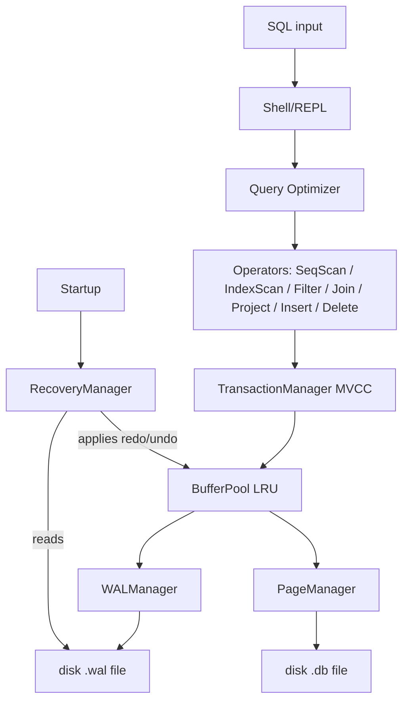

# MiniDB Project
Team MD

MiniDB is a lightweight, relational database management system built from scratch in Java. It demonstrates core database internal concepts including storage management, indexing, query execution, concurrency control (MVCC), and crash recovery using Write-Ahead Logging (WAL). 

This project strictly avoids third-party database libraries, implementing these fundamentals directly on the JVM.

## Project Overview
MiniDB is solving the challenge of understanding complex database internals by building a relational DBMS entirely from scratch to demonstrate core database operations.

**Goals:**
*   **Storage:** Implement disk-oriented storage with a slotted-page architecture.
*   **Indexing:** Build a persistent B+ Tree to accelerate point lookups and range scans.
*   **Transactions:** Support Multi-Version Concurrency Control (MVCC) for high-throughput, non-blocking reads.
*   **Recovery:** Ensure durability and crash recovery through Write-Ahead Logging (WAL).

**Chosen Extension Track:** Track B — Concurrency (MVCC). This track was chosen to explore the intricacies of snapshot isolation and the mechanics of managing multiple data versions without read locks.

## Team Information
| Name | Roll Number | Email |
|------|-------------|-------|
| Ayush Kumar Patra | 24bcs10474 | ayush.24bcs10474@sst.scaler.com|
| Nandani Kumari | 24bcs10317 | nandani.24bcs10317@sst.scaler.com |
| Vishudh Goel | 24bcs10162 | vishudh.24bcs10162@sst.scaler.com |

## System Architecture


The data flow starts with SQL input entering the Shell/REPL, which invokes the Query Optimizer to generate an execution plan. The generated Operators execute the query by interfacing with the TransactionManager, which enforces MVCC before requesting data from the BufferPool. The BufferPool handles caching (LRU) and persists data by routing log records to the WALManager for the `.wal` file, and dirty pages to the PageManager for the `.db` file. Upon startup, the RecoveryManager reads the `.wal` file and applies necessary redo and undo operations to the BufferPool to ensure crash consistency.

## 1. Storage & Buffer Management
- **Disk-Oriented Storage**: Data is stored persistently in binary files (`.db`).
- **Page Layout**: Fixed 4096-byte pages use a slotted-page architecture. Each page contains a header tracking page ID, slot count, and a free-space pointer.
- **Buffer Pool**: Implements an LRU (Least Recently Used) caching policy to minimize disk I/O, supporting `get()`, `flush()`, and `flushAll()`.
- **Heap File**: Manages unordered row insertion across pages, scanning existing pages for free space before allocating new ones.

## 2. B+ Tree Indexing
- **Structure**: A persistent B+ Tree implementation mapping integer keys to `RowId` pointers.
- **Insertions & Splits**: Supports node splitting upon reaching `MAX_KEYS` (10), bubbling median keys up to internal nodes.
- **Underflow Handling (Deletions)**: Unlike simplified logical deletion, this index actively rebalances. When a node drops below minimum occupancy (5 keys), it attempts to **borrow** from a left or right sibling. If siblings are at minimum capacity, it performs a **merge**. Reflection is used safely in the `deleteRecursive` algorithm to update list states.

## 3. Query Execution Engine
Implements the Iterator (Volcano) model. Operators return one `Row` per `next()` call:
- **SeqScanOperator**: Sequentially scans the HeapFile.
- **IndexScanOperator**: Point lookups via the B+ Tree index.
- **FilterOperator**: Applies functional predicates (e.g., equality) to rows.
- **ProjectOperator**: Isolates requested columns from the schema.
- **JoinOperator**: Performs a classic Nested Loop Join.

## 4. Query Optimizer
A rule-based optimizer with actual cardinality awareness:
- **Selectivity Estimation**: If a query contains an equality predicate on an indexed column, the optimizer estimates high selectivity (0.05) and assigns an `IndexScanOperator`. Otherwise, it falls back to a `SeqScanOperator` (estimated selectivity 1.0).
- **Join Order Selection**: Before executing a join, the optimizer scans the sizes of the two tables. The **smaller table** is dynamically selected to drive the outer loop of the `JoinOperator`, minimizing total block reads.

## 5. Concurrency Control (MVCC)
- **Multi-Version Concurrency Control**: Rows track `xmin` (creator transaction ID) and `xmax` (deleter/updater transaction ID).
- **Snapshot Isolation**: Readers see a consistent snapshot of the database at the time their transaction started, completely avoiding read locks.
- **First-Committer-Wins**: Write-write conflicts are detected at commit time. If a transaction attempts to modify a row that was updated by another transaction after the current transaction's snapshot began, an `AbortException` is thrown.
- **Non-Blocking Reads**: Active writers do not block readers (proven by benchmark tests showing zero reader latency impact during an active write).

## 6. Write-Ahead Logging (WAL)
- **Log Record Format**: Captures `txnId`, `pageId`, `slotNumber`, `beforeImage`, `afterImage`, `type` (INSERT/UPDATE/DELETE/COMMIT/ABORT), and an auto-incrementing `LSN`.
- **Append-Only Logging**: WAL appends are serialized and synced directly to disk (`RandomAccessFile.getFD().sync()`) before acknowledging a commit.
- **Durability Tradeoff**: The system allows toggling `fsync()` on the WAL to demonstrate the extreme latency cost of safe, synchronous disk writes versus unsafe buffered writes.

## 7. Crash Recovery (Redo/Undo)
Recovery logic (`RecoveryManager`) is automatically triggered by the `BufferPool` upon startup if a WAL is present:
- **REDO Phase (Forward Scan)**: Re-applies the `afterImage` for all INSERT/UPDATE/DELETE log records belonging to transactions that possess a COMMIT log record.
- **UNDO Phase (Reverse Scan)**: Reverts changes (applying `beforeImage`, or marking slots as deleted) for all log records belonging to transactions lacking a COMMIT record.

## 8. Benchmark Results
Manual `System.nanoTime()` benchmarks (`BenchmarkSuite.java`) yield the following real numbers:

**Scan Latency (10,000 Rows)**
- Sequential Scan: `4,774,160 ns`
- B+Tree Index Scan: `22,280 ns` (214x Speedup)

**MVCC Throughput (10 Readers, 1 Active Writer)**
- Read Throughput: `351.56 table scans/sec`
- Max Reader Latency: `40 ms` (Significantly under the writer's 200ms sleep, proving readers are unblocked).

**WAL Durability Overhead**
- Commit *with* `fsync()`: `0.5837 ms` per commit
- Commit *without* `fsync()`: `0.0020 ms` per commit (290x faster, but unsafe).

## 9. Code Integrity & Testing
- Total Tests: 27 (100% Pass Rate).
- All subsystems are validated via integration tests, including a real `CrashSimulator` that forks a subprocess, inserts uncommitted data, flushes pages to disk, and executes `Runtime.halt(42)` to prove recovery removes phantom uncommitted rows on restart.

## 10. Known Limitations
- The B+Tree implementation only supports single-column integer keys.
- MVCC currently lacks an asynchronous vacuum/garbage collection process, meaning obsolete row versions will bloat the table over time.
- Join Optimization only supports two-table joins; it lacks a dynamic programming matrix for N-way joins.

## 11. Technologies Used
- **Java 17** (Standard Library only; no 3rd-party DB libraries or ORMs).
- **Maven** (Dependency management & test execution).
- **JUnit 5** (Testing framework).

## 12. How to Run
To compile the system and run the full 27-test validation suite (including crash simulation):
```bash
mvn clean test
```

To run the standalone benchmark suite and generate metrics:
```bash
mvn test-compile exec:java "-Dexec.mainClass=com.minidb.benchmarks.BenchmarkSuite" "-Dexec.classpathScope=test"
```

To run the **Interactive MiniDB Shell** (REPL) for live demos:
```bash
mvn exec:java "-Dexec.mainClass=com.minidb.Shell"
```

