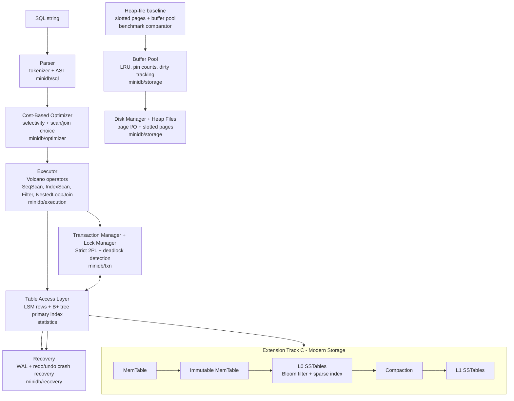

# MiniDB - A Working Relational Database Engine

> Advanced DBMS Capstone Project - Extension Track **C - Modern Storage (LSM-tree)**

MiniDB is a from-scratch relational database engine written in pure Python (no
third-party dependencies). It integrates a page-based storage engine, a B+ tree
index, a SQL parser, a cost-based optimizer, a Volcano-style execution engine,
strict-2PL transactions with deadlock detection, and WAL-based crash recovery,
with LSM-tree storage as the default SQL table backend for Track C, benchmarked
against the heap-file + B+ tree baseline.

---

## Team Information

**Team Name:** PageFault

| Full Name | Roll Number | Scaler Email |
|---|---|---|
| Shambhu Yadav | 10356 | shambhu.24bcs10356@scaler.com |
| Sudharsan | 10077 | sudharsan.23bcs10077@sst.scaler.com |
| Krishna Patidar | 10036 | krishna.23bcs10036@sst.scaler.com |
| Arjun Kshirsagar | 10157 | arjun.23bcs10157@sst.scaler.com |

---

## 1. Project Overview

**Problem statement.** Modern applications rely on databases that must
simultaneously guarantee durability, isolation, efficient lookups, and good
performance under concurrency, all while surviving crashes. Understanding *how*
a database delivers these guarantees requires building one. MiniDB is that
exercise: a small but complete engine where every layer (bytes on disk to SQL
results) is implemented and observable.

**Goals.**
- Implement all required core components and make each individually demonstrable.
- Keep the architecture modular and readable enough to defend in a viva.
- Implement one extension track and quantify its trade-offs with benchmarks.

**Chosen extension track: C - Modern Storage.** MiniDB uses an LSM-tree storage
engine (MemTable to SSTables to leveled compaction, with per-SSTable Bloom
filters) for SQL tables and benchmarks it against heap-file + B+ tree storage on
write throughput, read latency, and space/write amplification.

---

## 2. System Architecture



**Major modules** (`minidb/`): `storage/` (page, disk_manager, buffer_pool,
heap_file), `index/bplus_tree.py`, `lsm/` (memtable, SSTable, engine, and bloom),
`catalog/` (schema + metadata), `sql/` (tokenizer, parser, AST),
`optimizer/optimizer.py`, `execution/` (operators, executor), `txn/`
(lock_manager, transaction), `recovery/wal.py`, and `engine.py` (the facade).

**Data flow.** `Database.execute(sql)` parses the statement, asks the optimizer
for a plan, and runs it through the executor. Reads/writes go through the
transaction-aware table access layer, which acquires locks, stores row bytes in
the LSM tree, keeps a B+ tree primary-key index for point/range access, and
appends WAL records. The heap-file + buffer-pool stack remains implemented as
the baseline storage engine and as the comparator for Track C benchmarks.

---

## 3. Storage Layer

**Page format (slotted page - `storage/page.py`).** Each 4 KB page has a 4-byte
header `(num_slots, free_ptr)` followed by a slot directory growing forward;
records grow backward from the end of the page. A slot is `(offset, length)`;
`length == 0` is a tombstone. This supports variable-length records and stable
record ids (RIDs) of the form `(page_id, slot)`.

**Heap files (`storage/heap_file.py`).** An unordered collection of slotted
pages holding rows in the baseline engine. `insert` appends to the last page
with room (or grows the file); `scan` walks every page. The page list per table
is owned by the catalog so it survives restarts. This path is retained for the
core storage demonstration and for the B+ tree baseline benchmark.

**Buffer pool (`storage/buffer_pool.py`).** Caches a fixed number of frames
(`BUFFER_POOL_FRAMES = 64`). `fetch_page` serves hits from memory and reads
misses from disk; pages are **pinned** while in use and carry a **dirty** flag.
Replacement is **LRU over unpinned frames**; a dirty victim is written back
before eviction. `stats()` exposes hit ratio and residency for demos.

**Disk manager (`storage/disk_manager.py`).** The only layer doing real
syscalls: `page_id * PAGE_SIZE` byte offsets, `allocate_page`, and
`write_page` with `fsync` for durability. Tracks read/write counters.

---

## 4. Indexing

**B+ tree (`index/bplus_tree.py`)** maps the primary key to the table lookup
target. In the heap baseline the value is a RID; in the LSM SQL backend the
value is the primary key itself, used to probe the LSM row store.

- **Node structure.** Internal nodes hold up to `order-1` keys and `order`
  child pointers and only route searches. Leaf nodes hold `(key, value)` pairs
  and a `next` pointer linking leaves left-to-right for range scans. All data
  lives in the leaves.
- **Search path.** From the root, `bisect_right` on the separator keys chooses
  the child to descend into until a leaf is reached, then `bisect_left` locates
  the key. `last_search_path` records the number of nodes visited (the tree
  height), which the demos print.
- **Insert + page splits.** Insertion recurses to the target leaf. On overflow
  a leaf **splits** in half (first right key copied up); internal overflow
  splits with the median **pushed up**; a root split grows the tree by a level.
- **Delete.** Removes the leaf entry and collapses a thinned single-child root.
- **Range scan.** Descends to the lower bound then walks the leaf `next` chain.

The index is rebuilt from persisted rows on startup, decoupling it from the
pager while still demonstrating real B+ tree mechanics (split/search-path).

---

## 5. Query Execution

**Parser (`sql/parser.py`).** A regex tokenizer feeds a recursive-descent
parser producing AST nodes (`sql/ast.py`) for `CREATE TABLE`, `INSERT`,
`SELECT` (with `WHERE`, `JOIN ... ON`), and `DELETE`. Predicates are
`column OP value` (`= != < <= > >=`) combined with `AND`.

**Plan generation.** The optimizer turns the AST into a tree of physical
operators (see Section 6). `EXPLAIN <select>` renders that tree with cost estimates.

**Operator execution (`execution/operators.py`, Volcano/iterator model).** Each
operator yields dict-rows keyed by `table.col` (and bare `col`):
- `SeqScan` - full table scan through the active table access method.
- `IndexScan` - primary-key equality point lookup or `[lo, hi]` range via the B+ tree.
- `Filter` - applies residual predicates.
- `NestedLoopJoin` - index nested-loop join when the inner join key is the
  inner table's primary key, otherwise block nested-loop.
The executor (`execution/executor.py`) drives the root operator and projects the
requested columns; DDL/DML statements are applied through the transactional
`Table` API.

---

## 6. Optimizer

`optimizer/optimizer.py` is cost-based:

- **Selectivity estimation.** Equality on the primary key maps to `1/n_rows`;
  equality on a non-key column maps to default `0.2`; range predicates map to
  `0.33`.
- **Scan selection.** For each table it compares `SeqScan` cost (`n_rows`)
  against an `IndexScan` cost (`~tree height` for equality, `height + est_rows`
  for a range) and picks the cheaper. *A primary-key equality picks IndexScan; a
  broad non-key filter picks SeqScan* - verified by EXPLAIN in the demos.
- **Join ordering.** For a two-table join it builds both orderings
  (`A outer / B inner` vs `B outer / A inner`), costs each (index NLJ =
  `outer_rows * probe`; block NLJ = `outer_rows * inner_rows`), and keeps the
  cheaper. Multi-way joins chain in declaration order (see Limitations).

Cost model and chosen plan are printed by `EXPLAIN`.

---

## 7. Transactions & Concurrency

`txn/lock_manager.py`, `txn/transaction.py`, lifecycle in `engine.py`.

- **Locking strategy - Strict 2PL.** Shared (read) and Exclusive (write) locks
  at row granularity (`table:key`) plus table-level locks for scans and inserts.
  Scans take a table S lock and per-row S locks; inserts take a table X lock to
  prevent phantoms. Compatibility: S/S compatible, everything else conflicts.
  All locks are held until commit/abort and released together (strict 2PL means
  recoverable, no cascading aborts).
- **Isolation guarantee.** Serializable: row writes conflict with scan-held row
  locks, and inserts conflict with scan-held table locks, so repeat scans do not
  see phantoms inside a transaction.
- **Deadlock handling.** Before a transaction blocks, its edges are added to a
  **wait-for graph** and DFS checks for a cycle. If waiting would create one,
  the requester is chosen as the **victim** and aborted (`DeadlockError`), and
  its in-memory changes are rolled back via the undo list.

Demonstrated in `demos/demo_concurrency.py` (concurrent shared reads don't
block; an opposite-order X-lock pattern triggers detection and one abort).

---

## 8. Recovery

`recovery/wal.py`.

- **WAL design.** Newline-delimited JSON records (inspectable in the demo):
  `BEGIN`, `INSERT`, `UPDATE` (before+after images), `DELETE` (before image),
  `COMMIT`, `ABORT`, `CHECKPOINT`. **Durability rule:** the log is `fsync`'d
  before a `COMMIT` is acknowledged (WAL invariant).
- **Buffer policy.** NO-FORCE: commit does not force data pages. LSM tables flush
  at safe boundaries; the heap baseline can evict dirty pages under pressure, so
  WAL records are forced for data changes before later page flushes.
- **Crash recovery (redo + undo).** On startup the engine scans the log after
  the last checkpoint, identifies winners (transactions with a `COMMIT`),
  **redoes** winner operations in log order, then **undoes** loser operations in
  reverse log order. `checkpoint()` rejects active transactions, flushes safe
  state, persists the catalog, and truncates the log.

Demonstrated in `demos/demo_crash_recovery.py` (committed rows survive a
simulated crash; an uncommitted transaction's row is gone).

---

## 9. Extension Track C - LSM-Tree Storage

`minidb/lsm/` (`memtable` semantics in `lsm_engine.py`, `sstable.py`,
`bloom.py`) and `LSMTable` in `minidb/engine.py`.

- **Why we chose it.** We wanted Track C to show the classic storage trade-off
  rather than just add another file format. Heap + B+ tree storage updates pages
  in place, while an LSM-tree turns writes into memory updates and later
  sequential flushes. That makes it a good experiment for comparing cheap writes
  against read amplification and compaction cost.
- **How we built it.**
  - *Write path:* `put`/`delete` first update an in-memory **MemTable**. Deletes
    are tombstones. When the MemTable reaches `memtable_limit`, we rotate it and
    flush a sorted **L0 SSTable** with a sparse index and Bloom filter.
  - *Read path:* we check the MemTable, immutable MemTables, L0 (newest first),
    then L1. The newest version wins; a tombstone means the key is deleted.
    Bloom filters let us skip SSTables that definitely cannot contain a key.
  - *Compaction:* when L0 has enough SSTables, we merge L0 and L1 into one sorted
    L1 run. We keep the newest value per key and drop obsolete versions and
    bottom-level tombstones.
- **SQL integration.** We made LSM the default SQL table backend, not a separate
  demo-only class. The executor still calls the same table API (`insert`,
  `get_by_key`, `seq_scan`, `index_range`, `delete_by_key`), so parser,
  optimizer, transactions, WAL recovery, and the B+ tree primary index remain in
  the end-to-end path.
- **What we observed.** See Section 10 - LSM gives about 3.7x write throughput
  here, but reads are slower and compaction creates extra write and space cost.

---

## 10. Benchmarks

**Setup.** We benchmarked `benchmarks/bench_lsm_vs_btree.py` with 50,000 integer
keys, roughly 2.5 MB of logical row bytes, random point lookups for hits, and
5,000 absent-key lookups for misses. Both engines run the same workload. We
report the median of 7 local trials and write the min/max ranges to
`benchmarks/results.md`. Run with
`uv run python -m benchmarks.bench_lsm_vs_btree 50000 7`.

| Metric | B+Tree (heap) | LSM-tree |
|---|---|---|
| Write throughput (ops/s) | 15,273 | 57,068 |
| Point read hit (us) | 17.66 | 120.12 |
| Point read miss (us) | 0.55 | 7.15 |
| Space amplification | 1.09x | 1.33x |
| Write amplification | 1.00x | 2.93x |
| Compactions | 0 | 2 |
| Bloom-filter skips (5k misses) | 0 | 23,262 |

**Analysis.**
- **Write throughput (LSM ~3.7x faster).** We observed the expected write
  advantage: LSM inserts mostly touch the MemTable, then flush sorted runs. The
  heap+B+ tree baseline pays for heap insertion plus primary-key index work per
  row.
- **Read latency (LSM ~6.8x slower on hits).** The slower reads were also
  expected. A point lookup can touch the MemTable and multiple SSTables, so this
  is read amplification showing up in real timings. Bloom filters helped on
  misses: 23,262 SSTable reads were skipped across 5,000 negative lookups.
- **Space and write amplification.** We saw the other side of the LSM design:
  old versions remain until compaction (1.33x space), and compaction rewrites
  data (2.93x bytes written). This matched the theory we studied: optimizing
  writes usually pushes cost into reads, space, or background rewrites.

---

## 11. Limitations

- **B+ tree deletes.** We implemented lazy leaf deletion plus root collapse,
  rather than full borrow/merge rebalancing. The tree stays correct and ordered,
  but it can be less compact after many deletes.
- **Indexes are in-memory.** We rebuild them from persisted rows on startup.
  That keeps the project focused, but a production-style engine would page the
  B+ tree itself to disk.
- **Recovery is simplified.** We reject checkpoints while user transactions are
  active and use WAL redo/undo instead of full ARIES with page LSNs. This was a
  deliberate scope choice so the recovery demo stays explainable.
- **Optimizer scope.** We handle single-table scans and cost-ordered two-table
  joins. For 3+ joins we chain in declaration order, and we do not implement
  aggregation, GROUP BY, or ORDER BY.
- **SQL surface.** We support the statements needed for the capstone path, but
  not subqueries, `OR` predicates, or a SQL `UPDATE` statement. Updates exist in
  the table API and tests.
- **Single process.** We did not add a client/server layer or replication. The
  goal was to make the storage, transactions, optimizer, and recovery internals
  visible inside one small codebase.
- **Heap remains as a baseline.** We kept heap storage because the guidelines
  require page-manager and buffer-pool work, and because it gives Track C a real
  comparison point against LSM.

If we continued this project, the next upgrades would be a paged persistent B+
tree, MVCC, ORDER BY/aggregation, and WAL-backed LSM compaction scheduling.

---

## 12. How to Run

**Dependencies.** Python 3.9+ runtime, managed by `uv`. MiniDB itself uses only
the Python standard library at runtime.

```bash
cd capstone-project-codex

# 1) Run the test suite (covers every component)
uv run python tests/test_minidb.py

# 2) Demos
uv run python demos/demo_sql.py             # SQL + EXPLAIN (IndexScan/SeqScan/join)
uv run python demos/demo_crash_recovery.py  # WAL crash recovery
uv run python demos/demo_concurrency.py     # 2PL + deadlock detection

# 3) Benchmark (Extension Track C)
uv run python -m benchmarks.bench_lsm_vs_btree 50000 7

# 4) Interactive shell
uv run minidb mydata
```

**Example session:**
```sql
minidb> CREATE TABLE users (id INT PRIMARY KEY, name TEXT, city_id INT);
minidb> INSERT INTO users VALUES (1, 'Asha', 2);
minidb> EXPLAIN SELECT id, name FROM users WHERE id = 1;
minidb> SELECT id, name FROM users WHERE id = 1;
minidb> .stats
minidb> .checkpoint
minidb> .exit
```
