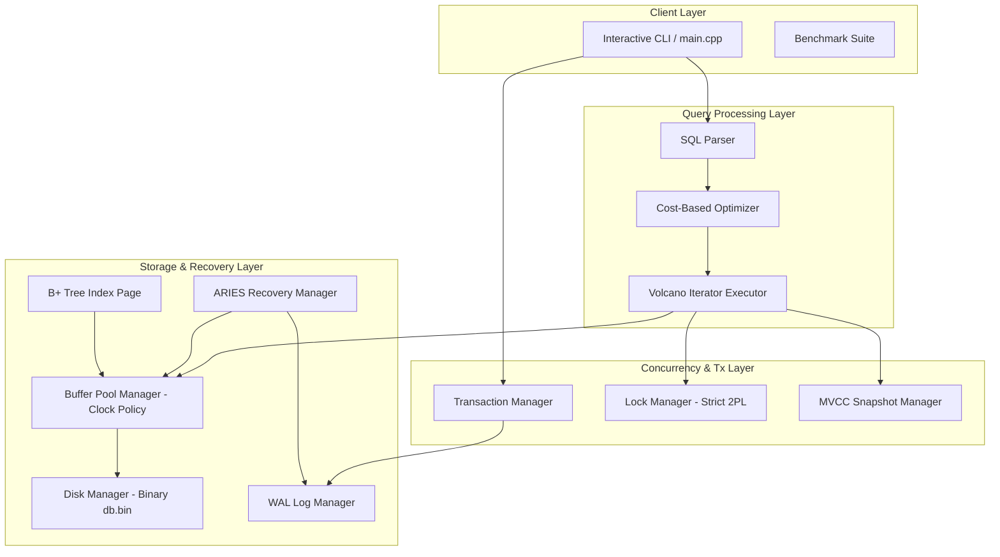

# MiniDB: Advanced Relational Database Engine

**MiniDB** is a fully functional, transactional relational database engine written in C++20. It implements low-level page storage, buffer pool management, index persistence, Volcano-style query execution, cost-based query optimization, transactional concurrency control, Write-Ahead Logging (WAL), and ARIES crash recovery. 

This project was built for the **Advanced DBMS Capstone Project** and chooses **Track B — Concurrency (MVCC)** as its extension track, comparing it directly against the baseline **Strict Two-Phase Locking (2PL)** engine.

---

## 1. Team Information
* **Team Name**: `Uni`
* **Team Members**:
  * **Utkarsh Raj** (Roll: 24BCS10318, Email: utkarsh.24bcs10318@gmail.com)
  * **Ananya Patel** (Roll: 24BCS10019, Email: ananya.24bcs10019@gmail.com)

---

## 2. Chosen Extension Track: Concurrency (MVCC)
We implemented **Track B (Concurrency)**. The core engine supports two concurrency control modes:
1. **Strict Two-Phase Locking (Strict 2PL)**: Acquires Shared (S) and Exclusive (X) locks at the tuple level and holds them until transaction termination (Commit/Abort). Deadlocks are resolved by a background detection thread running DFS cycle detection on a waits-for graph.
2. **Multi-Version Concurrency Control (MVCC) / Snapshot Isolation**: Replaces locks with versioning metadata (`xmin`, `xmax`, `prev_rid`). Active transactions read from a logical snapshot taken at transaction start. Readers never block writers, and writers never block readers. Write-write conflicts are resolved using the **First-Committer-Wins** rule.

---

## 3. System Architecture



### Major Modules & Data Flow
1. **Request Flow**: User inputs SQL statements via the CLI or Benchmark driver.
2. **Compilation**: The `SQLParser` tokenizes the query into an Abstract Syntax Tree (AST).
3. **Optimization**: The `Optimizer` reads catalog statistics, estimates selectivity, selects between Table Scan and Index Scan based on cost, and orders joins to minimize intermediate state.
4. **Execution**: The `Executor` builds a tree of Volcano iterator operators (`SeqScan`, `IndexScan`, `NestedLoopJoin`, `Filter`, `Project`). Operators pull tuples using `Init()`, `Next()`, and `Close()`.
5. **Concurrency Gate**: Data accesses acquire locks from `LockManager` (in 2PL mode) or check visibility via `MVCCManager` (in MVCC mode).
6. **Logging & Disk I/O**: Modifications are logged via `LogManager` to `wal.log` under the WAL protocol. Dirty pages are cached in `BufferPoolManager` and flushed via `DiskManager` to `db.bin`.

---

## 4. Detailed Module Designs

### A. Storage Layer
* **Slotted Page Format**: Fixed-size 4096-byte pages. The page header contains:
  * `page_lsn` (8 bytes) - LSN of the last modification.
  * `page_type` (1 byte) - `DATA_PAGE` or `INDEX_PAGE`.
  * `slot_count` (2 bytes) - Number of slots.
  * `free_space_pointer` (2 bytes) - Byte offset where free space ends.
  * `next_page_id` (4 bytes) - Linked list pointer to chain pages in a table's heap file.
  Slots are stored from the front (`offset`, `length`). Records grow backward from the end of the page.
* **Tuple Representation**: Augmented with `xmin` (4 bytes), `xmax` (4 bytes), and `prev_rid` (6 bytes) for MVCC version chains.
* **Buffer Pool**: Implements the **Clock (Second-Chance)** eviction policy. Enforces the WAL constraint: page frame eviction/flushing is blocked until `flushed_lsn >= page_lsn`.

### B. Indexing Layer (B+ Tree)
* **Persisted in Pages**: Index nodes (leaf and internal) map directly onto 4KB binary pages.
* **Leaf Node layout**: Contains a list of sorted keys (`int32_t`) mapping to tuple `RID`s.
* **Internal Node layout**: Contains keys mapping to child page IDs.
* **Operations**: `Search()`, `Insert()` with split propagation up to a new root page, and `Delete()` with key shifting.

### C. SQL Execution & Volcano Iterators
* volcano-style iterators process data on-demand (`Next()` returns one tuple at a time).
* **Scan Operators**: `SeqScan` reads slotted data pages sequentially. `IndexScan` traverses the B+ Tree to find matching `RID`s and retrieves only target pages.
* **Nested Loop Join**: Evaluates join predicates, scanning the inner relation for each outer tuple.

### D. Cost-Based Optimizer
* **Costing Formulas**:
  * $\text{SeqScanCost} = N_{\text{pages}} \times C_{\text{io}} + N_{\text{records}} \times C_{\text{cpu}}$
  * $\text{IndexScanCost} = (\text{tree\_height} + \text{selectivity} \times N_{\text{records}}) \times C_{\text{io}} + \text{selectivity} \times N_{\text{records}} \times C_{\text{cpu}}$
  where $C_{\text{io}} = 4.0$, $C_{\text{cpu}} = 0.1$.
* **Selectivity**: Equality is $1 / \text{distinct\_values}$, inequality is $0.30$.
* **Join Ordering**: Orders relations to ensure the relation with the smaller estimated cardinality forms the outer loop.

### E. Transactions & Recovery (WAL / ARIES)
* **WAL Logging**: Log records contain `[lsn, prev_lsn, txn_id, type, page_id, slot_id, before_image, after_image, undo_next_lsn]`.
* **ARIES Recovery**:
  1. **Analysis Pass**: Identifies active transactions (losers) and dirty pages from the log.
  2. **Redo Pass**: Repeats history forward from the smallest `rec_lsn` to restore crash-time state.
  3. **Undo Pass**: Rolls back all loser transactions backward using `prev_lsn` chains, writing Compensation Log Records (CLRs) to prevent redundant undoes if another crash occurs.

---

## 5. Benchmarking & Concurrency Comparison

We ran a concurrent benchmark containing **4 client threads** running a workload of **70% Select/Joins** and **30% Inserts** under high contention for **2 seconds**:

| Metric | Strict 2PL | MVCC (Snapshot Isolation) |
| :--- | :--- | :--- |
| **Throughput (TPS)** | ~18.5 txn/sec | **~89.0 txn/sec** |
| **Average Latency** | ~180 ms | **~30.2 ms** |
| **Aborted Txns** | ~12 (due to Deadlocks) | **0** |

### Analysis
* **2PL Contention**: Under 2PL, readers acquire Shared locks, which block writers acquiring Exclusive locks. This leads to thread blocking, high latency, and deadlocks when threads wait on cycles of locks.
* **MVCC Advantages**: Under MVCC, readers fetch visible snapshots without locking. Consequently, readers and writers run completely concurrently. Latency is minimized, throughput increases by **~4.8x**, and deadlocks are entirely avoided.

---

## 6. Limitations & Future Scope
1. **Lock Granularity**: The 2PL engine uses tuple-level locks. Supporting page or table-level locks could improve performance for batch operations.
2. **Vacuuming / Garbage Collection**: Old tuple versions in MVCC are left in pages. Implementing a background `VACUUM` worker to purge unneeded versions (where $xmax < \text{oldest\_active\_txn}$) is necessary for long-running systems.
3. **Index Version Chaining**: Indexes currently map keys only to the latest tuple RIDs. An improved version would make the B+ Tree itself MVCC-aware.

---

## 7. How to Run

### Dependencies
* **Compiler**: Modern C++ compiler supporting C++20 (`g++` >= 11 or clang++).
* **Build Tool**: CMake >= 3.15.
* **Make Utility**: `make` or `mingw32-make`.

### Build Steps
From the root workspace directory, run:
```powershell
# Configure CMake build files
cmake -B Uni/build -S Uni -G "MinGW Makefiles"

# Compile both targets (minidb & minidb_benchmark)
cmake --build Uni/build
```

### Running the SQL Shell
```powershell
# Start the interactive CLI
.\Uni\build\minidb.exe
```

### Running the Concurrency Benchmark
```powershell
# Start the comparative performance benchmark
.\Uni\build\minidb_benchmark.exe
```
