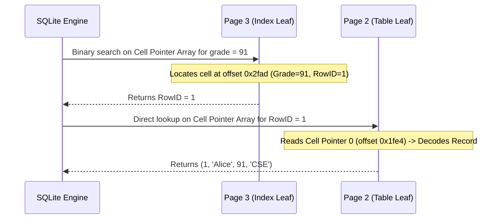

# Lab 4 - SQLite3 Hex Dump and B-Tree Analysis

## Objective

The objective of this lab is to study the internal storage structure of a SQLite3 database file using a hex dump generated with `xxd`. The lab focuses on understanding SQLite pages, B-tree structures, page headers, cell pointers, and how records are stored internally.

---

## Database Creation

The following SQL script was used to create the database and insert sample data.

```sql
CREATE TABLE students (
    id INTEGER PRIMARY KEY,
    name TEXT NOT NULL,
    grade INTEGER,
    department TEXT
);

CREATE INDEX idx_students_grade
ON students(grade);

INSERT INTO students (name, grade, department) VALUES
('Alice', 91, 'CSE'),
('Bob', 85, 'ISE'),
('Carol', 88, 'ECE'),
('David', 76, 'ME'),
('Eva', 95, 'CSE'),
('Frank', 82, 'EEE'),
('Grace', 89, 'ISE'),
('Helen', 92, 'ECE'),
('Ian', 80, 'CSE'),
('Jack', 87, 'ME'),
('Kevin', 78, 'EEE'),
('Luna', 90, 'CSE'),
('Mia', 84, 'ISE'),
('Noah', 93, 'ECE'),
('Olivia', 86, 'ME');

VACUUM;
```

---

## Commands Used

### Create Database

```bash
sqlite3 lab 4/campus.db < lab 4/create_campus.sql
```

### Generate Hex Dump

```bash
xxd -g 1 lab 4/campus.db > lab 4/campus.hex
```

### View Database Information

```bash
sqlite3 lab 4/campus.db ".dbinfo"
```

### View Schema Information

```bash
sqlite3 lab 4/campus.db "SELECT type,name,rootpage,sql FROM sqlite_schema;"
```

---

## SQLite File Structure

SQLite stores the complete database inside a single binary file divided into fixed-size pages. 

The default page size for this database is:
```text
4096 bytes
```

Each page begins at:
```text
(page_number - 1) × 4096
```

| Page Number | File Offset | Description |
|-------------|-------------|-------------|
| Page 1 | `0x0000` | Database Header & Schema Table (`sqlite_schema`) |
| Page 2 | `0x1000` | Table Leaf Page (`students` table records) |
| Page 3 | `0x2000` | Index Leaf Page (`idx_students_grade` index records) |

> [!NOTE]
> On macOS systems, the SQLite compilation default reserves **12 bytes** at the end of each page for system/encryption metadata. Therefore, the actual usable size of each page is $4096 - 12 = 4084$ bytes.

---

## SQLite File Header

The first 100 bytes of the database file (at Page 1, offset `0x0000` to `0x0063`) contain the SQLite database file header.

### Hex Dump Representation (Offsets 0x00 - 0x3F)
```text
00000000: 53 51 4c 69 74 65 20 66 6f 72 6d 61 74 20 33 00  SQLite format 3.
00000010: 10 00 01 01 0c 40 20 20 00 00 00 04 00 00 00 03  .....@  ........
00000020: 00 00 00 00 00 00 00 00 00 00 00 03 00 00 00 04  ................
00000030: 00 00 00 00 00 00 00 00 00 00 00 01 00 00 00 00  ................
```

### Decoded Header Fields

| Byte Offset | Hex Value | Decoded Meaning | Explanation |
|-------------|-----------|-----------------|-------------|
| `0x00 - 0x0F` | `53 51 ... 33 00` | `"SQLite format 3\0"` | The SQLite magic string signature. |
| `0x10 - 0x11` | `10 00` | `4096` | Database page size in bytes (`0x1000` = 4096). |
| `0x12` | `01` | `1` | File format write version (1 = Legacy/Journal mode). |
| `0x13` | `01` | `1` | File format read version (1 = Legacy/Journal mode). |
| `0x14` | `0c` | `12` | Reserved bytes at the end of each page. |
| `0x15` | `40` | `64` | Maximum embedded payload fraction (must be 64). |
| `0x16` | `20` | `32` | Minimum embedded payload fraction (must be 32). |
| `0x17` | `20` | `32` | Leaf payload fraction (must be 32). |
| `0x18 - 0x1B` | `00 00 00 04` | `4` | File change counter (incremented on writes). |
| `0x1C - 0x1F` | `00 00 00 03` | `3` | Size of the database file in pages. |
| `0x38 - 0x3B` | `00 00 00 01` | `1` | Text encoding (1 = UTF-8, 2 = UTF-16le, 3 = UTF-16be). |

---

## SQLite B-Tree Page Types

SQLite pages representing B-tree tables and indexes begin with a page header specifying their structure.

| Hex Flag | Integer Value | B-Tree Page Type |
|----------|---------------|------------------|
| `0x0D` | 13 | Table Leaf Page (contains data records mapped to keys) |
| `0x0A` | 10 | Index Leaf Page (contains index entries pointing to RowIDs) |
| `0x05` | 5 | Table Interior Page (contains navigation pointers to child pages) |
| `0x02` | 2 | Index Interior Page (contains index navigation structures) |

---

## Page 1 - sqlite_schema Table

Page 1 contains the 100-byte database file header, followed immediately by the B-Tree Page Header of the schema table `sqlite_schema` (which starts at byte offset 100 / `0x0064`).

### Page Header (Offset `0x0064` - `0x006B`)
```text
00000060: 00 2e 8d f8 0d 00 00 00 02 0f 06 00 0f 60 0f 06  .............`..
                      ^^ B-Tree Page Header Starts Here
```

- **Page Type Flag (`0x64`)**: `0d` $\rightarrow$ Table Leaf Page.
- **First Freeblock (`0x65 - 0x66`)**: `00 00` $\rightarrow$ 0 (no free blocks).
- **Cell Count (`0x67 - 0x68`)**: `00 02` $\rightarrow$ 2 cells (one for the table `students`, one for the index `idx_students_grade`).
- **Start of Cell Content Area (`0x69 - 0x6A`)**: `0f 06` $\rightarrow$ Cell data starts at page offset `0x0f06`.
- **Fragmented Free Bytes (`0x6B`)**: `00` $\rightarrow$ 0 bytes.

### Cell Pointer Array (Offset `0x006C` - `0x006F`)
The two cell pointers are stored as 2-byte offsets:
1. **Cell 0 Pointer (`0x6C - 0x6D`)**: `0f 60` $\rightarrow$ Offset `0x0f60`
2. **Cell 1 Pointer (`0x6E - 0x6F`)**: `0f 06` $\rightarrow$ Offset `0x0f06`

---

### Step-by-Step Cell Decoding

#### Cell 0: Table `students` (Offset `0x0f60`)
```text
00000f60: 81 11 01 07 17 1d 1d 01 81 75 74 61 62 6c 65 73  .........utables
00000f70: 74 75 64 65 6e 74 73 73 74 75 64 65 6e 74 73 02  tudentsstudents.
00000f80: 43 52 45 41 54 45 20 54 41 42 4c 45 20 73 74 75  CREATE TABLE stu...
```
1. **Payload Size**: Variable-length integer (varint). `81 11` is decoded as:
   $$(0x81 \text{ \& } 0x7F) \ll 7 \text{ | } 0x11 = 0x80 \text{ | } 0x11 = 145 \text{ bytes}$$
2. **RowID**: Varint `01` $\rightarrow$ RowID = 1.
3. **Record Header Size**: Varint `07` $\rightarrow$ 7 bytes.
4. **Serial Types**:
   - `17` $\rightarrow$ Text length: $(23 - 13) / 2 = 5$ bytes (`type` = `"table"`).
   - `1d` $\rightarrow$ Text length: $(29 - 13) / 2 = 8$ bytes (`name` = `"students"`).
   - `1d` $\rightarrow$ Text length: $(29 - 13) / 2 = 8$ bytes (`tbl_name` = `"students"`).
   - `01` $\rightarrow$ 8-bit signed integer (`rootpage` = 2).
   - `81 75` $\rightarrow$ Varint: $(0x81 \text{ \& } 0x7F) \ll 7 \text{ | } 0x75 = 245$. Text length: $(245 - 13) / 2 = 116$ bytes (`sql` = `"CREATE TABLE students..."`).
5. **Payload Values**:
   - `74 61 62 6c 65` $\rightarrow$ `"table"`
   - `73 74 75 64 65 6e 74 73` $\rightarrow$ `"students"`
   - `73 74 75 64 65 6e 74 73` $\rightarrow$ `"students"`
   - `02` $\rightarrow$ Root page number 2.
   - `43 52 45 41 ...` $\rightarrow$ `"CREATE TABLE students ( ... )"`

---

#### Cell 1: Index `idx_students_grade` (Offset `0x0f06`)
```text
00000f00: 00 00 00 00 00 00 58 02 06 17 31 1d 01 71 69 6e  ......X...1..qin
                            ^^ Cell Starts Here
```
1. **Payload Size**: Varint `58` $\rightarrow$ 88 bytes.
2. **RowID**: Varint `02` $\rightarrow$ RowID = 2.
3. **Record Header Size**: Varint `06` $\rightarrow$ 6 bytes.
4. **Serial Types**:
   - `17` $\rightarrow$ Text, 5 bytes (`type` = `"index"`).
   - `31` $\rightarrow$ Text, 18 bytes (`name` = `"idx_students_grade"`).
   - `1d` $\rightarrow$ Text, 8 bytes (`tbl_name` = `"students"`).
   - `01` $\rightarrow$ 8-bit signed integer (`rootpage` = 3).
   - `71` $\rightarrow$ Text, 50 bytes (`sql` = `"CREATE INDEX idx_students_grade ON students(grade)"`).
5. **Payload Values**:
   - `69 6e 64 65 78` $\rightarrow$ `"index"`
   - `69 64 78 5f ...` $\rightarrow$ `"idx_students_grade"`
   - `73 74 75 ...` $\rightarrow$ `"students"`
   - `03` $\rightarrow$ Root page number 3.
   - `43 52 45 41 ...` $\rightarrow$ `"CREATE INDEX idx_students_grade ON students(grade)"`

---

## Page 2 - Students Table B-Tree

Page 2 stores the table records for the `students` table. It starts at file offset `0x1000`.

### Page Header (Offset `0x1000` - `0x1007`)
```text
00001000: 0d 00 00 00 0f 0f 11 00
```
- **Page Type (`0x1000`)**: `0d` $\rightarrow$ Table Leaf Page.
- **Cell Count (`0x1003 - 0x1004`)**: `00 0f` $\rightarrow$ 15 rows inserted.
- **Start of Cell Content Area (`0x1005 - 0x1006`)**: `0f 11` $\rightarrow$ Usable space starts at page offset `0x0f11` (file offset `0x1f11`).

### Cell Pointer Array (Offset `0x1008` - `0x1025`)
Contains 15 cell pointer offsets (2 bytes each), sorted in ascending order of their RowIDs:
`0f e4`, `0f d6`, `0f c6`, `0f b7`, `0x0fa9`, `0x0f99`, `0x0f89`, `0x0f79`, `0x0f6b`, `0x0f5d`, `0x0f4d`, `0x0f3e`, `0x0f30`, `0x0f21`, `0x0f11`.

```
+--------------------------------------------------------+
| Page 2 Header (8 bytes)                                |
+--------------------------------------------------------+
| Cell Pointer Array (30 bytes, 15 entries)              |
| [0x0fe4] [0x0fd6] [0x0fc6] ... [0x0f11]                |
+--------------------------------------------------------+
| Unallocated Space (Contiguous Free Space)              |
| (from offset 0x1026 to 0x1f10)                         |
+--------------------------------------------------------+
| Cells / Records (Stacked bottom-up)                    |
| Cell 14 (Olivia)    starts at offset 0x1f11            |
| ...                                                    |
| Cell 1 (Bob)        starts at offset 0x1fd6            |
| Cell 0 (Alice)      starts at offset 0x1fe4            |
+--------------------------------------------------------+
| Reserved Bytes (12 bytes)                              |
+--------------------------------------------------------+
```

---

### Decoding Student Record 1 (Alice)
Located at page offset `0x0fe4` (file offset `0x1fe4`):
```text
00001fe0: 55 49 53 45 0e 01 05 00 17 01 13 41 6c 69 63 65  UISE.......Alice
00001ff0: 5b 43 53 45 00 00 00 00 00 00 00 00 00 00 00 00  [CSE............
                      ^^ Page 2 usable data ends here
```

- **Payload Size (`0x1fe4`)**: `0e` $\rightarrow$ 14 bytes.
- **RowID (`0x1fe5`)**: `01` $\rightarrow$ RowID = 1.
- **Record Payload (`0x1fe6 - 0x1ff3`)**:
  - **Header Size (`0x1fe6`)**: `05` $\rightarrow$ 5 bytes.
  - **Serial Types (`0x1fe7 - 0x1fea`)**:
    - `00` $\rightarrow$ Serial type for column 1 (`id`). Since `id` is an `INTEGER PRIMARY KEY`, it is aliased to the RowID. Storing it inside the payload is redundant, so its serial type is set to 0 (NULL) and it takes 0 bytes.
    - `17` $\rightarrow$ Column 2 (`name`): Text length: $(23 - 13) / 2 = 5$ bytes.
    - `01` $\rightarrow$ Column 3 (`grade`): 8-bit signed integer.
    - `13` $\rightarrow$ Column 4 (`department`): Text length: $(19 - 13) / 2 = 3$ bytes.
  - **Values (`0x1feb - 0x1ff3`)**:
    - `"Alice"` (5 bytes): `41 6c 69 63 65`
    - `91` (1 byte): `5b` (`0x5b` in decimal is 91).
    - `"CSE"` (3 bytes): `43 53 45`

---

## Page 3 - Index B-Tree

Page 3 stores the index created on the `grade` column (`idx_students_grade`). It starts at file offset `0x2000`.

### Page Header (Offset `0x2000` - `0x2007`)
```text
00002000: 0a 00 00 00 0f 0f 9b 00
```
- **Page Type (`0x2000`)**: `0a` $\rightarrow$ Index Leaf Page.
- **Cell Count (`0x2003 - 0x2004`)**: `00 0f` $\rightarrow$ 15 index records.
- **Start of Cell Content Area (`0x2005 - 0x2006`)**: `0f 9b` $\rightarrow$ Page offset `0x0f9b` (file offset `0x2f9b`).

### Cell Pointer Array (Offset `0x2008` - `0x2025`)
Unlike the table B-tree which is sorted by RowID, the index B-tree is sorted by the indexed column values (`grade` ASC, then `id` ASC).
Pointers are: `0f ee`, `0f e8`, `0f e2`, `0f dc`, `0f d6`, `0f d0`, `0f ca`, `0f c4`, `0f be`, `0f b8`, `0f b2`, `0f ad`, `0f a7`, `0f a1`, `0f 9b`.

---

### Decoding Index Records

#### Cell 0: Grade = 76 (David, RowID 4)
Located at page offset `0x0fee` (file offset `0x2fee`):
```text
00002fe0: 52 06 05 03 01 01 50 09 05 03 01 01 4e 0b 05 03  R.....P.....N...
                                            ^^ Cell Starts Here
```
- **Payload Size (`0x2fee`)**: `05` $\rightarrow$ 5 bytes.
- **Record Header Size (`0x2fef`)**: `03` $\rightarrow$ 3 bytes.
- **Serial Types (`0x2ff0 - 0x2ff1`)**:
  - `01` $\rightarrow$ 8-bit signed integer (grade).
  - `01` $\rightarrow$ 8-bit signed integer (RowID).
- **Values (`0x2ff2 - 0x2ff3`)**:
  - `4c` $\rightarrow$ Grade value: `76` (`0x4c` = 76).
  - `04` $\rightarrow$ RowID: `4`.

---

#### Special Optimization: Alice (Grade = 91, RowID 1)
Located at page offset `0x0fad` (file offset `0x2fad`):
```text
00002fa0: 05 05 03 01 01 5d 0e 05 03 01 01 5c 08 04 03 01  .....].....\....
                                               ^^ Cell Starts Here
00002fb0: 09 5b 05 ...
```
- **Payload Size (`0x2fad`)**: `04` $\rightarrow$ 4 bytes.
- **Record Header Size (`0x2fae`)**: `03` $\rightarrow$ 3 bytes.
- **Serial Types (`0x2faf - 0x2fb0`)**:
  - `01` $\rightarrow$ 8-bit signed integer (grade).
  - `09` $\rightarrow$ RowID value. 
  
> [!IMPORTANT]
> **Serial Type 9 Optimization**: Under the SQLite record format specification, serial type `9` represents the integer constant `1`. This means SQLite optimizes the storage of the RowID value `1` by encoding it directly in the header type array, requiring **0 bytes** of actual data payload. This reduces the cell payload from 5 bytes down to 4 bytes.

- **Values (`0x2fb1`)**:
  - `5b` $\rightarrow$ Grade: `91` (`0x5b` = 91).
  - (No RowID value byte is present because type `9` specifies it is 1).

---

## Lookup Example

### Query
```sql
SELECT * FROM students WHERE grade = 91;
```

### Execution & Lookup Process



1. **Index Search (Page 3)**:
   - The query specifies a filter on the indexed column `grade = 91`.
   - SQLite accesses Page 3 (root of the index B-tree).
   - It performs a binary search on the sorted **Cell Pointer Array**.
   - It locates the matching index cell at offset `0x2fad` (`grade = 91`).
   - It decodes the cell and extracts the associated RowID, which is `1`.

2. **Table Record Fetch (Page 2)**:
   - Armed with RowID `1`, SQLite accesses Page 2 (root of the table B-tree).
   - It reads the first entry in the **Cell Pointer Array** at offset `0x1008` (since the array is sorted by RowID, index 0 corresponds to RowID 1).
   - The pointer directs SQLite to file offset `0x1fe4`.
   - SQLite decodes the student record (`Alice`, `91`, `CSE`) and returns it to the client.

---

## Observations & Summary of B-Tree Mechanics

- **Fixed-size Pages**: SQLite organizes the file into 4096-byte pages, matching the OS filesystem block size to optimize I/O.
- **Defragmented Storage via `VACUUM`**: The `VACUUM` command rebuilds the database file, arranging pages sequentially (Schema, Table B-Tree, Index B-Tree) and packing cells tightly at the bottom of pages, leaving a contiguous block of free space in the center.
- **Cell Pointer Arrays**: Pointers grow from the top of the page downward, while cell data payloads are added from the bottom upward. This allows dynamic record insertion while maintaining binary search lookup on the pointers.
- **Varint Compression**: SQLite makes extensive use of variable-length integers (varints) for sizes, counts, and values, allowing integers between 0 and 127 to occupy only 1 byte.
- **Implicit Primary Key**: Redundant primary key integers are stored only as the RowID, saving storage space inside the record structure.

---

## Conclusion

Analyzing the database using `xxd` reveals the concrete, highly optimized physical layout that powers SQLite. From the B-tree page headers and cell pointer arrays to varint compression and serial-type header shortcuts, every byte in the database structure is strategically arranged to maximize lookup performance and minimize file size.
