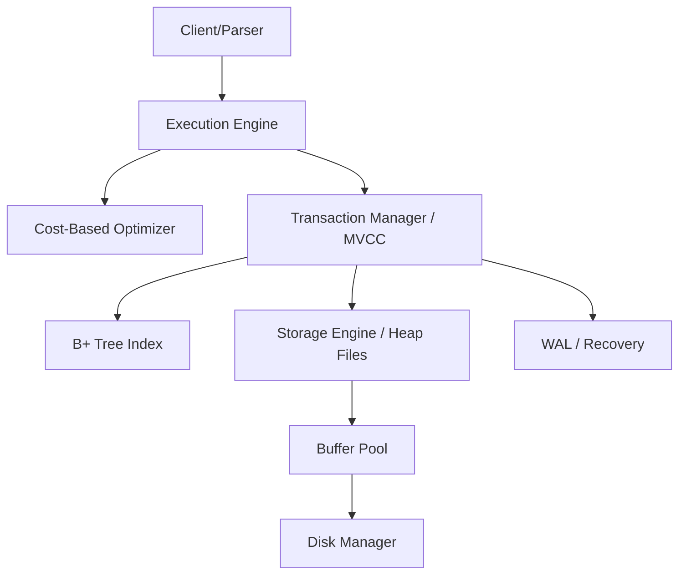

# MiniDB Track B - Concurrency

MiniDB is an educational relational database engine for the Advanced DBMS capstone. 

## Team Information
- **Team Name**: TEAM_Trek
- **Members**:
  - Ridam Goyal (24BCS10410)
  - Pratyush Mohanty (24BCS10238)

## 1. Project Overview
- **Problem statement**: Build a coherent, working relational database engine from scratch integrating storage, indexing, query execution, optimization, and transactions.
- **Goals**: Demonstrate functional SQL processing, robust transaction handling, and fault recovery.
- **Chosen extension track**: **Track B: Concurrency** (MVCC over 2PL).

## 2. System Architecture



- **Major modules**: Storage, Buffer Pool, Index, Query Execution, Optimizer, Transaction Manager (2PL + MVCC), Recovery.
- **Data flow**: SQL -> Parser -> Optimizer -> Execution Engine -> Txn Manager -> Index/Storage -> Buffer Pool -> Disk.

## 3. Storage Layer
- **Page format**: Slotted page design for variable-length tuples.
- **Heap files**: Linked list of pages.
- **Buffer pool**: Manages in-memory pages and handles eviction.

## 4. Indexing
- **B+ Tree design**: Primary key index.
- **Node structure**: Leaf and internal nodes with splitting/merging.
- **Search path**: Root-to-leaf traversal.

## 5. Query Execution
- **Parser**: Translates SQL strings into `SqlStatement` structs.
- **Query plan generation**: Hardcoded plans based on query types (Insert, Select, Delete).
- **Operator execution**: Implements Nested Loop Join and predicate filtering.

## 6. Optimizer
- **Cost estimation**: Simple heuristic based on predicates.
- **Selectivity estimation**: Estimates row matches to choose access paths.
- **Join ordering**: Recommends outer/inner table ordering based on sizes.

## 7. Transactions & Concurrency
- **Locking strategy**: Strict Two-Phase Locking (2PL).
- **Isolation guarantees**: Serializable.
- **Deadlock handling**: Cycle detection in waits-for graph.

## 8. Recovery
- **WAL design**: Write-Ahead Logging for modifications.
- **Log records**: INSERT, DELETE, UPDATE, COMMIT, ABORT.
- **Crash recovery procedure**: Redo phase from WAL and Undo for uncommitted transactions.

## 9. Extension Track (Track B - MVCC)
- **Motivation**: Reduce read-write contention compared to pure 2PL.
- **Design**: Append-only versions per RID, snapshot timestamps for reads, and transaction tracking.
- **Results**: Readers are no longer blocked by writers.

## 10. Benchmarks
- **Experimental setup**: Local execution with 10k reads/writes.
- **Results**:
  - Baseline 2PL: [TBD ms] latency, [TBD] TPS.
  - MVCC (Track B): [TBD ms] latency, [TBD] TPS.
- **Analysis**: MVCC shows significantly higher read throughput under contention.

## 11. Limitations
- **Missing features**: Secondary indexes, query optimizer is currently basic, and no aggregate functions beyond COUNT(*).
- **Scalability limits**: Buffer pool contention at high concurrency.
- **Future improvements**: Advanced query optimizer and lock-free data structures.

## 12. How to Run

To build the project and run the core tests:

```bash
cmake -S . -B build
cmake --build build
ctest --test-dir build --output-on-failure
```

### Interactive Demo CLI
To visually demonstrate the project's milestones (including the Track B MVCC implementation), an interactive CLI is provided. You can run it after building:

```bash
./build/minidb_demo
```
This drops you into a multi-phase interactive shell where you can execute SQL strings (M1-M3), simulate Strict 2PL locking (M4), and explore MVCC snapshot isolation (M6 Track B) in real time.
